# Tour of Go


A hands-on Go learning journal — from language basics to production-grade platform engineering, distributed systems, FinOps tooling, systems programming, and infrastructure automation.

---

## Learning Path (Recommended Order)

```
1. packages              → Variables, functions, types, constants
2. flow_control_statements → For, if, switch, defer
3. more_types            → Pointers, structs, slices, maps, closures
4. methods               → Value/pointer receivers, fmt.Stringer
5. interfaces            → Implicit satisfaction, type assertions, embedding
6. error_handling        → Custom errors, wrapping (%w), panic/recover
7. generics              → Type parameters, constraints, generic types
8. concurrency           → Goroutines, channels, select, mutex, worker pool
9. context               → Cancellation, timeouts, request-scoped values
   ↓
more-internals/          → Deep dives: Go runtime, design patterns, system design
   ↓
projects/                → Runnable platform projects
```

## Advanced Guides & Internals

For deep-dives into the Go runtime, idiomatic design patterns, and system design for Platform Engineering, check out our [**Master Table of Contents**](./more-internals/README.md).

### 🟢 Phase 1: Go Internals
Master the runtime mechanics: `defer`, Memory Layout, `cgo`, and Plan9 Assembly.

### 🔵 Phase 2: Design Patterns
Idiomatic patterns: Functional Options, Plugin Architectures, and the Repository Pattern.

### 🔴 Phase 3: System Design & Platform Ops
Architecting for scale: eBPF, Gossip Protocols, Distributed Tracing, and K8s-native services.

---

## Running Topics

```shell
go run . packages
go run . concurrency worker-pool
go run . context timeout
go run .              # show help
```

---

## Projects

Standalone mini-projects in `projects/` — each is a separate Go module with its own README and docs.

| # | Project | What you build | Key concepts |
|---|---------|---------------|--------------|
| 1 | [`grpc-service`](./projects/grpc-service/) | gRPC server + client | Protobuf, unary RPC, server streaming |
| 2 | [`otel-tracing`](./projects/otel-tracing/) | Distributed tracing across 2 HTTP services | OpenTelemetry, trace propagation, spans |
| 3 | [`k8s-controller`](./projects/k8s-controller/) | Kubernetes operator (CRD + controller) | controller-runtime, reconciliation loop, CRDs |
| 4 | [`distributed-scheduler`](./projects/distributed-scheduler/) | Production distributed job scheduler | Redis lease, concurrency manager, Bleve search, state machine |
| 5 | [`event-driven-pipeline`](./projects/event-driven-pipeline/) | Event processing pipeline | NATS JetStream, exactly-once, circuit breaker, DLQ |
| 6 | [`service-mesh-sidecar`](./projects/service-mesh-sidecar/) | TCP proxy sidecar | Connection pooling, token bucket, circuit breaking, Prometheus |
| 7 | [`realtime-dashboard`](./projects/realtime-dashboard/) | Live ops dashboard | HTMX, WebSocket, html/template, server-rendered UI |
| 8 | [`platform-console`](./projects/platform-console/) | K8s resource browser | html/template, Tailwind, SSE, client-go dynamic client |
| 9 | [`cli-tui`](./projects/cli-tui/) | Terminal dashboard | Bubble Tea, lipgloss, Elm architecture, TUI |
| 10 | [`aws-resource-reaper`](./projects/aws-resource-reaper/) | Concurrent FinOps CLI | AWS SDK v2, STS AssumeRole, errgroup + semaphore, log/slog |
| 11 | [`gocker`](./projects/gocker/) | Mini container runtime | Linux namespaces, OverlayFS, cgroups v1/v2, OCI pull, chroot |
| 12 | [`tf-drift-detector`](./projects/tf-drift-detector/) | Terraform drift detection daemon | errgroup, sync.Mutex, time.Ticker, stateful tracker, webhooks |
| 13 | [`raft-kv-store`](./projects/raft-kv-store/) | Distributed KV store via Raft | Leader election, log replication, WAL, gRPC, quorum commit |

---

## Project Architectures

### 1. grpc-service

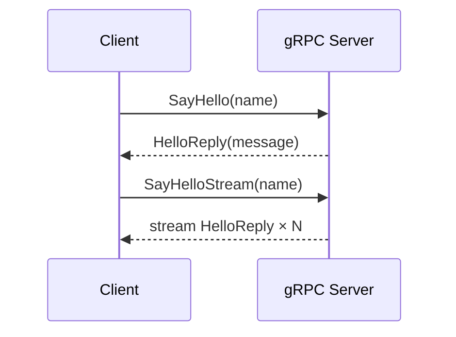

Protobuf-defined service with unary and server-streaming RPCs. The client demonstrates both call patterns.

---

### 2. otel-tracing

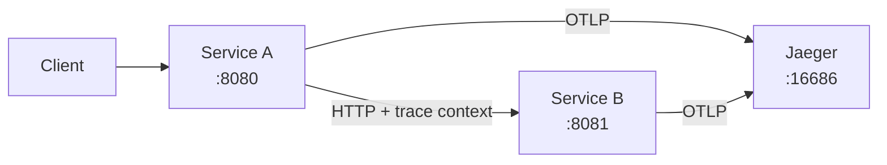

Two HTTP services propagate trace context via W3C `traceparent` headers. Both export spans to Jaeger via OTLP.

---

### 3. k8s-controller

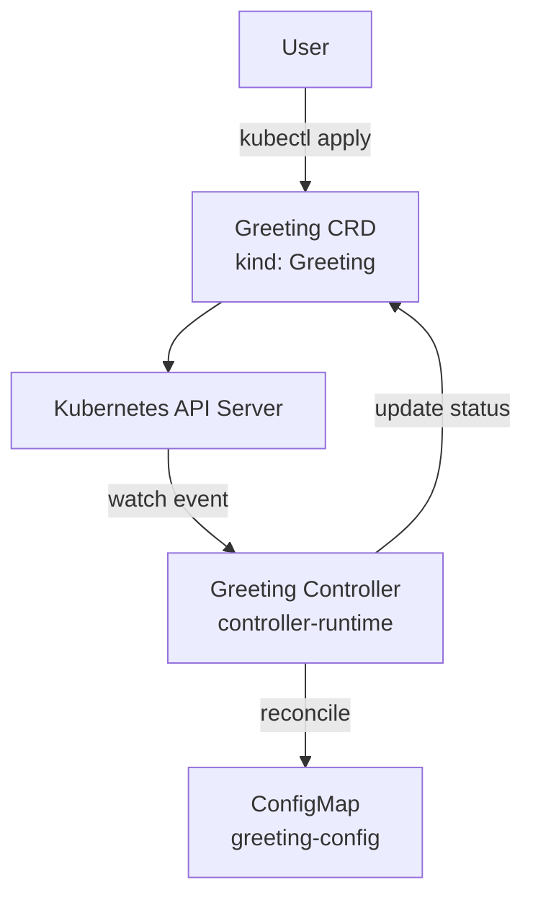

Custom Resource Definition + controller that reconciles `Greeting` objects into ConfigMaps. Demonstrates the operator pattern with controller-runtime.

---

### 4. distributed-scheduler

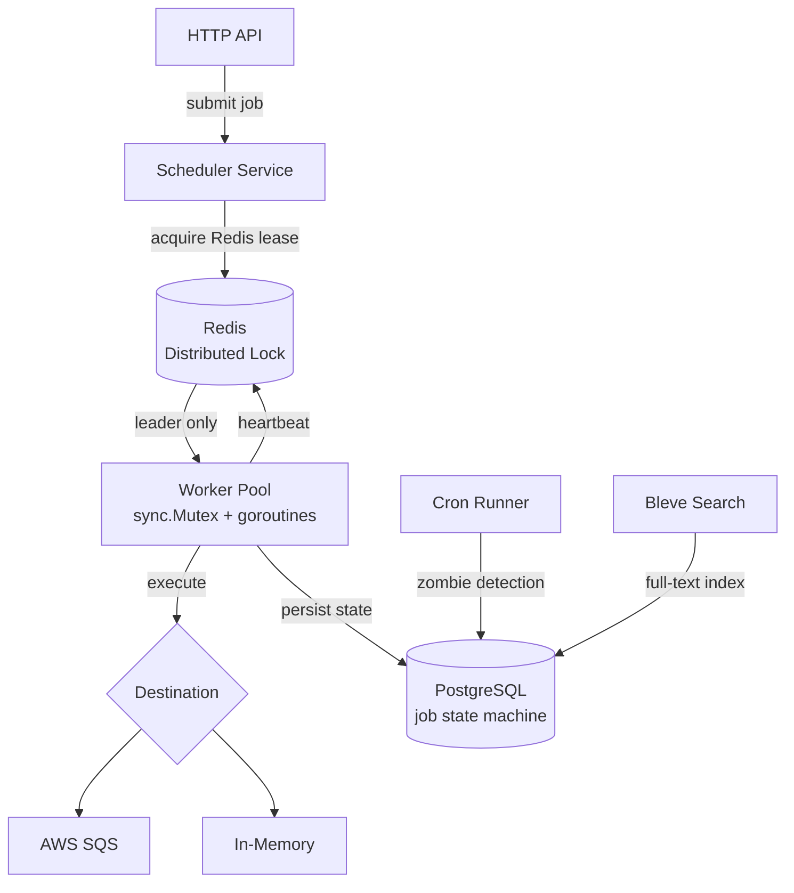

Production-grade job scheduler with Redis-based leader election, state machine (Pending → Running → Done/Failed), zombie detection, and full-text search.

---

### 5. event-driven-pipeline

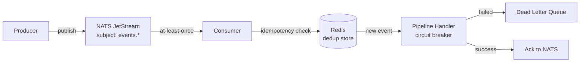

Event processing pipeline with NATS JetStream for durable messaging, Redis-based idempotency (exactly-once semantics), circuit breaker, and DLQ for failed events.

---

### 6. service-mesh-sidecar

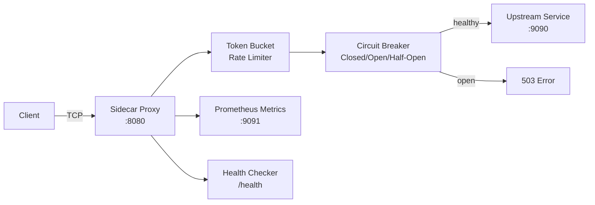

TCP reverse proxy sidecar with token bucket rate limiting, circuit breaker (3 states), connection pooling, Prometheus metrics, and health checks.

---

### 7. realtime-dashboard

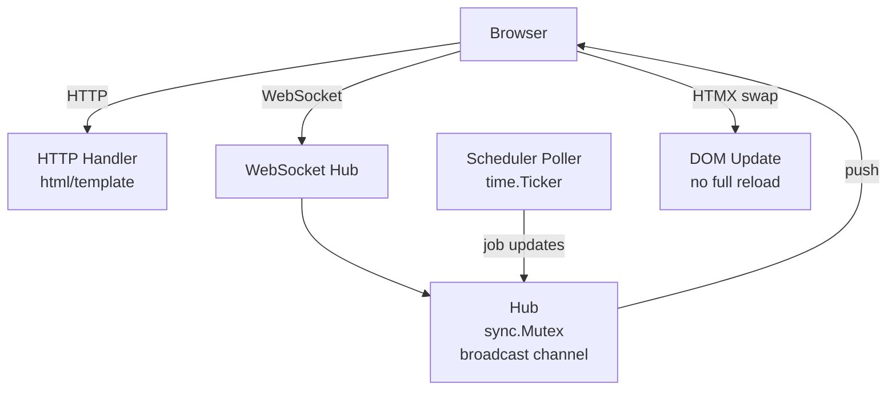

Live ops dashboard for the distributed scheduler. WebSocket hub broadcasts job state changes to all connected browsers. HTMX swaps DOM fragments without a full page reload.

---

### 8. platform-console

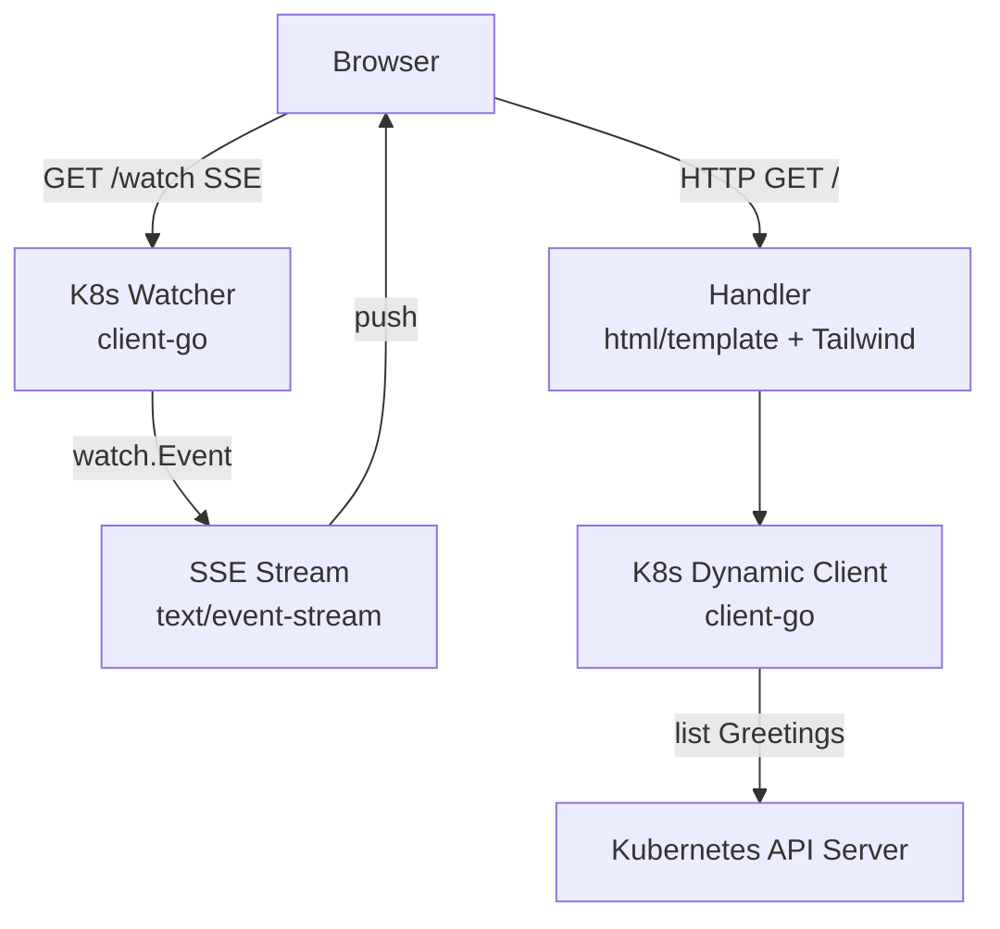

Web console for browsing `Greeting` custom resources. Uses client-go's dynamic client for CRD listing and a Server-Sent Events stream for live updates.

---

### 9. cli-tui

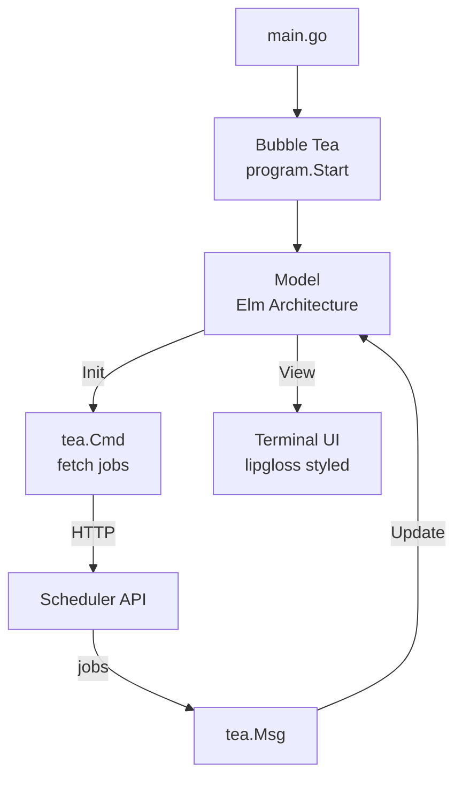

Terminal dashboard for the distributed scheduler using Bubble Tea's Elm-inspired architecture (Model → Update → View). lipgloss handles styling and layout.

---

### 10. aws-resource-reaper

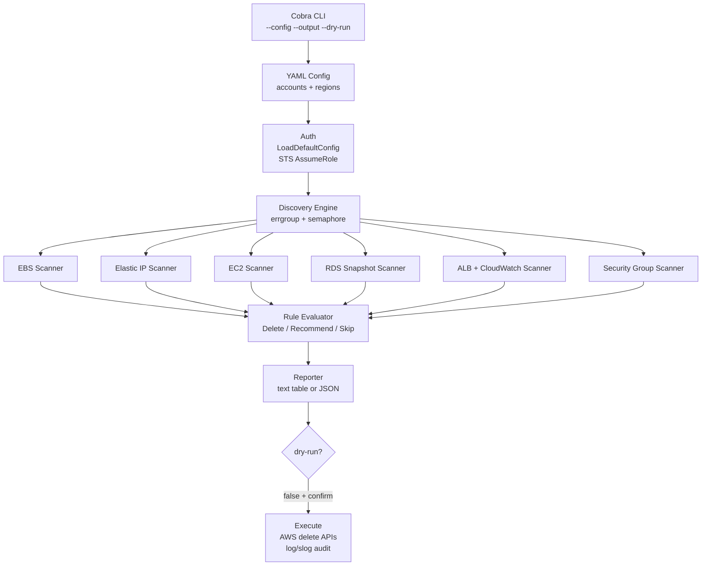

Concurrent FinOps CLI. Runs on EC2/ECS with an instance profile, assumes roles into target accounts, scans 6 resource types across all regions in parallel, and reports or removes idle resources.

---

### 11. gocker

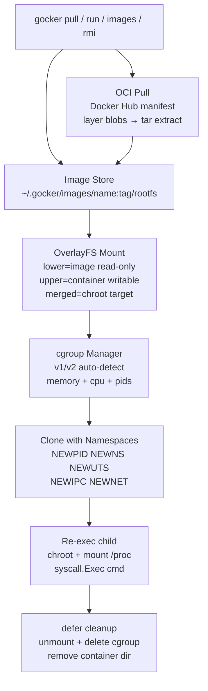

Mini Docker from scratch. Pulls real Alpine images via OCI spec, mounts OverlayFS for copy-on-write isolation, enforces resource limits via cgroups, and isolates processes with Linux namespaces.

---

### 12. tf-drift-detector

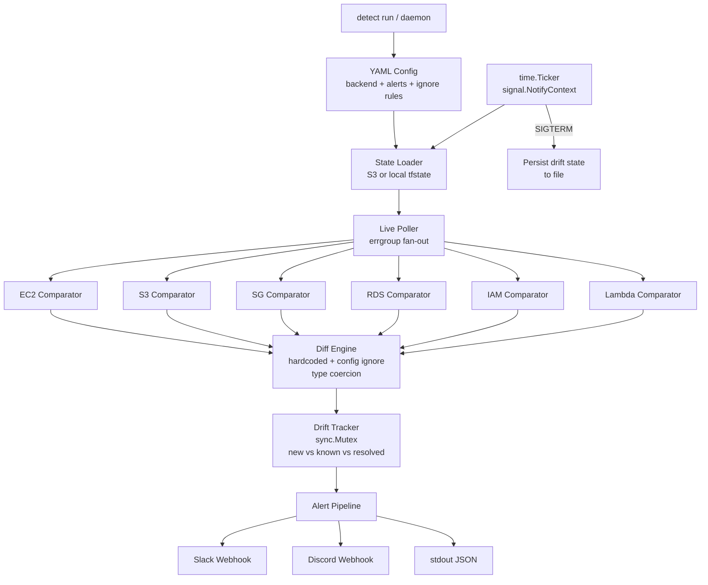

Daemon that compares Terraform state against live AWS infrastructure. Stateful tracking alerts only on new/resolved drift. Hardcoded + config-driven false-positive suppression.

---

### 13. raft-kv-store

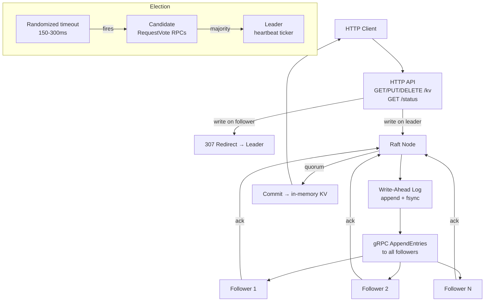

Distributed KV store implementing the Raft consensus algorithm from scratch. Leader election with randomized timeouts, log replication with quorum-based commits, WAL durability, and HTTP REST API.

---

### 14. xdp-firewall

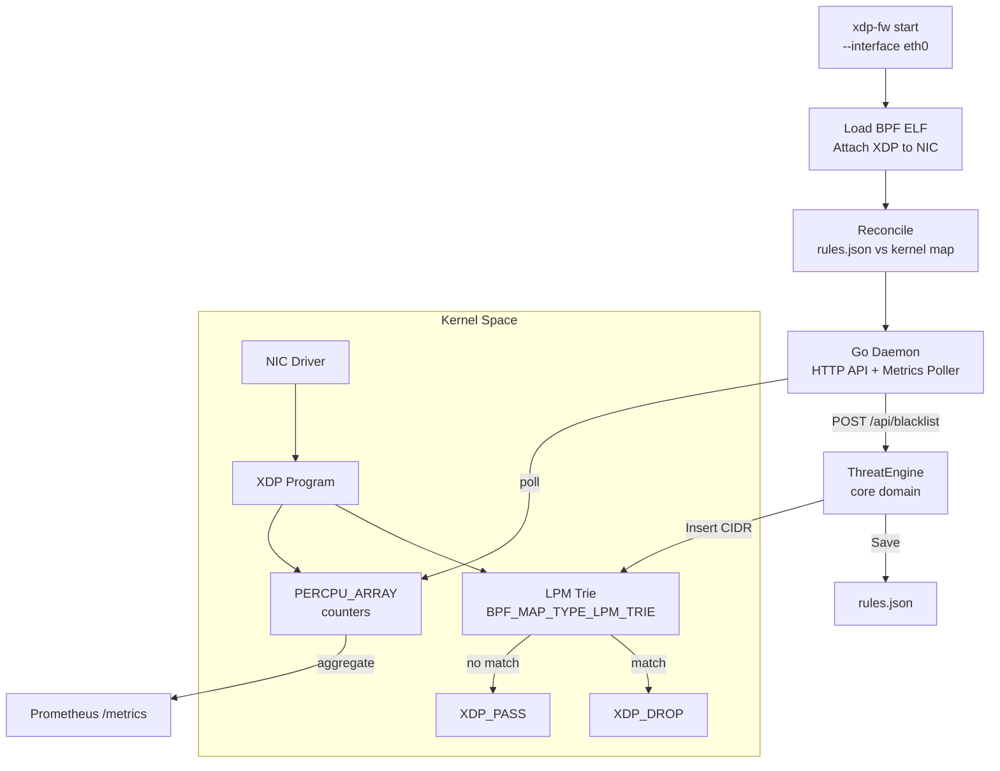

Kernel-level XDP firewall. Drops packets from blacklisted CIDRs at the NIC driver level using an eBPF LPM trie — before the Linux networking stack allocates memory. Hexagonal architecture with HTTP admin API, atomic file persistence, and Prometheus metrics.

---

### 15. k8s-event-sink

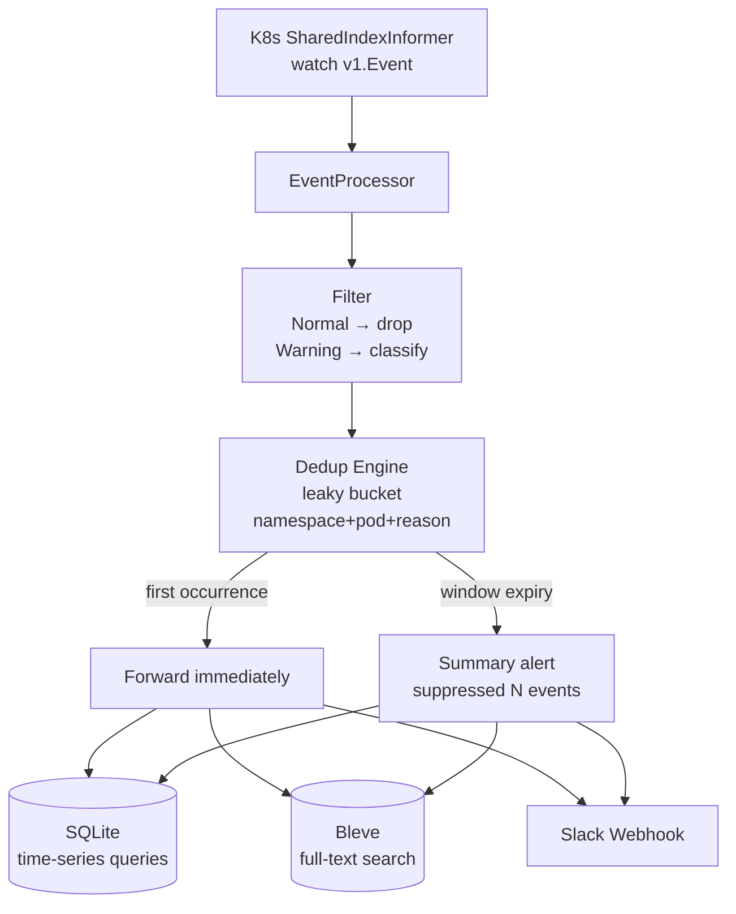

Kubernetes event vacuum daemon. Streams cluster events via informers, deduplicates with leaky bucket (first occurrence forwarded immediately, summary on window expiry), classifies severity, persists to embedded SQLite + Bleve. Single binary, zero external dependencies.

## Adding New Topics

```shell
mkdir mytopic
```

Create `mytopic/mytopic.go` with `Run()` and `RunExample(name string)` functions, then register in `main.go` with a `case "mytopic":` block.

---

