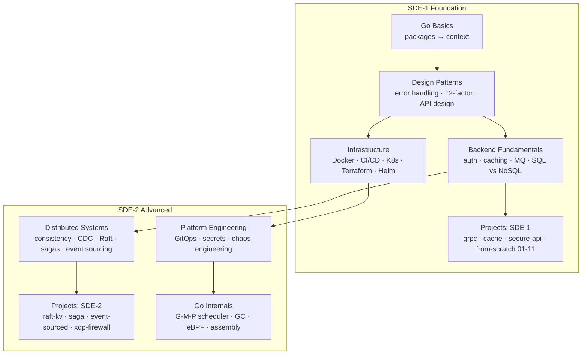

# Tour of Go


A hands-on Go learning journal — from language basics to production-grade platform engineering, distributed systems, FinOps tooling, systems programming, and infrastructure automation.

---

## Overall Learning Path


```mermaid
graph TD
    subgraph SDE-1 Foundation
        BASICS[Go Basics\npackages → context] --> PATTERNS[Design Patterns\nerror handling · 12-factor · API design]
        PATTERNS --> INFRA[Infrastructure\nDocker · CI/CD · K8s · Terraform · Helm]
        PATTERNS --> BACKEND[Backend Fundamentals\nauth · caching · MQ · SQL vs NoSQL]
        BACKEND --> PROJECTS_1[Projects: SDE-1\ngrpc · cache · secure-api · from-scratch 01-11]
    end
    
    subgraph SDE-2 Advanced
        INFRA --> PLATFORM[Platform Engineering\nGitOps · secrets · chaos engineering]
        BACKEND --> DISTRIBUTED[Distributed Systems\nconsistency · CDC · Raft · sagas · event sourcing]
        DISTRIBUTED --> PROJECTS_2[Projects: SDE-2\nraft-kv · saga · event-sourced · xdp-firewall]
        PLATFORM --> INTERNALS[Go Internals\nG-M-P scheduler · GC · eBPF · assembly]
    end
```

---

## Recommended Order

### 🟢 Step 1: Go Language (SDE-1)

```
1. packages              → Variables, functions, types, constants
2. flow_control_statements → For, if, switch, defer
3. more_types            → Pointers, structs, slices, maps, closures
4. methods               → Value/pointer receivers, fmt.Stringer
5. interfaces            → Implicit satisfaction, type assertions, embedding
6. error_handling        → Custom errors, wrapping (%w), panic/recover
7. generics              → Type parameters, constraints, generic types
8. concurrency           → Goroutines, channels, select, mutex, worker pool
9. context               → Cancellation, timeouts, request-scoped values
```

### 🔵 Step 2: Production Skills (SDE-1)

| Topic | Where |
|-------|-------|
| Testing (table-driven, mocks, fuzz) | `more-internals/go-internals/testing-patterns/` |
| Production Go (timeouts, pprof, graceful shutdown) | `more-internals/go-internals/production-go/` |
| Module patterns (go.work, internal/) | `more-internals/go-internals/module-patterns/` |
| Error handling mastery | `more-internals/design-patterns/error-handling/` |
| API design (REST, pagination, OpenAPI) | `more-internals/design-patterns/api-design/` |
| 12-Factor App | `more-internals/design-patterns/twelve-factor/` |

### 🔴 Step 3: System Design & DevOps (SDE-1 → SDE-2)

| Topic | Level | Where |
|-------|-------|-------|
| Docker deep dive | SDE-1 | `more-internals/system-design/docker-deep-dive/` |
| CI/CD pipelines | SDE-1 | `more-internals/system-design/cicd/` |
| Kubernetes core | SDE-1 | `more-internals/system-design/kubernetes-core/` |
| Auth (OAuth2, JWT) | SDE-1 | `more-internals/system-design/auth-deep-dive/` |
| Caching strategies | SDE-1 | `more-internals/system-design/caching-strategies/` |
| SQL vs NoSQL | SDE-1 | `more-internals/system-design/sql-vs-nosql/` |
| Message queues | SDE-1 | `more-internals/system-design/message-queue-patterns/` |
| Rate limiting & backpressure | SDE-1 | `more-internals/system-design/backpressure/` |
| Observability & tracing | SDE-1 | `more-internals/system-design/observability-guide/` |
| Consistency models | SDE-2 | `more-internals/system-design/consistency-models/` |
| Database internals | SDE-2 | `more-internals/system-design/database-internals/` |
| Distributed locking | SDE-1 | `more-internals/system-design/distributed-locking/` |
| CDC (Change Data Capture) | SDE-2 | `more-internals/system-design/cdc/` |
| Capacity planning | SDE-2 | `more-internals/system-design/capacity-planning/` |
| GitOps | SDE-2 | `more-internals/system-design/gitops/` |
| Chaos engineering | SDE-2 | `more-internals/system-design/chaos-engineering/` |

### 🟣 Step 4: Build Projects

Start with from-scratch series (01-11 for SDE-1), then tackle platform projects. See [projects/README.md](./projects/README.md) for the full index with level markers.

---

## Quick Reference: What Level Am I?

| If you can... | You're at... |
|---------------|-------------|
| Write Go with proper error handling, tests, and modules | SDE-1 basics ✅ |
| Deploy a Go service with Docker + CI/CD + K8s | SDE-1 DevOps ✅ |
| Design APIs with auth, caching, rate limiting, MQ | SDE-1 backend ✅ |
| Explain consistency models, CAP, and design for scale | SDE-2 system design ✅ |
| Build consensus protocols, event sourcing, CDC pipelines | SDE-2 distributed systems ✅ |
| Profile with pprof, understand GC, write operators | SDE-2 platform engineering ✅ |

---

## Advanced Guides & Internals

For the full deep-dive series with **SDE-1/SDE-2 level markers** on every topic, see the [**Master Table of Contents**](./more-internals/README.md).

---

## Running Topics

```shell
go run . packages
go run . concurrency worker-pool
go run . context timeout
go run .              # show help
```

---

## Projects

Standalone mini-projects in `projects/` — each is a separate Go module with its own README and docs.

See **[`projects/README.md`](./projects/README.md)** for the full project index (22 projects + 14 from-scratch) with architecture diagrams and level markers.

## Adding New Topics

```shell
mkdir mytopic
```

Create `mytopic/mytopic.go` with `Run()` and `RunExample(name string)` functions, then register in `main.go` with a `case "mytopic":` block.

---
