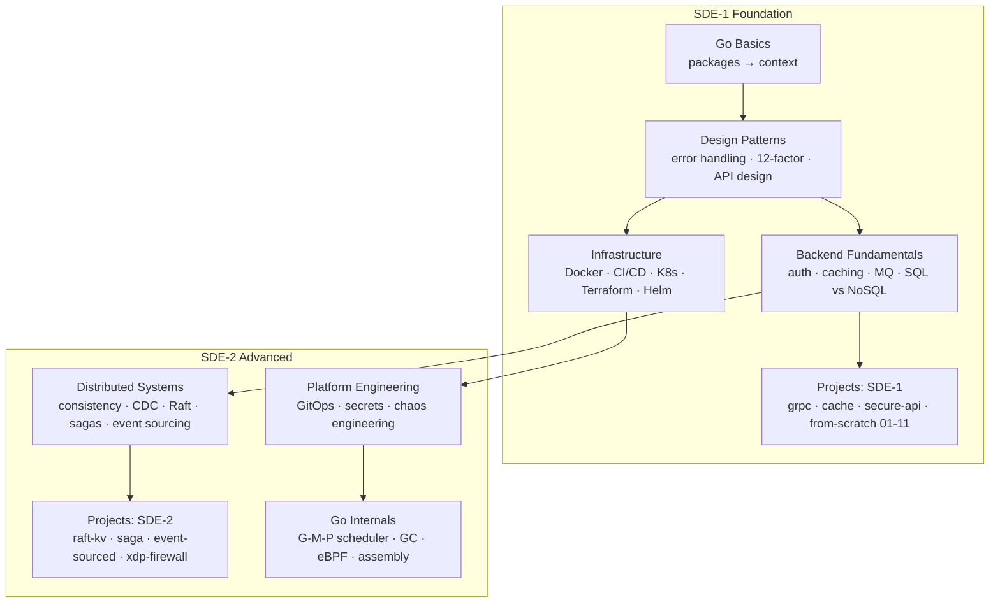

# backend-platform-notes


A hands-on engineering reference — Go from basics to internals, distributed systems, Kubernetes architecture, AWS infrastructure, and SRE practices.

---

## Overall Learning Path


```mermaid
graph TD
    subgraph SDE-1 Foundation
        BASICS[Go Basics<br/>packages → context] --> PATTERNS[Design Patterns<br/>error handling · 12-factor · API design]
        PATTERNS --> INFRA[Infrastructure<br/>Docker · CI/CD · K8s · Terraform · Helm]
        PATTERNS --> BACKEND[Backend Fundamentals<br/>auth · caching · MQ · SQL vs NoSQL]
        BACKEND --> PROJECTS_1[Projects: SDE-1<br/>grpc · cache · secure-api · from-scratch 01-11]
    end
    
    subgraph SDE-2 Advanced
        INFRA --> PLATFORM[Platform Engineering<br/>GitOps · secrets · chaos engineering]
        BACKEND --> DISTRIBUTED[Distributed Systems<br/>consistency · CDC · Raft · sagas · event sourcing]
        DISTRIBUTED --> PROJECTS_2[Projects: SDE-2<br/>raft-kv · saga · event-sourced · xdp-firewall]
        PLATFORM --> INTERNALS[Go Internals<br/>G-M-P scheduler · GC · eBPF · assembly]
    end
```

---

## Recommended Order

### 🟢 Step 1: Go Language (SDE-1)

```
1. go/packages              → Variables, functions, types, constants
2. go/flow_control_statements → For, if, switch, defer
3. go/more_types            → Pointers, structs, slices, maps, closures
4. go/methods               → Value/pointer receivers, fmt.Stringer
5. go/interfaces            → Implicit satisfaction, type assertions, embedding
6. go/error_handling        → Custom errors, wrapping (%w), panic/recover
7. go/generics              → Type parameters, constraints, generic types
8. go/concurrency           → Goroutines, channels, select, mutex, worker pool
9. go/context               → Cancellation, timeouts, request-scoped values
```

### 🔵 Step 2: Production Skills (SDE-1)

| Topic | Where |
|-------|-------|
| Testing (table-driven, mocks, fuzz) | `go/go-internals/testing-patterns/` |
| Production Go (timeouts, pprof, graceful shutdown) | `go/go-internals/production-go/` |
| Module patterns (go.work, internal/) | `go/go-internals/module-patterns/` |
| Error handling mastery | `go/design-patterns/error-handling/` |
| API design (REST, pagination, OpenAPI) | `go/design-patterns/api-design/` |
| 12-Factor App | `go/design-patterns/twelve-factor/` |

### 🔴 Step 3: System Design & DevOps (SDE-1 → SDE-2)

| Topic | Level | Where |
|-------|-------|-------|
| Docker deep dive | SDE-1 | `system-design/docker-deep-dive/` |
| CI/CD pipelines | SDE-1 | `system-design/cicd/` |
| Kubernetes core | SDE-1 | `system-design/kubernetes-core/` |
| Auth (OAuth2, JWT) | SDE-1 | `system-design/auth-deep-dive/` |
| Caching strategies | SDE-1 | `system-design/caching-strategies/` |
| SQL vs NoSQL | SDE-1 | `system-design/sql-vs-nosql/` |
| Message queues | SDE-1 | `system-design/message-queue-patterns/` |
| Rate limiting & backpressure | SDE-1 | `system-design/backpressure/` |
| Observability & tracing | SDE-1 | `system-design/observability-guide/` |
| Consistency models | SDE-2 | `system-design/consistency-models/` |
| Database internals | SDE-2 | `system-design/database-internals/` |
| Distributed locking | SDE-1 | `system-design/distributed-locking/` |
| CDC (Change Data Capture) | SDE-2 | `system-design/cdc/` |
| Capacity planning | SDE-2 | `system-design/capacity-planning/` |
| GitOps | SDE-2 | `system-design/gitops/` |
| Chaos engineering | SDE-2 | `system-design/chaos-engineering/` |

### 🟠 Step 3.5: DevOps, Kubernetes & AWS

Deep-dive reference for Kubernetes internals, AWS architecture, and SRE practices. See **[`devops/`](./devops/README.md)** for the full index.

| Topic | Where |
|-------|-------|
| K8s architecture (control plane, nodes, components) | `devops/kubernetes/README.md` |
| `kubectl apply` end-to-end flow | `devops/kubernetes/README.md` |
| Scheduler internals (Filter → Score, worked example) | `devops/kubernetes/README.md` |
| Taints, tolerations, node affinity, GPU node groups | `devops/kubernetes/README.md` |
| EKS architecture (AWS-managed vs customer-managed) | `devops/kubernetes/eks-architecture.md` |
| VPC, public/private subnets, route tables | `devops/aws/README.md` |
| Security Groups vs NACLs (stateful vs stateless) | `devops/aws/README.md` |
| NAT Gateway, IGW, VPC Peering, Transit Gateway | `devops/aws/README.md` |
| IAM, ELB/ALB/NLB, Route53, ECS vs EKS | `devops/aws/services-overview.md` |
| 5XX debugging runbook (K8s + EKS) | `devops/sre/README.md` |
| OOM recovery (singleton + distributed) | `devops/sre/README.md` |
| Leader election with `client-go` Lease API | `devops/sre/README.md` |

---

### 🟣 Step 4: Build Projects

Two series live at the root:

**From Scratch** (`from-scratch/`) — 15 projects building distributed systems primitives from zero using only the stdlib. Start here for SDE-1.

| Range | What you build |
|-------|---------------|
| FS-01 → FS-05 | TCP server → HTTP → WebSocket chat → rate limiter → load balancer |
| FS-06 → FS-10 | Message queue → distributed cache → log aggregator → task scheduler → URL shortener (capstone) |
| FS-11 | API gateway (chi, JWT, ReverseProxy) |
| FS-12 → FS-15 | Consistent hash · Bloom filter · CRDTs · Commit log (SDE-2) |

See **[`from-scratch/README.md`](./from-scratch/README.md)** for the full index with architecture diagrams.

**Platform Projects** (`projects/`) — 22 production-grade projects (gRPC, Raft, eBPF, Kubernetes operators, event sourcing, sagas…). Tackle after from-scratch. See **[`projects/README.md`](./projects/README.md)**.

---

## Quick Reference: What Level Am I?

| If you can... | You're at... |
|---------------|-------------|
| Write Go with proper error handling, tests, and modules | SDE-1 basics ✅ |
| Deploy a Go service with Docker + CI/CD + K8s | SDE-1 DevOps ✅ |
| Design APIs with auth, caching, rate limiting, MQ | SDE-1 backend ✅ |
| Explain consistency models, CAP, and design for scale | SDE-2 system design ✅ |
| Build consensus protocols, event sourcing, CDC pipelines | SDE-2 distributed systems ✅ |
| Profile with pprof, understand GC, write operators | SDE-2 platform engineering ✅ |

---

## Advanced Guides & Internals

For the full deep-dive series with **SDE-1/SDE-2 level markers** on every topic, see the [**Master Table of Contents**](./go/README.md).

---

## Running Topics

```shell
go run . packages
go run . concurrency worker-pool
go run . context timeout
go run .              # show help
```

---

## Projects

**From Scratch** (`from-scratch/`) — 15 standalone projects using only the Go stdlib. Each has its own `go.mod`, `README.md`, and `Makefile`.

See **[`from-scratch/README.md`](./from-scratch/README.md)** for the full index (FS-01 → FS-15) with architecture diagrams.

**Platform Projects** (`projects/`) — 22 production-grade Go modules. Each is a separate Go module with its own README, docs, and Makefile.

See **[`projects/README.md`](./projects/README.md)** for the full project index with architecture diagrams and level markers.

## Adding New Topics

```shell
mkdir go/mytopic
```

Create `go/mytopic/mytopic.go` with `Run()` and `RunExample(name string)` functions, then register in `main.go` with a `case "mytopic":` block and import `tour_of_go/go/mytopic`.

---
