# DevOps, Linux, Kubernetes & AWS

Everything runs on Linux. This section covers Linux internals first, then the layers built on top: containers, Kubernetes, AWS, and SRE practices.

---

## Overview

```mermaid
graph TD
    classDef linux fill:#e67e22,stroke:#d35400,color:#fff,rx:8
    classDef k8s fill:#326ce5,stroke:#254ea8,color:#fff,rx:8
    classDef aws fill:#f39c12,stroke:#d68910,color:#000,rx:8
    classDef sre fill:#e74c3c,stroke:#c0392b,color:#fff,rx:8
    classDef iac fill:#9b59b6,stroke:#8e44ad,color:#fff,rx:8
    classDef cicd fill:#2ecc71,stroke:#27ae60,color:#fff,rx:8

    subgraph Linux
        L1["Kernel: processes, memory, filesystem, namespaces, cgroups"]:::linux --> L2["Isolation: chroot, BSD Jails, LXC, Docker"]:::linux
        L2 --> L3["Commands: grep, sed, awk, find, ss, strace, top"]:::linux
    end

    subgraph Kubernetes
        K1["Architecture: Control Plane and Node Components"]:::k8s --> K2["kubectl apply: API Server to etcd to Scheduler to kubelet"]:::k8s
        K2 --> K3["Scheduler: Filter, Score, Worked Example"]:::k8s
        K3 --> K4["Networking, Workloads, Storage, RBAC, Autoscaling"]:::k8s
        K4 --> K5["EKS: AWS-managed vs Customer-managed"]:::k8s
    end

    subgraph AWS
        A1["VPC: Public vs Private Subnets, Route Tables"]:::aws --> A2["Security Groups vs NACLs: Stateful vs Stateless"]:::aws
        A2 --> A3["NAT GW, IGW, VPC Peering, Transit Gateway"]:::aws
        A3 --> A4["IAM, ELB/ALB, Route53, ECS vs EKS"]:::aws
    end

    subgraph SRE
        S1["5XX Debugging: K8s Runbook + EKS-Specific"]:::sre --> S2["OOM Recovery: Singleton vs Distributed"]:::sre
        S2 --> S3["SLI/SLO/Error Budget, MTTD/MTTR, Toil"]:::sre
        S3 --> S4["Leader Election: client-go Lease API"]:::sre
    end

    subgraph IaC["Infrastructure as Code"]
        I1["IaC Concepts: declarative vs imperative, drift, env isolation"]:::iac --> I2["Terraform: workspaces, state ops, lifecycle, DB user example"]:::iac
        I1 --> I3["CloudFormation: stacks, changesets, nested stacks, StackSets"]:::iac
    end

    subgraph CICD["CI/CD"]
        C1["CI/CD Concepts: triggers, secrets, deployment strategies"]:::cicd --> C2["Jenkins: declarative pipeline, ECS agents, withCredentials"]:::cicd
        C1 --> C3["GitHub Actions: OIDC to AWS, matrix builds, caching"]:::cicd
        C1 --> C4["ArgoCD: GitOps, sync policies, app-of-apps, multi-cluster"]:::cicd
    end
```

---

## Contents

### Linux

| Document | Topics |
|----------|--------|
| [linux/README.md](./linux/README.md) | Kernel architecture, processes, memory management, filesystem, inodes, load average, file descriptors, OOM killer, signals, top metrics, /proc and /sys |
| [linux/containers-evolution.md](./linux/containers-evolution.md) | chroot (1979), BSD Jails (2000), Linux namespaces, cgroups v1/v2, LXC (2008), Docker (2013) — full evolution with mermaid diagrams |
| [linux/commands.md](./linux/commands.md) | grep, sed, awk, find, networking, processes, disk, system monitoring, cron, one-liners |

### Kubernetes

| Document | Topics |
|----------|--------|
| [kubernetes/README.md](./kubernetes/README.md) | Full control plane & node architecture, `kubectl apply` flow, scheduler filtering/scoring, taints, tolerations, node affinity, GPU node group scenario |
| [kubernetes/eks-architecture.md](./kubernetes/eks-architecture.md) | EKS managed control plane, customer VPC worker nodes, VPC CNI, IRSA, managed node groups, Fargate |

### AWS

| Document | Topics |
|----------|--------|
| [aws/README.md](./aws/README.md) | VPC architecture, public vs private subnets, Security Groups vs NACLs (stateful/stateless), NAT Gateway, IGW, Route Tables, VPC Peering, Transit Gateway |
| [aws/services-overview.md](./aws/services-overview.md) | IAM (roles, policies, IRSA), ELB/ALB/NLB, Route53, ECS vs EKS |

### SRE

| Document | Topics |
|----------|--------|
| [sre/README.md](./sre/README.md) | 5XX debugging runbook (generic K8s + EKS-specific), OOM-killed recovery, singleton vs distributed pods, leader election with `client-go`, SLI/SLO/error budget, MTTD/MTTR, toil, incident response, RED method, scaling |

### Infrastructure as Code

| Document | Topics |
|----------|--------|
| [iac/README.md](./iac/README.md) | Why IaC, declarative vs imperative, tools comparison (Terraform/CFN/CDK/Pulumi), state management, drift, env isolation (directories/workspaces/Terragrunt), secrets, count vs for_each, lifecycle rules |
| [iac/terraform/README.md](./iac/terraform/README.md) | Core commands, workspaces, state ops (import/state rm/-replace), DB user example with for_each, HCL patterns, version history |
| [iac/cloudformation/README.md](./iac/cloudformation/README.md) | Stack lifecycle, template structure, change sets, nested stacks, cross-stack references, StackSets, drift detection, custom resources |

### CI/CD

| Document | Topics |
|----------|--------|
| [cicd/README.md](./cicd/README.md) | CI vs CD vs GitOps, triggers (push/PR best practice), deployment strategies (rolling/blue-green/canary), secrets in CI, Docker layer caching, debugging flaky pipelines |
| [cicd/jenkins/README.md](./cicd/jenkins/README.md) | Declarative pipeline, parameters, dynamic env vars, withCredentials, shared libraries, matrix builds, parallel stages, manual approval gates |
| [cicd/github-actions/README.md](./cicd/github-actions/README.md) | Workflow syntax, OIDC to AWS (no long-lived keys), matrix builds, caching (Go modules + Docker layers), reusable workflows, concurrency control |
| [cicd/argocd/README.md](./cicd/argocd/README.md) | GitOps pull model, Application CRD, sync policies (manual/auto/self-heal), sync waves and hooks, app-of-apps, multi-cluster with ApplicationSet, Image Updater, rollback |
