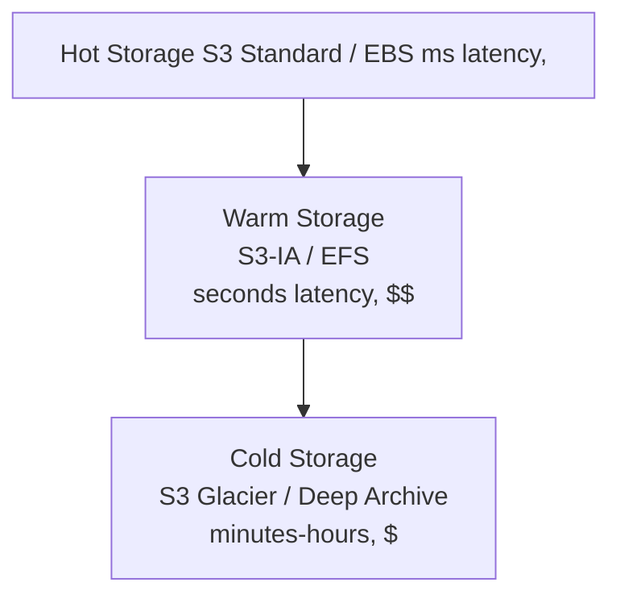
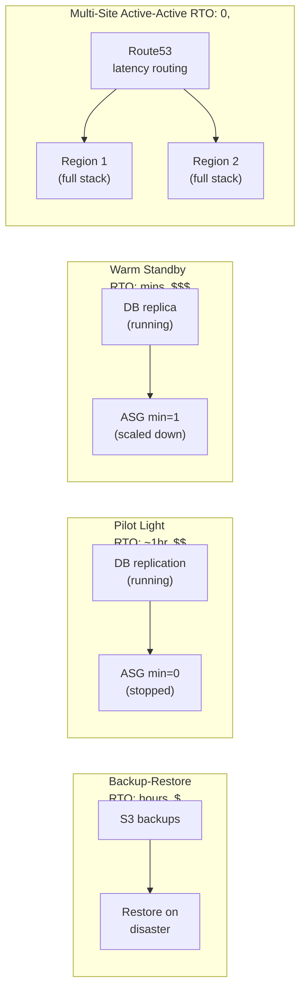
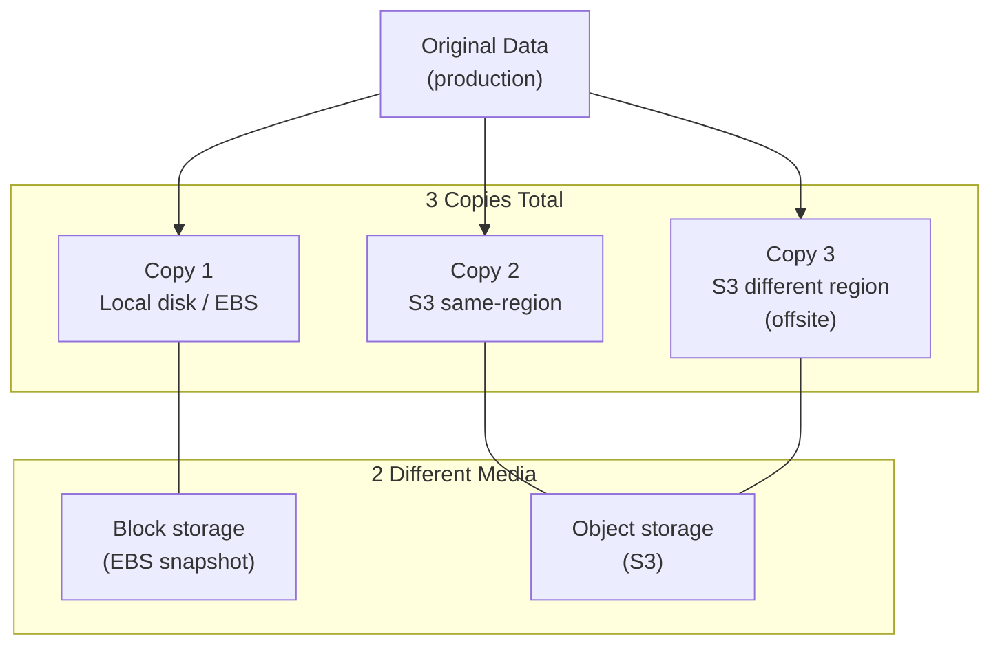

# Backup and Disaster Recovery

## 1. RTO vs RPO

- **RPO** (Recovery Point Objective): max acceptable data loss — how old can the restored data be?
- **RTO** (Recovery Time Objective): max acceptable downtime — how long until service is back?

```mermaid
gantt
    title RTO / RPO Timeline
    dateFormat HH:mm
    axisFormat %H:%M

    section Timeline
    Normal operation     : done, t1, 00:00, 02:00
    Disaster occurs      : crit, disaster, 02:00, 02:01
    Last backup          : milestone, backup, 01:30, 0m
    Detection + response : active, t2, 02:01, 02:30
    Restore in progress  : t3, 02:30, 03:30
    Service restored     : milestone, restored, 03:30, 0m
```



```
Last backup ──── DISASTER ──────────────── SERVICE BACK
     |←── RPO ──→|          |←─── RTO ────→|
  (30 min data   (02:00)                (03:30 = 90min
    could be lost)                       downtime)
```

Tighten RPO → more frequent backups or streaming replication.
Tighten RTO → more pre-provisioned infrastructure (warm/hot standby).

---

## 2. Backup Strategies

| Strategy | What | Pros | Cons |
|---|---|---|---|
| **Full** | Copy everything | Simple restore | Slow, large |
| **Incremental** | Changes since last backup | Fast, small | Restore = full + all increments |
| **Differential** | Changes since last full | Restore = full + one diff | Grows over time |

### Storage Pyramid



**Policy**: keep last 7 daily backups hot, 4 weekly warm, 12 monthly cold.

---

## 3. Kubernetes Backup with Velero

Velero backs up K8s resources (YAML manifests) + persistent volume snapshots.

```bash
# install
velero install \
  --provider aws \
  --plugins velero/velero-plugin-for-aws:v1.8.0 \
  --bucket my-velero-backups \
  --backup-location-config region=us-east-1 \
  --snapshot-location-config region=us-east-1 \
  --secret-file ./credentials-velero

# backup a namespace
velero backup create prod-backup --include-namespaces production

# schedule daily backups
velero schedule create daily-prod \
  --schedule="0 2 * * *" \
  --include-namespaces production \
  --ttl 720h     # 30 days retention

# restore
velero restore create --from-backup prod-backup
```

### etcd backup (control plane)

```bash
# backup
ETCDCTL_API=3 etcdctl snapshot save /backup/etcd-$(date +%F).db \
  --endpoints=https://127.0.0.1:2379 \
  --cacert=/etc/kubernetes/pki/etcd/ca.crt \
  --cert=/etc/kubernetes/pki/etcd/server.crt \
  --key=/etc/kubernetes/pki/etcd/server.key

# verify snapshot
etcdctl snapshot status /backup/etcd-2025-01-01.db

# restore (run on all etcd nodes, then restart etcd)
etcdctl snapshot restore /backup/etcd-2025-01-01.db \
  --data-dir /var/lib/etcd-restored
```

---

## 4. Database Backup

### PostgreSQL

```bash
# logical backup (portable, slow)
pg_dump -Fc mydb > mydb_$(date +%F).dump

# restore
pg_restore -d mydb mydb_2025-01-01.dump

# full cluster backup (binary, fast)
pg_basebackup -D /backup/pgbase -Ft -z -P \
  -R   # write recovery.conf for replica/PITR

# WAL archiving to S3 (in postgresql.conf)
archive_mode = on
archive_command = 'aws s3 cp %p s3://my-wal-bucket/wal/%f'
```

### Point-in-Time Recovery (PITR)

```bash
# restore base backup, then replay WAL up to target time
recovery_target_time = '2025-01-15 14:30:00'
restore_command = 'aws s3 cp s3://my-wal-bucket/wal/%f %p'
```

PITR gives RPO = seconds (limited only by WAL archive frequency).

---

## 5. AWS DR Patterns



| Pattern | RTO | RPO | Cost | When to use |
|---|---|---|---|---|
| Backup-restore | Hours | Hours | $ | Dev/test, low criticality |
| Pilot light | ~1 hour | Minutes | $$ | Core systems, cost-sensitive |
| Warm standby | Minutes | Seconds | $$$ | Business-critical |
| Active-active | Near zero | Near zero | $$$$ | Mission-critical |

---

## 6. Backup Testing

**An untested backup is not a backup.**

```bash
# automated restore test in CI (runs weekly)
steps:
  - name: Restore DB from latest backup
    run: |
      pg_restore -d test_restore $LATEST_BACKUP
      psql -d test_restore -c "SELECT COUNT(*) FROM orders"

  - name: Verify Velero restore
    run: |
      velero restore create ci-test --from-backup latest-prod
      kubectl wait --for=condition=Ready pod -l app=payment -n restored --timeout=300s
      curl -f http://payment.restored/healthz
```

**Restore drill checklist:**
- [ ] Restore to isolated environment (never test on prod backup → prod)
- [ ] Verify row counts / checksums match pre-backup
- [ ] Measure actual RTO (time restore took)
- [ ] Document gaps vs target RTO/RPO

---

## 7. The 3-2-1 Rule



- **3** copies of data
- **2** different storage media types
- **1** copy offsite (different region / cloud)

In AWS: EBS snapshot (copy 1) + S3 same-region (copy 2) + S3 cross-region replication (copy 3).
