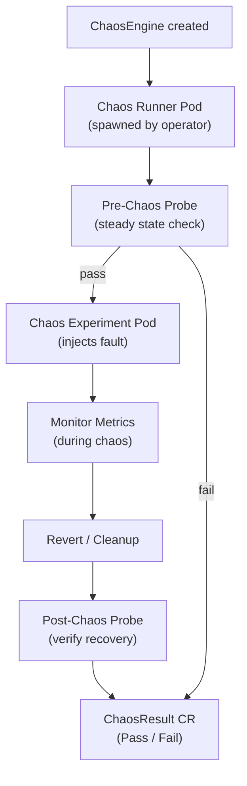
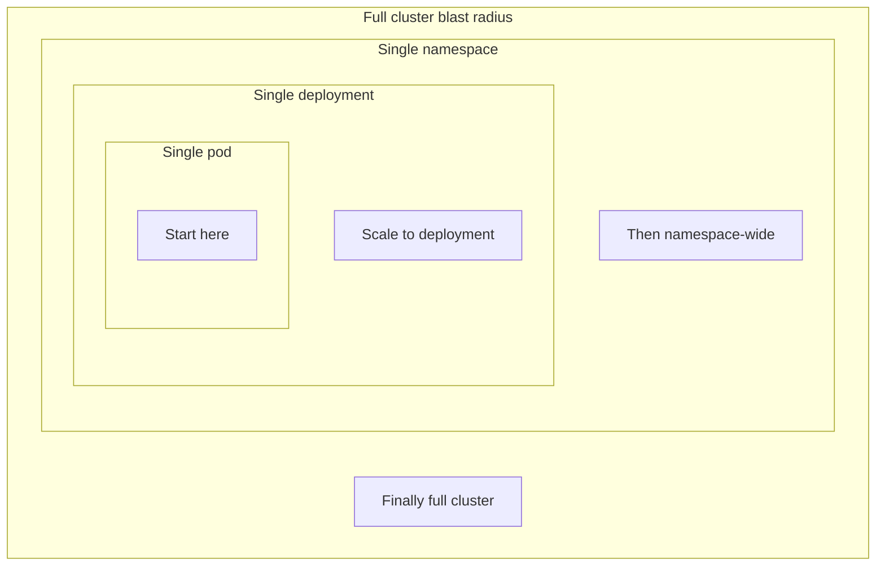

# Chaos Engineering

## 1. Principles

| Principle | Description |
|---|---|
| **Steady state** | Define normal behavior (p99 latency, error rate, RPS) |
| **Hypothesis** | "If X fails, the system stays healthy" |
| **Blast radius** | Limit scope — start small, expand gradually |
| **Run in prod** | Staging findings differ; prod is ground truth |
| **Learn from failures** | Post-mortem every experiment, fix weaknesses |

Chaos engineering is **not** breaking things randomly — it's controlled experiments to build confidence.

---

## 2. Tools

| Tool | Target | Notes |
|---|---|---|
| Chaos Monkey | EC2 instances | Netflix original, terminates random instances |
| Litmus Chaos | Kubernetes | CNCF project, CRD-driven, huge experiment library |
| Chaos Mesh | Kubernetes | CNCF, GUI + CRDs, fine-grained network faults |
| k6 | HTTP load + chaos | Combine load test with failure scenarios |
| AWS FIS | AWS resources | Fault Injection Simulator, native AWS service |

---

## 3. Litmus CRDs

### ChaosEngine — runs an experiment on a target

```yaml
apiVersion: litmuschaos.io/v1alpha1
kind: ChaosEngine
metadata:
  name: pod-kill-engine
  namespace: default
spec:
  appinfo:
    appns: default
    applabel: "app=payment"
    appkind: deployment
  engineState: active
  chaosServiceAccount: litmus-admin
  experiments:
  - name: pod-delete
    spec:
      components:
        env:
        - name: TOTAL_CHAOS_DURATION
          value: "60"          # seconds
        - name: CHAOS_INTERVAL
          value: "10"
        - name: FORCE
          value: "false"
```

### Litmus Execution Flow



---

## 4. Experiments

| Experiment | What it tests |
|---|---|
| **Pod kill** | Pod restarts, K8s self-healing |
| **Network partition** | Service mesh fallback, timeouts |
| **CPU hog** | Throttling, resource limits |
| **Memory hog** | OOMKilled handling, limits |
| **Node drain** | Pod disruption budgets, rescheduling |
| **Disk fill** | Ephemeral storage limits, log rotation |
| **Network latency** | Circuit breakers, timeout configs |
| **DNS failure** | Service discovery fallback |

---

## 5. Game Days

Structured chaos sessions:

1. **Define scope**: which service, which experiment, what blast radius
2. **Set steady state**: agree on SLIs to watch (e.g., error rate < 1%)
3. **Hypothesis**: "payment service continues serving after one pod kill"
4. **Run experiment**: start small (1 replica), observe
5. **Rollback plan**: know how to stop the experiment (`kubectl delete chaosengine`)
6. **Post-mortem**: document findings, create follow-up tickets

---

## 6. Observability During Chaos

Watch these signals during any experiment:

```
# Error rates
sum(rate(http_requests_total{status=~"5.."}[1m])) / sum(rate(http_requests_total[1m]))

# Latency p99
histogram_quantile(0.99, rate(http_request_duration_seconds_bucket[1m]))

# Pod restarts
kube_pod_container_status_restarts_total

# CPU throttling
container_cpu_cfs_throttled_seconds_total

# HPA scaling events
kubectl get events --field-selector reason=SuccessfulRescale
```

Chaos + load test together: run k6 traffic while injecting faults to see real user impact.

---

## 7. Failure Injection Patterns

### Blast Radius Diagram



### Patterns

| Pattern | Implementation |
|---|---|
| **Latency injection** | `tc netem delay 200ms` on pod network interface |
| **Error rate injection** | Return 500 for X% of requests (Envoy fault injection) |
| **Dependency kill** | Kill downstream service, verify circuit breaker opens |
| **Packet loss** | `tc netem loss 20%` to test retries |
| **DNS failure** | Block CoreDNS or return NXDOMAIN |

### Envoy fault injection (Istio)

```yaml
apiVersion: networking.istio.io/v1alpha3
kind: VirtualService
metadata:
  name: payment-fault
spec:
  hosts: [payment]
  http:
  - fault:
      delay:
        percentage:
          value: 10.0        # 10% of requests
        fixedDelay: 500ms
      abort:
        percentage:
          value: 5.0         # 5% return 500
        httpStatus: 500
    route:
    - destination:
        host: payment
```
