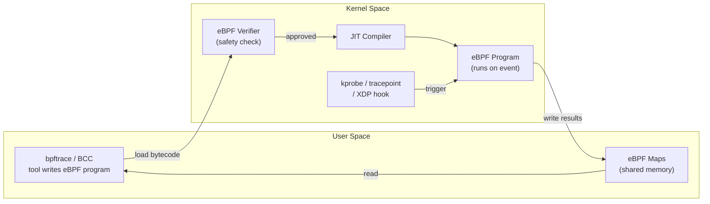
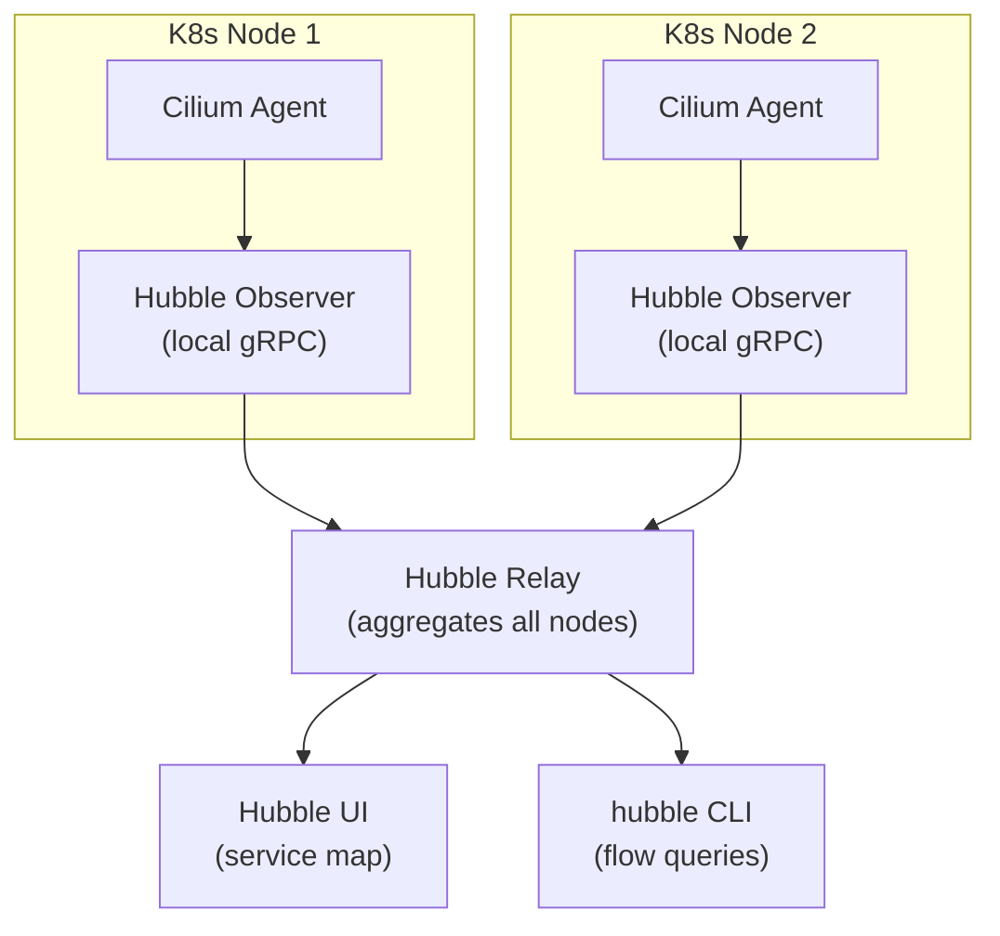
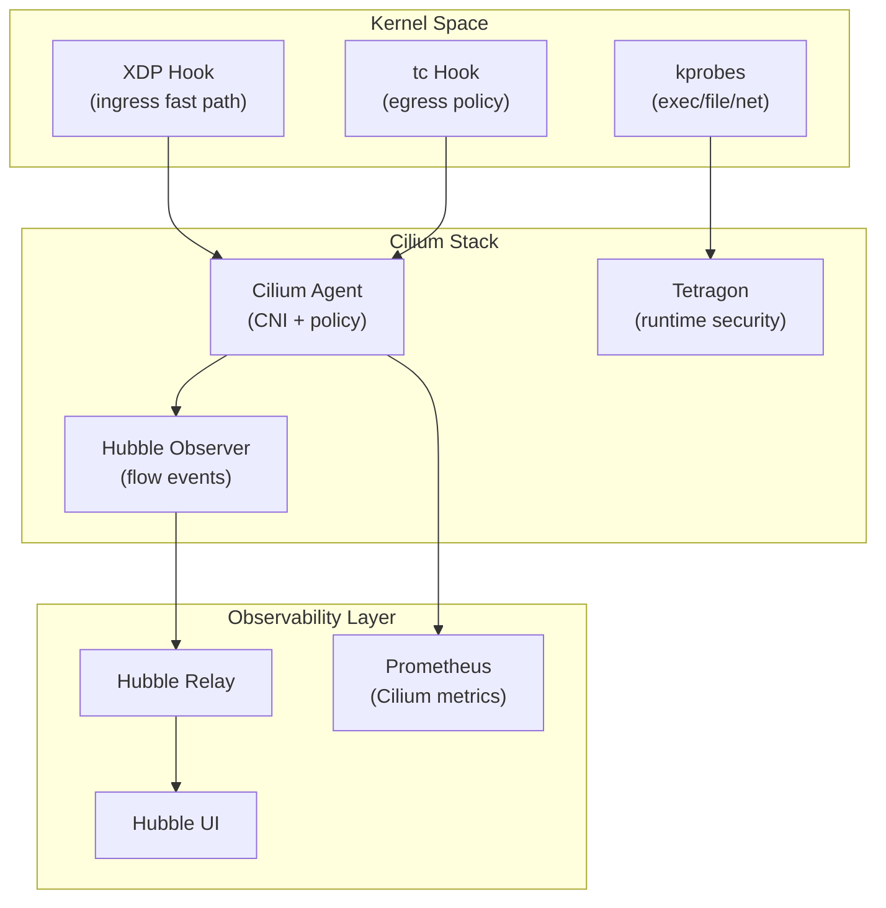

# eBPF Observability

## 1. What is eBPF?

eBPF (extended Berkeley Packet Filter) lets you run sandboxed programs inside the Linux kernel, triggered by events — without modifying kernel source or loading modules.



**Hook types:**
- `kprobe/kretprobe` — kernel function entry/exit
- `tracepoint` — stable kernel trace events
- `uprobe` — user-space function entry
- `XDP` — eXpress Data Path, runs at NIC driver level (pre-stack)
- `tc` — traffic control ingress/egress

---

## 2. Safety Model

The **verifier** enforces before any program runs:
- No unbounded loops (all loops must have a bounded iteration count)
- No invalid memory access (all pointer arithmetic checked)
- No unreachable instructions
- Must terminate (DAG check)
- Max 1M instructions (kernel 5.2+)

Result: kernel stability guaranteed — buggy eBPF cannot crash the kernel.

---

## 3. Tools

### bpftrace one-liners

```bash
# syscall latency histogram (nanoseconds)
bpftrace -e 'tracepoint:syscalls:sys_enter_read { @start[tid] = nsecs; }
             tracepoint:syscalls:sys_exit_read  { @ns = hist(nsecs - @start[tid]); }'

# off-CPU time (who is blocked and for how long)
bpftrace -e 'tracepoint:sched:sched_switch { @off[args->prev_comm] = nsecs; }
             tracepoint:sched:sched_switch { @ms[args->next_comm] = hist((nsecs - @off[args->next_comm])/1e6); }'

# TCP retransmits with details
bpftrace -e 'tracepoint:tcp:tcp_retransmit_skb {
               printf("%s %s:%d -> %d\n", comm,
               ntop(args->saddr), args->sport, args->dport); }'
```

### BCC tools

| Tool | What it shows |
|---|---|
| `execsnoop` | Every new process exec (pid, ppid, args) |
| `opensnoop` | Every file open call with path |
| `tcplife` | TCP connection durations + bytes |
| `biolatency` | Block I/O latency histogram |
| `runqlat` | CPU run-queue latency (scheduler) |
| `profile` | CPU flame graph via sampling |
| `tcpretrans` | TCP retransmit events |

```bash
# install bcc on Ubuntu
apt-get install bpfcc-tools
execsnoop-bpfcc          # watch all execs
opensnoop-bpfcc -p 1234  # watch PID 1234 file opens
tcplife-bpfcc            # show TCP session durations
```

---

## 4. Cilium: eBPF-based CNI

Cilium replaces iptables with eBPF for Kubernetes networking:
- **CNI**: pod-to-pod routing via eBPF maps (no kube-proxy)
- **Network Policy**: L3/L4 + L7 (HTTP method, gRPC service) enforcement
- **Load balancing**: eBPF replaces kube-proxy IPVS/iptables for Service VIP

```bash
helm install cilium cilium/cilium \
  --set kubeProxyReplacement=strict \
  --set hubble.relay.enabled=true \
  --set hubble.ui.enabled=true
```

---

## 5. Tetragon: Runtime Security

Tetragon uses eBPF to enforce security policies at kernel level:

```yaml
apiVersion: cilium.io/v1alpha1
kind: TracingPolicy
metadata:
  name: detect-shell-exec
spec:
  kprobes:
  - call: "sys_execve"
    syscall: true
    args:
    - index: 0
      type: "string"
    selectors:
    - matchArgs:
      - index: 0
        operator: "Postfix"
        values: ["/bin/sh", "/bin/bash"]
      matchActions:
      - action: Sigkill   # kill the process
```

Detects: exec of shells, `/etc/passwd` reads, unexpected network connections, privilege escalation.

---

## 6. Hubble: Network Observability

Hubble is the observability layer for Cilium clusters.



```bash
hubble observe --namespace default --last 100
hubble observe --from-pod default/frontend --to-pod default/backend
hubble observe --verdict DROPPED   # show dropped flows
```

---

## 7. Performance Advantage

| Approach | Overhead | Why |
|---|---|---|
| strace | ~100x slowdown | ptrace stops process per syscall |
| perf | ~5-10% | kernel→userspace copy per event |
| eBPF | ~1-3% | in-kernel aggregation, zero-copy maps |

eBPF programs aggregate data (histograms, counts) in kernel maps. Only summaries cross the user/kernel boundary — not raw events.

**Zero-copy**: `BPF_MAP_TYPE_PERF_EVENT_ARRAY` uses a shared ring buffer; userspace reads directly from mapped memory.

---

## Architecture: Cilium + Hubble + Tetragon


