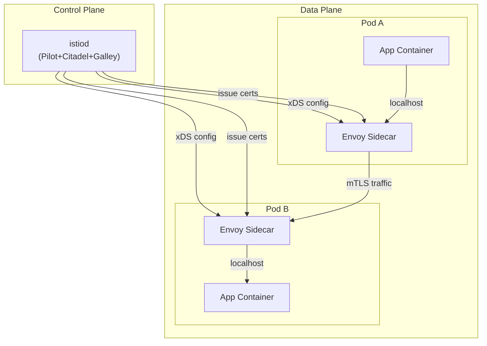
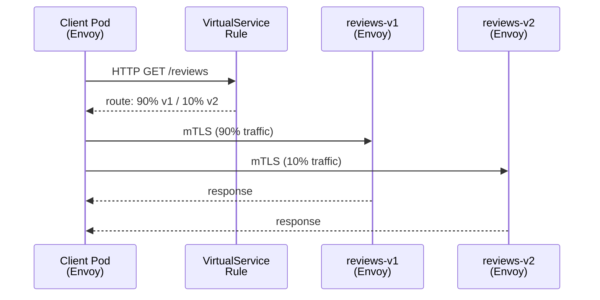
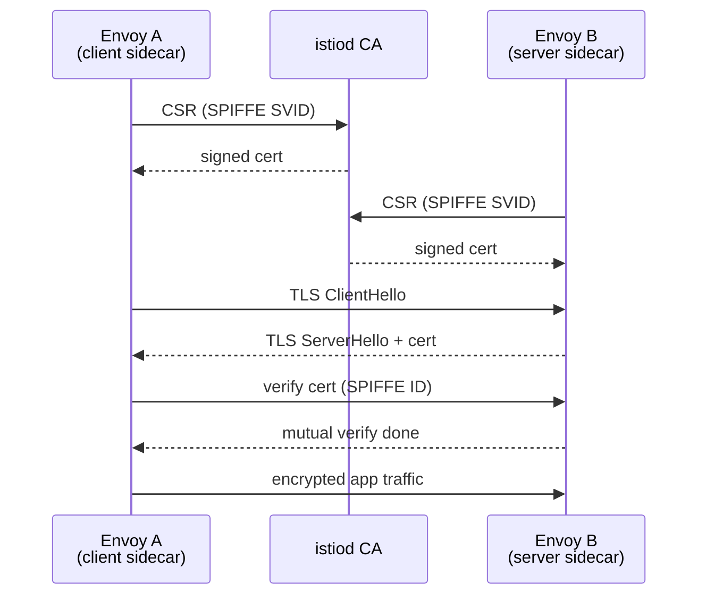
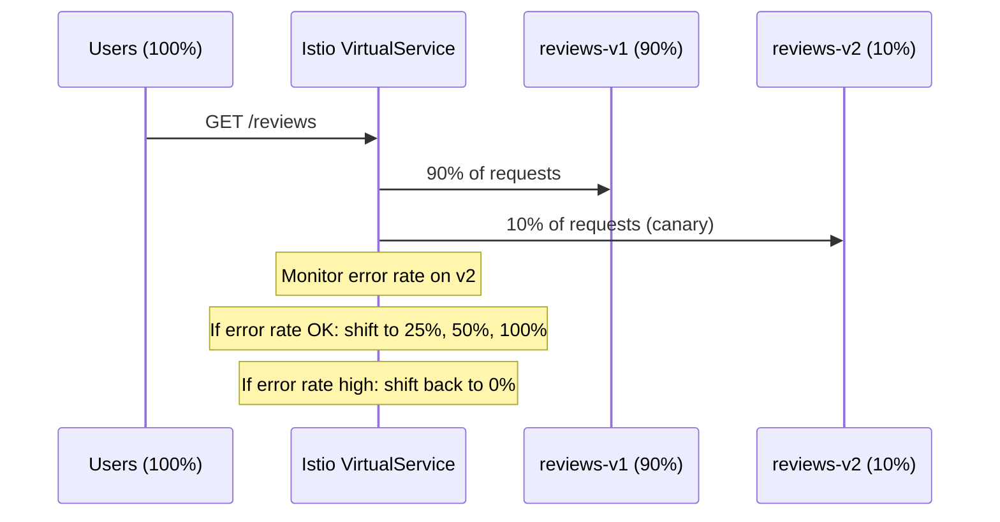

# Service Mesh (Istio / Linkerd)

## 1. The Problem

With N microservices, cross-cutting concerns appear in every service:

| Concern | Without mesh | With mesh |
|---|---|---|
| mTLS | Library per service | Sidecar auto-encrypts |
| Retries / timeouts | App code | DestinationRule |
| Circuit breaking | Hystrix/Resilience4j | DestinationRule |
| Distributed traces | Instrumentation code | Envoy auto-injects |
| Access logs | Custom logging | Envoy access log |

---

## 2. Architecture



- **istiod** combines Pilot (service discovery, xDS), Citadel (cert authority), Galley (config validation)
- **Envoy** sidecars intercept all inbound/outbound traffic via iptables rules injected by the init container
- xDS APIs (LDS, RDS, CDS, EDS) push config to proxies without restart

---

## 3. Traffic Management

### VirtualService — routing rules

```yaml
apiVersion: networking.istio.io/v1alpha3
kind: VirtualService
metadata:
  name: reviews
spec:
  hosts: [reviews]
  http:
  - match:
    - headers:
        end-user:
          exact: test-user
    route:
    - destination:
        host: reviews
        subset: v2
  - route:                      # default: canary split
    - destination:
        host: reviews
        subset: v1
      weight: 90
    - destination:
        host: reviews
        subset: v2
      weight: 10
```

### DestinationRule — subset definitions

```yaml
apiVersion: networking.istio.io/v1alpha3
kind: DestinationRule
metadata:
  name: reviews
spec:
  host: reviews
  subsets:
  - name: v1
    labels:
      version: v1
  - name: v2
    labels:
      version: v2
```

### Traffic Flow with Sidecar



---

## 4. Security

### mTLS — PeerAuthentication

```yaml
# STRICT: only mTLS accepted
apiVersion: security.istio.io/v1beta1
kind: PeerAuthentication
metadata:
  name: default
  namespace: production
spec:
  mtls:
    mode: STRICT   # or PERMISSIVE (plain+mTLS)
```

### AuthorizationPolicy

```yaml
apiVersion: security.istio.io/v1beta1
kind: AuthorizationPolicy
metadata:
  name: allow-reviews
  namespace: production
spec:
  selector:
    matchLabels:
      app: reviews
  rules:
  - from:
    - source:
        principals: ["cluster.local/ns/default/sa/productpage"]
    to:
    - operation:
        methods: ["GET"]
```

### mTLS Handshake



SPIFFE ID format: `spiffe://cluster.local/ns/<namespace>/sa/<serviceaccount>`

---

## 5. Observability

Envoy emits metrics automatically — no app instrumentation needed.

Key metrics:
```
istio_requests_total{source_app, destination_app, response_code}
istio_request_duration_milliseconds_bucket
istio_tcp_connections_opened_total
```

Access logs, distributed traces (Jaeger/Zipkin via B3 headers), and Kiali topology graph come out of the box.

---

## 6. Circuit Breaking & Retries

```yaml
apiVersion: networking.istio.io/v1alpha3
kind: DestinationRule
metadata:
  name: payment
spec:
  host: payment
  trafficPolicy:
    connectionPool:
      tcp:
        maxConnections: 100
      http:
        http1MaxPendingRequests: 50
        maxRequestsPerConnection: 10
    outlierDetection:             # circuit breaker
      consecutiveGatewayErrors: 5
      interval: 10s
      baseEjectionTime: 30s
      maxEjectionPercent: 50
    retries:
      attempts: 3
      perTryTimeout: 2s
      retryOn: "5xx,connect-failure"
```

---

## 7. Linkerd vs Istio

| Feature | Linkerd | Istio |
|---|---|---|
| Proxy | Linkerd2-proxy (Rust) | Envoy (C++) |
| Control plane | Lightweight Go binaries | istiod (heavy) |
| Install complexity | Low (`linkerd install \| kubectl apply`) | High (many CRDs) |
| mTLS | Automatic, zero-config | Requires PeerAuthentication |
| Traffic management | Basic (traffic split) | Full (VirtualService, DR) |
| L7 policy | Limited | Full AuthorizationPolicy |
| Resource usage | ~200 MB / proxy | ~500 MB / proxy |
| Learning curve | Low | High |
| Best for | Simplicity, fast mTLS | Full traffic control |

**Rule of thumb**: start with Linkerd if you just need mTLS + basic observability. Use Istio when you need fine-grained traffic policies, canary deployments, or complex AuthorizationPolicies.

---

## 8. Fault Injection — Chaos Testing via Istio

Istio can inject faults at the network level without touching application code — perfect for chaos engineering.

```yaml
# Inject HTTP 503 errors for 20% of requests to reviews
apiVersion: networking.istio.io/v1alpha3
kind: VirtualService
metadata:
  name: reviews-fault
spec:
  hosts: [reviews]
  http:
  - fault:
      abort:
        percentage:
          value: 20.0
        httpStatus: 503
    route:
    - destination:
        host: reviews
        subset: v1
---
# Inject 5-second delay for 10% of requests (test timeout handling)
apiVersion: networking.istio.io/v1alpha3
kind: VirtualService
metadata:
  name: ratings-delay
spec:
  hosts: [ratings]
  http:
  - fault:
      delay:
        percentage:
          value: 10.0
        fixedDelay: 5s
    route:
    - destination:
        host: ratings
        subset: v1
```

---

## 9. Timeouts and Retries

```yaml
apiVersion: networking.istio.io/v1alpha3
kind: VirtualService
metadata:
  name: reviews
spec:
  hosts: [reviews]
  http:
  - route:
    - destination:
        host: reviews
        subset: v1
    timeout: 3s                     # total request timeout
    retries:
      attempts: 3
      perTryTimeout: 1s             # each attempt gets 1s (total: 3s across 3 attempts)
      retryOn: "5xx,connect-failure,reset"   # retry on these conditions
```

**retryOn conditions:**

| Condition | When it retries |
|-----------|----------------|
| `5xx` | Any 5xx response from upstream |
| `connect-failure` | TCP connection failed |
| `reset` | Connection reset |
| `retriable-4xx` | 409 Conflict (safe to retry) |
| `gateway-error` | 502, 503, 504 |

**Important:** Only retry **idempotent** operations (GET, PUT). Never auto-retry POST without idempotency keys.

---

## 10. Traffic Shifting — Canary Deployment



```bash
# Gradually shift traffic using kubectl patch
kubectl patch virtualservice reviews --type=json \
  -p='[{"op":"replace","path":"/spec/http/0/route/0/weight","value":75},
       {"op":"replace","path":"/spec/http/0/route/1/weight","value":25}]'

# Monitor canary via Prometheus
# istio_requests_total{destination_service="reviews",destination_version="v2",response_code!~"5.."}
# / istio_requests_total{destination_service="reviews",destination_version="v2"}
# Alert if error rate > 1% on v2 → shift back to 0%
```
