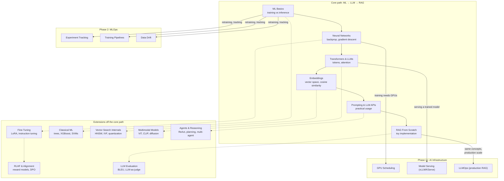

# AI Fundamentals

AI/ML from first principles — no infrastructure, no Kubernetes, no GPUs required to follow along. This section exists for one reason: `devops/ai-infra/` and `devops/mlops/` assume you already know what a model, a training loop, an embedding, and an LLM are. This is that missing Phase 0.

If you can already explain backpropagation, attention, and how RAG works without notes, skip straight to [`devops/ai-infra/README.md`](../ai-infra/README.md).

---

## How This Fits Into the Bigger Picture



This section is concept-only — every code sample runs in plain Python (some require an OpenAI/Anthropic API key for live calls, clearly noted where used). `devops/ai-infra/` and `devops/mlops/` are where these same concepts meet Kubernetes, GPUs, and production-scale systems.

---

## Files

### Core path — ML basics through RAG

| File | Topics |
|------|--------|
| [ml-basics.md](./ml-basics.md) | What ML is vs traditional programming, supervised/unsupervised/RL, features/labels, training vs inference, overfitting |
| [neural-networks.md](./neural-networks.md) | Neurons, activation functions (ReLU/softmax), layers, loss functions (MSE/cross-entropy), backpropagation, gradient descent, why GPUs matter |
| [transformers-llms.md](./transformers-llms.md) | Tokenization (BPE), embedding lookup, self-attention (Q/K/V), multi-head attention, transformer blocks, autoregressive generation, context window |
| [embeddings-deep-dive.md](./embeddings-deep-dive.md) | Vector space intuition, cosine similarity math, contrastive training, embeddings vs keyword search, dimensionality tradeoffs |
| [prompting-llm-apis.md](./prompting-llm-apis.md) | System/user/assistant roles, calling OpenAI/Anthropic APIs, temperature/top-p sampling, prompt engineering techniques, function calling/tool use |
| [rag-from-scratch.md](./rag-from-scratch.md) | Full toy RAG in ~40 lines of Python (list-based vector store), retrieval + augmentation + generation, 1:1 mapping to production `llmops.md` |

### Extensions — deeper topics off the core path

| File | Topics |
|------|--------|
| [fine-tuning.md](./fine-tuning.md) | Full fine-tuning, LoRA/QLoRA, instruction tuning, fine-tuning vs RAG decision framework |
| [rlhf-alignment.md](./rlhf-alignment.md) | RLHF pipeline (reward model + PPO), DPO, why aligned models refuse/hedge the way they do |
| [classical-ml.md](./classical-ml.md) | Decision trees, random forests, gradient boosting/XGBoost, SVMs, when classical ML beats deep learning |
| [llm-evaluation.md](./llm-evaluation.md) | Perplexity, BLEU/ROUGE, embedding similarity, LLM-as-judge, RAG-specific metrics (faithfulness, context precision/recall) |
| [vector-search-internals.md](./vector-search-internals.md) | IVF clustering, HNSW graphs, product quantization — why ANN search is sub-linear, what pgvector/Milvus do under the hood |
| [multimodal-models.md](./multimodal-models.md) | Vision transformers (ViT), CLIP, vision-language models (GPT-4V), diffusion-based image generation |
| [agents-reasoning.md](./agents-reasoning.md) | ReAct pattern, planning loops, multi-agent orchestration, agent risks (cost, runaway loops, unsafe actions) |

---

## Learning Path

```
Phase 0: AI Fundamentals — Core Path (start here if you've never trained or used a model)
  ml-basics.md              → what "training a model" actually means
  neural-networks.md        → how a model becomes a neural network, backprop/gradient descent
  transformers-llms.md      → the specific architecture behind GPT/Claude/Llama
  embeddings-deep-dive.md   → how text becomes searchable vectors
  prompting-llm-apis.md     → using an already-trained LLM via API, practically
  rag-from-scratch.md       → combining retrieval + generation, no infra required

Phase 0.5: Extensions (pick based on what you need — not strictly sequential)
  fine-tuning.md              → after neural-networks.md; needed if RAG/prompting alone can't fix behavior
  rlhf-alignment.md           → after fine-tuning.md; explains how aligned models are actually shaped
  classical-ml.md             → after ml-basics.md; parallel track for tabular-data problems
  vector-search-internals.md  → after embeddings-deep-dive.md; the "why" behind pgvector/Milvus indexes
  multimodal-models.md        → after transformers-llms.md + embeddings-deep-dive.md; extends both to images
  llm-evaluation.md           → after rag-from-scratch.md; how to measure if any of this actually worked
  agents-reasoning.md         → after prompting-llm-apis.md + rag-from-scratch.md; multi-step tool-using systems

Phase 1: AI Infrastructure — see devops/ai-infra/
  Once RAG-from-scratch makes sense, ai-infra/llmops.md is the same pipeline
  with a real vector DB, tracing, and guardrails layered on.

Phase 2: MLOps — see devops/mlops/
  Relevant once you're training/fine-tuning your own models, not just calling APIs.
```

---

## Quick Orientation: Do I Need This Section?

| If you can already... | You can skip to... |
|---|---|
| Explain gradient descent and backpropagation | `transformers-llms.md` |
| Explain self-attention and why LLMs use tokens, not words | `embeddings-deep-dive.md` |
| Explain cosine similarity and why embeddings beat keyword search | `prompting-llm-apis.md` |
| Call an LLM API with system/user roles and tune temperature | `rag-from-scratch.md` |
| Build a working retrieval + generation pipeline from scratch | [`devops/ai-infra/README.md`](../ai-infra/README.md) directly |
| All of the above, and want fine-tuning/evaluation/agents specifically | Jump straight to the relevant extension file above |

---

## Read Order

**Core:** `ml-basics.md` → `neural-networks.md` → `transformers-llms.md` → `embeddings-deep-dive.md` → `prompting-llm-apis.md` → `rag-from-scratch.md`

**Extensions** (read whichever is relevant to your task, in this relative order if reading all of them): `classical-ml.md` (parallel to core, anytime after `ml-basics.md`) → `fine-tuning.md` → `rlhf-alignment.md` → `vector-search-internals.md` → `multimodal-models.md` → `llm-evaluation.md` → `agents-reasoning.md`

Each file ends with a "Where This Leads"/"Where This Fits" section pointing to related files and, once you finish the core path, forward into `devops/ai-infra/llmops.md`.
