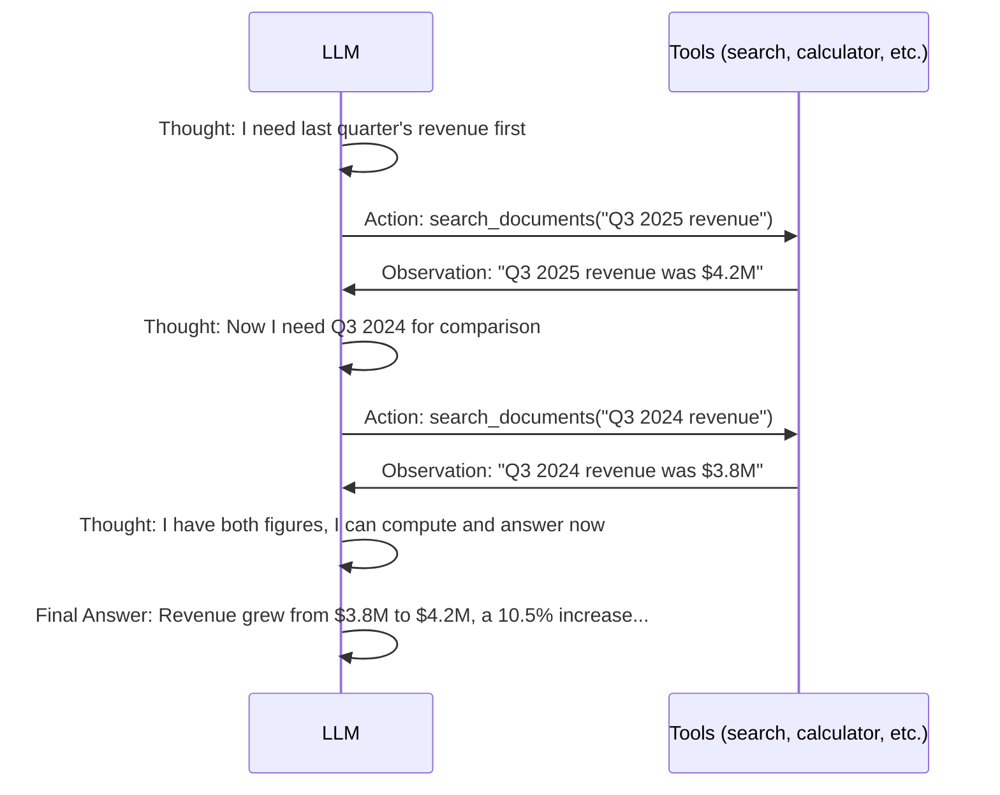
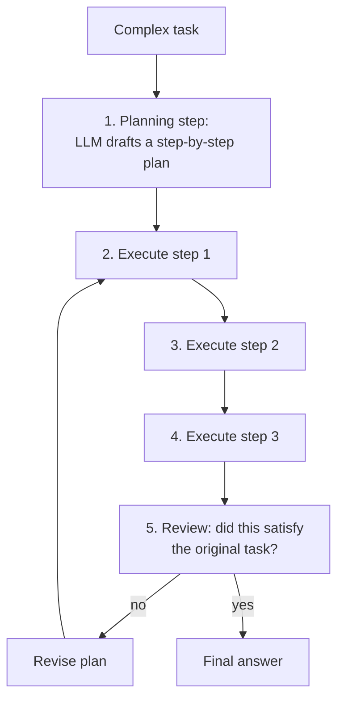
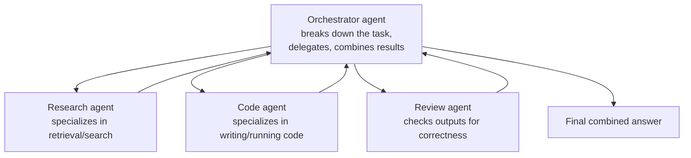

# Agents & Multi-Step Reasoning — Beyond a Single Question-Answer Turn

`rag-from-scratch.md` built a pipeline that answers one question with one retrieval step. `prompting-llm-apis.md`'s function calling let the model request a single tool call. An **agent** puts these together in a loop: the model can reason, call tools, observe results, and decide what to do next — repeatedly — until the task is actually done.

---

## The Core Limitation Agents Solve

A single RAG call is fixed: embed query → retrieve once → generate once. Some questions genuinely need multiple steps that can't be known in advance.

```python
# A single RAG call can't handle this well:
question = "Compare last quarter's revenue to the same quarter last year, and explain the difference."

# This actually requires:
# 1. Retrieve last quarter's revenue figure
# 2. Retrieve the same quarter last year's revenue figure
# 3. Compute the difference
# 4. Retrieve any context explaining what changed
# 5. Synthesize an explanation
# A single "retrieve top-5 chunks, then answer" pass has no mechanism for this multi-step process.
```

An agent handles this by letting the model decide, step by step, what to do next based on what it's learned so far — rather than the application hardcoding a fixed sequence.

---

## The ReAct Pattern (Reason + Act)

ReAct interleaves the model's reasoning ("what should I do next and why") with actions (tool calls) and observations (tool results), in a loop — a direct extension of the function-calling mechanism from `prompting-llm-apis.md`, just repeated multiple times instead of once.



```python
def react_agent(question: str, tools: dict, client, max_steps: int = 5) -> str:
    messages = [
        {"role": "system", "content": (
            "You solve problems step by step. At each step, either call a tool "
            "to gather information, or give a final answer if you have enough information."
        )},
        {"role": "user", "content": question},
    ]

    tool_definitions = [tool["definition"] for tool in tools.values()]

    for step in range(max_steps):
        response = client.chat.completions.create(
            model="gpt-4o",
            messages=messages,
            tools=tool_definitions,   # same tools mechanism as prompting-llm-apis.md
        )
        message = response.choices[0].message
        messages.append(message)

        if not message.tool_calls:
            return message.content   # model decided it has enough info — done

        # Execute whichever tool the model requested, feed the result back, loop again
        for tool_call in message.tool_calls:
            tool_name = tool_call.function.name
            tool_args = json.loads(tool_call.function.arguments)
            result = tools[tool_name]["function"](**tool_args)   # actually run it
            messages.append({
                "role": "tool",
                "tool_call_id": tool_call.id,
                "content": str(result),
            })

    return "Could not complete within step limit."
```

```python
# Wiring retrieval (rag-from-scratch.md) in as one of the agent's tools
tools = {
    "search_documents": {
        "definition": {
            "type": "function",
            "function": {
                "name": "search_documents",
                "description": "Search internal documents for relevant information",
                "parameters": {"type": "object", "properties": {"query": {"type": "string"}}, "required": ["query"]},
            },
        },
        "function": lambda query: retrieve(query, vector_store, top_k=3),  # from rag-from-scratch.md
    },
    "calculate": {
        "definition": {
            "type": "function",
            "function": {
                "name": "calculate",
                "description": "Evaluate a mathematical expression",
                "parameters": {"type": "object", "properties": {"expression": {"type": "string"}}, "required": ["expression"]},
            },
        },
        "function": lambda expression: eval(expression),  # simplified — sandbox this in production
    },
}

answer = react_agent(
    "Compare last quarter's revenue to the same quarter last year, and explain the difference.",
    tools, client,
)
```

**This is "agentic RAG"** — the term used in `prompting-llm-apis.md`'s closing note. Instead of always retrieving once with a fixed query, the model decides *when* to retrieve, *what* to search for, and *whether it needs more* information before answering.

---

## Planning Loops — Deciding the Whole Approach Upfront

ReAct decides one step at a time. A **planning** agent first drafts a multi-step plan, then executes each step — useful when the task is complex enough that reasoning step-by-step risks losing track of the overall goal.



```python
def plan_and_execute(task: str, tools: dict, client) -> str:
    # Step 1: ask the model to produce an explicit plan before doing anything
    planning_prompt = f"""Break this task into a numbered list of concrete steps:

Task: {task}

Respond with ONLY a numbered list of steps."""

    plan_response = client.chat.completions.create(
        model="gpt-4o", messages=[{"role": "user", "content": planning_prompt}],
    )
    steps = parse_numbered_list(plan_response.choices[0].message.content)

    # Step 2: execute each step, feeding prior results forward as context
    results = []
    for step in steps:
        step_context = "\n".join(f"Previous result: {r}" for r in results)
        step_result = react_agent(f"{step_context}\n\nCurrent step: {step}", tools, client)
        results.append(step_result)

    # Step 3: synthesize all step results into a final answer
    synthesis_prompt = f"Task: {task}\n\nStep results:\n" + "\n".join(results) + "\n\nGive the final answer."
    final = client.chat.completions.create(model="gpt-4o", messages=[{"role": "user", "content": synthesis_prompt}])
    return final.choices[0].message.content
```

**When planning beats pure ReAct:** tasks with steps that don't depend on each other's exact output (can be planned upfront) benefit from planning's clearer structure and easier debugging (you can inspect the plan before execution). Tasks where each step's outcome genuinely changes what should happen next favor ReAct's step-by-step reactivity.

---

## Multi-Agent Systems

Instead of one model doing everything, split responsibilities across multiple agents, each with a narrower role and its own system prompt (`prompting-llm-apis.md`) — similar to how a team of specialists outperforms one generalist on complex work.



```python
class Agent:
    def __init__(self, name: str, system_prompt: str, tools: dict, client):
        self.name = name
        self.system_prompt = system_prompt
        self.tools = tools
        self.client = client

    def run(self, task: str) -> str:
        return react_agent(task, self.tools, self.client)  # each agent is its own ReAct loop

research_agent = Agent("researcher", "You specialize in finding relevant information.", search_tools, client)
code_agent = Agent("coder", "You specialize in writing and testing code.", code_tools, client)
review_agent = Agent("reviewer", "You critically review work for correctness and completeness.", {}, client)

def orchestrate(task: str) -> str:
    research_findings = research_agent.run(f"Find information relevant to: {task}")
    draft = code_agent.run(f"Task: {task}\nRelevant info: {research_findings}")
    review = review_agent.run(f"Review this for correctness: {draft}")

    if "NEEDS_REVISION" in review:
        draft = code_agent.run(f"Revise based on feedback: {review}\nOriginal: {draft}")

    return draft
```

**Why split into multiple agents instead of one bigger prompt?** Each agent's system prompt and available tools stay focused and small — a research agent doesn't need code-execution tools cluttering its context, and a narrower role tends to produce more reliable behavior than one agent juggling every responsibility and tool at once. It also lets you swap out or improve individual agents independently (e.g., use a cheaper/faster model for the research agent, a stronger model for the review agent).

---

## The Real Risks of Agents

Agents are strictly more powerful and strictly less predictable than a single RAG call — that trade-off needs explicit handling:

| Risk | Why it happens | Mitigation |
|---|---|---|
| **Infinite/long loops** | Model keeps deciding it needs "just one more" tool call | Hard `max_steps` cap (as in `react_agent` above) |
| **Runaway cost** | Every step is a full LLM call; a 10-step agent run costs ~10x a single call | Set step limits and token budgets; monitor cost per task (`llmops.md`'s cost metrics) |
| **Compounding errors** | An error in step 2 corrupts every subsequent step's context | Validate/sanity-check intermediate results (`llm-evaluation.md`'s faithfulness scoring, applied per step) |
| **Unsafe actions** | An agent with real tool access (send email, delete data, spend money) can act on a bad decision | Human-approval gate before high-impact actions — see `devops/sre/self-healing-aiops.md`'s "human approval gate" pattern |
| **Unpredictable path** | Unlike fixed RAG, you can't always predict which tools will be called or in what order | Log every step (thought, action, observation) for debugging — this is what LLM tracing (`llmops.md`'s LangSmith/OpenLLMetry section) is for |

This is precisely why `devops/sre/self-healing-aiops.md`'s AIOps agent (LangChain + Loki + RAG, auto-remediating infrastructure issues) explicitly includes a human-approval gate before executing any remediation action — agents that can *act* on infrastructure, not just answer questions, need a safety net proportional to the damage a wrong decision could cause.

---

## Where This Fits — The Full Path From Fundamentals to Agents

```
agents-reasoning.md (you are here — final file, builds on nearly everything before it)
  ← prompting-llm-apis.md    function calling is the mechanism every tool call in this file uses
  ← rag-from-scratch.md      retrieval becomes just one tool among several an agent can call
  ← llm-evaluation.md        evaluating agent trajectories, not just final answers
  → devops/sre/self-healing-aiops.md   a real production agent: infra remediation with a human approval gate
  → devops/ai-infra/llmops.md           tracing/observability for multi-step agent runs, not just single calls
```

Agents are the natural ceiling of everything in this section — they combine training/inference concepts (`ml-basics.md`), the transformer's ability to follow instructions (`transformers-llms.md`, `rlhf-alignment.md`), retrieval (`rag-from-scratch.md`), and tool use (`prompting-llm-apis.md`) into systems that can complete open-ended, multi-step work rather than answering one question at a time.
