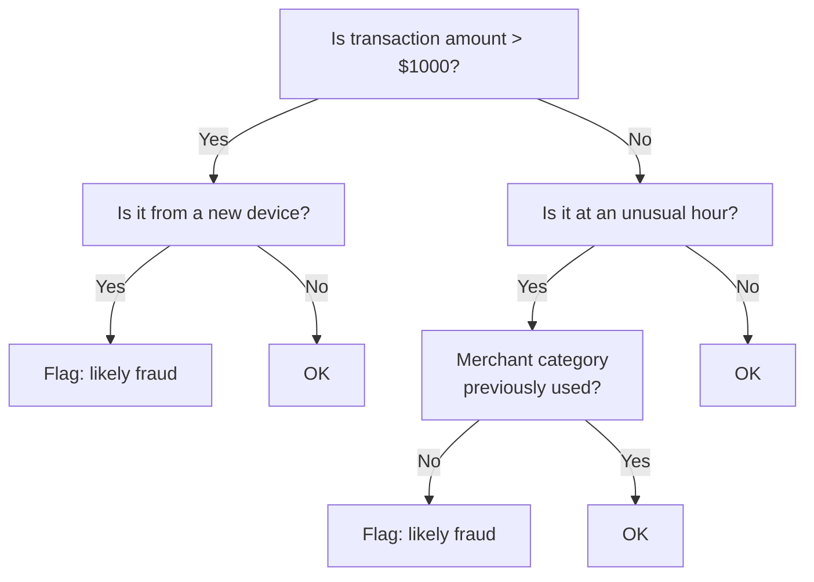
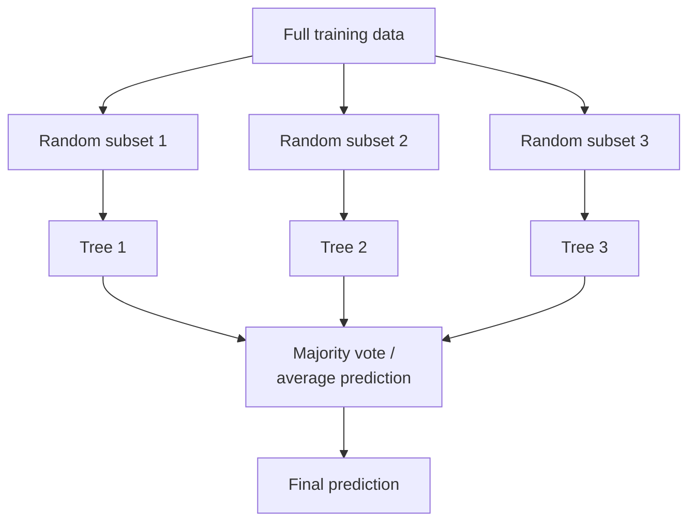
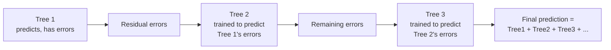
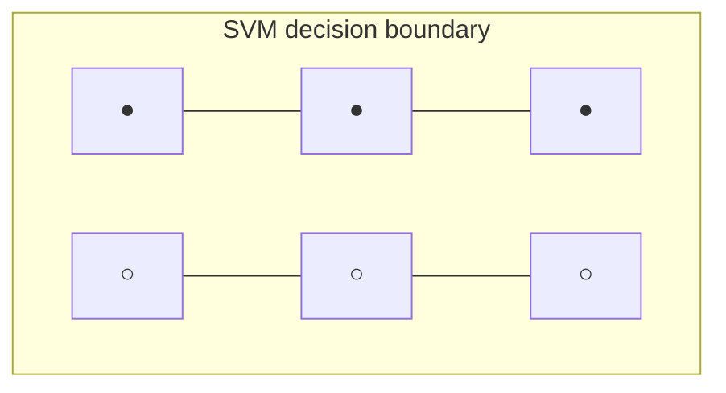

# Classical ML — Not Everything Is a Neural Network

Every other file in this section is deep-learning/LLM-focused, because that's what RAG needs. But most real-world tabular data problems (fraud detection, churn prediction, pricing models) are solved *better* by classical ML than by neural networks. This file exists so "machine learning" doesn't silently become a synonym for "neural network" in your head.

---

## Decision Trees

A decision tree learns a sequence of yes/no questions that split data into increasingly pure groups. It's the most human-readable ML model that exists — you can print the tree and read it like a flowchart.



```python
# A decision tree from scratch, for one binary feature split — real trees
# do this recursively across all features and pick the best split at each node
def gini_impurity(labels: list[int]) -> float:
    if not labels:
        return 0.0
    p_positive = sum(labels) / len(labels)
    p_negative = 1 - p_positive
    return 1 - (p_positive ** 2 + p_negative ** 2)  # 0 = pure group, 0.5 = maximally mixed

def best_split(feature_values: list[float], labels: list[int]) -> float:
    best_threshold, best_score = None, float("inf")
    for threshold in sorted(set(feature_values)):
        left_labels = [l for v, l in zip(feature_values, labels) if v <= threshold]
        right_labels = [l for v, l in zip(feature_values, labels) if v > threshold]
        # Weighted impurity after the split — lower is a better split
        weighted_impurity = (
            len(left_labels) * gini_impurity(left_labels) +
            len(right_labels) * gini_impurity(right_labels)
        ) / len(labels)
        if weighted_impurity < best_score:
            best_threshold, best_score = threshold, weighted_impurity
    return best_threshold
```

```python
# In practice, you use a library rather than writing this by hand
from sklearn.tree import DecisionTreeClassifier

model = DecisionTreeClassifier(max_depth=5)  # max_depth limits overfitting (ml-basics.md)
model.fit(X_train, y_train)   # X_train: feature matrix, y_train: labels
predictions = model.predict(X_test)
```

**Weakness:** a single deep decision tree overfits easily — recall `ml-basics.md`'s overfitting section. It can carve out a rule so specific it perfectly fits training data but fails on new data.

---

## Random Forests — Averaging Away the Overfitting

A random forest trains many decision trees, each on a random subset of the data and features, then averages their predictions. This is called **bagging** (bootstrap aggregating).



**Why averaging fixes overfitting:** any single tree's overfit mistakes are essentially random noise specific to its particular data subset. Averaging across many independently-overfit trees cancels out that noise while the genuine signal (which most trees agree on) reinforces itself.

```python
from sklearn.ensemble import RandomForestClassifier

model = RandomForestClassifier(
    n_estimators=100,   # number of trees — more trees = more stable, diminishing returns past ~100-500
    max_depth=10,
    max_features="sqrt",  # each tree only considers a random subset of features per split
)
model.fit(X_train, y_train)

# Bonus: random forests give you feature importance for free
importances = model.feature_importances_
for feature_name, importance in sorted(zip(feature_names, importances), key=lambda x: -x[1]):
    print(f"{feature_name}: {importance:.3f}")
# transaction_amount: 0.412
# device_is_new: 0.298
# hour_of_day: 0.155
# ...
```

This feature-importance output is something LLMs don't give you directly — a major reason classical ML remains preferred in regulated domains (credit scoring, fraud, insurance) where you must explain *why* a model made a decision.

---

## Gradient Boosting / XGBoost

Random forests build trees independently and average them. Gradient boosting builds trees *sequentially*, where each new tree specifically targets the errors the previous trees made — a very similar spirit to the gradient descent loop in `neural-networks.md`, but applied to trees instead of neural network weights.



```python
# Conceptual: each new tree is trained on the previous ensemble's mistakes
def gradient_boosting_step(trees: list, X, y_true, learning_rate: float = 0.1):
    current_predictions = sum(tree.predict(X) for tree in trees) if trees else [0] * len(y_true)
    residuals = [actual - pred for actual, pred in zip(y_true, current_predictions)]

    new_tree = DecisionTreeRegressor(max_depth=3)
    new_tree.fit(X, residuals)          # this tree learns to predict the error, not the label
    trees.append(new_tree)
    return trees
```

```python
# XGBoost — the production-grade, highly optimized implementation of this idea
import xgboost as xgb

model = xgb.XGBClassifier(
    n_estimators=200,
    max_depth=6,
    learning_rate=0.1,     # shrinks each tree's contribution — smaller = more trees needed, less overfitting
    subsample=0.8,          # each tree sees 80% of rows, adds randomness like random forests
)
model.fit(X_train, y_train)
```

XGBoost (and its cousins LightGBM, CatBoost) is the single most common winner of tabular-data ML competitions and production systems — it consistently beats neural networks on structured/tabular data with a fraction of the training cost and no GPU requirement.

---

## SVMs (Support Vector Machines)

An SVM finds the boundary between two classes that maximizes the margin — the distance from the boundary to the nearest points of each class. It's less commonly reached for today (gradient boosting usually wins on tabular data, neural nets win on unstructured data) but it's foundational and still useful for smaller, high-dimensional datasets like text classification.



The key idea: among all possible boundaries that separate the two classes, pick the one with the widest margin — this tends to generalize better to new data than a boundary that barely squeezes between the classes.

```python
from sklearn.svm import SVC

model = SVC(
    kernel="rbf",   # "kernel trick" — projects data into higher dimensions to find
                     # a linear boundary even when classes aren't linearly separable in original space
    C=1.0,           # regularization: lower C = wider margin, more tolerance for misclassified points
)
model.fit(X_train, y_train)
```

**The kernel trick, briefly:** some data isn't separable by a straight line in its original feature space, but becomes separable if you project it into a higher-dimensional space. The kernel trick computes the effect of that projection mathematically without ever explicitly computing the (potentially infinite-dimensional) projected coordinates.

---

## When to Use Classical ML vs Deep Learning

This is the practical decision this whole file is building toward.

| Signal | Favors classical ML (trees/XGBoost/SVM) | Favors deep learning (neural nets/transformers) |
|---|---|---|
| **Data type** | Tabular (rows/columns, structured features) | Text, images, audio, sequences |
| **Dataset size** | Small to medium (hundreds to low millions of rows) | Large (millions+ examples, or a pretrained model to fine-tune) |
| **Feature engineering** | You can hand-craft meaningful features | Raw input (pixels, tokens) with structure too complex to hand-craft |
| **Explainability requirement** | High — need to justify individual decisions | Lower — acceptable to trust aggregate performance |
| **Training cost/hardware** | Runs on a laptop CPU in minutes | Needs GPUs, can take hours to weeks |
| **Example problems** | Credit scoring, churn prediction, demand forecasting, fraud detection | Chatbots, image recognition, translation, code generation |

**The practical default for a new tabular-data problem:** start with XGBoost/LightGBM. It's fast to train, hard to badly overfit with reasonable defaults, gives you feature importance, and beats a neural network on most structured-data tasks without needing a GPU. Reach for deep learning when your data is inherently unstructured (text, images) or when you have both enough data and a pretrained model to build on.

---

## Where This Fits

```
classical-ml.md (you are here — independent track from the LLM path)
  ← ml-basics.md   the training/inference/overfitting concepts apply identically here
  → devops/mlops/experiment-tracking.md   tracking classical ML experiments (MLflow/W&B work for these too)
  → devops/mlops/data-drift.md            classical models degrade from data drift exactly like LLMs do
```

Unlike the other files in this section, classical ML doesn't lead toward RAG — it's a parallel track. If your problem is "predict a number/category from structured data," this is often the better path even in an LLM-heavy team.
