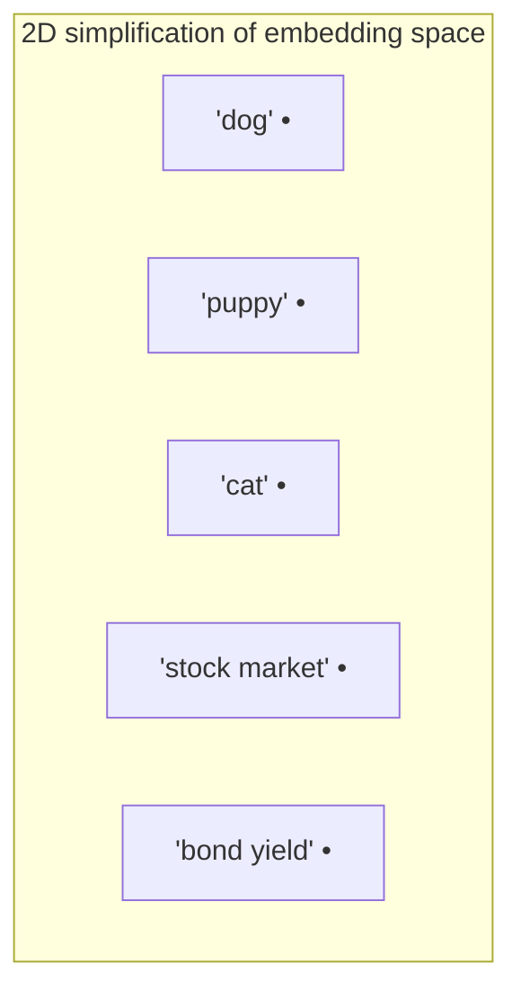
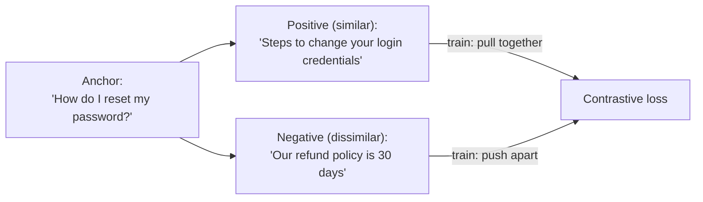

# Embeddings Deep Dive — How Text Becomes Searchable Vectors

`transformers-llms.md` mentioned embeddings as "the vector a token gets looked up as." This file covers what that vector actually represents, why distances between vectors are meaningful, and how embedding models are trained — the foundation `llmops.md`'s vector DB section builds on.

---

## What an Embedding Actually Is

An embedding is a fixed-length list of numbers (a vector) that represents the *meaning* of a piece of text. Similar meanings end up as vectors that are numerically close together; unrelated meanings end up far apart.

```python
# Conceptually — real models output 384 to 3072 dimensions, not 3
embed("dog")        # [0.91, 0.12, -0.4]
embed("puppy")       # [0.89, 0.15, -0.38]   ← very close to "dog"
embed("cat")         # [0.85, 0.30, -0.20]   ← somewhat close (both animals)
embed("stock market") # [-0.30, 0.88, 0.44]  ← far away (unrelated concept)
```

**Dimensionality** is just the length of that list. More dimensions can capture more nuance but cost more storage and compute:

| Model | Dimensions | Notes |
|-------|-----------|-------|
| `text-embedding-3-small` (OpenAI) | 1536 | Good default, used in `llmops.md` |
| `text-embedding-3-large` (OpenAI) | 3072 | Higher accuracy, higher cost |
| `all-MiniLM-L6-v2` (open source) | 384 | Small, fast, self-hostable |
| `bge-large` (open source) | 1024 | Strong open-source retrieval performance |

---

## Why This Works: Vector Space Geometry

Imagine (for intuition) just 2 dimensions instead of 1536 — every piece of text becomes a point on a 2D plane. Semantically similar text clusters together.



In the real 1536-dimensional space, "dog" and "puppy" end up close together, "cat" is somewhat nearby (both are pets/animals), and "stock market" is in a completely different region of the space, near "bond yield" and other finance terms. The model learned this structure from data — nobody hand-labeled these relationships.

---

## Measuring Similarity: Cosine Similarity

To find "which stored vectors are closest to this query vector," you need a distance metric. **Cosine similarity** is the standard choice for embeddings — it measures the angle between two vectors, ignoring their magnitude.

```python
import math

def cosine_similarity(a: list[float], b: list[float]) -> float:
    dot_product = sum(x * y for x, y in zip(a, b))
    magnitude_a = math.sqrt(sum(x ** 2 for x in a))
    magnitude_b = math.sqrt(sum(y ** 2 for y in b))
    return dot_product / (magnitude_a * magnitude_b)

# Returns a value from -1 (opposite) to 1 (identical direction)
cosine_similarity(embed("dog"), embed("puppy"))        # ~0.89 → very similar
cosine_similarity(embed("dog"), embed("stock market"))  # ~0.05 → unrelated
```

**Why cosine, not plain Euclidean distance?** Cosine similarity cares about *direction*, not vector length. Two vectors pointing the same way but of different magnitude (e.g., a short document and a long document both about "dogs") are still considered similar. This is why `llmops.md`'s pgvector query uses the `<=>` cosine distance operator:

```sql
-- 1 - cosine_distance = cosine_similarity; this is exactly cosine_similarity() above, in SQL
SELECT content, 1 - (embedding <=> query_embedding) AS similarity
FROM documents
ORDER BY embedding <=> query_embedding
LIMIT 5;
```

That `< 0.70` threshold mentioned in `llmops.md`'s runbook ("if average similarity drops below 0.70, retrieval is degraded") is exactly this score — nothing more mysterious than the formula above.

---

## How Embedding Models Are Trained

Embedding models are trained with **contrastive learning**: show the model pairs of text that *should* be similar and pairs that *shouldn't*, and adjust weights so similar pairs end up close in vector space and dissimilar pairs end up far apart.



```python
# Conceptual training objective (this is what the loss function optimizes for)
def contrastive_loss(anchor_vec, positive_vec, negative_vec, margin: float = 0.2) -> float:
    similar_score = cosine_similarity(anchor_vec, positive_vec)      # want this HIGH
    dissimilar_score = cosine_similarity(anchor_vec, negative_vec)   # want this LOW
    # Penalize if dissimilar pairs aren't at least `margin` further apart than similar pairs
    return max(0.0, margin - similar_score + dissimilar_score)
```

This training data (question/answer pairs, duplicate questions, paraphrase pairs) is what teaches the model that "How do I reset my password" and "Steps to change your login credentials" mean the same thing despite sharing almost no words in common — this is the key advantage embeddings have over plain keyword search.

---

## Embeddings vs Keyword Search

| | Keyword search (e.g. grep, Elasticsearch BM25) | Embedding search (semantic search) |
|---|---|---|
| Matches | Exact/fuzzy word overlap | Meaning, even with zero word overlap |
| "car" finds "automobile"? | No | Yes |
| Typo tolerance | Limited (fuzzy matching) | Good (typos embed close to correct spelling) |
| Cost | Cheap, no ML model needed | Requires an embedding model call per query/document |
| Best for | Exact terms, IDs, error codes | Conceptual/natural-language questions |

In production RAG systems, it's common to combine both (**hybrid search**) — keyword search catches exact terms like error codes or product SKUs that embeddings might blur together, while embeddings catch conceptual matches keyword search would miss entirely.

---

## Where This Leads

```
embeddings-deep-dive.md (you are here)
  → prompting-llm-apis.md   using an LLM through an API, practically
  → rag-from-scratch.md     using embeddings + cosine similarity to build a real retrieval system
  → devops/ai-infra/llmops.md   production vector DBs (pgvector, Milvus) built on these exact concepts
```
