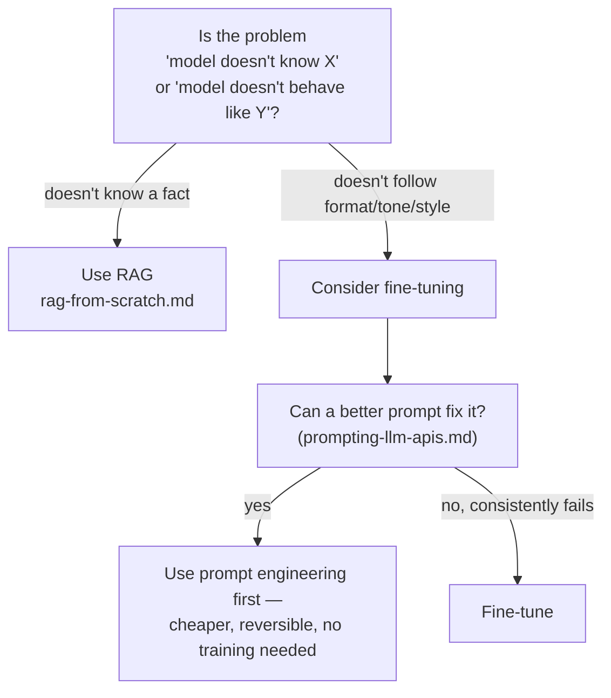
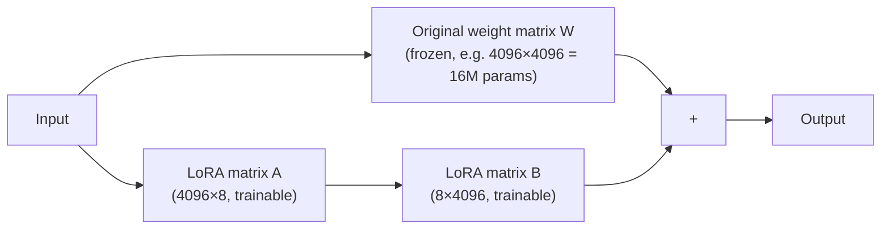

# Fine-Tuning — Teaching a Pretrained Model New Behavior

`rag-from-scratch.md` solved the "the model doesn't know my facts" problem without touching the model's weights at all. Fine-tuning is the other lever: you *do* touch the weights, via more training (`neural-networks.md`'s backprop loop), starting from an already-trained model instead of from scratch.

---

## Fine-Tuning vs RAG — Pick the Right Tool

This is the single most important decision this file covers, and it's the one many teams get wrong first.

| | RAG | Fine-tuning |
|---|---|---|
| **Fixes** | "Model doesn't know this fact" | "Model doesn't behave/respond the way I want" |
| **Update frequency** | Instant — just re-index documents | Slow — requires a training run |
| **Cost to update** | Cheap (embed + insert) | Expensive (GPU time, even for LoRA) |
| **Traceable to a source** | Yes — you can point to the retrieved chunk | No — behavior is baked into weights, unexplainable |
| **Good for** | Facts, docs, anything that changes often | Tone, format, domain-specific style, following a schema reliably, domain jargon |
| **Bad for** | Teaching new writing style or reasoning patterns | Frequently-changing facts — you'd have to retrain constantly |



**Rule of thumb in practice:** try RAG, then better prompting, before reaching for fine-tuning. Fine-tuning is the most expensive and slowest lever — most "the model gets it wrong" problems are actually retrieval or prompt problems, not weight problems. Many production systems combine both: fine-tune the model to reliably follow a domain-specific output format, and RAG to keep it grounded in current facts.

---

## Full Fine-Tuning

Full fine-tuning takes a pretrained model's weights and keeps running the exact training loop from `neural-networks.md` (forward pass → loss → backprop → update) on your own dataset, updating *every* parameter.

```python
# Conceptual — using a Hugging Face-style API against a small open model
from transformers import AutoModelForCausalLM, AutoTokenizer, Trainer, TrainingArguments

model = AutoModelForCausalLM.from_pretrained("meta-llama/Llama-3-8b")
tokenizer = AutoTokenizer.from_pretrained("meta-llama/Llama-3-8b")

# Your custom dataset: examples of the exact behavior you want
train_examples = [
    {"prompt": "Summarize this support ticket:", "completion": "Customer reports login failure..."},
    # ... thousands more domain-specific examples
]

training_args = TrainingArguments(
    output_dir="./fine-tuned-model",
    num_train_epochs=3,
    per_device_train_batch_size=4,
    learning_rate=2e-5,   # much smaller than pretraining LR — we're nudging, not starting over
)

trainer = Trainer(model=model, args=training_args, train_dataset=train_examples)
trainer.train()  # runs the same forward/loss/backward/update loop as neural-networks.md,
                  # but starting from pretrained weights instead of random ones
```

**Why this is expensive:** every parameter needs a gradient computed and stored during backprop. An 8-billion-parameter model needs gradients and optimizer state for all 8 billion numbers — this requires multiple high-memory GPUs even for a "small" open model, and full fine-tuning of frontier-scale models (100B+ parameters) is out of reach for nearly everyone except the labs that trained them.

---

## LoRA (Low-Rank Adaptation) — Fine-Tuning Without the Cost

LoRA's insight: instead of updating all of a layer's weights, freeze the original weights and train a much smaller pair of matrices that get *added* to the original layer's output. Most of the model stays frozen; only a tiny fraction of new parameters actually trains.



```python
# Conceptual LoRA layer — the actual math a LoRA-adapted layer performs
class LoRALayer:
    def __init__(self, original_dim: int, rank: int = 8):
        # rank is tiny compared to original_dim — this is the entire trick
        self.A = random_matrix(original_dim, rank)   # trainable
        self.B = random_matrix(rank, original_dim)   # trainable
        # `original_weight` stays frozen and untouched throughout training

    def forward(self, x, original_weight):
        frozen_output = x @ original_weight            # frozen path, no gradient needed
        lora_output = x @ self.A @ self.B                # trainable path, tiny parameter count
        return frozen_output + lora_output               # combined result
```

With `rank=8` on a 4096-dimension layer, you train `4096×8 + 8×4096 ≈ 65K` parameters instead of `4096×4096 ≈ 16.7M` — roughly **250x fewer trainable parameters** for that layer, applied across every layer you adapt. This is why LoRA fine-tuning can run on a single consumer GPU where full fine-tuning would need a multi-GPU cluster.

```python
# Using LoRA in practice via the PEFT library (Hugging Face)
from peft import LoraConfig, get_peft_model

lora_config = LoraConfig(
    r=8,                 # rank — the trainable matrices' shared dimension
    lora_alpha=16,        # scaling factor for the LoRA update
    target_modules=["q_proj", "v_proj"],  # apply LoRA to attention's Q/V projections
    lora_dropout=0.05,
)

model = get_peft_model(model, lora_config)
model.print_trainable_parameters()
# trainable params: 4,194,304 || all params: 8,030,000,000 || trainable%: 0.05%
```

**QLoRA** extends this further by also quantizing the frozen base weights to 4-bit precision, cutting GPU memory needs even more — this is what makes fine-tuning an 8B+ model feasible on a single GPU with 24GB of VRAM.

---

## Instruction Tuning

This is *what data* you fine-tune on, not a different mechanism — it's supervised fine-tuning (full or LoRA) specifically using `(instruction, response)` pairs, teaching a base model to follow instructions rather than just continue text.

```python
# The difference between a base model and an instruction-tuned model is entirely the training data shape
base_model_training_example = "The capital of France is Paris. Paris is known for..."
# ^ base models learn to continue text naturally — no concept of "answering a question"

instruction_tuned_example = {
    "instruction": "What is the capital of France?",
    "response": "The capital of France is Paris.",
}
# ^ instruction tuning teaches: given a question-shaped input, produce an answer-shaped output
```

This is literally the difference between a raw pretrained model (predicts plausible next tokens, `transformers-llms.md`) and something that behaves like ChatGPT (follows an instruction, stays on-topic, stops when done). It's typically the first fine-tuning stage applied after pretraining, before RLHF (`rlhf-alignment.md`) refines behavior further.

```python
# A minimal instruction-tuning dataset format (Alpaca-style, widely used)
dataset = [
    {
        "instruction": "Summarize this support ticket in one sentence.",
        "input": "Customer says the app crashes every time they upload a photo over 10MB.",
        "output": "The app crashes when users upload photos larger than 10MB.",
    },
    # thousands more examples covering the target behavior
]

def format_prompt(example: dict) -> str:
    return f"### Instruction:\n{example['instruction']}\n\n### Input:\n{example['input']}\n\n### Response:\n{example['output']}"
```

---

## When Fine-Tuning Actually Makes Sense

| Scenario | Fine-tune? | Why |
|---|---|---|
| "Answer questions about our internal wiki" | No — use RAG | Facts change; fine-tuning would need constant retraining |
| "Always respond in valid JSON matching our schema" | Maybe — try prompting + function calling first | Often solvable without fine-tuning; fine-tune only if prompting isn't reliable enough at scale |
| "Speak in our brand's specific tone across thousands of calls/day" | Yes | Consistent style is a behavior pattern, not a fact lookup |
| "Understand heavy domain jargon (legal, medical, internal codenames)" | Yes, often combined with RAG | Domain vocabulary is a persistent behavior change |
| "Classify support tickets into 20 specific categories reliably" | Yes | A narrow, repeated task benefits from being baked into weights |

---

## Where This Fits

```
fine-tuning.md (you are here)
  → rlhf-alignment.md   the fine-tuning stage that shapes *how* a model behaves, not just *what* it knows
  → devops/mlops/training-pipelines.md   running fine-tuning jobs on Kubeflow/Airflow at scale
  → devops/mlops/experiment-tracking.md  tracking fine-tuning runs (MLflow/W&B)
```
