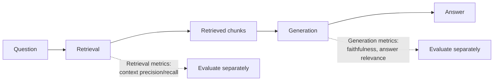

# LLM Evaluation — How Do You Know If It's Actually Good?

Every prior file assumed you can tell whether a model or pipeline is "better." This file covers how that judgment is actually made — the metrics behind `llmops.md`'s "shadow scoring" and "LLM-as-judge" mentions, and what to measure at each stage: the base model, fine-tuning (`fine-tuning.md`), and a full RAG pipeline (`rag-from-scratch.md`).

---

## Why This Is Hard

Classical ML evaluation is simple: you know the correct label, you check if the prediction matches, you get accuracy/precision/recall. LLM outputs are open-ended text — there's rarely one single "correct" answer, so "did it get it right" isn't a simple string comparison.

```python
# Classical ML: trivial to score
prediction = "fraud"
actual = "fraud"
correct = prediction == actual  # True — unambiguous

# LLM: how do you score this?
question = "Summarize the causes of the 2008 financial crisis."
model_answer = "The crisis stemmed from subprime mortgage defaults, excessive leverage, and..."
reference_answer = "Deregulation, risky lending practices, and the collapse of mortgage-backed securities..."
# Neither is "wrong" — they're both valid summaries using different words. Exact match is useless here.
```

---

## Perplexity — Measuring the Base Model

Perplexity comes directly from the training loss in `neural-networks.md`. Recall that LLMs are trained with cross-entropy loss — perplexity is just that loss transformed into a more interpretable number.

```python
import math

def perplexity(cross_entropy_loss: float) -> float:
    return math.exp(cross_entropy_loss)

# Cross-entropy loss of 0.5 -> perplexity ~1.65
# Cross-entropy loss of 3.0 -> perplexity ~20.1
print(perplexity(0.5))   # 1.6487212707001282
print(perplexity(3.0))   # 20.085536923187668
```

**Intuition:** perplexity roughly answers "on average, how many equally-likely next-token choices was the model effectively choosing between?" A perplexity of 1 means the model was completely certain every time (predicted the actual next token with ~100% probability). A perplexity of 50 means it was, on average, about as uncertain as picking uniformly among 50 options.

**What it's good for:** comparing base/pretrained language modeling quality — did this training run produce a model that predicts held-out text better than the last checkpoint? **What it's not good for:** judging whether a chat response is *helpful* — a model can have great perplexity on held-out web text and still give unhelpful, poorly-formatted, or unsafe chat responses. This gap is exactly why RLHF (`rlhf-alignment.md`) exists — perplexity alone doesn't capture what humans actually want.

---

## BLEU and ROUGE — Comparing Against a Reference Text

These predate LLMs (originally built for machine translation and summarization) and work by measuring word/phrase overlap between the model's output and a human-written reference answer.

**BLEU (Bilingual Evaluation Understudy)** — counts overlapping n-grams (word sequences) between the candidate and reference.

```python
def get_ngrams(tokens: list[str], n: int) -> set[tuple]:
    return set(tuple(tokens[i:i + n]) for i in range(len(tokens) - n + 1))

def bleu_precision(candidate: str, reference: str, n: int = 2) -> float:
    candidate_tokens = candidate.lower().split()
    reference_tokens = reference.lower().split()
    candidate_ngrams = get_ngrams(candidate_tokens, n)
    reference_ngrams = get_ngrams(reference_tokens, n)
    if not candidate_ngrams:
        return 0.0
    overlap = candidate_ngrams & reference_ngrams
    return len(overlap) / len(candidate_ngrams)   # what fraction of candidate's n-grams are "correct"

bleu_precision("the cat sat on the mat", "the cat sat on a mat", n=2)
# -> overlapping bigrams: {"the cat", "cat sat", "sat on"} out of 5 candidate bigrams -> 0.6
```

**ROUGE (Recall-Oriented Understudy for Gisting Evaluation)** — the mirror image of BLEU: instead of "what fraction of the candidate's words are correct," it measures "what fraction of the reference's words did the candidate capture." Used mainly for summarization.

```python
def rouge_recall(candidate: str, reference: str, n: int = 2) -> float:
    candidate_tokens = candidate.lower().split()
    reference_tokens = reference.lower().split()
    candidate_ngrams = get_ngrams(candidate_tokens, n)
    reference_ngrams = get_ngrams(reference_tokens, n)
    if not reference_ngrams:
        return 0.0
    overlap = candidate_ngrams & reference_ngrams
    return len(overlap) / len(reference_ngrams)   # what fraction of the reference did we capture
```

**The core weakness of both:** they're purely lexical — they don't understand meaning, only word overlap. "The stock market crashed" and "Equity prices collapsed" describe the same event but share zero words, so BLEU/ROUGE would score that pair as a total mismatch despite it being a perfect paraphrase. This is the exact same limitation keyword search has over embeddings (`embeddings-deep-dive.md`'s "Embeddings vs Keyword Search" table) — and it's why these metrics have fallen out of favor for evaluating modern LLMs, replaced by embedding-based and LLM-as-judge approaches below.

---

## Embedding-Based Similarity — A Middle Ground

Instead of counting overlapping words, embed both the candidate and reference (`embeddings-deep-dive.md`) and compute cosine similarity between the two vectors. This captures meaning, not just word overlap.

```python
def semantic_similarity(candidate: str, reference: str, embed_fn) -> float:
    candidate_vec = embed_fn(candidate)
    reference_vec = embed_fn(reference)
    return cosine_similarity(candidate_vec, reference_vec)  # from embeddings-deep-dive.md

semantic_similarity("The stock market crashed", "Equity prices collapsed", embed)
# -> ~0.85 (high, correctly recognizes these as similar in meaning despite no shared words)
```

This is directly useful for RAG evaluation: it's the same cosine similarity math `llmops.md`'s runbook uses to measure retrieval quality, just applied to compare a *generated answer* against a *reference answer* instead of comparing a query against document chunks.

---

## LLM-as-Judge — Using a Model to Grade Another Model

The current standard approach for evaluating open-ended text quality: prompt a strong LLM (often GPT-4 or Claude) to score or compare responses, using the exact prompting techniques from `prompting-llm-apis.md`.

```python
def llm_judge_score(question: str, answer: str, client) -> dict:
    judge_prompt = f"""You are evaluating the quality of an AI assistant's answer.

Question: {question}
Answer: {answer}

Rate the answer from 1-5 on each dimension:
- Accuracy: is the information correct?
- Helpfulness: does it actually address the question?
- Clarity: is it well-organized and easy to understand?

Respond in JSON: {{"accuracy": <1-5>, "helpfulness": <1-5>, "clarity": <1-5>, "reasoning": "<brief explanation>"}}"""

    response = client.chat.completions.create(
        model="gpt-4o",
        messages=[{"role": "user", "content": judge_prompt}],
        temperature=0,   # deterministic scoring — same input should give same score (prompting-llm-apis.md)
    )
    return json.loads(response.choices[0].message.content)

llm_judge_score(
    question="How do I safely dispose of old batteries?",
    answer="Take them to a designated battery recycling center...",
    client=client,
)
# -> {"accuracy": 5, "helpfulness": 5, "clarity": 4, "reasoning": "Correct and actionable, could mention specific store examples"}
```

**Pairwise comparison** is often more reliable than absolute scoring — asking "which of these two answers is better" tends to produce more consistent judgments than asking "rate this answer 1-5" in isolation:

```python
def llm_judge_pairwise(question: str, answer_a: str, answer_b: str, client) -> str:
    judge_prompt = f"""Question: {question}

Answer A: {answer_a}
Answer B: {answer_b}

Which answer is better? Respond with exactly "A", "B", or "TIE"."""

    response = client.chat.completions.create(
        model="gpt-4o",
        messages=[{"role": "user", "content": judge_prompt}],
        temperature=0,
    )
    return response.choices[0].message.content.strip()
```

**Known weaknesses to account for:**
- **Position bias** — judges often slightly favor whichever answer appears first; mitigate by running each pair both ways (A/B and B/A) and checking for consistency
- **Verbosity bias** — judges tend to favor longer answers even when a shorter one is equally correct
- **Self-preference bias** — a model judging its own outputs (or outputs from models in the same family) tends to rate them more favorably

---

## RAG-Specific Evaluation Metrics

A RAG pipeline (`rag-from-scratch.md`) has two independent components that need separate evaluation — a great answer built on bad retrieval, or good retrieval wasted by a poor answer, are different failure modes needing different fixes.



| Metric | What it measures | How it's computed |
|--------|-------------------|---------------------|
| **Context precision** | Of the retrieved chunks, how many were actually relevant? | LLM-as-judge scores each retrieved chunk against the question |
| **Context recall** | Did retrieval miss important relevant information? | Compare retrieved chunks against a known-complete reference context |
| **Faithfulness** | Does the generated answer only state things supported by the retrieved context? | LLM-as-judge checks each claim in the answer against the retrieved chunks |
| **Answer relevance** | Does the answer actually address the question asked? | LLM-as-judge or embedding similarity between question and answer |

```python
def faithfulness_score(answer: str, retrieved_chunks: list[str], client) -> float:
    context = "\n".join(retrieved_chunks)
    judge_prompt = f"""Context:
{context}

Answer: {answer}

Does the answer ONLY contain claims that are supported by the context above?
Respond with a score from 0.0 (contains unsupported claims / hallucinations)
to 1.0 (fully grounded in the context). Respond with just the number."""

    response = client.chat.completions.create(
        model="gpt-4o",
        messages=[{"role": "user", "content": judge_prompt}],
        temperature=0,
    )
    return float(response.choices[0].message.content.strip())
```

This `faithfulness_score` is the concrete, computable version of `llmops.md`'s runbook step "Is the LLM ignoring the context?" — instead of eyeballing traces manually, this can run automatically over a batch of production queries and flag low scores for review.

---

## Putting It Together: An Evaluation Pipeline

```python
def evaluate_rag_pipeline(test_questions: list[dict], rag_fn, client) -> dict:
    """test_questions: list of {"question": ..., "reference_answer": ...}"""
    results = []
    for item in test_questions:
        retrieved_chunks = retrieve(item["question"], vector_store)     # rag-from-scratch.md
        answer = generate_answer(item["question"], retrieved_chunks)     # rag-from-scratch.md

        results.append({
            "question": item["question"],
            "semantic_similarity": semantic_similarity(answer, item["reference_answer"], embed),
            "faithfulness": faithfulness_score(answer, retrieved_chunks, client),
            "judge_score": llm_judge_score(item["question"], answer, client),
        })

    return {
        "avg_semantic_similarity": sum(r["semantic_similarity"] for r in results) / len(results),
        "avg_faithfulness": sum(r["faithfulness"] for r in results) / len(results),
        "results": results,
    }
```

Run this against a fixed set of test questions every time you change chunking strategy, swap embedding models, or update prompts — this turns "does this change make RAG better or worse" from a guess into a measured, trackable number (fitting naturally into `devops/mlops/experiment-tracking.md` for tracking these evaluation runs over time).

---

## Where This Leads

```
llm-evaluation.md (you are here)
  → vector-search-internals.md   evaluation of retrieval quality assumes you understand what's being searched
  → devops/ai-infra/llmops.md     "shadow scoring" and drift detection in production, using these exact metrics
  → devops/mlops/data-drift.md    detecting when evaluation scores degrade over time in production
```
