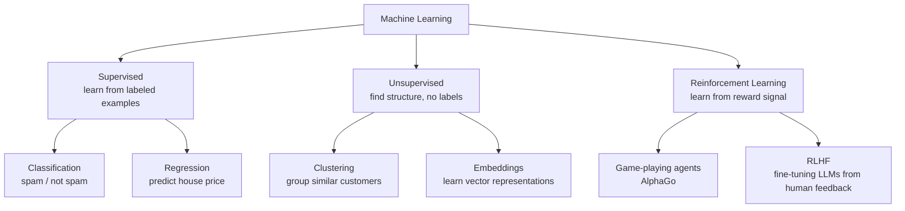
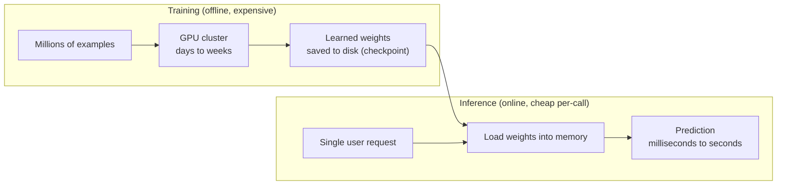
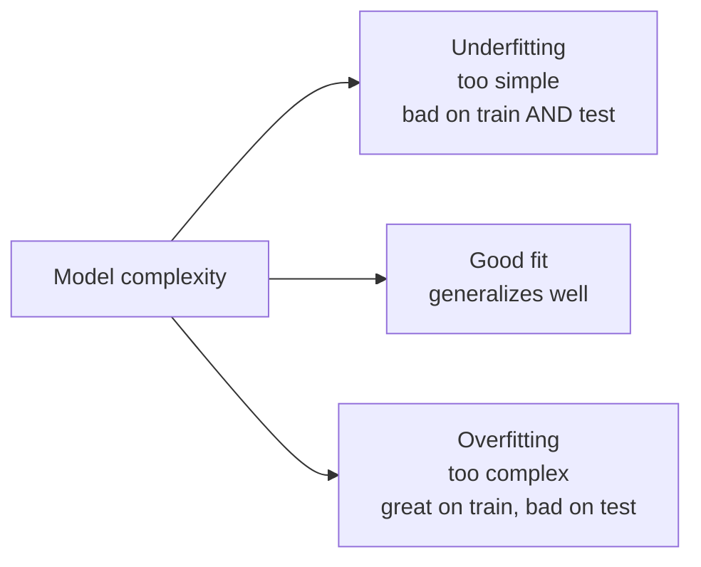

# ML Basics — What Machine Learning Actually Is

Before GPUs, Kubernetes, or vector databases mean anything, you need the core idea: a machine learning model is a function with parameters that gets adjusted from data, instead of hand-written by a programmer.

Traditional programming: `output = handwritten_function(input)`
Machine learning: `output = learned_function(input)`, where `learned_function`'s internal numbers (parameters) were tuned by looking at lots of examples.

---

## The Core Idea in One Example

Say you want to predict house prices from square footage.

**Traditional approach:** you write `price = 200 * sqft` because you guessed the constant.

**ML approach:** you give the model 1,000 examples of `(sqft, actual_price)` pairs, and it finds the constant (and more complex relationships) itself by minimizing the error between its predictions and the actual prices.

```python
# The entire idea of "training" in ~10 lines — linear regression from scratch
def predict(sqft: float, weight: float, bias: float) -> float:
    return weight * sqft + bias

def train(data: list[tuple[float, float]], epochs: int = 1000, lr: float = 0.0000001):
    weight, bias = 0.0, 0.0
    for _ in range(epochs):
        for sqft, actual_price in data:
            prediction = predict(sqft, weight, bias)
            error = prediction - actual_price
            # Gradient descent: nudge weight and bias in the direction that reduces error
            weight -= lr * error * sqft
            bias -= lr * error
    return weight, bias

data = [(1000, 200_000), (1500, 300_000), (2000, 400_000), (2500, 500_000)]
w, b = train(data)
print(f"Learned: price ≈ {w:.2f} * sqft + {b:.2f}")
# Learned: price ≈ 200.00 * sqft + 0.03  ← model discovered the relationship itself
```

Every model covered in this repo — from a spam classifier to GPT-4 — is this same loop at wildly larger scale: **predict → measure error → adjust parameters → repeat.**

---

## Supervised vs Unsupervised vs Reinforcement Learning



| Type | Data you have | Example task | Where it shows up later |
|------|---------------|--------------|--------------------------|
| **Supervised** | Inputs + correct answers (labels) | Email → spam/not spam | Classification, most fine-tuning |
| **Unsupervised** | Inputs only, no labels | Group similar customer segments | Embedding models are trained this way |
| **Reinforcement Learning** | Actions + reward signal, no fixed "correct answer" | Game-playing agents, RLHF | LLM alignment (ChatGPT-style fine-tuning) |

LLMs primarily use a mix: unsupervised pre-training on raw text (predict the next word), then supervised fine-tuning on curated examples, then RLHF to align behavior with human preference.

---

## Key Vocabulary

| Term | Meaning | Analogy |
|------|---------|---------|
| **Features** | The inputs the model sees | Columns in a spreadsheet: sqft, bedrooms, zip code |
| **Labels** | The correct answer, used only during training | The actual sale price |
| **Model** | The function + its learned parameters | The formula `price = w*sqft + b` after training |
| **Parameters / weights** | The learned numbers inside the model | `w` and `b` above — GPT-4 has ~1.8 trillion of these |
| **Training** | The process of adjusting parameters to reduce error | Running the loop above thousands of times |
| **Inference** | Using a trained model to make a prediction on new data | Calling `predict(sqft, w, b)` on a house you haven't seen |
| **Loss function** | A number measuring how wrong the model currently is | `error = prediction - actual_price` above |
| **Epoch** | One full pass through the entire training dataset | Looping over all 1,000 houses once |
| **Learning rate** | How big a step to take when adjusting weights | `lr` in the code above — too high overshoots, too low is slow |

---

## Training vs Inference — Why This Split Matters for Infra

This distinction is the reason `ai-infra/` and this fundamentals section exist as separate concerns from normal backend work.



| | Training | Inference |
|---|---------|-----------|
| **Frequency** | Once, or periodically (retraining) | Every user request |
| **Compute** | Massive — many GPUs, hours/days | Small per-call — one GPU or fraction of one |
| **Latency tolerance** | Hours is fine | Milliseconds to seconds matters |
| **What you're doing** | Finding good weights | Using already-found weights |
| **Repo reference** | `devops/mlops/training-pipelines.md` | `devops/ai-infra/model-serving.md` |

When you use an LLM API (OpenAI, Anthropic), you are only ever doing inference — someone else already did the (extremely expensive) training.

---

## Overfitting — The Central Failure Mode

A model that memorizes training data instead of learning the underlying pattern will perform great on data it's seen and badly on new data.



**Concrete example:** if you train a model on 10 houses and give it enough parameters, it can perfectly memorize all 10 prices — but it hasn't learned "bigger house → higher price," it's learned a lookup table specific to those 10 houses. Show it an 11th house and it fails.

**How this is detected in practice:** split data into a training set and a held-out test set the model never sees during training. If training accuracy is 99% but test accuracy is 60%, you're overfitting.

**Why this matters for RAG later:** an LLM that has "memorized" facts from training data can still be wrong on anything outside that training data or anything that changed since — this is precisely the gap RAG is designed to close (see [`rag-from-scratch.md`](./rag-from-scratch.md)).

---

## Where This Leads

```
ml-basics.md (you are here)
  → neural-networks.md      how the "model" becomes a neural network specifically
  → transformers-llms.md    how neural networks became LLMs
  → embeddings-deep-dive.md how text becomes vectors (used for search/RAG)
  → prompting-llm-apis.md   using someone else's already-trained LLM
  → rag-from-scratch.md     combining retrieval + LLM to ground answers in facts
```
