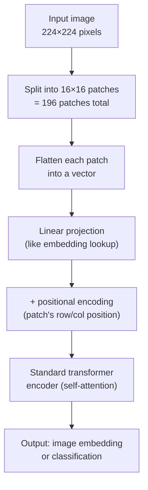
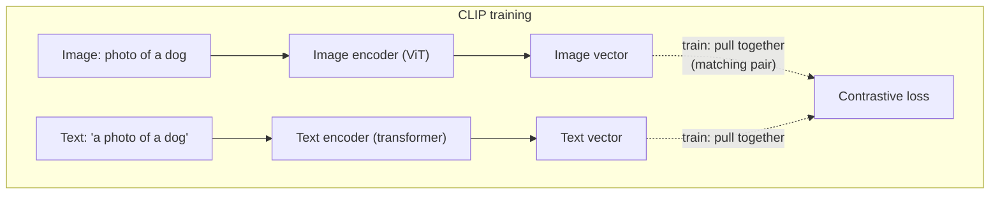
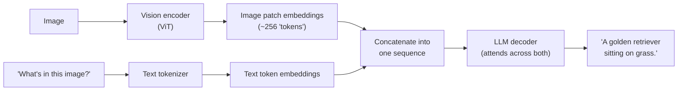
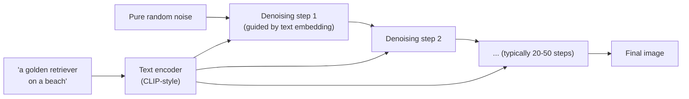

# Multimodal Models — Beyond Text

Every file so far treats text as the only input. Multimodal models extend the same core ideas — tokens, embeddings, attention (`transformers-llms.md`) — to images, audio, and combinations thereof. This file covers how "a picture" becomes something a transformer can process, and how models like GPT-4V, CLIP, and DALL-E actually work.

---

## Step 1: Turning an Image Into Tokens

Text tokenization (`transformers-llms.md`) splits a sentence into subword chunks. A **Vision Transformer (ViT)** does the analogous thing to an image: split it into a grid of fixed-size patches, and treat each patch like a "token."



```python
def image_to_patches(image: list[list[list[int]]], patch_size: int = 16) -> list[list[float]]:
    # image: height x width x channels (RGB) — conceptually simplified
    height, width = len(image), len(image[0])
    patches = []
    for row in range(0, height, patch_size):
        for col in range(0, width, patch_size):
            patch = extract_region(image, row, col, patch_size)
            flattened = flatten(patch)   # patch_size * patch_size * channels numbers in a row
            patches.append(flattened)
    return patches   # e.g. 196 patches for a 224x224 image with 16x16 patches

def vit_forward(image_patches: list[list[float]], projection_matrix, transformer_encoder):
    # Same idea as embed() in transformers-llms.md, just for image patches instead of word tokens
    patch_embeddings = [patch @ projection_matrix for patch in image_patches]
    patch_embeddings = add_positional_encoding(patch_embeddings)
    # From here it's the exact same self-attention mechanism from transformers-llms.md —
    # patches attend to other patches the same way tokens attend to other tokens
    return transformer_encoder.forward(patch_embeddings)
```

**The key insight:** once an image is a sequence of patch vectors, everything from `transformers-llms.md` — self-attention, multi-head attention, transformer blocks — applies unchanged. A patch representing "part of a dog's ear" can attend to a distant patch representing "part of a dog's tail" the same way the word "bank" attended to "interest" and "rates" in the text example.

---

## CLIP — Connecting Images and Text in One Vector Space

CLIP (Contrastive Language-Image Pretraining) trains an image encoder and a text encoder *together*, so that an image and its caption end up as nearby vectors in the same embedding space — extending the contrastive training idea from `embeddings-deep-dive.md` across two different modalities.



```python
def clip_contrastive_loss(image_vectors: list[list[float]], text_vectors: list[list[float]]) -> float:
    # image_vectors[i] and text_vectors[i] are a MATCHING pair (image i, its real caption)
    # All other combinations (image i, caption j where i != j) are non-matching pairs
    total_loss = 0.0
    for i in range(len(image_vectors)):
        similarities = [cosine_similarity(image_vectors[i], text_vectors[j]) for j in range(len(text_vectors))]
        # Softmax over all captions — want the TRUE caption (index i) to have the highest similarity
        probabilities = softmax(similarities)
        total_loss += -math.log(probabilities[i])   # same cross-entropy pattern as neural-networks.md
    return total_loss / len(image_vectors)
```

Once trained, CLIP gives you a single shared vector space where you can compute cosine similarity **between an image and a piece of text directly** — this is what powers "search my photos by describing them in words" features.

```python
# After training, CLIP lets you do cross-modal search
image_embedding = clip.encode_image(photo)
text_embeddings = [clip.encode_text(caption) for caption in ["a dog", "a cat", "a sunset"]]

# Which caption best matches this image? Same cosine_similarity from embeddings-deep-dive.md
best_match = max(text_embeddings, key=lambda t: cosine_similarity(image_embedding, t))
```

**This is the same retrieval pattern as `rag-from-scratch.md`**, just with images and text sharing a vector space instead of text-to-text. A "search photos by description" feature is architecturally identical to RAG's retrieval step — embed the query, compute cosine similarity against stored vectors, return the top matches.

---

## Vision-Language Models (GPT-4V, Claude with vision)

Modern multimodal chat models combine a vision encoder (ViT-style) with an LLM decoder: the image gets encoded into a sequence of embeddings, which get fed into the LLM's context alongside the text tokens — the model then attends across both image patches and text tokens together.



```python
# Conceptual API usage — image and text share the same message, processed jointly
response = client.chat.completions.create(
    model="gpt-4o",
    messages=[{
        "role": "user",
        "content": [
            {"type": "text", "text": "What's in this image?"},
            {"type": "image_url", "image_url": {"url": "data:image/jpeg;base64,..."}},
        ],
    }],
)
```

From the model's perspective, an image patch embedding and a text token embedding are both just vectors in the same attention mechanism (`transformers-llms.md`) — the model doesn't fundamentally distinguish "this vector came from a pixel patch" vs "this vector came from a word" once they're both projected into the shared embedding space.

---

## Image Generation — The Reverse Direction

Text-to-image models (DALL-E, Stable Diffusion, Midjourney) go the opposite direction: text in, pixels out. The dominant approach is **diffusion**: start with random noise and iteratively refine it toward an image matching the text description.



```python
# Heavily simplified diffusion sampling loop — the actual denoising network is a large
# trained model (typically a U-Net or transformer), this shows only the iterative structure
def diffusion_generate(text_prompt: str, text_encoder, denoising_model, num_steps: int = 50):
    text_embedding = text_encoder.encode(text_prompt)     # same embedding concept, text -> vector
    image = random_noise(shape=(512, 512, 3))              # start from pure noise

    for step in range(num_steps, 0, -1):
        noise_level = step / num_steps
        predicted_noise = denoising_model.predict(image, text_embedding, noise_level)
        image = image - (predicted_noise * step_size(step))   # remove a bit of predicted noise

    return image   # after all steps, noise has been refined into a coherent image
```

**Why this works, intuitively:** the denoising model was trained on millions of (image, added-noise) pairs, learning to predict "what noise was added to this image" — the exact same predict-the-error pattern as `neural-networks.md`'s loss functions, just predicting pixel noise instead of a next token or a house price. Running that prediction in reverse, step by step, gradually turns noise into a coherent image steered by the text embedding's guidance at every step.

---

## Multimodal Embeddings in Practice

The practical takeaway for anything building on this repo's RAG content: multimodal embeddings mean retrieval isn't limited to text documents.

| Use case | What gets embedded | Same mechanism as |
|---|---|---|
| "Search my documents" (text RAG) | Text chunks | `rag-from-scratch.md` |
| "Search my photos by description" | Images, via CLIP-style encoder | Same cosine similarity, image vector space |
| "Find similar product images" | Product photos | Same cosine similarity, image vector space |
| "Answer questions about a PDF with charts/diagrams" | Text chunks + image regions, often separately embedded then combined in retrieval | Hybrid of both |

A production system indexing scanned documents or product catalogs would combine a text embedding model and a CLIP-style image embedding model, storing both vector types in the vector DB from `llmops.md` — the SQL/pgvector mechanics are identical, only the embedding source changes.

---

## Where This Fits

```
multimodal-models.md (you are here — extends embeddings-deep-dive.md and transformers-llms.md to images)
  ← transformers-llms.md      the attention mechanism this reuses unchanged
  ← embeddings-deep-dive.md   the vector space / cosine similarity concepts this reuses unchanged
  → devops/ai-infra/model-serving.md   serving vision-language models at scale (larger, more GPU-hungry than text-only)
```
