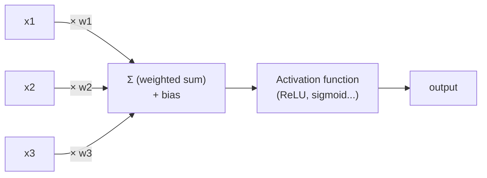
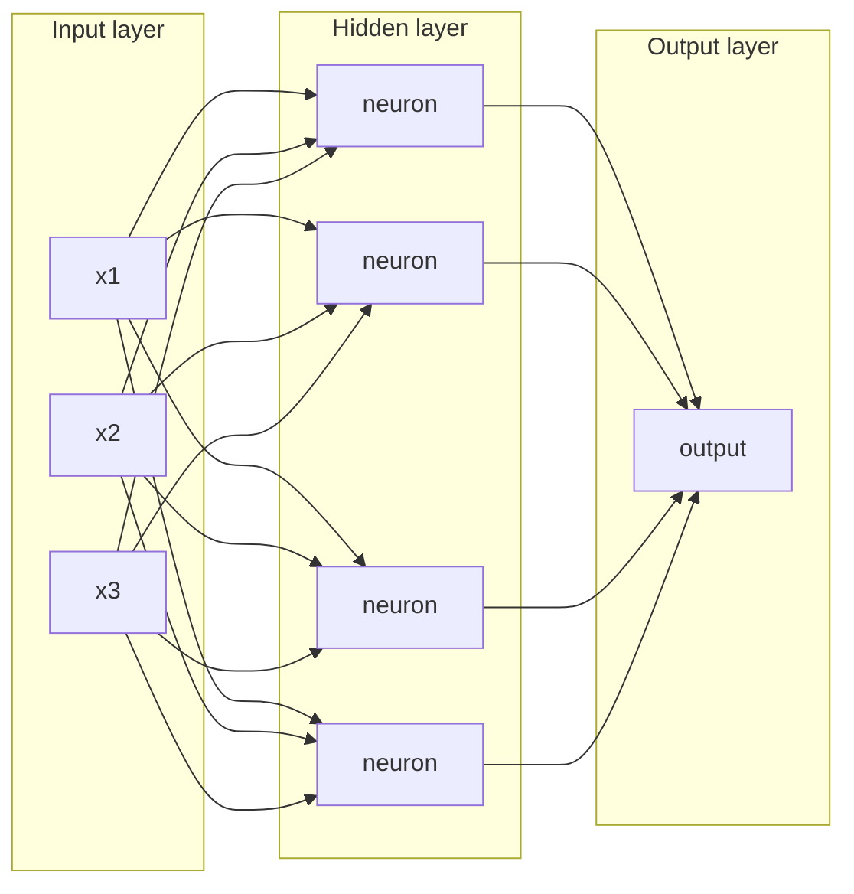
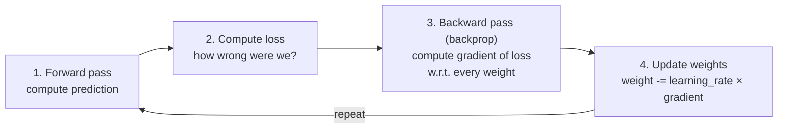

# Neural Networks — From a Single Neuron to Deep Learning

`ml-basics.md` showed a model with 2 parameters (`weight`, `bias`) learning a straight line. Real-world relationships aren't straight lines — a neural network is what you get when you stack many small linear-plus-nonlinear units together so the model can learn curved, complex relationships.

---

## A Single Neuron

A neuron takes several inputs, multiplies each by a weight, sums them, adds a bias, then passes the result through an **activation function**.



```python
import math

def neuron(inputs: list[float], weights: list[float], bias: float) -> float:
    weighted_sum = sum(x * w for x, w in zip(inputs, weights)) + bias
    return relu(weighted_sum)  # activation function applied last

def relu(x: float) -> float:
    return max(0.0, x)  # simplest activation: negative becomes 0, positive passes through
```

This single neuron is barely more than the linear regression from `ml-basics.md` — the power comes from stacking thousands of these together.

---

## Why Activation Functions Matter

Without a nonlinear activation function, stacking neurons is pointless — a stack of purely linear functions is still just one linear function, no matter how many layers you add. Activation functions are what let networks learn curves, thresholds, and complex boundaries instead of only straight lines.

| Activation | Formula | Used for |
|------------|---------|---------|
| **ReLU** | `max(0, x)` | Most hidden layers — fast, avoids vanishing gradients |
| **Sigmoid** | `1 / (1 + e^-x)` | Squashes to (0,1) — binary classification output |
| **Softmax** | `e^xi / Σ e^xj` | Turns a vector of numbers into probabilities that sum to 1 — used for "which token comes next" in LLMs |
| **GELU / SiLU** | smooth ReLU variants | Used in transformers (GPT, BERT) instead of plain ReLU |

Softmax specifically is worth remembering now — it's exactly how an LLM turns "raw scores for 50,000 possible next words" into "probabilities for 50,000 possible next words" (see [`transformers-llms.md`](./transformers-llms.md)).

---

## Layers — Stacking Neurons

A **layer** is a group of neurons that all take the same inputs. A network chains layers together: the output of one layer becomes the input to the next.



"Deep learning" simply means a network with many hidden layers stacked in sequence. GPT-class models have on the order of 100 layers, each containing thousands of neurons wired through the attention mechanism described in `transformers-llms.md`.

```python
class Layer:
    def __init__(self, num_inputs: int, num_neurons: int):
        # In real training these start random and get adjusted — see gradient descent below
        self.weights = [[0.1] * num_inputs for _ in range(num_neurons)]
        self.biases = [0.0] * num_neurons

    def forward(self, inputs: list[float]) -> list[float]:
        return [relu(sum(x * w for x, w in zip(inputs, neuron_w)) + b)
                for neuron_w, b in zip(self.weights, self.biases)]

class NeuralNetwork:
    def __init__(self, layers: list[Layer]):
        self.layers = layers

    def forward(self, inputs: list[float]) -> list[float]:
        for layer in self.layers:
            inputs = layer.forward(inputs)  # output of one layer feeds the next
        return inputs
```

---

## Loss Functions — Measuring Wrongness

The **loss function** converts "how wrong was the prediction" into a single number the network can try to minimize.

| Loss function | Formula (intuition) | Used for |
|----------------|----------------------|----------|
| **Mean Squared Error (MSE)** | average of `(prediction - actual)²` | Regression (predicting numbers) |
| **Cross-entropy** | penalizes confident wrong predictions heavily | Classification (predicting categories, including "next token") |

```python
def mean_squared_error(predictions: list[float], actuals: list[float]) -> float:
    return sum((p - a) ** 2 for p, a in zip(predictions, actuals)) / len(predictions)
```

Cross-entropy loss is the one that matters for LLMs: at each training step, the model predicts a probability distribution over the entire vocabulary for "what's the next token," and cross-entropy measures how much probability mass it put on the token that was actually correct.

---

## Backpropagation and Gradient Descent

This is the algorithm that actually does the "learning." The linear regression in `ml-basics.md` used gradient descent on 2 parameters; a neural network runs the exact same idea across millions or billions of parameters using **backpropagation** to compute how much each one contributed to the error.



**Intuition, not calculus:** the gradient of a weight tells you "if I increase this specific weight slightly, does the loss go up or down, and by how much." Backpropagation computes this efficiently for every weight in the network by applying the chain rule backwards from the output layer to the input layer — hence "back"-propagation.

```python
# Pseudocode for one training step — the actual chain-rule math is what
# frameworks like PyTorch/TensorFlow automate via "autograd"
def train_step(network, inputs, actual, learning_rate):
    prediction = network.forward(inputs)                  # 1. forward pass
    loss = mean_squared_error([prediction], [actual])       # 2. compute loss
    gradients = backpropagate(network, loss)                # 3. backward pass (autograd does this)
    for layer in network.layers:
        layer.weights -= learning_rate * gradients[layer]   # 4. update weights
    return loss
```

This loop — forward, loss, backward, update — run millions of times over billions of parameters and trillions of tokens, **is** what "training an LLM" means at the mechanical level. Everything else (data curation, distributed training across GPU clusters, RLHF) is scaffolding around this core loop.

---

## Why This Needs GPUs

Each neuron's weighted sum is a dot product; a full layer's forward pass is a matrix multiplication. GPUs are built to do thousands of these multiplications in parallel, which is why neural network training is fundamentally a GPU workload — this is the direct link to `devops/ai-infra/gpu-scheduling.md` later in the learning path.

| Operation | CPU | GPU |
|-----------|-----|-----|
| Matrix multiply (core NN operation) | Sequential-ish, few cores | Thousands of cores, purpose-built |
| Training a small model | Minutes to hours | Seconds to minutes |
| Training GPT-scale model | Not feasible | Days to weeks on thousands of GPUs |

---

## Where This Leads

```
neural-networks.md (you are here)
  → transformers-llms.md    the specific neural network architecture behind LLMs
  → embeddings-deep-dive.md what a trained network's internal representation looks like
```
