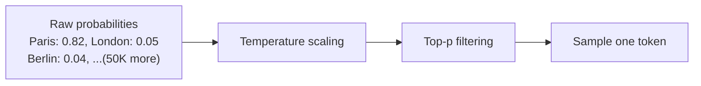
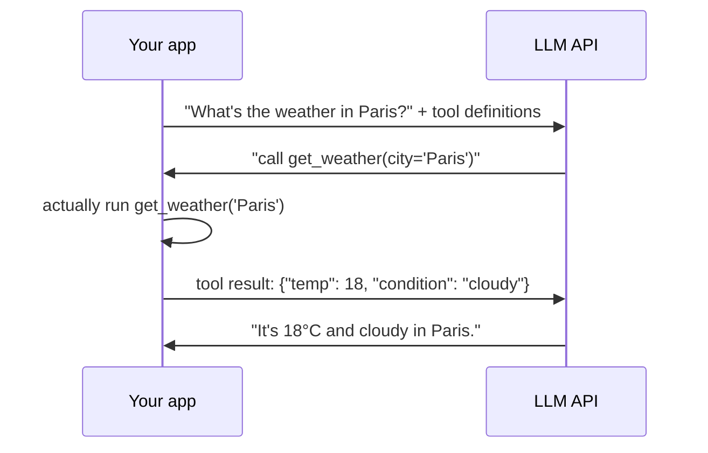

# Prompting & LLM APIs — Using a Trained Model Practically

Everything so far (`ml-basics.md` → `transformers-llms.md`) covered how an LLM is built and trained. From here on, you're a *consumer* of an already-trained model via an API — this is 95% of what "building an AI feature" means in practice, and it's the last prerequisite before [`rag-from-scratch.md`](./rag-from-scratch.md).

---

## The Three Roles: System, User, Assistant

Every chat-based LLM API call is a list of messages, each tagged with a role. This structure is what turns a raw next-token predictor into something that behaves like a conversational assistant.

| Role | Purpose | Who writes it |
|------|---------|----------------|
| **system** | Sets behavior, constraints, and persona for the whole conversation | The application developer, not the end user |
| **user** | The actual question or instruction | The end user (or your application, on their behalf) |
| **assistant** | The model's previous replies | The model itself (echoed back for multi-turn context) |

```python
messages = [
    {"role": "system", "content": "You are a support assistant for Acme Corp. "
                                    "Only answer questions about Acme products. "
                                    "If you don't know, say so — do not guess."},
    {"role": "user", "content": "How do I reset my password?"},
]
```

In a multi-turn conversation, you resend the *entire* message history on every call — the model itself is stateless between API calls; your application maintains conversation state, not the model.

```python
messages = [
    {"role": "system", "content": "You are a support assistant."},
    {"role": "user", "content": "How do I reset my password?"},
    {"role": "assistant", "content": "Go to Settings > Security > Reset Password."},
    {"role": "user", "content": "What if I don't have access to my email?"},  # new turn
]
# The model sees the full history above and can resolve "it" / "that" from prior turns
```

This is also why the "context window" from `transformers-llms.md` fills up over a long conversation — every message you've ever sent in this thread gets resent and re-processed on every single call.

---

## Making an Actual API Call

```python
from openai import OpenAI

client = OpenAI(api_key="sk-...")

response = client.chat.completions.create(
    model="gpt-4o",
    messages=[
        {"role": "system", "content": "You are a support assistant for Acme Corp."},
        {"role": "user", "content": "How do I reset my password?"},
    ],
    temperature=0.2,
    max_tokens=300,
)

print(response.choices[0].message.content)
print(response.usage)  # prompt_tokens, completion_tokens — what you're billed for
```

Anthropic's Claude API is structurally similar (system prompt as a separate top-level field rather than a message role, but the same user/assistant turn structure):

```python
import anthropic

client = anthropic.Anthropic(api_key="sk-ant-...")

response = client.messages.create(
    model="claude-sonnet-4-5",
    system="You are a support assistant for Acme Corp.",
    messages=[{"role": "user", "content": "How do I reset my password?"}],
    max_tokens=300,
)
```

---

## Temperature and Top-p — Controlling Randomness

Recall from `transformers-llms.md`: the model outputs a probability distribution over the vocabulary, then *samples* from it. Temperature and top-p control how that sampling happens.



| Parameter | What it does | Low value | High value |
|-----------|---------------|------------|-------------|
| **temperature** | Scales confidence before sampling | `0` → nearly always picks the top token (deterministic, focused) | `1.5+` → flattens probabilities, more random/creative, higher hallucination risk |
| **top_p** (nucleus sampling) | Only sample from the smallest set of tokens whose cumulative probability ≥ p | `0.1` → only considers the most likely handful of tokens | `1.0` → considers the full distribution |

```python
def apply_temperature(probabilities: list[float], temperature: float) -> list[float]:
    if temperature == 0:
        # Deterministic: always pick the single highest-probability token (argmax)
        return [1.0 if p == max(probabilities) else 0.0 for p in probabilities]
    # Higher temperature flattens the distribution -> more randomness
    scaled = [p ** (1 / temperature) for p in probabilities]
    total = sum(scaled)
    return [s / total for s in scaled]
```

**Practical defaults:**

| Use case | Temperature | Why |
|----------|-------------|-----|
| Code generation, data extraction, RAG answers | 0–0.2 | You want the most likely, consistent, grounded answer |
| Creative writing, brainstorming | 0.7–1.0 | You want variety and novelty |
| Classification / structured output | 0 | You want the same input to reliably produce the same output |

For RAG specifically (`rag-from-scratch.md`), low temperature (0–0.3) is standard — you want the model to stick closely to the retrieved context, not get creative with the facts.

---

## Prompt Engineering Basics

The system/user prompt is the only lever you have to shape behavior without retraining the model. A few techniques that consistently help:

**1. Be specific about format and constraints**
```
Bad:  "Summarize this document."
Better: "Summarize this document in 3 bullet points, each under 20 words. 
         Focus only on action items, not background context."
```

**2. Few-shot examples** — show the model 2-3 examples of input → desired output before the real request:
```python
prompt = """
Classify the sentiment as positive, negative, or neutral.

Text: "This product changed my life!"
Sentiment: positive

Text: "It arrived broken and support never responded."
Sentiment: negative

Text: "It does what it says on the box."
Sentiment:"""  # model completes: "neutral"
```

**3. Chain-of-thought** — ask the model to reason step by step before giving a final answer, which measurably improves accuracy on multi-step problems:
```
"Think through this step by step, then give your final answer on the last line."
```

**4. Tell it what to do when it doesn't know** — this single instruction meaningfully reduces confident hallucination:
```
"If the answer isn't in the provided context, say 'I don't have enough information' 
 instead of guessing."
```

---

## Function Calling / Tool Use

Function calling lets the model request that *your code* run a specific function, instead of only generating text. The model never executes anything itself — it outputs a structured request, your application runs the actual function, and feeds the result back.



```python
tools = [{
    "type": "function",
    "function": {
        "name": "get_weather",
        "description": "Get current weather for a city",
        "parameters": {
            "type": "object",
            "properties": {"city": {"type": "string"}},
            "required": ["city"],
        },
    },
}]

response = client.chat.completions.create(
    model="gpt-4o",
    messages=[{"role": "user", "content": "What's the weather in Paris?"}],
    tools=tools,
)

tool_call = response.choices[0].message.tool_calls[0]
# tool_call.function.name == "get_weather"
# tool_call.function.arguments == '{"city": "Paris"}'

# Your code actually executes it, then sends the result back as a new message
# with role "tool", and the model produces the final natural-language answer.
```

**This is the mechanism RAG is built on.** A retrieval step can be exposed to the model as a tool (`search_documents(query)`), letting the model decide *when* to retrieve rather than always retrieving — this pattern is called **agentic RAG**, an extension of the basic RAG pipeline in the next file. It's also the same mechanism behind the AIOps LLM agent in `devops/sre/self-healing-aiops.md`.

---

## Where This Leads

```
prompting-llm-apis.md (you are here)
  → rag-from-scratch.md          combine retrieval (embeddings) + generation (this file) into RAG
  → devops/ai-infra/llmops.md    production RAG: vector DBs, tracing, guardrails, cost optimization
```
