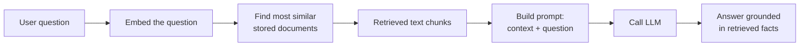

# RAG From Scratch — Building the Whole Thing With No Infrastructure

Every prior file in this section builds toward this one. RAG (Retrieval-Augmented Generation) is just:

**embeddings** (`embeddings-deep-dive.md`) **+ cosine similarity search + an LLM API call** (`prompting-llm-apis.md`).

No vector database, no Kubernetes, no LangChain required to understand it. This file builds a complete, working RAG pipeline in plain Python using a list as the "vector database" — then shows exactly how each piece maps onto the production version in `devops/ai-infra/llmops.md`.

---

## The Problem RAG Solves

An LLM's knowledge is frozen at training time and limited to what was in its training data (recall "overfitting" and generalization limits from `ml-basics.md`, and the sampling-based generation from `transformers-llms.md` — it produces plausible text, not verified facts). Ask it about your company's internal runbook and it will either say "I don't know" or, worse, confidently make something up.

RAG fixes this without retraining the model: **look up relevant facts first, then hand them to the LLM as context, and instruct it to answer using only that context.**



---

## Step 1: The Document Store (Just a Python List)

In production this is pgvector or Milvus (`llmops.md`). For learning, it's a list of `(text, embedding)` tuples.

```python
from openai import OpenAI

client = OpenAI(api_key="sk-...")

# Our entire "knowledge base" — normally hundreds/thousands of chunked documents
documents = [
    "The Acme API rate limit is 1000 requests per minute per API key.",
    "To reset your password, go to Settings > Security > Reset Password.",
    "Acme's production database runs PostgreSQL 15 with daily automated backups.",
    "Refunds are processed within 5-7 business days to the original payment method.",
    "The support team's SLA for critical incidents is a 15-minute response time.",
]

def embed(text: str) -> list[float]:
    response = client.embeddings.create(model="text-embedding-3-small", input=text)
    return response.data[0].embedding

# Build the "index" — just a Python list of (text, vector) pairs
vector_store: list[tuple[str, list[float]]] = [(doc, embed(doc)) for doc in documents]
```

This is the exact same operation as `llmops.md`'s indexing pipeline (`chunk_document` → embed → `INSERT INTO documents`) — just held in memory instead of persisted to a database.

---

## Step 2: Retrieval — Cosine Similarity Search

This is the `cosine_similarity()` function from `embeddings-deep-dive.md`, applied against every stored vector.

```python
import math

def cosine_similarity(a: list[float], b: list[float]) -> float:
    dot_product = sum(x * y for x, y in zip(a, b))
    magnitude_a = math.sqrt(sum(x ** 2 for x in a))
    magnitude_b = math.sqrt(sum(y ** 2 for y in b))
    return dot_product / (magnitude_a * magnitude_b)

def retrieve(query: str, store: list[tuple[str, list[float]]], top_k: int = 2) -> list[str]:
    query_vec = embed(query)
    # Score every document against the query — this is a full linear scan,
    # which is exactly why real systems need an index (see "Why This Doesn't Scale" below)
    scored = [(text, cosine_similarity(query_vec, vec)) for text, vec in store]
    scored.sort(key=lambda pair: pair[1], reverse=True)
    return [text for text, score in scored[:top_k]]

retrieve("How long do refunds take?", vector_store, top_k=2)
# -> ["Refunds are processed within 5-7 business days to the original payment method.",
#     "The support team's SLA for critical incidents is a 15-minute response time."]
```

Notice the query "How long do refunds take?" shares almost no exact words with the matching document ("Refunds are processed within 5-7 business days...") — this only works because embeddings capture meaning, not keywords (the exact distinction covered in `embeddings-deep-dive.md`'s "Embeddings vs Keyword Search" table).

---

## Step 3: Augmentation — Building the Prompt

Take the retrieved chunks and inject them into the LLM prompt, with explicit instructions to only use that context.

```python
def build_prompt(question: str, retrieved_chunks: list[str]) -> list[dict]:
    context = "\n".join(f"- {chunk}" for chunk in retrieved_chunks)
    return [
        {
            "role": "system",
            "content": (
                "You are a support assistant. Answer the user's question using ONLY "
                "the context below. If the answer isn't in the context, say "
                "'I don't have enough information to answer that.' Do not guess."
            ),
        },
        {
            "role": "user",
            "content": f"Context:\n{context}\n\nQuestion: {question}",
        },
    ]
```

This system prompt is doing real work — it's the "prompt engineering" technique from `prompting-llm-apis.md` ("tell it what to do when it doesn't know") applied specifically to stop the model from ignoring the retrieved context and answering from its own training data instead.

---

## Step 4: Generation — Calling the LLM

```python
def generate_answer(question: str, retrieved_chunks: list[str]) -> str:
    messages = build_prompt(question, retrieved_chunks)
    response = client.chat.completions.create(
        model="gpt-4o",
        messages=messages,
        temperature=0.1,  # low temperature: stick to the facts, don't improvise (prompting-llm-apis.md)
    )
    return response.choices[0].message.content
```

---

## Putting It All Together: The Full Toy RAG Pipeline

```python
def rag_pipeline(question: str) -> str:
    retrieved_chunks = retrieve(question, vector_store, top_k=2)   # Step 2
    return generate_answer(question, retrieved_chunks)              # Steps 3+4

print(rag_pipeline("How long do refunds take?"))
# -> "Refunds are processed within 5-7 business days to the original payment method."

print(rag_pipeline("What's Acme's stock price?"))
# -> "I don't have enough information to answer that."
# ^ correctly refuses, because nothing in our 5 documents covers this
```

This ~40 lines of code — no framework, no database, no Kubernetes — is the complete conceptual model. Everything else you'll encounter (LangChain, vector databases, tracing dashboards) is *engineering* built around making this pattern reliable, fast, and observable at scale.

---

## Why This Doesn't Scale — And What Fixes Each Problem

| Problem with the toy version | Why it breaks at scale | Production fix (in `llmops.md`) |
|---|---|---|
| `retrieve()` does a full linear scan over every document | O(n) per query — fine for 5 docs, unusable for 5 million | Vector DB with an approximate-nearest-neighbor index (pgvector's IVFFlat, Milvus's HNSW) |
| Documents are hardcoded in a list | No way to add/update/delete documents without redeploying code | `INSERT`/`UPDATE`/`DELETE` against a real database table |
| No chunking strategy — each "document" is one sentence | Real documents are pages long; embedding a whole document loses precision | `chunk_document()` with token-based chunking + overlap |
| No visibility into what happened | Can't debug "why did it answer wrong" in production | LangSmith / OpenLLMetry tracing — see full prompt, retrieved chunks, and output per request |
| No validation on output | A malformed or unsafe answer reaches the user directly | Guardrails — output schema validation, hallucination/toxicity checks |
| Every query re-embeds from scratch, no caching | Slow and expensive at real traffic volume | Prompt caching, embedding caching, prefix caching (vLLM) |
| In-memory store — lost on restart | Not durable, single-process only | Persistent vector DB, replicated, backed up |

**Concretely, the mapping is almost 1:1:**

```python
# Toy version (this file)                       # Production version (llmops.md)
vector_store: list[tuple[str, list]]        →   CREATE TABLE documents (... embedding vector(1536))
embed(text)                                  →   same embedding API call, just also persisted
cosine_similarity() + sort() + slice          →   ORDER BY embedding <=> query_embedding LIMIT 5
build_prompt() + generate_answer()            →   chain = retriever | prompt | llm | output_parser
(nothing)                                     →   Traceloop.init() / LangSmith tracing
(nothing)                                     →   NeMo Guardrails / Pydantic output validation
```

If you understood every line of code in this file, `llmops.md`'s pgvector SQL, LangSmith snippets, and guardrails code are no longer abstract — they're this exact pipeline with the "list" swapped for a real database and production concerns layered on top.

---

## A Note on RAG Quality — Where Things Actually Go Wrong

In practice, RAG failures are rarely "the LLM is bad." They're almost always one of:

1. **Retrieval returned the wrong chunks** — chunking was too coarse/fine, or the embedding model doesn't capture the domain's vocabulary well (e.g., legal or medical jargon vs. a general-purpose embedding model)
2. **The right chunks were retrieved, but the LLM ignored them** — usually a prompt engineering problem, fixable with a stricter system prompt like the one above
3. **Context got truncated** — too many chunks retrieved, blowing past the context window (`transformers-llms.md`)
4. **Stale data** — the source documents changed but the vector store wasn't re-indexed

This is exactly the diagnostic order in `llmops.md`'s "LLMOps Runbook: RAG Quality Drops" section — check retrieval similarity scores first, then check for stale source documents, then inspect traces to see if the LLM used the context, then check for token truncation.

---

## Where This Leads

```
rag-from-scratch.md (you are here — end of ai-fundamentals)
  → devops/ai-infra/llmops.md         production RAG: pgvector/Milvus, LangSmith, guardrails, cost
  → devops/ai-infra/model-serving.md  serving the LLM itself at scale (vLLM, KServe)
  → devops/mlops/                     if you also need to fine-tune or track experiments
```

You now have the full path from "what is machine learning" to "how does a production RAG system work" — the rest of `devops/ai-infra/` and `devops/mlops/` is the *infrastructure* layer underneath everything covered in this section.
