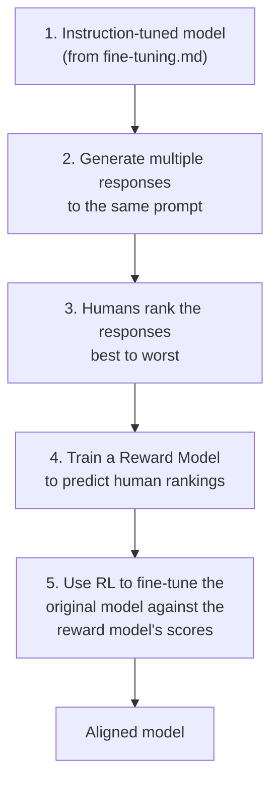
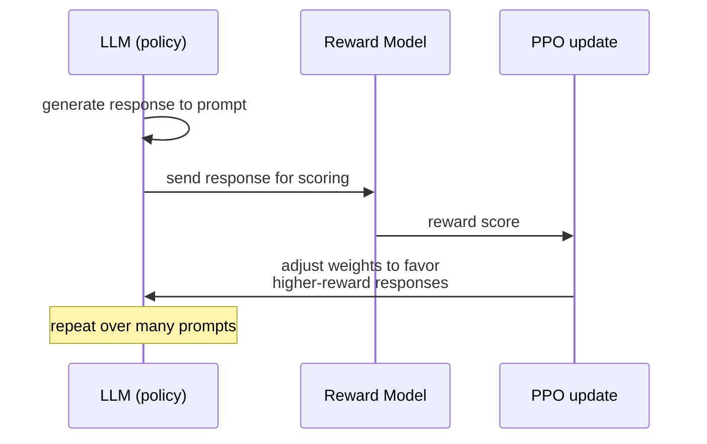
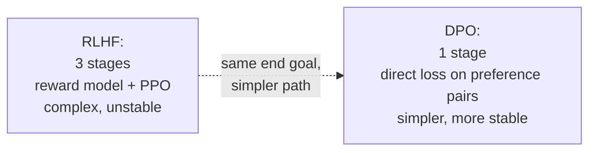
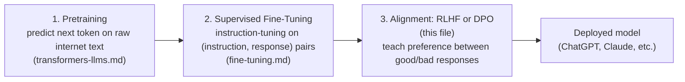

# RLHF & Alignment — Teaching a Model What "Good" Means

`fine-tuning.md`'s instruction tuning teaches a model to follow instructions in the right *shape*. It doesn't teach the model which of several correct-shaped answers is actually *better* — more helpful, less harmful, more honest. That's what RLHF (Reinforcement Learning from Human Feedback) and its modern alternatives are for.

---

## The Problem: There's No Loss Function for "Good"

Every training loop so far (`neural-networks.md`) needs a loss function — a number to minimize. For "is this response helpful and safe," there's no formula. You can't write `loss = helpfulness(response)` because helpfulness isn't a mathematical property of text — it's a human judgment.

RLHF's approach: **train a separate model to predict what humans would prefer, then use that model's predictions as the loss signal for the main model.**



---

## Step 1: Collecting Preference Data

Humans don't write a perfect answer from scratch (expensive and inconsistent) — instead, the model generates several candidate responses to the same prompt, and a human ranks them.

```python
prompt = "How do I safely dispose of old batteries?"

candidate_responses = [
    "Take them to a designated battery recycling center — most electronics "
    "stores and municipal waste facilities accept them for free.",
    "Just throw them in the regular trash, it's fine.",
    "Batteries are dangerous, I cannot help with that.",  # overly cautious, unhelpful
]

# A human labeler ranks these: response 1 is best (accurate + helpful),
# response 2 is worst (factually wrong, unsafe), response 3 is mediocre (unhelpfully evasive)
human_ranking = [0, 2, 1]  # indices into candidate_responses, best to worst
```

This produces a dataset of `(prompt, chosen_response, rejected_response)` triples — the raw material for the next step.

---

## Step 2: Training the Reward Model

The reward model is a separate neural network (often the same architecture as the LLM itself, with a different output head) trained to output a single score: "how good is this response." It's trained using exactly the pattern from `embeddings-deep-dive.md`'s contrastive loss — pull the score of the preferred response up, push the rejected response's score down.

```python
import math

def reward_model_loss(chosen_score: float, rejected_score: float) -> float:
    # Bradley-Terry model: probability that "chosen" beats "rejected"
    # Loss is low when chosen_score is much higher than rejected_score
    probability_chosen_wins = 1 / (1 + math.exp(-(chosen_score - rejected_score)))
    return -math.log(probability_chosen_wins)  # cross-entropy-style loss

# Conceptual training step
def train_reward_model_step(reward_model, prompt, chosen, rejected, optimizer):
    chosen_score = reward_model.forward(prompt, chosen)      # reward model scores response
    rejected_score = reward_model.forward(prompt, rejected)
    loss = reward_model_loss(chosen_score, rejected_score)
    loss.backward()   # same backprop mechanics as neural-networks.md
    optimizer.step()
    return loss
```

Once trained, the reward model can score *any* prompt-response pair without needing a human in the loop — it's a learned proxy for "would a human prefer this."

```python
reward_model.score(
    prompt="How do I safely dispose of old batteries?",
    response="Take them to a designated battery recycling center...",
)
# -> 0.87  (high — matches the pattern of human-preferred responses)

reward_model.score(
    prompt="How do I safely dispose of old batteries?",
    response="Just throw them in the regular trash, it's fine.",
)
# -> 0.12  (low — matches the pattern humans ranked as bad)
```

---

## Step 3: Reinforcement Learning Against the Reward Model

This is the "RL" in RLHF. The main LLM generates responses, the reward model scores them, and the LLM's weights are updated to make higher-scoring responses more likely — using PPO (Proximal Policy Optimization), a standard RL algorithm.



```python
# Heavily simplified PPO-style update loop — production RLHF uses full PPO
# with a KL-divergence penalty to prevent the model from drifting too far
def rlhf_training_step(llm, reward_model, reference_llm, prompt, kl_coefficient=0.1):
    response = llm.generate(prompt)
    reward = reward_model.score(prompt, response)

    # KL penalty: don't let the model drift too far from its original behavior
    # just to chase reward — this prevents "reward hacking"
    kl_penalty = kl_divergence(llm.policy(prompt), reference_llm.policy(prompt))
    adjusted_reward = reward - kl_coefficient * kl_penalty

    llm.update_via_ppo(prompt, response, adjusted_reward)  # standard RL policy gradient update
```

**The KL-divergence penalty matters:** without it, the model can learn to "game" the reward model — finding responses that score highly without actually being good (e.g., stuffing responses with reward-model-pleasing phrases). Keeping the model close to its original behavior while nudging it toward higher reward is the core balancing act of RLHF.

---

## DPO (Direct Preference Optimization) — The Modern Simplification

RLHF's three-stage pipeline (reward model → RL → PPO) is complex and unstable to train. DPO, introduced in 2023, achieves a similar result with one direct training step — no separate reward model, no RL loop.



```python
import math

def dpo_loss(
    chosen_logprob: float, rejected_logprob: float,
    chosen_ref_logprob: float, rejected_ref_logprob: float,
    beta: float = 0.1,
) -> float:
    # How much more likely does the CURRENT model make the chosen response,
    # relative to the REFERENCE (original) model, compared to the rejected response?
    chosen_ratio = chosen_logprob - chosen_ref_logprob
    rejected_ratio = rejected_logprob - rejected_ref_logprob
    logits = beta * (chosen_ratio - rejected_ratio)
    probability_correct_preference = 1 / (1 + math.exp(-logits))
    return -math.log(probability_correct_preference)
```

DPO directly optimizes the LLM on `(prompt, chosen, rejected)` triples — the same preference data RLHF collects in Step 1 — skipping the reward model and PPO stages entirely. This is why most open-source aligned models released since 2023 (Llama's instruction-tuned variants, Zephyr, and others) use DPO or close variants rather than full RLHF.

---

## Where This Fits in the Bigger Training Pipeline



When you use GPT-4 or Claude through an API, every one of these three stages already happened — `prompting-llm-apis.md` covers being a *consumer* of the fully-aligned end result. This file explains what actually produced the model's tendency to refuse harmful requests, admit uncertainty, and generally "feel" helpful rather than just grammatically fluent.

---

## Why This Matters Even If You Never Train a Model

Understanding alignment explains behavior you'll observe as an API consumer:
- Why models refuse certain requests even when asked directly (trained via preference data to prefer refusal in those cases)
- Why models sometimes over-refuse benign requests (an alignment side-effect — the reward model rewarded caution broadly)
- Why "jailbreak" prompts exist and periodically work — they're attempts to push the model outside the distribution the reward model was trained on
- Why fine-tuning your own model on top of an already-aligned base model (`fine-tuning.md`) can degrade its safety behavior if you're not careful with the training data

---

## Where This Leads

```
rlhf-alignment.md (you are here)
  → llm-evaluation.md   how you'd actually measure whether alignment/fine-tuning worked
  → devops/ai-infra/llmops.md   guardrails as a runtime safety net, complementary to alignment
```
