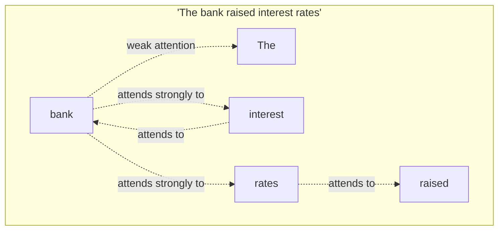
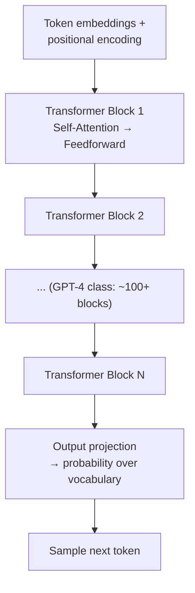
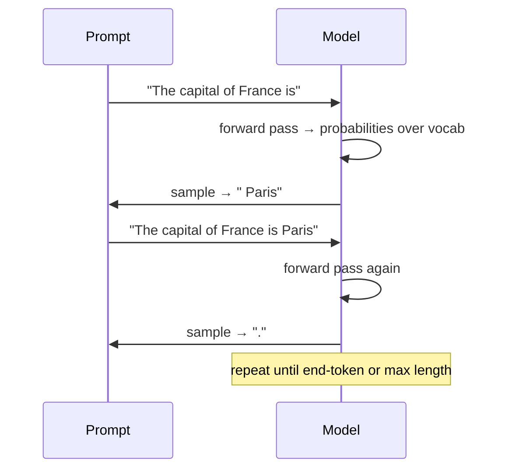

# Transformers & LLMs — How ChatGPT Actually Works

`neural-networks.md` covered generic layers and backprop. LLMs (GPT-4, Claude, Llama) are a *specific* neural network architecture — the **Transformer** — trained on text with one deceptively simple objective: predict the next token.

---

## Step 1: Tokens, Not Words

LLMs don't see words. They see **tokens** — subword chunks from a fixed vocabulary (GPT-4 uses ~100K tokens; Llama uses a similar range). A word might be one token, or split into several.

```python
# Conceptually, a tokenizer maps text <-> integer IDs from a fixed vocabulary
text = "unbelievable"
tokens = ["un", "believ", "able"]        # subword pieces, not the whole word
token_ids = [403, 12881, 481]            # what the model actually receives

# Common words are single tokens; rare/compound words get split
"the"          -> ["the"]           -> [262]
"tokenization" -> ["token", "ization"] -> [30001, 2065]
```

**Why subwords, not whole words?** A whole-word vocabulary would need millions of entries (every name, typo, and language) and couldn't handle words it's never seen. Subword tokenization (BPE — Byte Pair Encoding) handles unknown words by falling back to smaller, known pieces — worst case, individual characters.

**Why this matters practically:**
- API pricing is per-token, not per-word (~4 characters ≈ 1 token in English)
- "Context window" (e.g., 128K tokens) is a token budget, not a word-count budget
- This is why `llmops.md`'s chunking code uses `tokenizer.encode()`, not `text.split()`

---

## Step 2: Tokens Become Vectors (Embeddings)

Each token ID is looked up in an **embedding table** — a big matrix where every row is a vector representing that token's meaning. This is the first layer of every transformer.

```python
# Simplified: embedding table is just a lookup matrix, one row per vocab token
embedding_table = {
    262:   [0.12, -0.45, 0.88, ...],   # "the"  -> 768-dim vector (GPT-3 uses 12288-dim)
    30001: [0.51,  0.02, -0.31, ...],  # "token"
}

def embed(token_ids: list[int]) -> list[list[float]]:
    return [embedding_table[tid] for tid in token_ids]
```

These embeddings start random and get refined during training — see [`embeddings-deep-dive.md`](./embeddings-deep-dive.md) for what the resulting vector space actually represents.

---

## Step 3: The Attention Mechanism

This is the core innovation behind transformers (the 2017 "Attention Is All You Need" paper). The problem it solves: **the meaning of a word depends on context.**

> "The **bank** raised interest rates." vs "I sat by the river**bank**."

A plain embedding lookup gives "bank" the same vector both times. **Self-attention** lets every token look at every other token in the sequence and adjust its representation based on what's actually around it.



**Mechanically, attention computes 3 vectors per token:**

| Vector | Question it answers |
|--------|---------------------|
| **Query (Q)** | "What am I looking for?" |
| **Key (K)** | "What do I represent, for others to match against?" |
| **Value (V)** | "What information do I actually contribute if attended to?" |

```python
import math

def softmax(scores: list[float]) -> list[float]:
    exp_scores = [math.exp(s) for s in scores]
    total = sum(exp_scores)
    return [s / total for s in exp_scores]

def attention(query: list[float], keys: list[list[float]], values: list[list[float]]) -> list[float]:
    # 1. Score: how relevant is each key to this query? (dot product = similarity)
    scores = [sum(q * k for q, k in zip(query, key_vec)) for key_vec in keys]
    scale = 1 / math.sqrt(len(query))
    scores = [s * scale for s in scores]

    # 2. Normalize scores into weights that sum to 1
    weights = softmax(scores)

    # 3. Weighted sum of values — tokens that matter more contribute more
    output = [0.0] * len(values[0])
    for weight, value_vec in zip(weights, values):
        for i, v in enumerate(value_vec):
            output[i] += weight * v
    return output
```

Every token's output vector becomes a weighted blend of every other token's "value," where the weights are determined by how relevant each token is to the current one. "bank" ends up blended heavily with "interest" and "rates," pulling its representation toward the financial meaning.

**Multi-head attention** just runs several of these attention computations in parallel (different learned Q/K/V projections), so the model can track multiple kinds of relationships simultaneously (grammar, meaning, coreference) — then concatenates the results.

---

## Step 4: The Transformer Block

A transformer stacks many identical blocks, each containing self-attention followed by a small feedforward neural network (the plain layers from `neural-networks.md`).



**Positional encoding** matters because attention itself has no concept of word order — "dog bites man" and "man bites dog" would look identical without it. A positional signal is added to each token's embedding so the model knows *where* each token sits in the sequence.

---

## Step 5: Generating Text — One Token at a Time

An LLM generates text by repeatedly predicting the single most probable next token, appending it, and feeding the whole sequence back in.



```python
def generate(prompt_tokens: list[int], model, max_new_tokens: int = 50) -> list[int]:
    tokens = prompt_tokens.copy()
    for _ in range(max_new_tokens):
        probabilities = model.forward(tokens)      # probability over entire vocabulary
        next_token = sample(probabilities)          # see prompting-llm-apis.md for temperature/top-p
        tokens.append(next_token)
        if next_token == END_OF_SEQUENCE_TOKEN:
            break
    return tokens
```

This is why LLMs can "hallucinate" fluently — at each step they're sampling the statistically most plausible next token given everything so far, not looking anything up. There's no separate "fact-checking" step; plausibility and truth are correlated but not identical. This gap is exactly what RAG (`rag-from-scratch.md`) exists to close.

---

## Context Window

The context window is the maximum number of tokens (prompt + conversation history + generated output combined) the model can attend over in a single forward pass.

| Model class | Typical context window |
|-------------|------------------------|
| GPT-3.5 era | 4K–16K tokens |
| GPT-4 / Claude 3 | 128K–200K tokens |
| Latest long-context models | 1M+ tokens |

**Why it can't just be infinite:** self-attention is O(n²) in sequence length — every token attends to every other token, so doubling the context window roughly quadruples the compute for the attention step. This is a direct hardware/cost constraint, not an arbitrary limit (see `llmops.md`'s "Context utilization" metric and `ai-infra/model-serving.md`'s KV cache discussion for how serving systems manage this in production).

**Why RAG exists despite big context windows:** even at 1M tokens, you can't stuff your entire company's documentation into every prompt — it's slow, expensive (you pay per token), and the model attends worse when the context is stuffed with mostly-irrelevant text. Retrieval picks the *relevant* few thousand tokens instead of relying on a huge fixed window.

---

## Where This Leads

```
transformers-llms.md (you are here)
  → embeddings-deep-dive.md  the vector representations transformers produce, used for search
  → prompting-llm-apis.md    calling a trained LLM through an API, practically
  → rag-from-scratch.md      combining retrieval + generation to ground answers in real data
```
