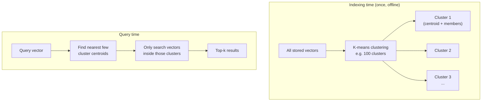
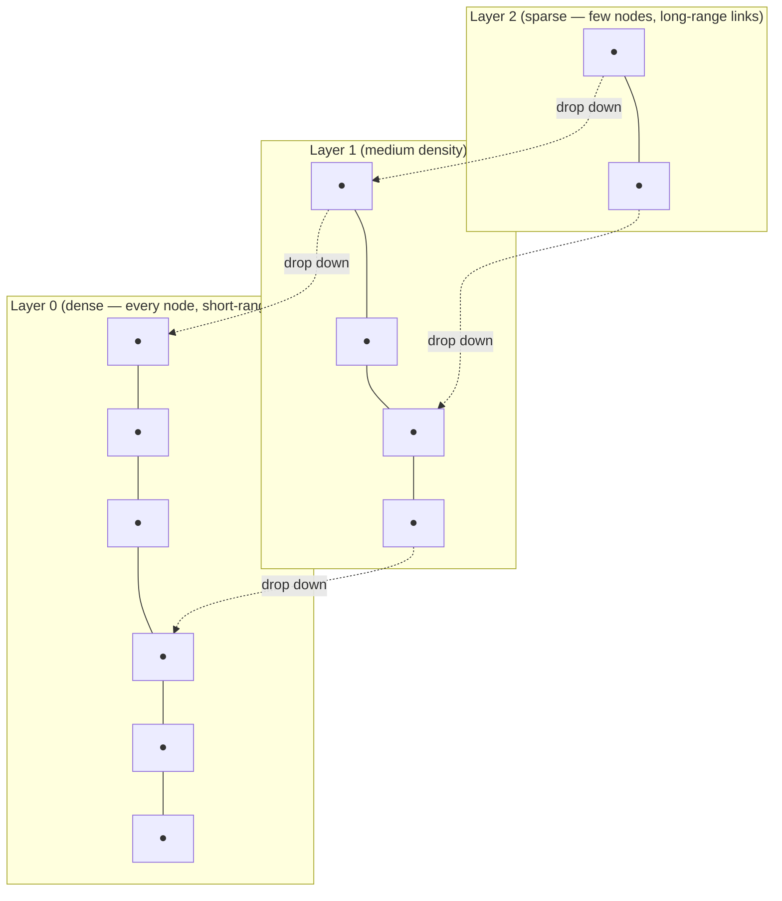
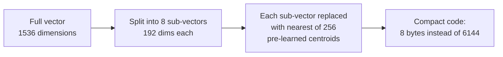

# Vector Search Internals — Why ANN Search Works Sub-Linearly

`rag-from-scratch.md`'s `retrieve()` function computed cosine similarity against *every* stored vector — a full linear scan. It works fine for 5 documents and falls apart at 5 million. This file explains what `llmops.md`'s `CREATE INDEX ... USING ivfflat` and Milvus's HNSW indexes are actually doing to make similarity search fast at scale.

---

## The Problem: Exact Search Doesn't Scale

```python
# The toy version from rag-from-scratch.md — O(n) per query
def exact_search(query_vector, stored_vectors, top_k=5):
    scored = [(text, cosine_similarity(query_vector, vec)) for text, vec in stored_vectors]
    scored.sort(key=lambda pair: pair[1], reverse=True)
    return scored[:top_k]
```

| Number of documents | Time per query (exact scan) |
|---|---|
| 1,000 | ~1 ms |
| 1,000,000 | ~1 second |
| 100,000,000 | ~100 seconds |

At real production scale (millions to billions of vectors), exact search is unusable for anything latency-sensitive. **Approximate Nearest Neighbor (ANN)** algorithms trade a small amount of accuracy for a massive speedup — instead of checking every vector, they check a carefully chosen small subset likely to contain the true nearest neighbors.

---

## IVF (Inverted File Index) — Search Only the Relevant Neighborhood

IVF's idea: cluster all stored vectors ahead of time. At query time, only search the clusters closest to the query — skip everything else entirely.



```python
import random

def kmeans_cluster(vectors: list[list[float]], num_clusters: int, iterations: int = 20):
    # Simplified k-means — real implementations use libraries (faiss, scikit-learn)
    centroids = random.sample(vectors, num_clusters)
    for _ in range(iterations):
        clusters = {i: [] for i in range(num_clusters)}
        for vec in vectors:
            closest = max(range(num_clusters), key=lambda i: cosine_similarity(vec, centroids[i]))
            clusters[closest].append(vec)
        centroids = [average_vector(clusters[i]) if clusters[i] else centroids[i] for i in range(num_clusters)]
    return centroids, clusters

def ivf_search(query_vector, centroids, clusters, num_clusters_to_check=3, top_k=5):
    # Step 1: find the nearest few cluster centroids — cheap, only num_clusters comparisons
    cluster_scores = [(i, cosine_similarity(query_vector, c)) for i, c in enumerate(centroids)]
    cluster_scores.sort(key=lambda x: x[1], reverse=True)
    clusters_to_search = [i for i, _ in cluster_scores[:num_clusters_to_check]]

    # Step 2: only scan vectors inside the chosen clusters — this is the actual speedup
    candidates = []
    for cluster_id in clusters_to_search:
        for vec in clusters[cluster_id]:
            candidates.append((vec, cosine_similarity(query_vector, vec)))
    candidates.sort(key=lambda x: x[1], reverse=True)
    return candidates[:top_k]
```

This is exactly what `llmops.md`'s pgvector setup does:

```sql
-- "lists = 100" means: cluster into 100 groups (the centroids above)
CREATE INDEX ON documents USING ivfflat (embedding vector_cosine_ops) WITH (lists = 100);

-- At query time, pgvector only checks a handful of the 100 clusters nearest the query,
-- not all rows in the table — this is why it's fast at millions of rows
```

**The tradeoff:** if the true nearest neighbor happens to sit in a cluster you didn't check (because it was near a cluster boundary), you miss it — hence "approximate." Checking more clusters (`num_clusters_to_check`) trades speed for accuracy.

---

## HNSW (Hierarchical Navigable Small World) — Graph-Based Search

HNSW builds a multi-layer graph where each vector is a node, connected to its approximate nearest neighbors. Search starts at a sparse top layer and "zooms in" through denser layers, like using a highway system before switching to local roads.



```python
# Conceptual greedy-search over an HNSW-style graph — real implementations (hnswlib, faiss) are far more optimized
def hnsw_search(query_vector, graph_layers: list[dict], entry_point, top_k=5):
    current_node = entry_point
    # Start at the top (sparsest) layer, greedily move toward the query at each layer
    for layer in reversed(graph_layers):   # top layer first, down to layer 0
        improved = True
        while improved:
            improved = False
            for neighbor in layer[current_node]["neighbors"]:
                if cosine_similarity(query_vector, layer[neighbor]["vector"]) > \
                   cosine_similarity(query_vector, layer[current_node]["vector"]):
                    current_node = neighbor   # move to the closer neighbor
                    improved = True
    # By layer 0, current_node is very close to the true nearest neighbor —
    # a small local search from here finds the actual top-k
    return local_search_around(current_node, graph_layers[0], query_vector, top_k)
```

**Why this beats IVF for accuracy:** IVF can miss a true neighbor that landed in the "wrong" cluster near a boundary. HNSW's graph structure lets search naturally drift toward the right neighborhood regardless of arbitrary cluster boundaries, generally giving better recall at similar speed — which is why Milvus, Weaviate, and Qdrant (all mentioned in `llmops.md`'s vector DB table) default to HNSW rather than IVF.

| | IVF | HNSW |
|---|---|---|
| Structure | Flat clusters (k-means) | Multi-layer graph |
| Build time | Fast | Slower (graph construction) |
| Query speed | Fast | Fast, often faster |
| Recall (accuracy) | Good, sensitive to cluster boundaries | Generally better | 
| Memory usage | Lower | Higher (graph edges cost memory) |
| Used by | pgvector (IVFFlat), Faiss | Milvus, Weaviate, Qdrant, pgvector (HNSW option) |

---

## Product Quantization — Shrinking Vectors to Save Memory

Storing a raw 1536-dimensional float32 vector costs `1536 × 4 bytes = 6,144 bytes` per document. At 100 million documents, that's over 600GB just for embeddings — before even indexing them. Product quantization (PQ) compresses each vector into a much smaller approximate representation.



```python
def train_pq_codebook(vectors: list[list[float]], num_subvectors: int = 8, centroids_per_subvector: int = 256):
    dim = len(vectors[0])
    subvector_size = dim // num_subvectors
    codebooks = []
    for i in range(num_subvectors):
        # Extract the i-th slice of every vector, cluster those slices independently
        subvectors = [vec[i * subvector_size:(i + 1) * subvector_size] for vec in vectors]
        centroids, _ = kmeans_cluster(subvectors, centroids_per_subvector)
        codebooks.append(centroids)
    return codebooks

def quantize_vector(vector: list[float], codebooks: list[list[list[float]]], num_subvectors: int = 8) -> list[int]:
    dim = len(vector)
    subvector_size = dim // num_subvectors
    codes = []
    for i in range(num_subvectors):
        subvector = vector[i * subvector_size:(i + 1) * subvector_size]
        # Find which of the 256 centroids this sub-vector is closest to, store just that index
        closest_centroid_idx = max(range(len(codebooks[i])),
                                     key=lambda j: cosine_similarity(subvector, codebooks[i][j]))
        codes.append(closest_centroid_idx)   # a single byte (0-255) instead of 192 floats
    return codes  # 8 bytes total, down from 6144 bytes — ~768x compression
```

**The tradeoff, again:** you're storing an approximation of each sub-vector (the nearest of 256 learned centroids), not the exact values — search results are slightly less accurate in exchange for a massive memory reduction. Production vector DBs combine PQ with HNSW or IVF: use the compressed codes for the fast initial search, optionally re-rank the top candidates using full-precision vectors for final accuracy.

---

## What This Means for the `< 0.70` Threshold in `llmops.md`

Recall `llmops.md`'s runbook: "if average retrieval similarity drops below 0.70, something's wrong." Now you know the full picture behind that number — the similarity score you're checking was computed via an *approximate* search (IVF or HNSW), possibly against *quantized* vectors. Low similarity scores can mean:

1. The embedding model genuinely doesn't have a good match for the query (a real content/embedding-quality problem)
2. The ANN index's approximation missed the true best match (an index tuning problem — e.g., increase `lists` search count in IVF, or the `ef_search` parameter in HNSW)
3. Aggressive quantization degraded precision (a memory/accuracy tradeoff decision)

Distinguishing these matters: (1) needs better documents or a different embedding model, while (2) and (3) are pure infrastructure tuning — exactly the kind of judgment call `devops/ai-infra/llmops.md` and its vector DB choices are built around.

---

## Where This Leads

```
vector-search-internals.md (you are here)
  → devops/ai-infra/llmops.md   pgvector/Milvus in production, now with the "why" behind their index types
  → llm-evaluation.md            measuring whether retrieval quality (this file) is actually good enough
```
