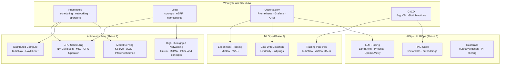

# AI Infrastructure

Platform engineering for AI/ML workloads — the substrate underneath models. Kubernetes stretched to its limits with GPUs, distributed compute, and high-throughput networking.

This is the natural extension of your K8s/Linux/DevOps foundation.

---

## How AI Infra Relates to What You Know



---

## Files

| File | Topics |
|------|--------|
| [gpu-scheduling.md](./gpu-scheduling.md) | NVIDIA Device Plugin, extended resources, MIG slicing, GPU Operator, taints/tolerations for GPU nodes |
| [kuberay.md](./kuberay.md) | KubeRay operator, RayCluster CRD, head/worker nodes, autoscaling, Ray Serve, resource requests |
| [model-serving.md](./model-serving.md) | KServe InferenceService, vLLM continuous batching, KV cache, canary rollouts, autoscaling with Knative |
| [llmops.md](./llmops.md) | RAG architecture, vector DBs (pgvector, Milvus, Pinecone), LangSmith tracing, guardrails, cost optimization |
| [networking.md](./networking.md) | NVLink, InfiniBand, RoCE, AWS EFA, NCCL AllReduce, Cilium for inference, fat-tree topology |

---

## Learning Path

```
Phase 1: AI Infrastructure (start here if you have K8s background)
  gpu-scheduling.md     → understand how GPUs become K8s resources
  kuberay.md            → distributed Python workloads on K8s
  model-serving.md      → expose models as APIs at scale

Phase 2: MLOps (after Phase 1) — see devops/mlops/
  experiment-tracking   → MLflow / W&B
  training-pipelines    → Kubeflow Pipelines / Airflow

Phase 3: LLMOps (concurrent with Phase 2)
  llmops.md             → RAG, vector DBs, LangSmith, guardrails
```

---

## Quick Orientation: AI Workload Types

| Workload | K8s resource shape | Key concern |
|----------|------------------|-------------|
| Model training | Long-running Job, multi-GPU, gang scheduling | GPU utilization, checkpoint, fault tolerance |
| Batch inference | Job or CronJob, GPU optional | Throughput, cost |
| Online inference | Deployment + HPA, GPU required | Latency p99, KV cache size, queue depth |
| RAG pipeline | Stateless Deployment + vector DB | Embedding latency, retrieval accuracy |
| Fine-tuning | Job, 1–8 GPUs, hours to days | Data pipeline, checkpoint storage, resume |

---

## Key Difference from Standard K8s Workloads

| Standard workload | AI workload |
|------------------|-------------|
| CPU + memory requests | CPU + memory + `nvidia.com/gpu` requests |
| HPA on CPU % | HPA on GPU utilization or queue depth (KEDA) |
| Any node | GPU node group with taint `nvidia.com/gpu=present:NoSchedule` |
| Rolling update | Canary with traffic split (KServe) or blue-green |
| Prometheus metrics | Prometheus + DCGM Exporter (GPU metrics) + LLM token metrics |
| Container image ~100MB | Model image ~5–70GB (use PVC or model storage instead) |
