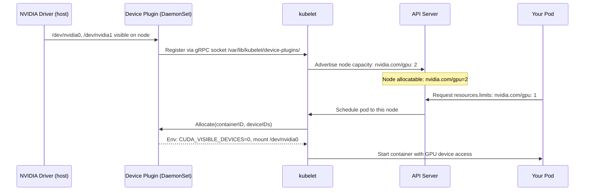
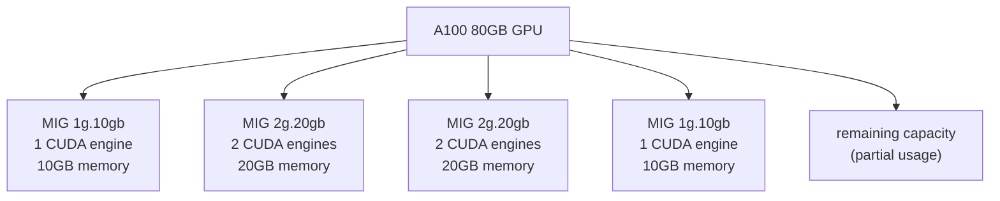
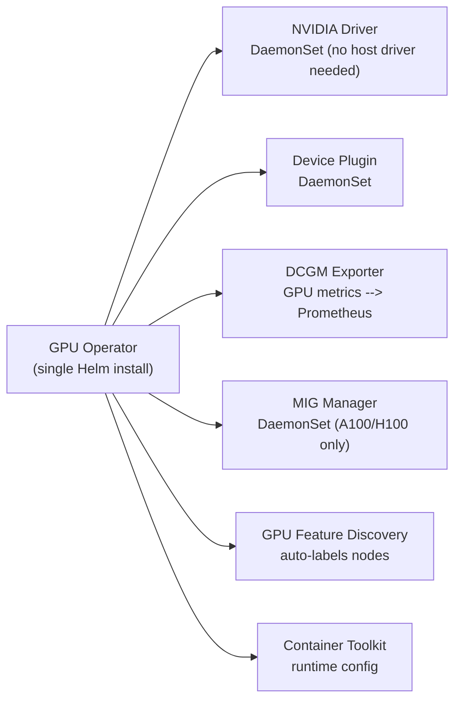

# GPU Scheduling on Kubernetes

GPUs are exposed to Kubernetes as **extended resources** — not built-in like CPU/memory. A chain of components bridges the hardware to the pod spec.

---

## How GPUs Become K8s Resources



The Device Plugin API is a gRPC socket at `/var/lib/kubelet/device-plugins/`. Any hardware can be exposed via this interface — GPUs, FPGAs, InfiniBand NICs.

---

## NVIDIA Device Plugin

### Install

```bash
# Via Helm (preferred — handles DaemonSet + RBAC)
helm repo add nvdp https://nvidia.github.io/k8s-device-plugin
helm install nvdp nvdp/nvidia-device-plugin \
  --namespace kube-system \
  --set failOnInitError=false

# Verify: node should show nvidia.com/gpu in allocatable
kubectl describe node <gpu-node> | grep -A5 "Allocatable:"
# Allocatable:
#   cpu:                15600m
#   memory:             60Gi
#   nvidia.com/gpu:     4       ← 4 GPUs available
```

### Pod requesting a GPU

```yaml
apiVersion: v1
kind: Pod
spec:
  containers:
  - name: training
    image: nvcr.io/nvidia/pytorch:24.01-py3
    resources:
      limits:
        nvidia.com/gpu: 1       # request exactly 1 GPU
        memory: "16Gi"
        cpu: "4"
      requests:
        nvidia.com/gpu: 1       # must equal limits for GPU (no overcommit)
        memory: "16Gi"
        cpu: "2"
    env:
    - name: CUDA_VISIBLE_DEVICES   # set by device plugin automatically
      value: "0"                   # don't set manually — let the plugin do it
```

**GPU resources are not overcommittable.** `requests` must equal `limits` for `nvidia.com/gpu`. The scheduler guarantees one pod per GPU slot.

---

## Node Taints for GPU Nodes

GPU instances are expensive. Prevent non-GPU workloads from landing on them:

```bash
# Taint GPU nodes — only pods with the matching toleration can schedule here
kubectl taint node <gpu-node> nvidia.com/gpu=present:NoSchedule

# GPU pods must have this toleration
tolerations:
- key: "nvidia.com/gpu"
  operator: "Exists"
  effect: "NoSchedule"
```

```yaml
# Node selector to target GPU nodes specifically
nodeSelector:
  node.kubernetes.io/instance-type: p3.8xlarge   # AWS GPU instance type
  # or use a custom label:
  accelerator: "nvidia-tesla-v100"
```

---

## MIG — Multi-Instance GPU

MIG (Multi-Instance GPU) partitions a single A100/H100 into up to 7 hardware-isolated instances. Each instance has its own:
- CUDA engines
- L2 cache partition
- Memory bandwidth slice
- **Memory isolation** — other instances cannot see this instance's memory



**vs. `CUDA_VISIBLE_DEVICES` (soft isolation):** Using env vars to restrict a container to one GPU still allows the process to see the full GPU memory — another process on the same GPU can interfere. MIG provides **hardware-enforced** isolation.

### MIG profiles on A100

| Profile | CUDA engines | Memory | Instances max |
|---------|-------------|--------|--------------|
| `1g.10gb` | 1/7 | 10GB | 7 |
| `2g.20gb` | 2/7 | 20GB | 3 |
| `3g.40gb` | 3/7 | 40GB | 2 |
| `7g.80gb` | 7/7 | 80GB | 1 (full GPU) |

### Expose MIG slices as K8s resources

```bash
# Check current MIG mode
nvidia-smi --query-gpu=mig.mode.current --format=csv

# Enable MIG mode on GPU 0
sudo nvidia-smi -i 0 -mig 1

# Create 7x 1g.10gb instances
sudo nvidia-smi mig -cgi 1g.10gb,1g.10gb,1g.10gb,1g.10gb,1g.10gb,1g.10gb,1g.10gb -C
```

With GPU Operator (automated), MIG resources appear as:
```
nvidia.com/mig-1g.10gb: 7
nvidia.com/mig-2g.20gb: 3
```

Pod requests a specific slice:
```yaml
resources:
  limits:
    nvidia.com/mig-1g.10gb: 1   # one 10GB MIG slice
```

---

## GPU Operator

The GPU Operator automates the entire GPU software stack via Kubernetes operators:



```bash
helm repo add nvidia https://helm.ngc.nvidia.com/nvidia
helm install gpu-operator nvidia/gpu-operator \
  --namespace gpu-operator --create-namespace \
  --set mig.strategy=mixed   # 'single' = all GPUs same profile, 'mixed' = different per GPU
```

**Why GPU Operator over manual installation?**
- No GPU driver installed on the host required — operator manages driver as a container
- Automatic node labeling (`nvidia.com/gpu.product=A100-SXM4-80GB`)
- DCGM exporter automatically deployed for GPU metrics
- MIG configuration managed declaratively

---

## GPU Metrics with DCGM Exporter

DCGM (Data Center GPU Manager) exposes GPU metrics to Prometheus:

```bash
# Key metrics
DCGM_FI_DEV_GPU_UTIL          # GPU utilization % (0-100)
DCGM_FI_DEV_MEM_COPY_UTIL     # Memory bandwidth utilization %
DCGM_FI_DEV_FB_USED           # Framebuffer (VRAM) used MB
DCGM_FI_DEV_FB_FREE           # VRAM free MB
DCGM_FI_DEV_POWER_USAGE       # Power draw (watts)
DCGM_FI_DEV_GPU_TEMP          # Temperature (celsius)
DCGM_FI_DEV_SM_CLOCK          # Streaming multiprocessor clock MHz
DCGM_FI_PROF_PIPE_TENSOR_ACTIVE  # Tensor core utilization % (training efficiency)
```

```promql
# GPU utilization per pod
avg by (pod, gpu) (DCGM_FI_DEV_GPU_UTIL)

# VRAM usage %
DCGM_FI_DEV_FB_USED / (DCGM_FI_DEV_FB_USED + DCGM_FI_DEV_FB_FREE) * 100

# Alert: GPU idle > 5 min on a running pod (wasted $$$)
DCGM_FI_DEV_GPU_UTIL < 5
```

**Alert thresholds:**

| Metric | Warning | Critical |
|--------|---------|---------|
| GPU util | < 20% sustained (idle waste) | > 95% sustained (saturation) |
| VRAM used | > 85% | > 95% → OOM kill |
| Temperature | > 80°C | > 87°C (throttling starts) |
| Power | > 90% TDP | — |

---

## Gang Scheduling — All-or-Nothing Pod Groups

Distributed training requires ALL pods to start simultaneously (otherwise one waits forever for others that are stuck pending). Standard K8s scheduler doesn't guarantee this.

```bash
# Install Volcano or Coscheduler (scheduler-plugins)
kubectl apply -f https://raw.githubusercontent.com/volcano-sh/volcano/master/installer/volcano-development.yaml

# PodGroup: schedule all 4 pods atomically
apiVersion: scheduling.volcano.sh/v1beta1
kind: PodGroup
metadata:
  name: training-job
spec:
  minMember: 4       # all 4 GPUs must be available, or none start
---
apiVersion: v1
kind: Pod
metadata:
  annotations:
    scheduling.volcano.sh/pod-group: training-job
spec:
  schedulerName: volcano
  containers:
  - resources:
      limits:
        nvidia.com/gpu: 1
```

Without gang scheduling: 3/4 pods start, 4th can't schedule → deadlock (3 GPUs held hostage, 4th waiting forever).
