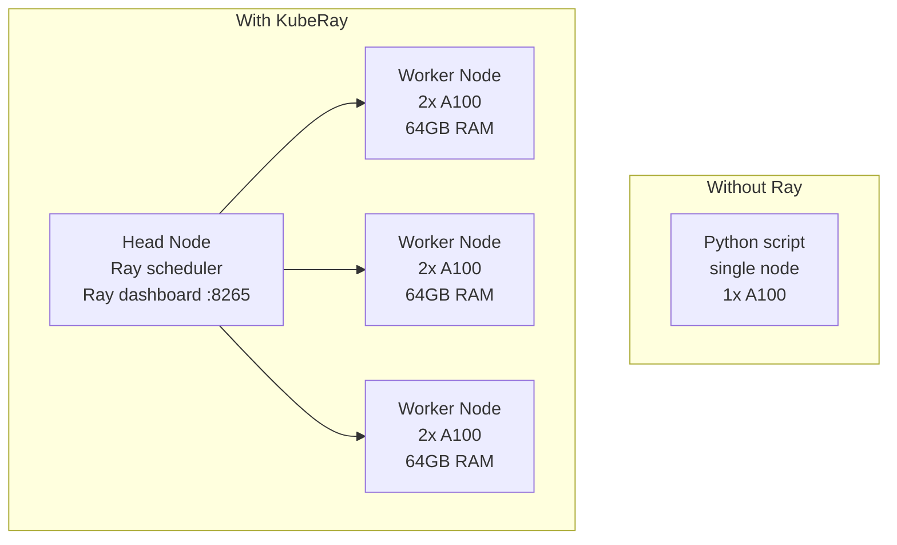
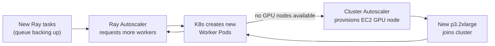

# KubeRay — Distributed Compute on Kubernetes

Ray is the standard framework for scaling Python and ML workloads across a cluster. KubeRay is the Kubernetes operator that manages Ray clusters as CRDs.

---

## What Ray Solves

Single-node Python hits limits: one GPU, one CPU, one machine's memory. Ray distributes workloads across many nodes transparently — the same Python code runs on 1 node or 1000.



**Use cases:**
- Distributed model training (multiple GPUs across nodes)
- Parallel hyperparameter search
- Batch inference at scale
- Ray Serve: scalable model serving with request routing

---

## KubeRay Operator

```bash
helm repo add kuberay https://ray-project.github.io/kuberay-helm/
helm install kuberay-operator kuberay/kuberay-operator \
  --namespace ray-system --create-namespace \
  --version 1.1.0
```

The operator watches for `RayCluster`, `RayJob`, and `RayService` CRDs and creates the corresponding K8s resources (Pods, Services, Ingress).

---

## RayCluster CRD

```yaml
apiVersion: ray.io/v1
kind: RayCluster
metadata:
  name: llm-training-cluster
spec:
  rayVersion: "2.9.0"

  # Head node: Ray scheduler + object store + dashboard
  headGroupSpec:
    rayStartParams:
      dashboard-host: "0.0.0.0"
      num-cpus: "0"           # head node doesn't run tasks — only scheduling
    template:
      spec:
        containers:
        - name: ray-head
          image: rayproject/ray-ml:2.9.0-gpu
          resources:
            limits:
              cpu: "4"
              memory: "16Gi"
              nvidia.com/gpu: "0"   # head doesn't need GPU
            requests:
              cpu: "2"
              memory: "8Gi"
        tolerations:
        - key: "nvidia.com/gpu"
          operator: "Exists"
          effect: "NoSchedule"

  # Worker nodes: actual compute
  workerGroupSpecs:
  - groupName: gpu-workers
    replicas: 4                # 4 worker pods
    minReplicas: 1             # autoscaling min
    maxReplicas: 8             # autoscaling max
    rayStartParams: {}
    template:
      spec:
        containers:
        - name: ray-worker
          image: rayproject/ray-ml:2.9.0-gpu
          resources:
            limits:
              cpu: "8"
              memory: "64Gi"
              nvidia.com/gpu: "2"   # 2 GPUs per worker
            requests:
              cpu: "4"
              memory: "32Gi"
              nvidia.com/gpu: "2"
        nodeSelector:
          accelerator: nvidia-a100
        tolerations:
        - key: "nvidia.com/gpu"
          operator: "Exists"
          effect: "NoSchedule"
```

---

## RayJob — Run a Job and Tear Down

For batch training/inference — spin up a cluster, run the job, clean up:

```yaml
apiVersion: ray.io/v1
kind: RayJob
metadata:
  name: training-run-v1
spec:
  entrypoint: "python /app/train.py --epochs 100 --lr 0.001"
  shutdownAfterJobFinishes: true   # ← delete cluster when done (cost saving)
  ttlSecondsAfterFinished: 300     # clean up resources 5 min after completion

  runtimeEnvYAML: |
    pip:
      - torch==2.2.0
      - transformers==4.38.0
    env_vars:
      WANDB_API_KEY: "$(WANDB_API_KEY)"

  rayClusterSpec:
    # ... same as RayCluster spec above
```

```bash
# Submit and monitor
kubectl apply -f rayjob.yaml
kubectl get rayjob training-run-v1
# STATUS: Running → Succeeded

# View Ray dashboard (port-forward to head)
kubectl port-forward svc/llm-training-cluster-head-svc 8265:8265
# http://localhost:8265
```

---

## RayService — Scalable Model Serving

RayService runs Ray Serve, Ray's built-in serving framework. Supports multi-model serving, request routing, and blue-green deployments.

```yaml
apiVersion: ray.io/v1
kind: RayService
metadata:
  name: llm-inference
spec:
  serviceUnhealthySecondThreshold: 300
  deploymentUnhealthySecondThreshold: 300

  serveConfigV2: |
    applications:
    - name: llm
      route_prefix: /
      import_path: serve_app:deployment
      deployments:
      - name: LLMDeployment
        num_replicas: 2
        ray_actor_options:
          num_gpus: 1
          num_cpus: 4
          memory: 32000000000   # 32GB

  rayClusterSpec:
    # ... worker group with GPU resources
```

```python
# serve_app.py — the Ray Serve deployment
from ray import serve
from transformers import pipeline

@serve.deployment(num_replicas=2, ray_actor_options={"num_gpus": 1})
class LLMDeployment:
    def __init__(self):
        self.model = pipeline("text-generation", model="gpt2", device=0)

    async def __call__(self, request):
        data = await request.json()
        return self.model(data["prompt"], max_length=100)

deployment = LLMDeployment.bind()
```

---

## Autoscaling RayClusters

KubeRay integrates with K8s Cluster Autoscaler and Ray's own autoscaler:

```yaml
workerGroupSpecs:
- groupName: gpu-workers
  minReplicas: 0       # scale to zero when idle (cost saving)
  maxReplicas: 16
  # Ray autoscaler adds workers when task queue is backed up
  # Cluster Autoscaler provisions new EC2 GPU nodes when K8s can't schedule
```



**Cost optimization:** Set `minReplicas: 0` for worker groups. Workers scale to zero when no jobs are running. Only the head node (no GPU, cheap) stays running.

---

## Connecting to a Running RayCluster

```bash
# Port-forward to Ray head service
kubectl port-forward svc/<cluster>-head-svc 10001:10001 8265:8265

# In Python — connect to the cluster
import ray
ray.init(address="ray://localhost:10001")

# Run a distributed task
@ray.remote(num_gpus=1)
def train_shard(data_shard):
    # runs on a worker with 1 GPU
    return model.fit(data_shard)

futures = [train_shard.remote(shard) for shard in data_shards]
results = ray.get(futures)   # collect results from all workers
```

---

## Observability

```bash
# Ray Dashboard: task graph, resource usage, logs
kubectl port-forward svc/<cluster>-head-svc 8265:8265
# http://localhost:8265

# Ray metrics exposed for Prometheus
# Add ServiceMonitor for ray-head-svc port 8080 (metrics)
ray_tasks_running_gauge          # active tasks
ray_actors_count                 # actor pool size
ray_object_store_memory_usage    # shared memory usage
ray_node_cpu_utilization         # per-node CPU %
ray_node_gpus_available          # available GPU slots
```
