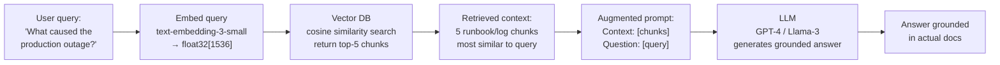
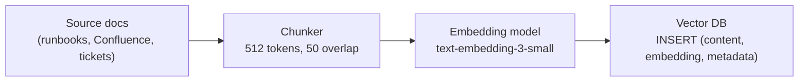
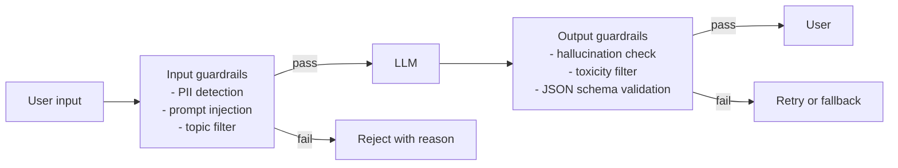

# LLMOps — Operating Large Language Models in Production

LLMOps extends standard DevOps/MLOps to cover the specific challenges of LLM-based systems: RAG pipelines, observability beyond metrics, cost control, and guardrails.

---

## RAG Architecture

RAG (Retrieval-Augmented Generation) prevents hallucinations by grounding LLM responses in retrieved context. The LLM doesn't need to know everything — it reasons over retrieved facts.



### Indexing Pipeline (offline)



```python
# Chunking with overlap preserves context across chunk boundaries
def chunk_document(text: str, size: int = 512, overlap: int = 50) -> list[str]:
    tokens = tokenizer.encode(text)
    chunks = []
    for i in range(0, len(tokens), size - overlap):
        chunk = tokens[i:i + size]
        chunks.append(tokenizer.decode(chunk))
    return chunks
```

---

## Vector Databases

| DB | Deployment | Best for | K8s-native |
|----|-----------|---------|-----------|
| **pgvector** | PostgreSQL extension | Existing Postgres, small-medium scale | ✅ (any Postgres) |
| **Milvus** | Standalone cluster | High scale, dedicated vector search | ✅ (Helm chart) |
| **Weaviate** | Standalone cluster | Built-in text vectorization | ✅ (Helm chart) |
| **Qdrant** | Standalone | Rust-based, fast, simple API | ✅ (Helm chart) |
| **Pinecone** | Managed SaaS | No ops, pay-per-use | External |
| **OpenSearch** | Standalone cluster | Existing OpenSearch users | ✅ |

### pgvector (K8s — start here)

```yaml
# Postgres with pgvector extension
apiVersion: apps/v1
kind: Deployment
metadata:
  name: postgres-pgvector
spec:
  template:
    spec:
      containers:
      - name: postgres
        image: pgvector/pgvector:pg16   # pgvector pre-installed
        env:
        - name: POSTGRES_DB
          value: vectordb
```

```sql
-- Enable extension and create table
CREATE EXTENSION IF NOT EXISTS vector;

CREATE TABLE documents (
    id          SERIAL PRIMARY KEY,
    content     TEXT,
    source      TEXT,
    embedding   vector(1536),    -- OpenAI text-embedding-3-small dimension
    created_at  TIMESTAMPTZ DEFAULT now()
);

-- IVFFlat index for approximate nearest neighbour (fast at scale)
CREATE INDEX ON documents USING ivfflat (embedding vector_cosine_ops)
  WITH (lists = 100);   -- sqrt(row_count) is a good starting point

-- Query: find top-5 most similar chunks
SELECT content, source,
       1 - (embedding <=> '[0.1, 0.2, ...]'::vector) AS similarity
FROM documents
ORDER BY embedding <=> '[0.1, 0.2, ...]'::vector
LIMIT 5;
```

### Milvus (for scale)

```bash
helm repo add milvus https://zilliztech.github.io/milvus-helm/
helm install milvus milvus/milvus \
  --namespace milvus --create-namespace \
  --set cluster.enabled=false \    # standalone mode for dev
  --set persistence.enabled=true
```

---

## LLM Tracing with LangSmith / OpenLLMetry

Standard OTel traces show HTTP calls. LLM traces show **prompt chains** — which prompts ran, what tokens were used, where latency came from.

### OpenLLMetry (open-source, OTel-native)

Instruments LangChain, OpenAI, Anthropic, etc. Exports to your existing OTel Collector → Jaeger/Tempo.

```python
from opentelemetry.sdk.trace import TracerProvider
from traceloop.sdk import Traceloop

# Initialize — auto-instruments all LLM calls
Traceloop.init(
    app_name="rag-service",
    exporter=OTLPExporter(endpoint="http://otel-collector:4317"),
)

# All downstream OpenAI/LangChain calls now emit spans automatically
```

Spans emitted per LLM call:
```
Span: llm.openai.chat
  Attributes:
    llm.model: gpt-4
    llm.request.max_tokens: 1024
    llm.usage.prompt_tokens: 342
    llm.usage.completion_tokens: 128
    llm.usage.total_tokens: 470
    llm.request.temperature: 0.7
  Duration: 1.4s
  Events:
    - name: "first_token", timestamp: +0.8s  ← TTFT
```

### LangSmith (LangChain-specific)

```python
import os
os.environ["LANGCHAIN_TRACING_V2"] = "true"
os.environ["LANGCHAIN_API_KEY"] = "ls_..."
os.environ["LANGCHAIN_PROJECT"] = "production-rag"

# All LangChain calls automatically traced to LangSmith
chain = retriever | prompt | llm | output_parser
result = chain.invoke({"question": "What is the RTO?"})
# Trace visible at langsmith.com with full prompt, retrieved docs, LLM output
```

### Key LLM Metrics to Track

```
TTFT (Time To First Token)    → user-perceived latency start
TPOT (Time Per Output Token)  → generation speed (tokens/sec)
Total latency                 → TTFT + TPOT × output_tokens
Token cost                    → (prompt_tokens × $X + completion_tokens × $Y)
Context utilization           → prompt_tokens / max_context_tokens (avoid truncation)
Retrieval score               → cosine similarity of top-1 chunk (< 0.7 = poor retrieval)
```

```promql
# Average TTFT over 5 min
histogram_quantile(0.95, rate(llm_time_to_first_token_seconds_bucket[5m]))

# Token cost per minute
rate(llm_usage_total_tokens_total[1m]) * 0.00003  # $0.03 per 1K tokens (GPT-4)
```

---

## Guardrails

Guardrails validate LLM inputs and outputs before they reach users or downstream systems.



### NeMo Guardrails (NVIDIA, open-source)

```python
from nemoguardrails import RailsConfig, LLMRails

config = RailsConfig.from_path("./config/guardrails/")
rails = LLMRails(config)

# config/guardrails/config.yml defines:
# - allowed topics
# - blocked topics (competitor mentions, PII)
# - output validation rules

response = await rails.generate_async(
    messages=[{"role": "user", "content": user_input}]
)
```

### Practical Output Validation

```python
import json
from pydantic import BaseModel, validator

class StructuredOutput(BaseModel):
    action: str
    confidence: float
    reasoning: str

    @validator("confidence")
    def confidence_in_range(cls, v):
        assert 0.0 <= v <= 1.0
        return v

def validated_llm_call(prompt: str) -> StructuredOutput:
    response = llm.invoke(prompt)
    try:
        data = json.loads(response.content)
        return StructuredOutput(**data)
    except (json.JSONDecodeError, ValidationError) as e:
        # Retry with corrective prompt or return safe default
        raise LLMOutputValidationError(str(e))
```

---

## Cost Optimization

| Technique | Savings | Tradeoff |
|-----------|---------|---------|
| Prompt caching (OpenAI/Anthropic) | 50–90% on repeated context | Cache only stable prefixes |
| Smaller model for simple queries | 10–50× cost reduction | Accuracy may drop |
| Quantization (fp16→int4) | 2–4× GPU memory reduction | 1–3% accuracy loss |
| KV cache sharing (vLLM prefix caching) | Reduce TTFT for common system prompts | Memory tradeoff |
| Batching requests | Amortize GPU setup cost | Added latency |
| Spot/preemptible instances for training | 60–80% compute cost reduction | Need checkpoint/resume |

```bash
# Enable vLLM prefix caching — shared system prompt reuses KV cache
vllm serve llama-3-8b \
  --enable-prefix-caching \    # cache KV for repeated prefixes
  --max-num-seqs 256           # max concurrent sequences
```

---

## Data Drift and Model Observability

For self-hosted fine-tuned models (not API calls), you need to detect when the model degrades.

| Signal | What it detects | Tool |
|--------|----------------|------|
| **Data drift** | Input distribution changed from training data | Evidently, Whylogs |
| **Concept drift** | Same inputs, different correct outputs (world changed) | Human evaluation + shadow scoring |
| **Output drift** | Model outputs becoming shorter/longer/more generic | Prometheus histograms on output length, sentiment |
| **Retrieval drift** | Vector DB chunks no longer relevant (docs outdated) | Monitor similarity scores < threshold |

```python
# Simple output drift detection: monitor response length distribution
from prometheus_client import Histogram

llm_response_tokens = Histogram(
    "llm_response_tokens",
    "Distribution of LLM response token counts",
    buckets=[10, 50, 100, 200, 500, 1000]
)

def generate(prompt: str) -> str:
    response = llm.invoke(prompt)
    llm_response_tokens.observe(count_tokens(response))
    return response

# Alert if p50 response length drops >30% (model becoming terse/degraded)
```

---

## LLMOps Runbook: RAG Quality Drops

**Symptom:** Users report wrong or irrelevant answers. Retrieval similarity scores trending down.

```
1. Check retrieval similarity scores:
   SELECT AVG(1 - (embedding <=> query_embedding)) FROM retrieval_logs
   WHERE created_at > NOW() - INTERVAL '24h';
   → If < 0.70: embedding model or chunking problem

2. Check if source documents were updated:
   SELECT MAX(updated_at) FROM documents;
   → Re-index if documents changed

3. Check LLM output in LangSmith/Phoenix traces:
   → Are retrieved chunks actually relevant to the question?
   → Is the LLM ignoring the context?

4. Check token count — context truncation:
   → If prompt_tokens ≈ max_context: documents are being cut off
   → Fix: reduce chunk size, reduce top-k, increase model context

5. Shadow scoring: run 100 queries through old and new pipeline:
   → Compare LLM-as-judge scores (GPT-4 rates quality 1-5)
```
