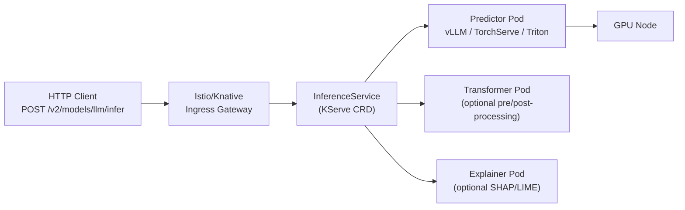

# Model Serving Infrastructure

Exposing ML models as production APIs. Two layers: KServe for the K8s-native orchestration layer, vLLM for the high-throughput LLM inference engine underneath.

---

## KServe — InferenceService CRD

KServe is the Kubernetes-native model serving platform. It adds an `InferenceService` CRD that abstracts model serving across frameworks (sklearn, PyTorch, TensorFlow, custom).



### InferenceService for a custom vLLM model

```yaml
apiVersion: serving.kserve.io/v1beta1
kind: InferenceService
metadata:
  name: llama-3-8b
  namespace: ml-serving
spec:
  predictor:
    model:
      modelFormat:
        name: pytorch
      storageUri: "s3://my-models/llama-3-8b/"   # model weights on S3/GCS/PVC
      runtime: vllm-runtime                        # custom ServingRuntime

    # Resource allocation
    resources:
      limits:
        cpu: "8"
        memory: "32Gi"
        nvidia.com/gpu: "1"
      requests:
        cpu: "4"
        memory: "16Gi"
        nvidia.com/gpu: "1"

    # Knative autoscaling
    minReplicas: 1
    maxReplicas: 4
    scaleTarget: 5        # target concurrent requests per replica
    scaleMetric: concurrency
```

### Custom ServingRuntime for vLLM

```yaml
apiVersion: serving.kserve.io/v1alpha1
kind: ClusterServingRuntime
metadata:
  name: vllm-runtime
spec:
  supportedModelFormats:
  - name: pytorch
    version: "2"
    autoSelect: true

  containers:
  - name: kserve-container
    image: vllm/vllm-openai:v0.4.2
    command: ["python", "-m", "vllm.entrypoints.openai.api_server"]
    args:
    - --model=/mnt/models            # KServe mounts model here
    - --tensor-parallel-size=1       # GPUs to shard across
    - --max-model-len=8192           # max sequence length
    - --gpu-memory-utilization=0.90  # leave 10% for KV cache growth
    - --served-model-name=llama-3-8b

    resources:
      limits:
        nvidia.com/gpu: "1"
    volumeMounts:
    - name: model
      mountPath: /mnt/models
```

---

## vLLM — High-Throughput LLM Inference Engine

vLLM achieves 20–100× throughput vs naive inference through three innovations.

### 1. Continuous Batching

Naive: wait for a full batch, run, return, repeat (GPU idle between batches).

vLLM: new requests join the batch **mid-generation**. The batch is always full.

```mermaid
gantt
    title Naive vs Continuous Batching
    dateFormat X
    axisFormat %s

    section Naive
    Request A (20 tokens) : 0, 20
    Request B wait        : 0, 20
    Request B (10 tokens) : 20, 30

    section Continuous
    Request A (20 tokens) : 0, 20
    Request B (joins at 5): 5, 15
```



Result: GPU utilization goes from ~40% to ~95%.

### 2. PagedAttention — KV Cache Management

During generation, each token's Key and Value vectors are cached (the KV cache). Standard approach: pre-allocate max sequence length × batch size = wastes memory for short sequences.

PagedAttention borrows from OS virtual memory paging:
- KV cache divided into fixed-size **pages** (e.g., 16 tokens per page)
- Pages allocated **on demand** as tokens are generated
- Pages shared across parallel sequences (for beam search, speculative decoding)
- No memory fragmentation

```
Standard KV cache: [seq0: 2048 tokens allocated][seq1: 2048 tokens allocated] ...
  → seq0 uses 50 tokens, 1998 slots wasted

Paged KV cache: [page0: seq0 t0-15][page1: seq0 t16-31][page2: seq1 t0-15] ...
  → pages allocated as needed, no waste
```

Result: 2–4× more concurrent sequences fit in the same GPU memory.

### 3. Tensor Parallelism

For models too large for one GPU, split the weight matrices across GPUs:

```bash
# Llama 70B requires ~140GB VRAM at fp16 → needs 2x A100 80GB minimum
vllm serve meta-llama/Meta-Llama-3-70B \
  --tensor-parallel-size 2    # split across 2 GPUs
  --pipeline-parallel-size 1  # layers are NOT split across GPUs (different from TP)
```

Tensor parallel: each GPU holds a **column slice** of weight matrices. Each forward pass requires an AllReduce across GPUs. Needs high-bandwidth NVLink (not PCIe).

---

## KV Cache and Context Window

Every token you've generated so far is in the KV cache. Longer context = more KV cache = less room for concurrent requests.

```
A100 80GB, Llama-3 8B (fp16):
  Model weights: ~16GB
  Remaining for KV cache: ~64GB

  At 4096 context length: ~200 concurrent requests
  At 8192 context length: ~100 concurrent requests
  At 32768 context length: ~25 concurrent requests
```

This is why `--max-model-len` is a critical parameter. Set it to the 95th percentile of your actual request length, not the model's maximum.

```bash
# Monitor KV cache utilization
curl http://vllm:8000/metrics | grep kv_cache
# vllm:num_requests_running 12
# vllm:gpu_cache_usage_perc 0.73   ← 73% of KV cache used
```

---

## Canary Rollout with KServe

```yaml
apiVersion: serving.kserve.io/v1beta1
kind: InferenceService
metadata:
  name: llama-3-8b
spec:
  predictor:
    canaryTrafficPercent: 10    # 10% to new version

    # Stable version
    model:
      storageUri: "s3://models/llama-3-8b-v1/"
      runtime: vllm-runtime

  # Canary: new version getting 10% traffic
  # Defined by deploying with a new revision
```

```bash
# Promote canary to 100% after validation
kubectl patch isvc llama-3-8b \
  --type merge \
  -p '{"spec":{"predictor":{"canaryTrafficPercent":0}}}'
```

---

## Autoscaling with KEDA (GPU-aware)

Standard HPA scales on CPU %. For inference, scale on **request queue depth** or **GPU utilization**:

```yaml
apiVersion: keda.sh/v1alpha1
kind: ScaledObject
metadata:
  name: llm-inference-scaler
spec:
  scaleTargetRef:
    name: llama-3-8b-predictor-default
  minReplicaCount: 1
  maxReplicaCount: 8
  triggers:
  # Scale on Prometheus metric: vLLM waiting requests
  - type: prometheus
    metadata:
      serverAddress: http://prometheus:9090
      metricName: vllm_requests_waiting
      threshold: "5"       # scale up when >5 requests waiting
      query: |
        sum(vllm:num_requests_waiting{model_name="llama-3-8b"})
```

---

## Model Storage Patterns

Model weights are large (8B model = 16GB fp16). Don't bake them into the container image.

| Pattern | How | Tradeoff |
|---------|-----|----------|
| PVC with ReadOnlyMany | Model stored on EFS/NFS PVC, mounted into predictor pods | Slow first mount, fast subsequent |
| Init container + S3 | Init container downloads from S3 on pod start | Pod start time 2–5 min for large models |
| KServe model agent | KServe sidecar downloads model from storage URI automatically | Declarative, handles S3/GCS/Azure |
| OCI model artifacts | Model packaged as OCI image layer | Cached by containerd, fast on warm nodes |

```yaml
# KServe handles download automatically via storageUri
spec:
  predictor:
    model:
      storageUri: "s3://my-models/llama-3-8b-instruct/"
      # KServe model agent sidecar downloads this to /mnt/models before starting predictor
```

---

## Key Metrics for Model Serving

| Metric | Source | Alert threshold |
|--------|--------|----------------|
| `vllm:num_requests_waiting` | vLLM /metrics | > 10 sustained → scale up |
| `vllm:gpu_cache_usage_perc` | vLLM /metrics | > 90% → reduce context or add replicas |
| `vllm:e2e_request_latency_seconds` | vLLM /metrics | p99 > SLO |
| `vllm:time_to_first_token_seconds` | vLLM /metrics | > 2s → model load or batching issue |
| `DCGM_FI_DEV_GPU_UTIL` | DCGM Exporter | < 30% → over-provisioned |
| `DCGM_FI_DEV_FB_USED` | DCGM Exporter | > 90% → OOM risk |
