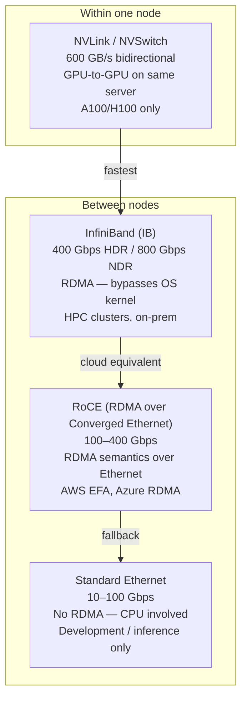
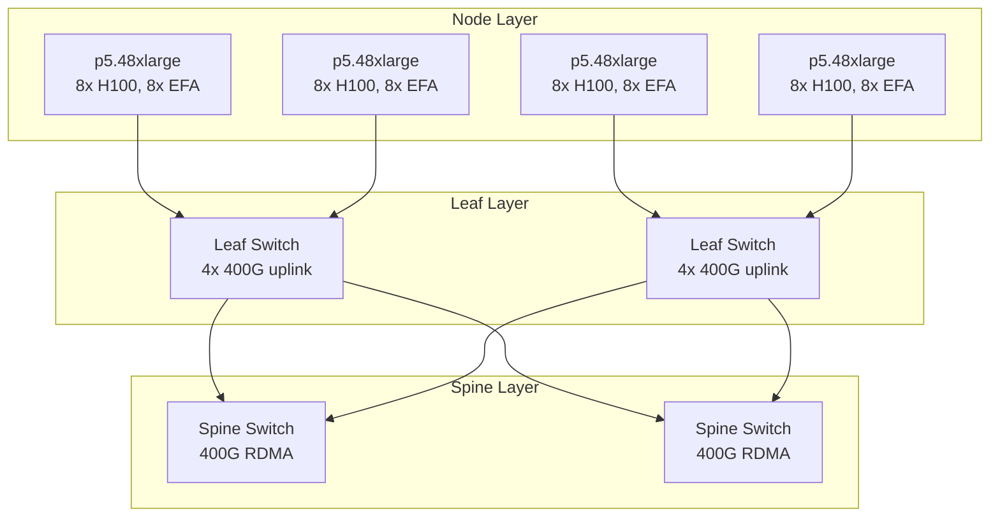

# High-Throughput AI Networking

Distributed training moves massive tensors between GPUs every forward/backward pass. Standard Ethernet bottlenecks this. AI clusters use specialized interconnects that deliver 10–100× the bandwidth of typical cloud networking.

---

## Why Standard Networking Fails for AI Training

A single AllReduce operation during training (synchronizing gradients across all GPUs) for a 70B model transfers ~140GB of data. At 10 Gbps Ethernet: 112 seconds per step. At 400 Gbps InfiniBand: 2.8 seconds per step.

```
Training throughput bottleneck:
  Compute time per step: 5s
  Network sync (AllReduce) at 10 Gbps: 112s   ← 95% time wasted on network
  Network sync (AllReduce) at 400 Gbps: 2.8s  ← 36% overhead (acceptable)
```

---

## Interconnect Technologies



### NVLink / NVSwitch (intra-node)

- **NVLink:** Direct GPU-to-GPU connection, bypassing PCIe. 600 GB/s aggregate on H100.
- **NVSwitch:** All-to-all NVLink fabric within one DGX node. 8 GPUs act as one logical device.
- Used automatically by NCCL when topology is detected — no configuration needed.

### InfiniBand (inter-node, on-prem)

- **RDMA (Remote Direct Memory Access):** GPU memory transferred directly to remote GPU memory — CPU never involved, no kernel copy.
- Latency: ~1 microsecond vs ~50 microseconds for TCP.
- Standard in HPC clusters (DGX SuperPOD, Cray, IBM).

### RoCE / AWS EFA (inter-node, cloud)

- **EFA (Elastic Fabric Adapter):** AWS's custom RDMA-capable network interface. Available on P4d (A100), P5 (H100) instances.
- Provides InfiniBand-like performance over Ethernet fabric.
- Required for multi-node distributed training on AWS.

---

## AWS EFA Setup on EKS

```bash
# EFA-enabled instance types
# p4d.24xlarge  → 4x A100, 4x 100 Gbps EFA
# p5.48xlarge   → 8x H100, 32x 100 Gbps EFA

# Install AWS EFA driver on GPU nodes (via user data or DaemonSet)
# EFA plugin exposes vpc.amazonaws.com/efa as a K8s resource
```

```yaml
# Pod requesting EFA interfaces
apiVersion: v1
kind: Pod
spec:
  containers:
  - name: training
    image: nvcr.io/nvidia/pytorch:24.01-py3
    resources:
      limits:
        nvidia.com/gpu: "8"
        vpc.amazonaws.com/efa: "4"    # request 4 EFA interfaces
    env:
    - name: NCCL_SOCKET_IFNAME
      value: "eth"                    # use EFA for NCCL AllReduce
    - name: FI_PROVIDER
      value: "efa"                    # use EFA provider for libfabric
    - name: NCCL_DEBUG
      value: "INFO"
```

```yaml
# Node group for EFA training
# Must use placement group (same rack = lower latency)
apiVersion: eksctl.io/v1alpha5
kind: ClusterConfig
managedNodeGroups:
- name: gpu-training
  instanceType: p4d.24xlarge
  minSize: 0
  maxSize: 8
  availabilityZones: ["us-east-1a"]   # single AZ for placement group
  placementGroup:
    enabled: true                      # ensures nodes are physically close
```

---

## NCCL — NVIDIA Collective Communications Library

NCCL handles the AllReduce, AllGather, Broadcast operations across GPUs. It automatically selects the fastest transport (NVLink → EFA → Ethernet).

```bash
# Key NCCL environment variables
NCCL_SOCKET_IFNAME=eth0        # which network interface to use
NCCL_IB_DISABLE=0              # enable InfiniBand (0=yes, 1=no)
NCCL_DEBUG=INFO                # verbose logging for debugging
NCCL_NET_GDR_LEVEL=2           # GPU Direct RDMA level (bypass host memory)
NCCL_TOPO_DUMP_FILE=/tmp/nccl  # dump detected topology for debugging

# Test NCCL bandwidth between nodes
kubectl exec -it training-pod -- nccl-tests/build/all_reduce_perf \
  -b 8 -e 256M -f 2 -g 8       # sweep from 8B to 256MB, 8 GPUs
```

NCCL topology detection output shows which GPUs are connected via NVLink vs PCIe vs network.

---

## Cilium for AI Cluster Networking

For inference clusters (not training), Cilium's eBPF-based networking reduces per-packet CPU overhead — critical when serving 10K+ concurrent LLM requests.

```bash
# Install Cilium with bandwidth manager for AI inference
helm install cilium cilium/cilium \
  --set bandwidthManager.enabled=true \     # BBR congestion control
  --set bandwidthManager.bbr=true \         # better throughput than CUBIC
  --set kubeProxyReplacement=true \         # eliminate iptables overhead
  --set loadBalancer.algorithm=maglev       # consistent hashing for session affinity
```

**Why Cilium matters for inference:**
- 0 iptables rules → no rule-chain traversal per packet
- Socket-level load balancing → direct pod-to-pod without DNAT
- Network policies with L7 awareness → block by HTTP path without sidecar

---

## Network Topology for AI Clusters



**Fat-tree / CLOS topology** ensures any-to-any communication at line rate — no oversubscription. Critical for AllReduce where every node communicates with every other node simultaneously.

---

## Quick Reference: Which Interconnect for What

| Scenario | Recommended | Why |
|----------|-------------|-----|
| Single-node training (≤8 GPUs) | NVLink (automatic) | 600 GB/s intra-node, no config |
| Multi-node training on AWS | EFA (p4d/p5 instances) + NCCL | RDMA-like performance on cloud |
| Multi-node training on-prem | InfiniBand HDR/NDR | Lowest latency, highest bandwidth |
| Online LLM inference at scale | Cilium + standard Ethernet | Throughput matters, not RDMA |
| Development / single GPU | Standard VPC networking | No special setup needed |
