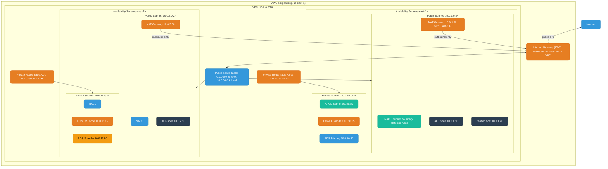
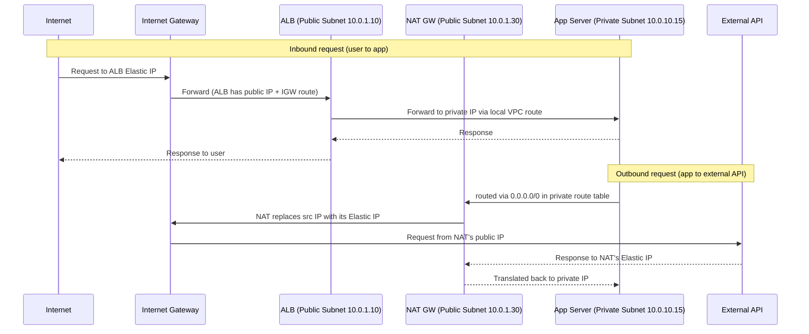
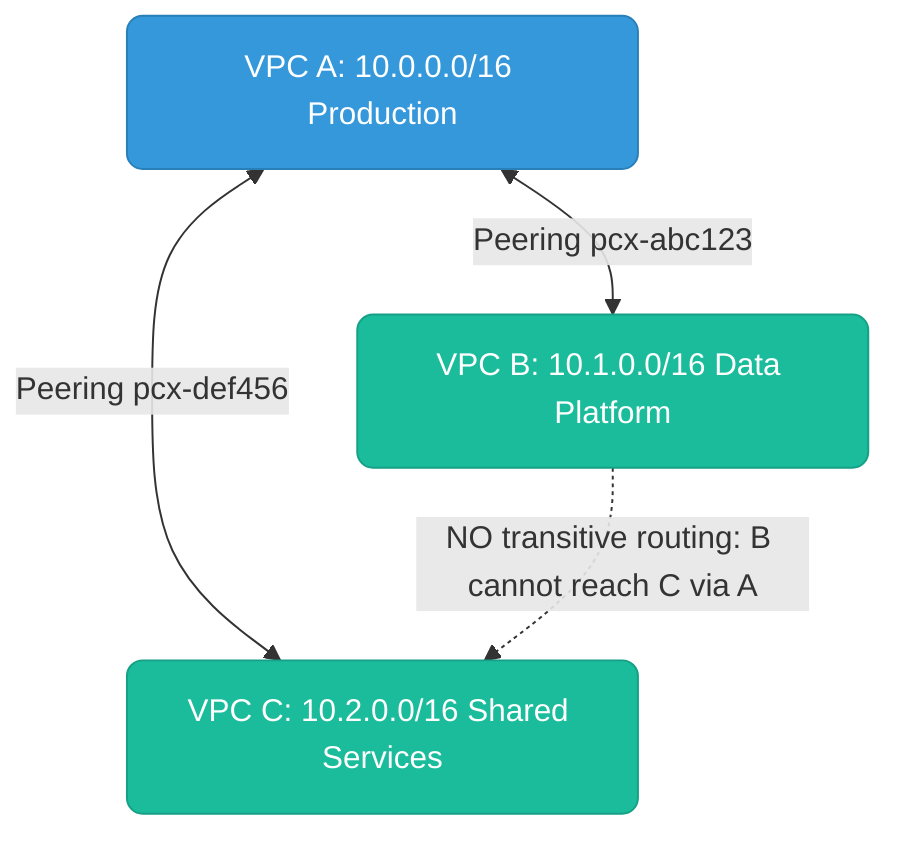
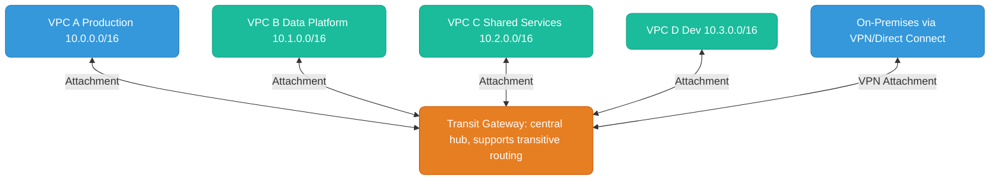

# AWS Networking

---

## VPC Architecture

A **VPC (Virtual Private Cloud)** is your private, logically isolated network inside AWS. Everything lives inside a VPC — EC2 instances, RDS databases, EKS worker nodes, Lambda functions (in VPC mode).



---

## Public vs Private Subnets

The distinction between public and private is **entirely determined by the route table** associated with the subnet — specifically whether a route for `0.0.0.0/0` points to an **Internet Gateway** or a **NAT Gateway**.

### What Makes a Subnet Public

A subnet is public when:
1. Its route table has a route `0.0.0.0/0 → <internet-gateway-id>`
2. Resources in it have a **public IPv4 address** (or Elastic IP) assigned

Both conditions are required. A route to IGW without a public IP won't give internet access; a public IP without the route also won't.

```
Public Route Table:
  Destination     Target
  10.0.0.0/16     local        ← VPC-internal traffic stays local
  0.0.0.0/0       igw-abc123   ← everything else → internet
```

**What lives in public subnets:** Load balancers (ALB/NLB), NAT Gateways, Bastion/jump hosts.

### What Makes a Subnet Private

A subnet is private when its route table routes `0.0.0.0/0` to a **NAT Gateway** instead of the IGW. Private resources can initiate outbound connections via NAT, but nothing on the internet can initiate a connection TO them.

```
Private Route Table (AZ-a):
  Destination     Target
  10.0.0.0/16     local
  0.0.0.0/0       nat-xyz789   ← outbound only, via NAT in public subnet
```

**What lives in private subnets:** EC2/EKS worker nodes, RDS databases, ElastiCache, internal services.

### Traffic Flow Comparison



Key insight: **The app server is never directly reachable from the internet**. Inbound goes through the ALB. Outbound is NAT'd — the external service sees the NAT Gateway's Elastic IP, not the app's private IP.

---

## Security Groups vs NACLs

These are the two firewall layers in AWS. They operate at different levels and have fundamentally different behavior.

### Security Groups (SGs)

Attached to an **ENI (Elastic Network Interface)** — operates at the **resource level inside the VPC**.

**Security Groups are STATEFUL.**

Stateful means: if you allow inbound traffic on port 443, the **return traffic (response) is automatically allowed** without an explicit outbound rule. The SG tracks the TCP connection in a state table. Reply packets for an established connection are always permitted, regardless of outbound rules.

**SG Rule Characteristics:**
- **Allow-only** — there is no explicit deny. Anything not matched is implicitly denied.
- Rules reference other SGs by ID: `allow inbound TCP 5432 from sg-app-servers` — means any ENI with that SG in the same VPC.
- Evaluated as a **union** — if any rule allows, it's allowed.

```
Security Group: sg-app-server
  Inbound:
    TCP 8080   from  sg-alb         (only ALB can reach app)
    TCP 5432   from  sg-app-server  (inter-pod communication)
  Outbound:
    TCP 5432   to    sg-rds         (app → RDS)
    TCP 443    to    0.0.0.0/0      (app → external HTTPS)
    (return traffic: automatically allowed — stateful)
```

### NACLs (Network Access Control Lists)

Attached to a **subnet** — filters all traffic crossing the **subnet boundary**.

**NACLs are STATELESS.**

Stateless means: **every packet is evaluated independently** in both directions. No connection tracking. If you allow inbound TCP 443, you must ALSO explicitly allow the outbound ephemeral ports (1024-65535) for the return traffic. If you forget, the SYN-ACK can't leave your subnet and TCP connections fail silently.

**NACL Rule Characteristics:**
- Rule number (1–32766) — lower = evaluated first, first match wins.
- Rules can **allow or deny** — you can block specific IPs before a broader allow.
- Final implicit `* DENY ALL` that cannot be removed.

```
NACL: nacl-private-subnet
  Inbound:
    100  ALLOW  TCP  10.0.1.0/24   port 8080       (from ALB public subnet)
    110  ALLOW  TCP  10.0.0.0/16   port 5432       (DB connections)
    *    DENY   ALL  0.0.0.0/0

  Outbound:
    100  ALLOW  TCP  10.0.1.0/24   ports 1024-65535  (ephemeral return to ALB — MUST have this)
    110  ALLOW  TCP  10.0.1.30/32  port 443           (to NAT GW)
    *    DENY   ALL  0.0.0.0/0
```

### Head-to-Head Comparison

| Property | Security Group | NACL |
|----------|---------------|------|
| **Operates at** | ENI / instance level | Subnet boundary |
| **Stateful / Stateless** | **Stateful** — return traffic auto-allowed | **Stateless** — must allow both directions explicitly |
| **Allow / Deny rules** | Allow only (implicit deny) | Allow AND explicit deny |
| **Rule evaluation** | All rules, union of allows | Ordered by rule number, first match wins |
| **Scope** | Specific ENIs | ALL traffic crossing the subnet |
| **Default (new VPC)** | No inbound, all outbound | All traffic allowed |
| **Rule limits** | 60 inbound + 60 outbound | 20 inbound + 20 outbound |
| **Reference other SGs** | Yes | No — CIDR only |
| **Typical use** | Fine-grained service-to-service | Broad subnet defense, block IP ranges |

### Where They Sit in the Network Path


Response travels the same path in reverse. SGs auto-allow the return; NACLs require explicit outbound rules for ephemeral ports.

**In practice:** NACLs are last-line-of-defense for blocking entire IP ranges at subnet level (useful in PCI-DSS/HIPAA). Security Groups are the primary day-to-day firewall for service-to-service rules. Most teams leave NACLs as "allow all" and do real access control in SGs.

---

## NAT Gateway vs Internet Gateway

| | Internet Gateway (IGW) | NAT Gateway |
|---|---|---|
| **Direction** | Bidirectional (inbound + outbound) | Outbound only |
| **Attached to** | VPC | Subnet (must be public) |
| **Who uses it** | Public subnet resources | Private subnet resources |
| **IP translation** | None — passes through | Translates private IP to NAT's Elastic IP |
| **HA** | Fully managed, no SPOF | Single AZ — deploy one per AZ |
| **Cost** | Free | ~$0.045/hr + data processing |

**NAT Gateway AZ-locality:** Always deploy one NAT Gateway per AZ and route each AZ's private subnet to its local NAT GW. Cross-AZ traffic incurs ~$0.01/GB data transfer charges.

**Cost gotcha — NAT Gateway for AWS service traffic:**
NAT Gateway charges ~$0.045/hr + ~$0.045/GB processed. For heavy traffic to S3, ECR, or DynamoDB routed through NAT, costs compound fast.

**Fix: VPC Endpoints** bypass NAT entirely — traffic stays on the AWS backbone:

| Endpoint Type | Services | Cost | Route table change? |
|--------------|----------|------|---------------------|
| **Gateway Endpoint** | S3, DynamoDB | **Free** | Yes — adds prefix list route |
| **Interface Endpoint** | ECR, Secrets Manager, SSM, SQS, etc. | ~$0.01/hr per AZ + data | No — uses private DNS |

```
# Route table with S3 Gateway Endpoint (replaces NAT for S3 traffic):
10.0.0.0/16    local
pl-68a54001    vpce-s3-xxxx   ← S3 prefix list → stays on AWS backbone (free)
0.0.0.0/0      nat-xyz789     ← everything else still goes through NAT
```

For EKS clusters pulling images from ECR or writing to S3 — add VPC endpoints first before diagnosing high NAT costs.

---

## Route Tables

Every subnet is associated with one route table. Routes are evaluated **most specific first** (longest prefix match).

```
Packet to 10.0.5.20:
  10.0.0.0/16  → local          (/16 matches)
  10.0.5.0/24  → vpc-endpoint   (/24 MORE specific → wins)
  0.0.0.0/0    → igw-abc123

Result: routed to vpc-endpoint
```

**VPC Endpoints** in route tables keep traffic to S3/DynamoDB inside AWS's network (free, faster, no NAT GW needed):
```
10.0.0.0/16    local
pl-68a54001    vpce-s3-xxxx   ← S3 prefix list to VPC endpoint
0.0.0.0/0      nat-xyz789
```

---

## VPC Peering vs Transit Gateway

### VPC Peering

Direct 1:1 network connection between two VPCs over AWS backbone.



**Key limitation: No transitive routing.** B cannot reach C through A — each pair needs its own peering. N VPCs need N*(N-1)/2 connections.

### Transit Gateway (TGW)

Managed regional hub-and-spoke router. All VPCs attach to TGW; TGW routes between them with full transitive routing support.



Each VPC's route table only needs: `0.0.0.0/0 → tgw-abc123`. TGW route tables isolate environments (prod from dev).

| | VPC Peering | Transit Gateway |
|--|------------|----------------|
| Topology | Point-to-point | Hub-and-spoke |
| Transitive routing | No | Yes |
| Scalability | ~125 peers per VPC | Thousands of attachments |
| Cross-region | Yes (inter-region peering) | Yes (TGW peering) |
| Cost | No hourly fee, data transfer only | $0.05/hr per attachment + $0.02/GB |
| Best for | Simple, few VPCs | Enterprise, many VPCs, on-prem hybrid |

**Rule of thumb:** 2 VPCs → use peering (free, lower latency). 3+ VPCs, cross-region, or on-prem hybrid → use Transit Gateway (centralized, transitive, worth the cost).
