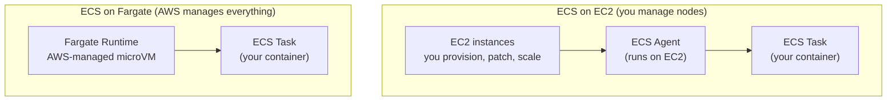
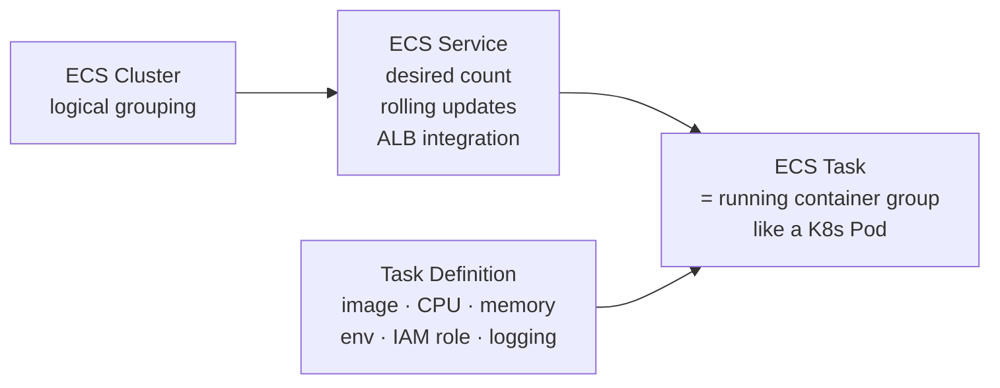
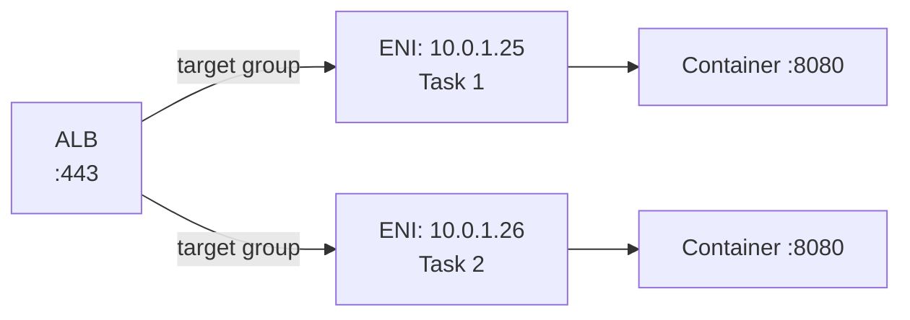
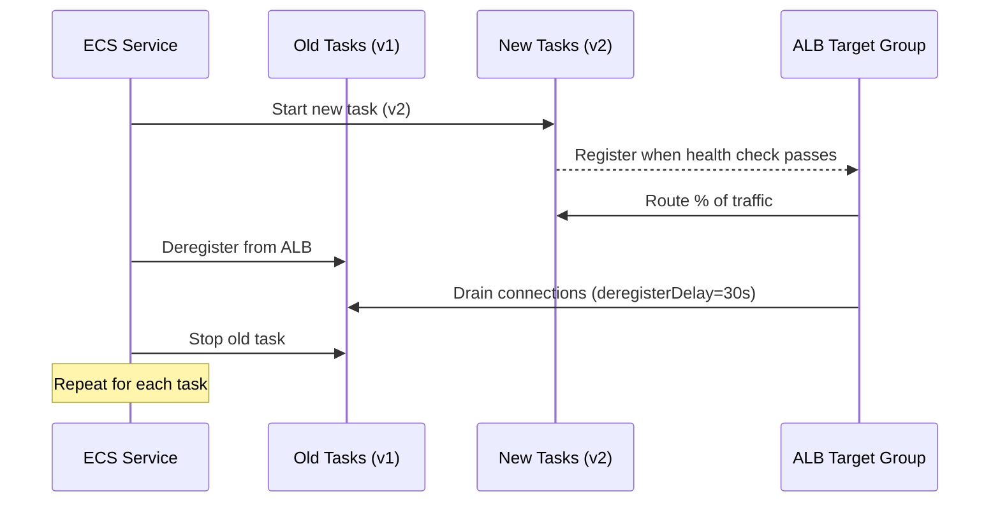
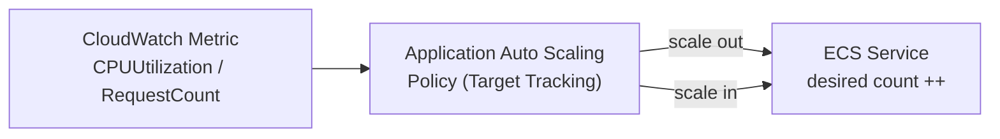

# ECS Fargate — Where, How, and Internals

## What is ECS Fargate?

ECS (Elastic Container Service) is AWS's container orchestrator. Fargate is its **serverless compute engine** — you define the container, AWS manages the underlying EC2 instance. You never SSH into a node.



**Fargate isolation:** each Fargate task runs in its own **Firecracker microVM** — a lightweight KVM-based VM (~125ms boot). This gives hardware-level isolation (unlike shared-kernel containers on EC2).

---

## Core Concepts



| Concept | K8s equivalent | Description |
|---------|---------------|-------------|
| Task Definition | Pod spec | Blueprint: image, CPU, memory, env, ports, IAM role |
| Task | Pod | Running instance of a Task Definition |
| Service | Deployment | Maintains desired task count, handles rolling updates |
| Cluster | Namespace/cluster | Logical grouping of services |

---

## Task Definition

```json
{
  "family": "api-service",
  "networkMode": "awsvpc",
  "requiresCompatibilities": ["FARGATE"],
  "cpu": "512",
  "memory": "1024",
  "executionRoleArn": "arn:aws:iam::123:role/ecsTaskExecutionRole",
  "taskRoleArn": "arn:aws:iam::123:role/ecsTaskRole",
  "containerDefinitions": [{
    "name": "api",
    "image": "123456.dkr.ecr.us-east-1.amazonaws.com/api:v1.2",
    "portMappings": [{"containerPort": 8080, "protocol": "tcp"}],
    "environment": [
      {"name": "ENV", "value": "production"}
    ],
    "secrets": [
      {"name": "DB_PASSWORD", "valueFrom": "arn:aws:secretsmanager:us-east-1:123:secret:db-pass"}
    ],
    "logConfiguration": {
      "logDriver": "awslogs",
      "options": {
        "awslogs-group": "/ecs/api-service",
        "awslogs-region": "us-east-1",
        "awslogs-stream-prefix": "ecs"
      }
    },
    "healthCheck": {
      "command": ["CMD-SHELL", "curl -f http://localhost:8080/health || exit 1"],
      "interval": 30,
      "timeout": 5,
      "retries": 3
    }
  }]
}
```

**Two IAM roles:**
- `executionRole` — ECS agent needs this to pull ECR image, push logs to CloudWatch
- `taskRole` — your application code uses this to call AWS APIs (S3, DynamoDB, etc.)

---

## Networking: awsvpc Mode

Fargate always uses `awsvpc` network mode. Each task gets its **own ENI and private IP** — identical to an EC2 instance from the VPC's perspective.



Security groups attach directly to the task ENI — not to a node. This means per-task security group rules, same as EC2.

---

## ECS Service with ALB

```yaml
# Terraform: ECS Service with ALB
resource "aws_ecs_service" "api" {
  name            = "api"
  cluster         = aws_ecs_cluster.main.id
  task_definition = aws_ecs_task_definition.api.arn
  desired_count   = 3
  launch_type     = "FARGATE"

  network_configuration {
    subnets          = var.private_subnet_ids
    security_groups  = [aws_security_group.task.id]
    assign_public_ip = false   # private subnets, reach internet via NAT GW
  }

  load_balancer {
    target_group_arn = aws_lb_target_group.api.arn
    container_name   = "api"
    container_port   = 8080
  }

  deployment_controller {
    type = "ECS"   # rolling update. Use CODE_DEPLOY for blue/green
  }
}
```

---

## Rolling Update / Deployment



Key config:
- `minimumHealthyPercent: 100` — never go below desired count during deploy (needs extra capacity)
- `maximumPercent: 200` — can run up to 2× desired count during deploy
- `deregistrationDelay` on target group — ALB waits N seconds to drain in-flight requests

---

## ECS Service Auto Scaling



```bash
# Target tracking: keep average CPU at 70%
aws application-autoscaling put-scaling-policy \
  --service-namespace ecs \
  --resource-id service/my-cluster/api \
  --scalable-dimension ecs:service:DesiredCount \
  --policy-type TargetTrackingScaling \
  --target-tracking-scaling-policy-configuration '{
    "TargetValue": 70.0,
    "PredefinedMetricSpecification": {
      "PredefinedMetricType": "ECSServiceAverageCPUUtilization"
    },
    "ScaleInCooldown": 300,
    "ScaleOutCooldown": 60
  }'
```

---

## Debugging Fargate Tasks

```bash
# List running tasks
aws ecs list-tasks --cluster my-cluster --service-name api

# Describe a task (get IP, status, stopped reason)
aws ecs describe-tasks --cluster my-cluster --tasks <task-arn>
# Look for: lastStatus, stoppedReason, containers[].exitCode

# Logs (CloudWatch)
aws logs tail /ecs/api-service --follow

# ECS Exec (SSM-based shell into running task — no SSH needed)
aws ecs execute-command \
  --cluster my-cluster \
  --task <task-arn> \
  --container api \
  --interactive \
  --command "/bin/sh"
# Requires: SSM agent in image + executionRole has ssmmessages permissions

# Common stopped reasons
# "Essential container exited"  → check container exit code
# "CannotPullContainerError"    → ECR permissions or network issue
# "OutOfMemoryError"            → increase memory in task definition
```

---

## ECS vs EKS — When to Use

| Factor | ECS Fargate | EKS |
|--------|------------|-----|
| Team K8s expertise | Not needed | Required |
| Operational overhead | Minimal (no nodes) | Higher (node groups, upgrades) |
| Ecosystem | AWS-native | Full K8s ecosystem |
| Custom scheduling | No | Yes |
| DaemonSets | No (Fargate) | Yes (EC2 nodes) |
| Cost at small scale | Lower (no control plane fee) | +$73/month control plane |
| Cost at large scale | Higher per vCPU than EC2 | EC2 Spot can be 90% cheaper |
| Best for | Small-medium teams, AWS-only, quick start | Platform teams, complex microservices |
