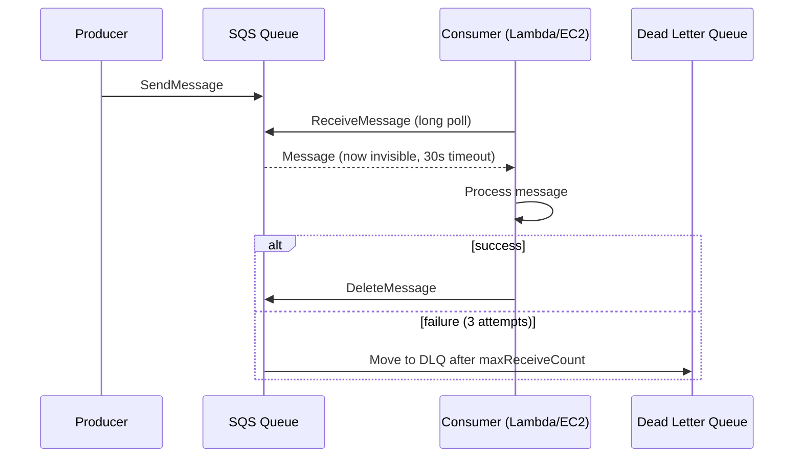
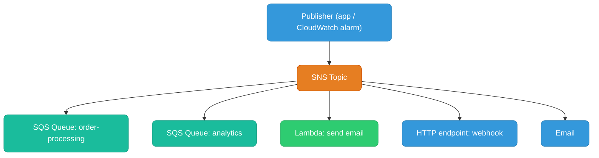
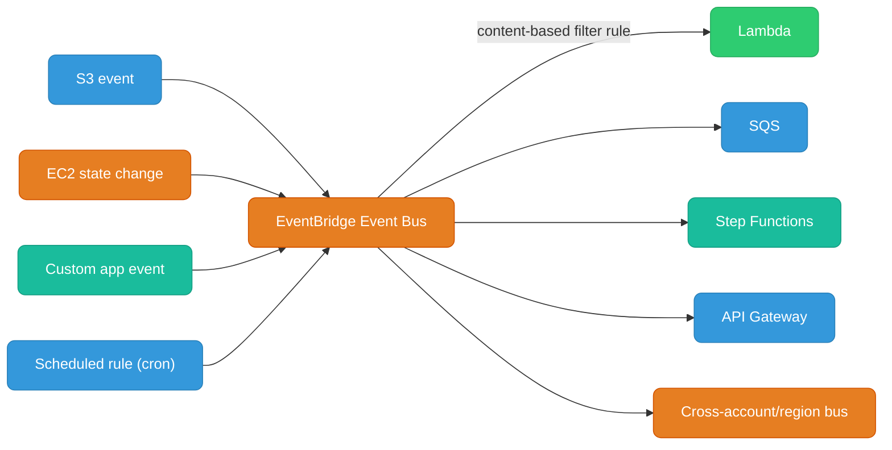
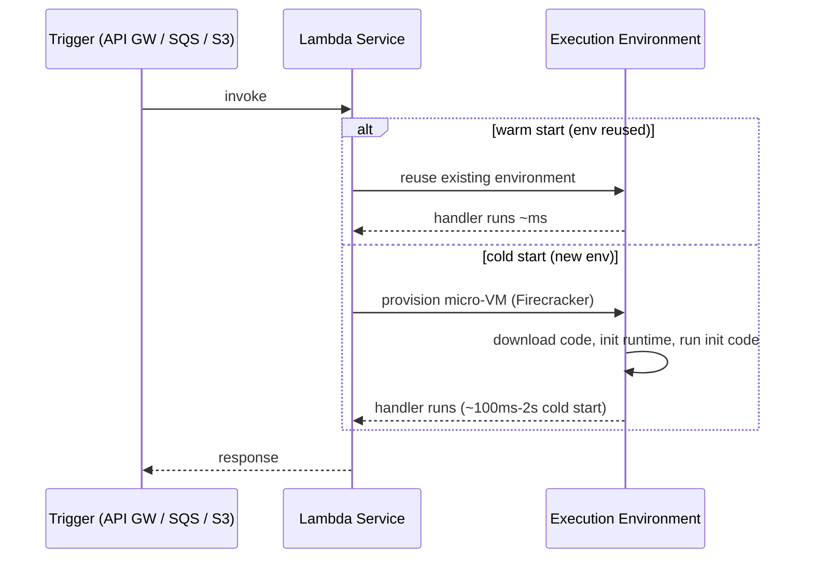
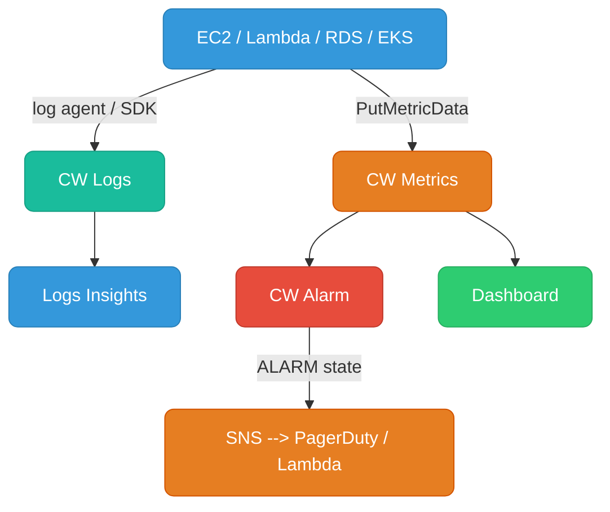
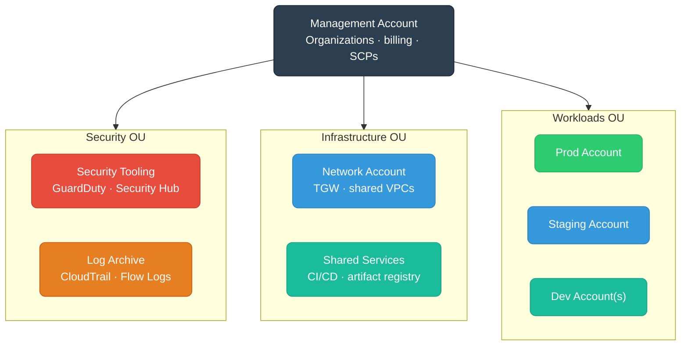
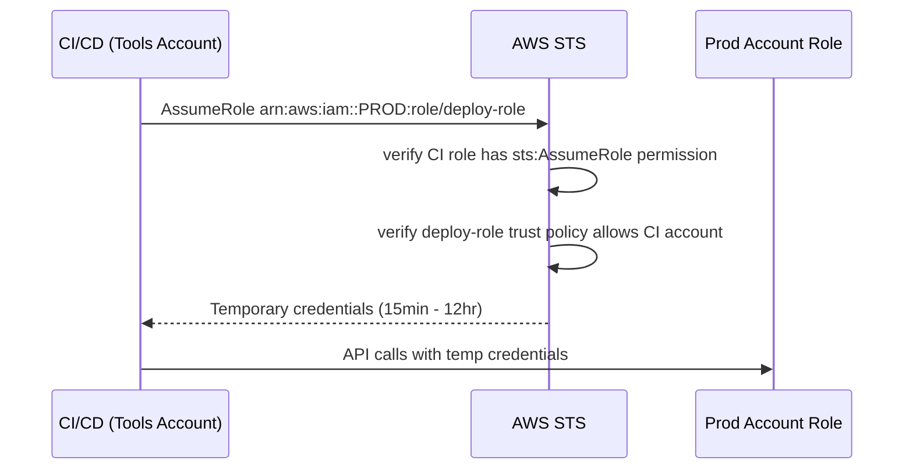

# AWS Messaging, Serverless & Observability

SQS, SNS, EventBridge, Lambda, CloudWatch, and multi-account patterns.

---

## SQS (Simple Queue Service)

Managed message queue — decouples producers from consumers. Messages are pulled by consumers.

### Standard vs FIFO

| | Standard Queue | FIFO Queue |
|--|---------------|-----------|
| **Ordering** | Best-effort (not guaranteed) | Strict FIFO per message group |
| **Delivery** | At-least-once (duplicates possible) | Exactly-once processing |
| **Throughput** | Unlimited | 300 msg/s (3000 with batching) |
| **Use case** | High-throughput, order doesn't matter | Financial transactions, order processing |
| **Deduplication** | No (handle in consumer) | Content-based or deduplication ID |

### Key Properties

**Visibility timeout:** When a consumer receives a message, it becomes invisible to other consumers for the timeout duration (default 30s). If not deleted before timeout expires, message re-appears. Set timeout > max processing time.

**Dead Letter Queue (DLQ):** After `maxReceiveCount` failed deliveries, move to DLQ for inspection. Essential for debugging poison-pill messages.



**Long polling:** `WaitTimeSeconds=20` — consumer waits up to 20s for a message instead of returning empty immediately. Reduces API calls and cost by ~95%.

### Lambda + SQS (Event Source Mapping)

Lambda polls SQS automatically (you don't write polling code). Lambda scales based on queue depth — up to 1000 concurrent Lambda invocations per queue.

```
Queue depth: 1000 msgs → Lambda scales to process in parallel batches
Batch size: 1-10000 messages per invocation
```

If Lambda throws, batch goes back to queue → retried → eventually hits DLQ.

---

## SNS (Simple Notification Service)

Managed pub/sub — one message fans out to many subscribers. Push model (vs SQS pull).



**SNS + SQS fan-out pattern:** SNS topic → multiple SQS queues. Each queue has its own consumer processing the same event independently. This is the standard pattern for event-driven architectures.

**Message filtering:** Subscribers can filter messages by attributes, so each subscriber only receives relevant events:

```json
// SQS subscription filter: only receive order events for region "us-east"
{
  "region": ["us-east"],
  "eventType": ["order.placed", "order.cancelled"]
}
```

---

## EventBridge

Serverless event bus — more powerful than SNS for routing. Native integration with 200+ AWS services as sources.



### SNS vs SQS vs EventBridge

| | SQS | SNS | EventBridge |
|--|-----|-----|------------|
| **Model** | Queue (pull) | Pub/Sub (push) | Event bus (push) |
| **Ordering** | FIFO option | No | No |
| **Persistence** | Yes (up to 14 days) | No (fire and forget) | No |
| **Filtering** | No | Attribute filter | Rich content-based filter |
| **Sources** | Application | Application | 200+ AWS services + custom |
| **Replay** | No (archive manually) | No | Yes (archive + replay) |
| **Cross-account** | With resource policy | Yes | Yes (event bus) |
| **Use case** | Work queues, job buffering | Fan-out notifications | Event-driven automation, service integration |

**Rule of thumb:**
- Need to buffer / retry / process asynchronously → **SQS**
- Need fan-out to multiple consumers → **SNS** (or SNS→SQS)
- Reacting to AWS service events or complex routing → **EventBridge**

---

## Lambda

Serverless compute — run code in response to events, pay per 100ms of execution.

### Execution Model



**Cold start optimization:**
- Use Provisioned Concurrency (keeps N envs warm) for latency-sensitive paths
- Minimize package size (smaller = faster cold start)
- Avoid VPC attachment unless necessary (VPC adds ~1-2s historically, now much faster with hyperplane)
- Move initialization outside the handler function (DB connections, SDK clients)

```go
// WRONG: new DB connection every invocation
func Handler(ctx context.Context, event events.APIGatewayProxyRequest) {
    db := sql.Open("postgres", os.Getenv("DB_URL"))  // cold start every time
    defer db.Close()
    ...
}

// RIGHT: initialize once, reuse across warm invocations
var db *sql.DB
func init() {
    db, _ = sql.Open("postgres", os.Getenv("DB_URL"))
}
func Handler(ctx context.Context, event events.APIGatewayProxyRequest) {
    // db is reused across warm invocations
}
```

### Lambda Concurrency

```
Account limit: 1000 concurrent (soft, can raise)
Reserved concurrency: guarantee N for a function, cap its max
Provisioned concurrency: pre-warmed environments (avoids cold start)

Burst limit: 3000 initial burst, then +500/minute
```

**Throttling:** When concurrency limit hit, Lambda returns 429. SQS event source mapping retries; API Gateway returns 429 to caller.

### Lambda Destinations

On async invocations, route successes/failures to SQS, SNS, EventBridge, or another Lambda:

```
Lambda async invoke
  → success → SNS topic: order-success
  → failure → SQS DLQ: order-failures
```

Cleaner than wrapping everything in try/catch for async flows.

### Lambda in VPC

Lambda can access private resources (RDS, ElastiCache) inside a VPC via ENI injection:

```
Lambda function (invocation)
  → attaches to VPC subnet via Hyperplane ENI
  → private IP in your subnet
  → can reach RDS on 10.0.10.50:5432
  → outbound internet: via NAT Gateway (needs private subnet + NAT)
```

**Gotcha:** Lambda in VPC with no VPC endpoint for S3/DynamoDB will route through NAT GW — add VPC endpoints to avoid NAT costs.

---

## CloudWatch

### Metrics, Logs, Alarms



**Log groups and retention:** By default, logs never expire (expensive). Always set retention:
```bash
aws logs put-retention-policy \
  --log-group-name /aws/lambda/my-function \
  --retention-in-days 30
```

### CloudWatch Logs Insights Query

```
# Error rate in last 1 hour
fields @timestamp, @message
| filter @message like /ERROR/
| stats count(*) as errors by bin(5m)
| sort @timestamp asc
```

### Custom Metrics

```go
// Emit custom metric from application
svc := cloudwatch.NewFromConfig(cfg)
svc.PutMetricData(ctx, &cloudwatch.PutMetricDataInput{
    Namespace: aws.String("MyApp/Orders"),
    MetricData: []types.MetricDatum{{
        MetricName: aws.String("OrderProcessingTime"),
        Value:      aws.Float64(float64(duration.Milliseconds())),
        Unit:       types.StandardUnitMilliseconds,
        Dimensions: []types.Dimension{{
            Name: aws.String("Environment"), Value: aws.String("prod"),
        }},
    }},
})
```

### Container Insights (EKS)

Deploys a CloudWatch agent DaemonSet to EKS — ships pod/node CPU, memory, network, disk metrics and container logs automatically.

```bash
aws eks create-addon \
  --cluster-name my-cluster \
  --addon-name amazon-cloudwatch-observability
```

---

## Secrets Manager vs Parameter Store

| | Secrets Manager | SSM Parameter Store |
|--|----------------|-------------------|
| **Purpose** | Secrets with rotation | Config + secrets (tiered) |
| **Automatic rotation** | Yes (Lambda-based, built-in for RDS, Redshift) | No |
| **Versioning** | Yes | Yes |
| **Cost** | $0.40/secret/month + $0.05/10k API calls | Free (Standard tier), $0.05/advanced param/month |
| **Max size** | 64 KB | 4 KB (standard), 8 KB (advanced) |
| **KMS encryption** | Always encrypted | Optional (SecureString type) |
| **Cross-account** | Yes (resource policy) | No |
| **Use case** | DB passwords, API keys needing rotation | App config, feature flags, non-rotating secrets |

**In EKS:** Use External Secrets Operator or Secrets Store CSI Driver to mount Secrets Manager / Parameter Store values as Kubernetes secrets or volume files.

---

## Multi-Account Strategy

Single AWS account for everything is an anti-pattern at scale. AWS Organizations provides a hierarchy for governance.



### Service Control Policies (SCPs)

SCPs are IAM policies attached to OUs/accounts in Organizations. They **restrict the maximum permissions** any IAM entity in that account can have — even the root user.

```json
// SCP: prevent anyone from disabling GuardDuty
{
  "Statement": [{
    "Effect": "Deny",
    "Action": [
      "guardduty:DeleteDetector",
      "guardduty:DisassociateFromMasterAccount"
    ],
    "Resource": "*"
  }]
}
```

SCPs do NOT grant permissions — they only set the ceiling. An IAM policy must still exist to actually allow access.

### Cross-Account Role Assumption Pattern



The **trust policy** on the target role is the door; the **identity policy** on the caller is the key. Both must match.

---

## Cost Optimization Patterns

### Compute

| Strategy | Savings |
|----------|---------|
| **Savings Plans** (1 or 3 yr, flexible) | Up to 66% vs On-Demand |
| **Reserved Instances** (1 or 3 yr, specific type) | Up to 72% |
| **Spot Instances** (interruptible, 2-min notice) | Up to 90% |
| **Graviton (ARM)** instances | 20% better price/perf than x86 |
| **Right-sizing** (use Compute Optimizer) | 20-30% typical savings |

**EKS + Spot:** Run stateless workloads on Spot node groups with Karpenter. Karpenter selects cheapest available instance type/AZ dynamically.

### Data Transfer (biggest surprise bill)

```
Intra-AZ:       Free
Inter-AZ:       $0.01/GB each direction  ← biggest hidden cost
Internet out:   $0.09/GB (first 10 TB)
S3/DynamoDB via VPC endpoint: Free (saves NAT GW charges)
CloudFront → origin: cheaper than direct internet
```

**Minimize inter-AZ traffic:** Keep pod-to-pod communication within the same AZ using topology-aware routing in K8s (`topologySpreadConstraints`, `trafficPolicy: Local`).

### Tagging strategy for cost allocation

```
aws:createdBy: terraform
team: payments
env: prod
service: order-api
cost-center: engineering-platform
```

Use AWS Cost Explorer + tag-based cost allocation reports. Enforce tags with SCPs or AWS Config rules.
