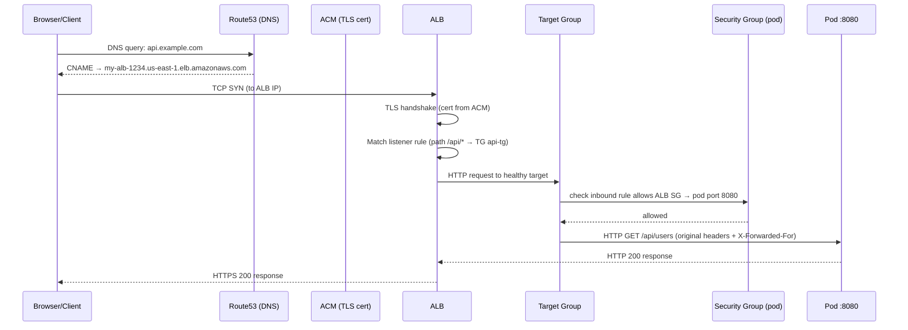
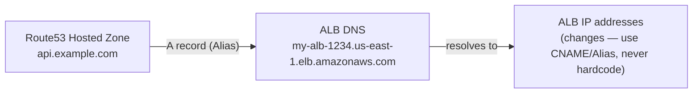
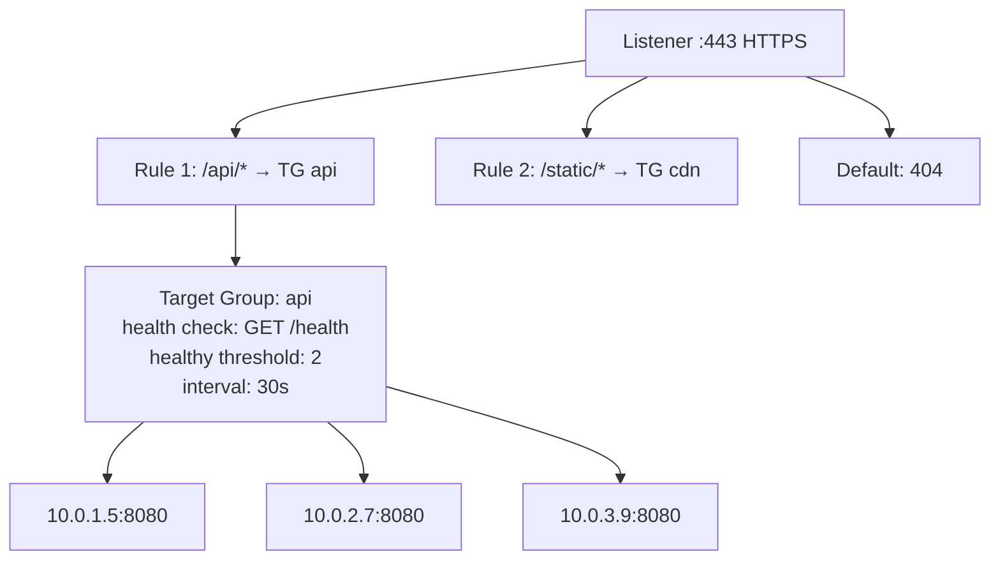
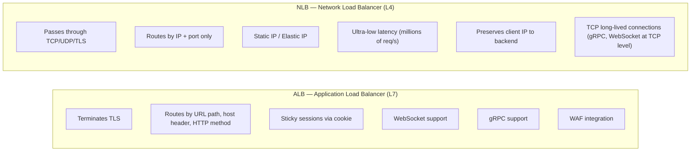
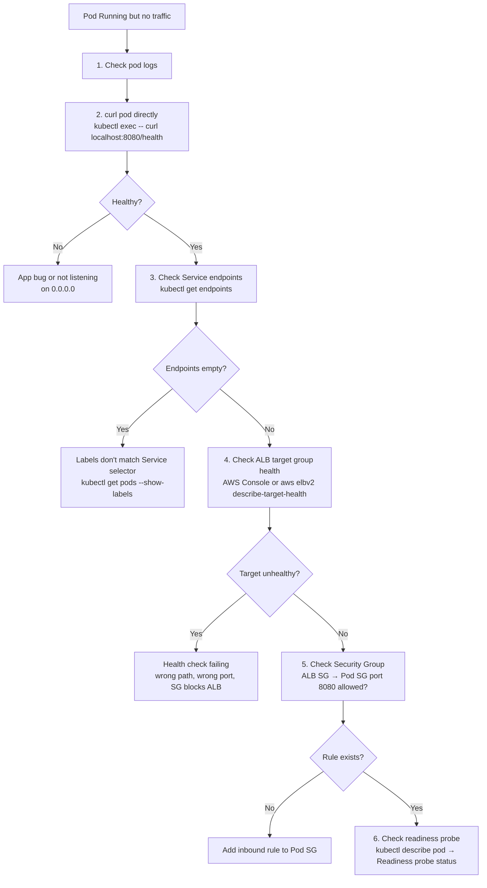

# Request Flow: Route53 → ALB → Pod

## Full Request Path



---

## Layer by Layer

### 1. Route53 — DNS



- Use **Alias record** (not CNAME) for ALB in Route53 — free, faster, works at apex domain
- ALB has multiple IPs (multi-AZ) — Route53 returns all of them, client picks one
- TTL typically 60s

### 2. ALB — Application Load Balancer (L7)



ALB terminates TLS, inspects HTTP headers, routes by path/host, and load-balances across healthy targets using round-robin (default) or least-outstanding-requests.

### 3. Target Group — Health Checks

```
Target Group health check:
  Protocol: HTTP
  Path:     /health
  Port:     traffic-port (8080)
  Healthy threshold:   2 consecutive successes
  Unhealthy threshold: 3 consecutive failures
  Timeout:             5s
  Interval:            30s

A pod is only added to the target group AFTER passing 2 health checks.
A pod is removed after failing 3 consecutive checks.
```

### 4. Security Groups

```
ALB Security Group:
  Inbound:  0.0.0.0/0 :443 (public)
  Outbound: [Pod SG] :8080

Pod Security Group (EKS VPC CNI / ECS task SG):
  Inbound:  [ALB SG] :8080   ← MUST reference ALB SG, not CIDR
  Outbound: 0.0.0.0/0
```

Referencing the ALB security group (not a CIDR) means the rule automatically follows ALB IP changes.

---

## ALB vs NLB — L7 vs L4



| Feature | ALB | NLB |
|---------|-----|-----|
| Layer | L7 (HTTP/HTTPS) | L4 (TCP/UDP/TLS) |
| Routing | Path, host, headers | IP + port only |
| TLS termination | Yes | Yes (passthrough also possible) |
| Client IP | X-Forwarded-For header | Preserved natively |
| Static IP | No (use Global Accelerator) | Yes (Elastic IP per AZ) |
| Latency | ~1ms | ~100μs |
| Use case | Web APIs, microservices, gRPC (HTTP/2) | Gaming, IoT, TCP-native protocols |

**Rule of thumb:** Use ALB for everything HTTP/HTTPS. Use NLB when you need static IPs, ultra-low latency, or TCP passthrough.

---

## Load Balancing Algorithms

### ALB: Round-Robin (default) vs Least-Outstanding-Requests

```
Round Robin:
  Request 1 → Pod 1
  Request 2 → Pod 2
  Request 3 → Pod 3
  Request 4 → Pod 1  (cycles)

Least Outstanding Requests (better for variable request duration):
  Pod 1: 5 in-flight
  Pod 2: 2 in-flight  ← ALB sends next request here
  Pod 3: 8 in-flight
```

Enable LOR:
```bash
aws elbv2 modify-target-group-attributes \
  --target-group-arn <arn> \
  --attributes Key=load_balancing.algorithm.type,Value=least_outstanding_requests
```

---

## If Pod is Not Receiving Traffic — Debug Flow



### Full Debug Command Set

```bash
# 1. Pod logs (current + previous crash)
kubectl logs <pod> -n <namespace>
kubectl logs <pod> -n <namespace> --previous

# 2. Test app directly (bypass all load balancers)
kubectl exec -it <pod> -n <namespace> -- curl -v http://localhost:8080/health

# 3. Service endpoints — is the pod in the endpoint list?
kubectl get endpoints <service> -n <namespace>
# ENDPOINTS should list pod IPs:ports
# If empty: pod labels don't match Service selector

# 4. Service selector vs pod labels
kubectl describe svc <service> -n <namespace> | grep Selector
kubectl get pods -n <namespace> --show-labels

# 5. ALB target group health (EKS/ECS)
aws elbv2 describe-target-health \
  --target-group-arn <arn> \
  --region us-east-1

# 6. Readiness probe status
kubectl describe pod <pod> -n <namespace> | grep -A 10 Readiness

# 7. Events for the pod (scheduling, probe failures, image issues)
kubectl get events -n <namespace> --field-selector involvedObject.name=<pod> \
  --sort-by='.lastTimestamp'

# 8. Port-forward directly to pod to bypass Service/ALB entirely
kubectl port-forward pod/<pod> 8080:8080 -n <namespace>
curl -v http://localhost:8080/health
```
