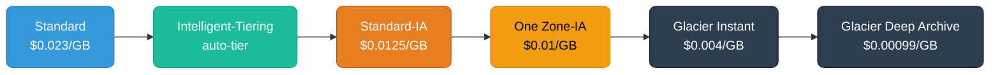
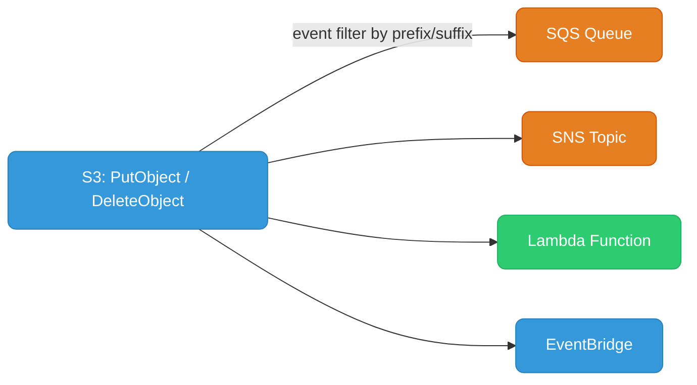
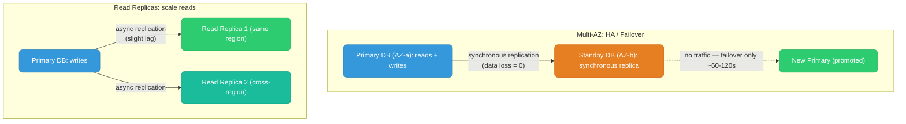
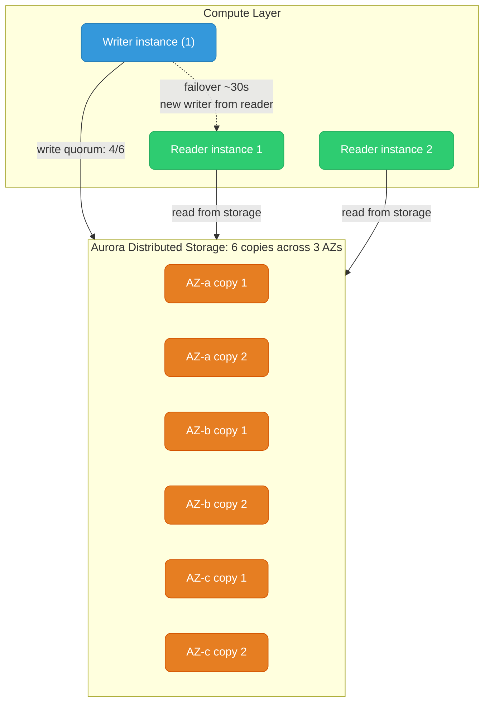
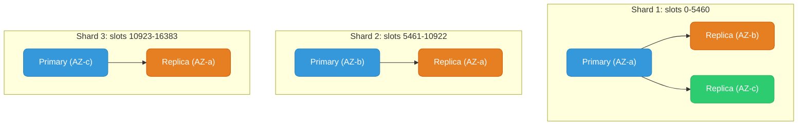
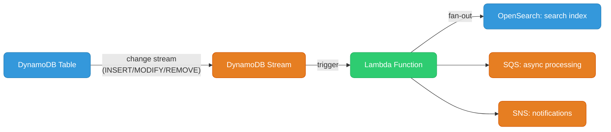

# AWS Storage & Databases

S3, RDS, Aurora, ElastiCache, DynamoDB — the data layer every backend engineer uses.

---

## S3 (Simple Storage Service)

S3 is **object storage** — flat namespace of buckets containing objects (key/value pairs). Not a filesystem; no directories, just key prefixes that look like paths.

### Storage Classes



| Class | Price/GB | Retrieval | Use |
|-------|----------|-----------|-----|
| Standard | $0.023 | ms | Frequent access |
| Intelligent-Tiering | varies | ms | Unknown patterns |
| Standard-IA | $0.0125 | ms + $0.01/GB fee | Infrequent, 30-day min |
| One Zone-IA | $0.01 | ms + fee | Reproducible data only |
| Glacier Instant | $0.004 | ms | Archive, fast retrieval |
| Glacier Deep Archive | $0.00099 | 12 hr | Cheapest, long-term |

**Lifecycle policy** automates transitions:
```json
{
  "Rules": [{
    "Status": "Enabled",
    "Transitions": [
      { "Days": 30,  "StorageClass": "STANDARD_IA" },
      { "Days": 90,  "StorageClass": "GLACIER_IR" },
      { "Days": 365, "StorageClass": "DEEP_ARCHIVE" }
    ],
    "Expiration": { "Days": 2555 }
  }]
}
```

### Versioning & Replication

**Versioning:** Once enabled on a bucket, every `PutObject` creates a new version. Delete adds a delete marker (object recoverable). Can't disable — only suspend.

**Cross-Region Replication (CRR):** Async replication to a bucket in another region. Requires versioning on both buckets. Use for: DR, latency (serve from nearest region), compliance (data residency).

```
Source: us-east-1 bucket (versioning on)
    ↓ async CRR rule
Destination: eu-west-1 bucket (versioning on)
```

**Same-Region Replication (SRR):** Same region, different account or bucket. Use for log aggregation, test/prod data copies.

### Access Control

**Priority order (most → least specific):**
1. S3 Block Public Access (account/bucket level — overrides everything)
2. Bucket Policy (resource-based, JSON)
3. ACLs (legacy, avoid for new setups — AWS recommends disabling ACLs)
4. IAM policy (identity-based)

For cross-account access: both the IAM policy on the caller AND the bucket policy must allow. One alone is insufficient.

```json
// Bucket policy: allow specific IAM role from another account
{
  "Statement": [{
    "Effect": "Allow",
    "Principal": { "AWS": "arn:aws:iam::OTHER-ACCOUNT:role/reader-role" },
    "Action": ["s3:GetObject"],
    "Resource": "arn:aws:s3:::my-bucket/*"
  }]
}
```

### Presigned URLs

Temporary access to private objects — no IAM credentials required by the recipient:

```bash
aws s3 presign s3://my-bucket/report.pdf --expires-in 3600
# Returns: https://my-bucket.s3.amazonaws.com/report.pdf?X-Amz-Signature=...
```

The URL is signed with the IAM identity's credentials. If the identity's permissions are revoked, existing presigned URLs stop working.

### S3 Event Notifications



EventBridge is the most flexible — fan-out to many targets, content filtering, cross-account delivery.

---

## RDS & Aurora

### RDS Multi-AZ vs Read Replicas

These solve different problems. They're not interchangeable.



| | Multi-AZ | Read Replica |
|--|---------|-------------|
| **Purpose** | High availability / failover | Read scalability |
| **Replication** | Synchronous | Asynchronous (lag possible) |
| **Serves traffic** | Standby serves NO traffic | Yes — reads only |
| **Failover** | Automatic (~60-120s) | Manual promotion |
| **Cross-region** | No (single region) | Yes |
| **Cost** | 2x instance cost | Additional instance cost |

You can have BOTH: Multi-AZ for HA + Read Replicas for scale. They're orthogonal.

### Aurora Architecture

Aurora is not just "managed MySQL/PostgreSQL" — it's a **storage-compute separation** architecture.



**Key properties:**
- Storage **auto-grows** in 10 GB increments up to 128 TB — no provisioning
- **6 copies** across 3 AZs — can lose an AZ and still write (only needs 4/6 for write quorum, 3/6 for read)
- Readers share the same storage — **no replication lag** on reads (reads are consistent)
- Failover is faster (~30s) because a reader is already connected to the same storage

### Aurora Serverless v2

Scales compute (ACUs — Aurora Capacity Units) instantly in fine-grained increments. Unlike v1 which had cold starts, v2 scales continuously.

```
Minimum: 0.5 ACU (1 ACU ≈ 2 GB RAM)
Maximum: 128 ACU
Scale up: within seconds on demand
Scale to zero: yes (v2 can pause)
```

Good for: dev/test environments, irregular workloads, unpredictable spikes.

### RDS Proxy

Connection pooler as a managed service — sits between your app and RDS/Aurora.

**Problem it solves:** Serverless functions (Lambda) open new DB connections per invocation. RDS can handle ~5000 connections max. 1000 concurrent Lambdas = 1000 connections, overwhelming the DB.

```
Lambda (1000 concurrent) → RDS Proxy (maintains ~50 pooled connections) → RDS
```

Also provides: IAM authentication for DB connections, automatic failover (no connection string change needed), TLS enforcement.

---

## ElastiCache

Managed in-memory caching. Two engines:

| | Redis | Memcached |
|--|-------|-----------|
| **Data structures** | Strings, hashes, lists, sets, sorted sets, streams | Strings only |
| **Persistence** | Yes (RDB snapshots + AOF) | No |
| **Replication** | Yes (primary + replicas) | No |
| **Cluster mode** | Yes (sharding across nodes) | Yes (hash-based) |
| **Pub/Sub** | Yes | No |
| **Transactions / Lua** | Yes | No |
| **Use case** | Sessions, leaderboards, rate limiting, queues | Simple KV cache, high-throughput read cache |

**Rule:** Use Redis unless you specifically need Memcached's multi-threaded simplicity or are already on Memcached.

### Redis Cluster Mode



16384 hash slots divided across shards. Key `k` maps to slot `CRC16(k) % 16384`. Client connects to any node and gets redirected.

### Cache-Aside Pattern (Lazy Loading)

```go
func getUser(id string) (*User, error) {
    // 1. Check cache
    if cached, err := redis.Get(ctx, "user:"+id).Result(); err == nil {
        return unmarshal(cached), nil
    }
    // 2. Cache miss → DB
    user, err := db.QueryUser(id)
    if err != nil { return nil, err }
    // 3. Populate cache, set TTL
    redis.Set(ctx, "user:"+id, marshal(user), 5*time.Minute)
    return user, nil
}
```

**Write-through** (update cache on every write) prevents stale reads but wastes memory caching rarely-read data. Cache-aside is more common.

---

## DynamoDB

Fully managed serverless NoSQL — key-value and document model. No servers, no connections, auto-scales.

### Data Model

Every table has a **primary key**:
- **Simple primary key:** Partition key only — each item uniquely identified by partition key
- **Composite primary key:** Partition key + Sort key — items with same PK are sorted by SK, enabling range queries

```
Table: Orders
  PK: customerId (partition key)
  SK: orderId#timestamp (sort key)

Query: all orders for customer "123", sorted by time
  KeyConditionExpression: customerId = "123" AND begins_with(SK, "order#")
```

### Read/Write Capacity

| Mode | When to use |
|------|-------------|
| **Provisioned** | Predictable traffic; set RCU/WCU; can use Auto Scaling or reserved capacity |
| **On-demand** | Unpredictable spikes; pay per request; ~6x more expensive at steady load |

**RCU/WCU:** 1 RCU = 1 strongly consistent read of 4 KB/s (or 2 eventually consistent reads). 1 WCU = 1 write of 1 KB/s.

### GSI (Global Secondary Index)

Query on non-key attributes — projects a subset of table data with a different partition key.

```
Table: Orders (PK: customerId, SK: orderId)

GSI: OrdersByStatus
  PK: status       ← now queryable
  SK: createdAt
  Projection: ALL

Query: all PENDING orders sorted by time
  → query GSI with status = "PENDING"
```

GSIs have their own RCU/WCU capacity and can diverge from the main table during heavy writes (eventual consistency).

### DynamoDB Streams + Lambda (Event-driven)



Classic CDC pattern inside AWS: changes in DynamoDB propagate to other systems via Streams + Lambda.

---

## S3 vs EBS vs EFS

| | S3 | EBS | EFS |
|--|-----|-----|-----|
| **Type** | Object storage | Block storage | Network filesystem (NFS) |
| **Access** | HTTP API, SDK | Mounted on one EC2 (Multi-Attach: up to 16) | Mounted on many EC2 simultaneously |
| **Durability** | 11 nines (3+ AZ) | Single AZ (snapshot to S3 for backup) | Multi-AZ |
| **Max size** | Unlimited | 64 TB per volume | Unlimited |
| **Latency** | ms-level | Sub-ms | Low ms |
| **Use case** | Static files, backups, data lake, artifacts | OS volumes, DB storage | Shared config, CMS, home dirs |
| **Cost** | $0.023/GB | $0.10/GB (gp3) | $0.30/GB |
