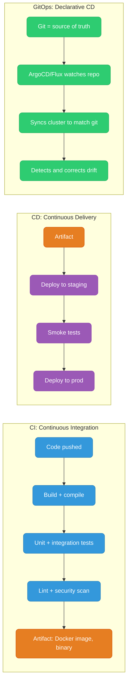
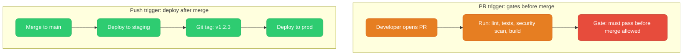
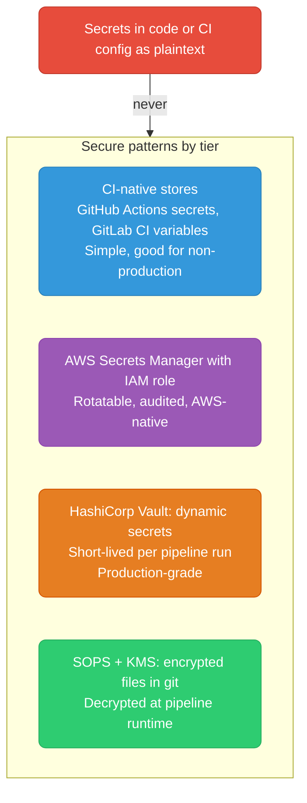
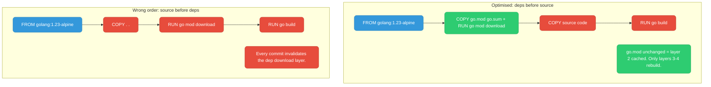
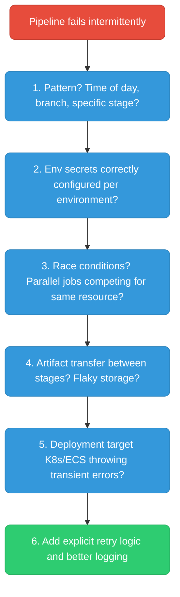

# CI/CD: Concepts & Patterns

---

## CI vs CD vs GitOps



| | CI | CD push | GitOps pull |
|--|----|---------|----|
| Trigger | Code push/PR | Pipeline pushes to env | Agent pulls from git |
| Audit | Pipeline logs | Pipeline logs | Git commits |
| Rollback | Re-run pipeline | Re-run pipeline | `git revert` + auto-sync |

---

## Pipeline Triggers



**Best practice flow:**
```
PR opened       → CI: lint + test + security scan + build
PR merged to main → CD: deploy to staging + smoke tests
Git tag v*.*.*  → CD: deploy to production (with approval gate)
```

---

## Deployment Strategies

```mermaid
graph TD
    classDef v1 fill:#3498db,stroke:#2980b9,color:#fff,rx:8
    classDef v2 fill:#2ecc71,stroke:#27ae60,color:#fff,rx:8
    classDef switch fill:#e67e22,stroke:#d35400,color:#fff,rx:8
    classDef info fill:#95a5a6,stroke:#7f8c8d,color:#fff,rx:6

    subgraph Rolling["Rolling Update: gradual replacement"]
        R1["v1: 3 pods"]:::v1 --> R2["Replace 1 pod with v2"]:::v2
        R2 --> R3["Replace next"]:::v2
        R3 --> R4["All on v2"]:::v2
        RN["Low cost. Both versions run briefly. Slower rollback."]:::info
    end

    subgraph BlueGreen["Blue-Green: instant switch"]
        BG1["Blue: v1 100% traffic"]:::v1 --> BG2["Green: v2 idle"]:::v2
        BG2 --> BG3["Switch LB to Green"]:::switch
        BG3 --> BG4["Blue kept for instant rollback"]:::v1
        BGN["Instant rollback. Doubles cost during transition."]:::info
    end

    subgraph Canary["Canary: gradual traffic shift"]
        C1["v1: 95%"]:::v1 --> C2["v2: 5% canary"]:::v2
        C2 --> C3["Monitor error rate + p99 latency"]:::switch
        C3 --> C4["Shift: 10% to 25% to 50% to 100%"]:::v2
        CN["Real user validation. Low blast radius."]:::info
    end
```



| Strategy | Rollback | Cost | Risk |
|----------|---------|------|------|
| Rolling | Slow (re-deploy) | Low | Mixed versions briefly |
| Blue-Green | Instant (flip switch) | High (double) | None |
| Canary | Fast (shift back) | Medium | Low (small blast radius) |

---

## Secrets in CI/CD



---

## Docker Layer Caching in CI



---

## Debugging Flaky Pipelines


