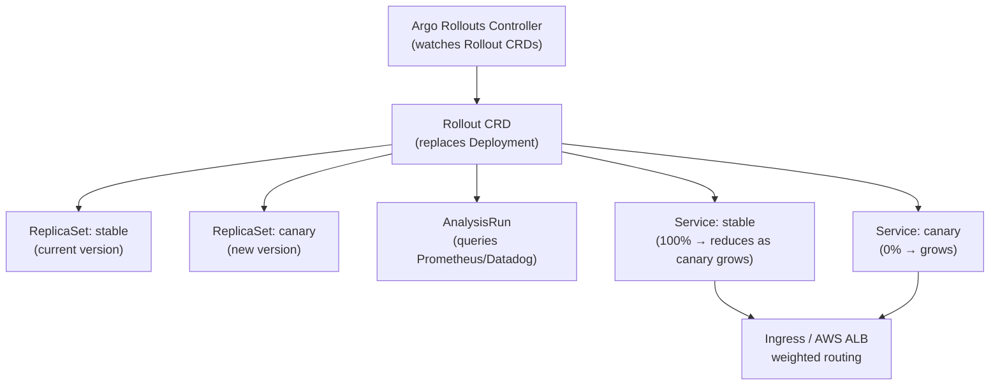
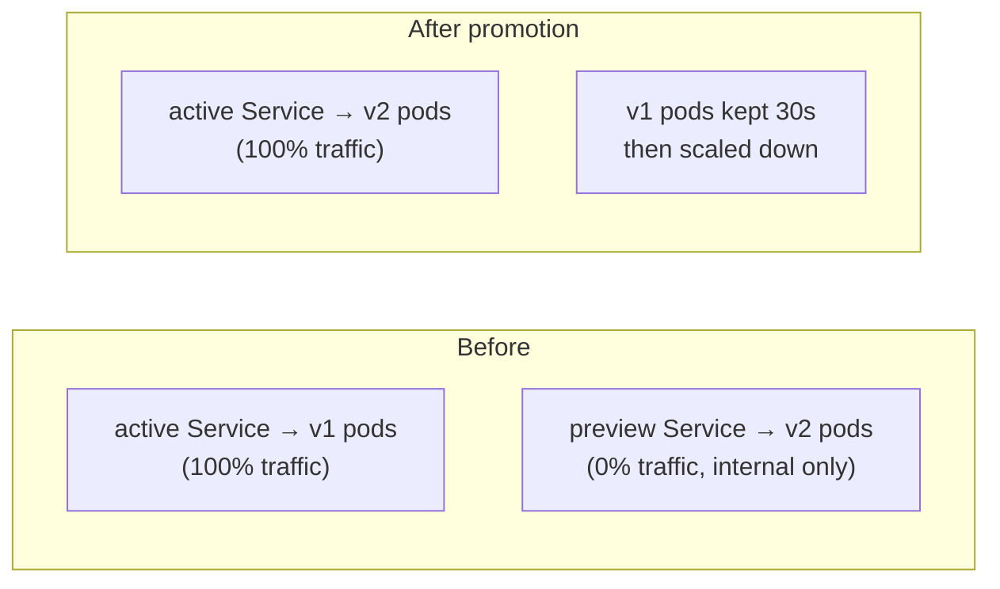

# Argo Rollouts — Progressive Delivery in Kubernetes

Argo Rollouts extends Kubernetes Deployments with canary and blue-green strategies, automated analysis, and traffic management integration.

---

## Why Not Plain Kubernetes Rolling Updates?

| | K8s RollingUpdate | Argo Rollouts |
|--|-------------------|---------------|
| Traffic control | None — replicas = traffic | Precise % split (1% → 5% → 50% → 100%) |
| Automated analysis | No | Yes — query Prometheus/Datadog, pause on errors |
| Pause/resume | No | Yes — manual gate or metric gate |
| Blue-green | No | Yes — full traffic switch |
| Rollback trigger | Manual only | Automatic on metric degradation |
| Preview URL | No | Yes — separate Service for canary |

---

## Architecture



---

## Install

```bash
kubectl create namespace argo-rollouts
kubectl apply -n argo-rollouts \
  -f https://github.com/argoproj/argo-rollouts/releases/latest/download/install.yaml

# kubectl plugin for managing rollouts
brew install argoproj/tap/kubectl-argo-rollouts
```

---

## Canary Rollout

### Basic canary

```yaml
apiVersion: argoproj.io/v1alpha1
kind: Rollout
metadata:
  name: my-app
spec:
  replicas: 10
  selector:
    matchLabels:
      app: my-app
  template:                          # same as Deployment pod template
    metadata:
      labels:
        app: my-app
    spec:
      containers:
      - name: app
        image: my-app:v2
        ports:
        - containerPort: 8080

  strategy:
    canary:
      # Canary traffic goes to this service (separate from stable)
      canaryService: my-app-canary
      stableService: my-app-stable

      steps:
      - setWeight: 5          # send 5% traffic to canary
      - pause: {duration: 5m} # wait 5 min
      - setWeight: 20
      - pause: {}             # pause indefinitely — manual promotion required
      - setWeight: 50
      - pause: {duration: 5m}
      - setWeight: 100        # full rollout
```

### With automated Prometheus analysis

```yaml
strategy:
  canary:
    canaryService: my-app-canary
    stableService: my-app-stable
    steps:
    - setWeight: 10
    - analysis:
        templates:
        - templateName: success-rate   # ← AnalysisTemplate defined below
        args:
        - name: service-name
          value: my-app-canary
    - pause: {duration: 5m}
    - setWeight: 50
    - pause: {duration: 5m}
    - setWeight: 100
---
apiVersion: argoproj.io/v1alpha1
kind: AnalysisTemplate
metadata:
  name: success-rate
spec:
  args:
  - name: service-name
  metrics:
  - name: success-rate
    interval: 1m
    successCondition: result[0] >= 0.95   # 95% success rate required
    failureLimit: 3                        # 3 consecutive failures = abort rollout
    provider:
      prometheus:
        address: http://prometheus:9090
        query: |
          sum(rate(http_requests_total{
            service="{{args.service-name}}",
            status!~"5.."
          }[2m])) /
          sum(rate(http_requests_total{
            service="{{args.service-name}}"
          }[2m]))
```

**What happens on failure:** If the success rate drops below 95% for 3 consecutive checks, the rollout automatically aborts — scales canary to 0, promotes nothing, and the stable version continues serving 100%.

### ALB weighted routing (AWS)

For precise traffic splitting without replica-count tricks:

```yaml
strategy:
  canary:
    canaryService: my-app-canary
    stableService: my-app-stable
    trafficRouting:
      alb:
        ingress: my-app-ingress    # the ALB Ingress resource
        servicePort: 8080
    steps:
    - setWeight: 1        # 1% canary — impossible with just replicas
    - pause: {duration: 10m}
    - setWeight: 10
    - pause: {}
    - setWeight: 100
```

```yaml
# The Ingress — Argo Rollouts manages the weights automatically
apiVersion: networking.k8s.io/v1
kind: Ingress
metadata:
  name: my-app-ingress
  annotations:
    kubernetes.io/ingress.class: alb
spec:
  rules:
  - http:
      paths:
      - path: /
        backend:
          service:
            name: my-app-stable   # Rollouts controller updates weights on ALB
            port:
              number: 8080
```

---

## Blue-Green Rollout



```yaml
apiVersion: argoproj.io/v1alpha1
kind: Rollout
metadata:
  name: my-app-bg
spec:
  replicas: 5
  selector:
    matchLabels:
      app: my-app
  template:
    metadata:
      labels:
        app: my-app
    spec:
      containers:
      - name: app
        image: my-app:v2

  strategy:
    blueGreen:
      activeService: my-app-active        # production traffic
      previewService: my-app-preview      # test traffic (internal, QA)

      autoPromotionEnabled: false         # require manual promotion
      # autoPromotionSeconds: 60          # or auto-promote after 60s

      prePromotionAnalysis:               # run analysis before switching traffic
        templates:
        - templateName: success-rate
        args:
        - name: service-name
          value: my-app-preview

      scaleDownDelaySeconds: 30           # keep old (blue) pods 30s after switch
```

**Promotion:**
```bash
# Manual promotion — switch active service to new version
kubectl argo rollouts promote my-app-bg

# Or via ArgoCD UI / CLI
argocd app sync my-app   # if using ArgoCD to manage the Rollout
```

---

## kubectl Commands

```bash
# Watch rollout progress (live)
kubectl argo rollouts get rollout my-app --watch

# Promote to next step (unpause a manual pause)
kubectl argo rollouts promote my-app

# Abort rollout (scale canary to 0, stable remains)
kubectl argo rollouts abort my-app

# Manually retry after abort
kubectl argo rollouts retry rollout my-app

# Set image (triggers new rollout)
kubectl argo rollouts set image my-app app=my-app:v3

# Pause a running rollout
kubectl argo rollouts pause my-app

# View analysis run results
kubectl argo rollouts get rollout my-app -o json | jq '.status.currentStepAnalysisRunStatus'
```

---

## ArgoCD + Argo Rollouts Integration

ArgoCD manages the `Rollout` CRD the same way it manages `Deployment`. Install the ArgoCD Rollouts extension so ArgoCD understands Rollout health:

```bash
# ArgoCD needs a custom health check for Rollout objects (Lua script in argocd-cm)
# Most setups use the official Rollouts plugin:
kubectl apply -n argocd \
  -f https://raw.githubusercontent.com/argoproj-labs/argocd-extensions/main/examples/rollout/rollout-extension.yaml
```

```yaml
# argocd-cm ConfigMap — custom health check for Rollout
resource.customizations.health.argoproj.io_Rollout: |
  hs = {}
  if obj.status ~= nil then
    if obj.status.phase == "Healthy" then
      hs.status = "Healthy"
    elseif obj.status.phase == "Paused" then
      hs.status = "Suspended"
      hs.message = "Rollout is paused"
    elseif obj.status.phase == "Degraded" then
      hs.status = "Degraded"
      hs.message = obj.status.message
    else
      hs.status = "Progressing"
    end
  end
  return hs
```

**GitOps flow with Argo Rollouts:**
1. Developer bumps image tag in git
2. ArgoCD syncs → creates new `Rollout` revision
3. Argo Rollouts controller starts canary steps
4. Analysis queries Prometheus automatically
5. On success: full promotion. On failure: auto-rollback to previous revision in git.

---

## Canary vs Blue-Green Decision

| | Canary | Blue-Green |
|--|--------|-----------|
| Traffic split | Gradual (1% → 100%) | Instant switch |
| Resource cost | Low (only a few canary pods) | 2× during transition |
| Rollback speed | Fast (shift traffic back) | Instant (flip service) |
| Best for | Stateless services, high traffic | Services needing zero-downtime switch, stateful |
| DB migrations | Risky — both versions run simultaneously | Safer — preview env for testing |
| Real user validation | Yes — real traffic on canary | No — preview is internal only |
