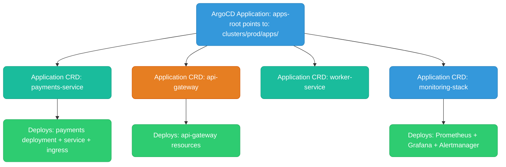
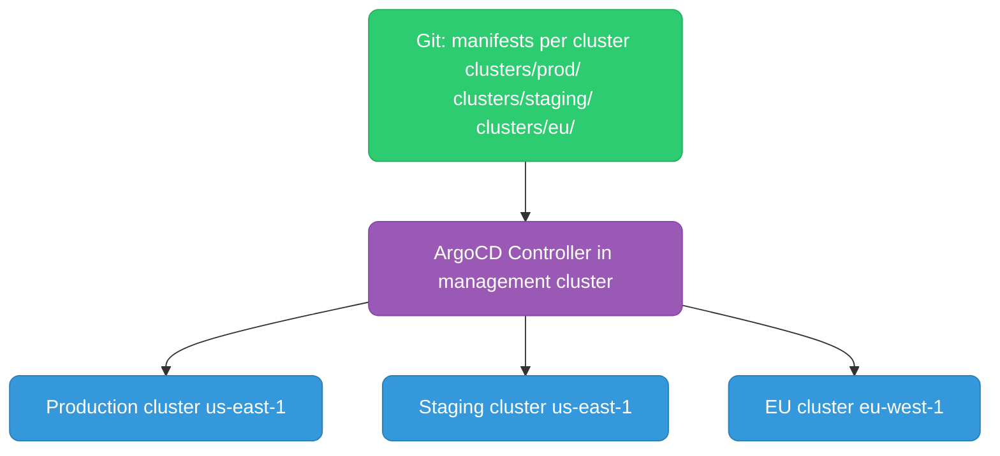

# ArgoCD

ArgoCD is a declarative GitOps continuous delivery tool for Kubernetes. Git is the single source of truth; ArgoCD continuously syncs the cluster to match it.

---

## GitOps Model

```mermaid
graph LR
    classDef blue fill:#3498db,stroke:#2980b9,color:#fff,rx:8
    classDef green fill:#2ecc71,stroke:#27ae60,color:#fff,rx:8
    classDef red fill:#e74c3c,stroke:#c0392b,color:#fff,rx:8
    classDef orange fill:#e67e22,stroke:#d35400,color:#fff,rx:8
    classDef purple fill:#9b59b6,stroke:#8e44ad,color:#fff,rx:8
    classDef teal fill:#1abc9c,stroke:#16a085,color:#fff,rx:8
    classDef dark fill:#2c3e50,stroke:#1a252f,color:#fff,rx:8
    classDef yellow fill:#f39c12,stroke:#d68910,color:#000,rx:8
    classDef k8s fill:#326ce5,stroke:#254ea8,color:#fff,rx:8
    classDef aws fill:#ff9900,stroke:#cc7a00,color:#000,rx:8
    DEV["Developer pushes K8s manifest to git"]:::green --> GIT["Git repo (manifests, Helm charts, Kustomize)"]:::green
    GIT --> ARGO["ArgoCD controller watches git repo"]:::green
    ARGO --> DIFF["Computes diff: git state vs cluster state"]:::green
    DIFF -->|"out of sync"| SYNC["Syncs cluster to match git (kubectl apply equivalent)"]:::green
    SYNC --> CLUSTER["Kubernetes Cluster"]:::k8s
    CLUSTER -->|"health checks"| ARGO
```



**Pull-based vs push-based:**
- Push (Jenkins/GHA): pipeline has cluster credentials, applies changes directly
- Pull (ArgoCD): agent inside cluster pulls changes from git, no external credentials needed

**Why GitOps wins for Kubernetes:**
- Cluster credentials never leave the cluster — no secrets in CI pipelines
- Full audit trail in git: who changed what, when, and why (via PR description)
- Rollback = `git revert` + ArgoCD auto-syncs back
- Multi-cluster: one ArgoCD instance can manage many clusters

---

## Application CRD

The `Application` is ArgoCD's core resource. It defines what to deploy and where.

```yaml
apiVersion: argoproj.io/v1alpha1
kind: Application
metadata:
  name: my-app
  namespace: argocd
spec:
  # Where to deploy
  destination:
    server: https://kubernetes.default.svc   # in-cluster
    namespace: production

  # Source: where the K8s manifests live
  source:
    repoURL: https://github.com/my-org/my-app-manifests
    targetRevision: main     # branch, tag, or commit SHA
    path: k8s/production     # directory within repo

  # Sync policy
  syncPolicy:
    automated:
      prune: true      # delete resources removed from git
      selfHeal: true   # revert manual cluster changes back to git state
    syncOptions:
      - CreateNamespace=true

  # Health check — what does "healthy" mean for this app?
  # ArgoCD has built-in health checks for Deployment, StatefulSet, Ingress, etc.
```

**Without `automated` sync:** ArgoCD detects drift but waits for a human to click "Sync" or run `argocd app sync my-app`. Manual sync = change management gate before applying to production.

---

## Sync Policies

```mermaid
graph TD
    classDef blue fill:#3498db,stroke:#2980b9,color:#fff,rx:8
    classDef green fill:#2ecc71,stroke:#27ae60,color:#fff,rx:8
    classDef red fill:#e74c3c,stroke:#c0392b,color:#fff,rx:8
    classDef orange fill:#e67e22,stroke:#d35400,color:#fff,rx:8
    classDef purple fill:#9b59b6,stroke:#8e44ad,color:#fff,rx:8
    classDef teal fill:#1abc9c,stroke:#16a085,color:#fff,rx:8
    classDef dark fill:#2c3e50,stroke:#1a252f,color:#fff,rx:8
    classDef yellow fill:#f39c12,stroke:#d68910,color:#000,rx:8
    classDef k8s fill:#326ce5,stroke:#254ea8,color:#fff,rx:8
    classDef aws fill:#ff9900,stroke:#cc7a00,color:#000,rx:8
    subgraph ManualSync["Manual Sync (default)"]
        DETECT["ArgoCD detects OutOfSync"]:::green --> WAIT["Waits for human approval"]:::orange
        WAIT --> SYNC_BTN["Human clicks Sync / argocd app sync"]:::green
        SYNC_BTN --> APPLY["Apply changes to cluster"]:::blue
    end

    subgraph AutoSync["Automated Sync"]
        A_DETECT["ArgoCD detects OutOfSync"]:::green --> AUTO_APPLY["Immediately applies changes"]:::blue
        AUTO_APPLY --> HEALTH["Health assessment"]:::yellow
        HEALTH -->|"Degraded"| ROLLBACK["Auto-rollback to previous state"]:::blue
    end

    subgraph SelfHeal["Self-Heal (automated + selfHeal: true)"]
        KUBECTL["kubectl edit deployment (manual change)"]:::green --> DRIFT2["ArgoCD detects drift within 3min"]:::red
        DRIFT2 --> REVERT["Reverts manual change to match git"]:::green
    end
```



| Policy | Use case |
|--------|----------|
| Manual sync | Production — require human approval for every deployment |
| Auto sync without self-heal | Staging — auto-deploy new commits, allow temporary manual patches |
| Auto sync + self-heal | Dev/ephemeral — full automation, git is absolute truth |
| Auto sync + prune | Any — clean up resources deleted from git |

---

## Sync Waves and Hooks

Control the order of resource application within a single sync:

```yaml
# Database migration job — must complete BEFORE app deployment
apiVersion: batch/v1
kind: Job
metadata:
  name: db-migrate
  annotations:
    argocd.argoproj.io/hook: PreSync        # runs before the main sync
    argocd.argoproj.io/hook-delete-policy: HookSucceeded  # clean up after
    argocd.argoproj.io/sync-wave: "-1"      # wave order (lower = earlier)
spec:
  template:
    spec:
      containers:
        - name: migrate
          image: my-app:v2
          command: ["/app/server", "migrate"]
---
# Main deployment — runs after migration completes
apiVersion: apps/v1
kind: Deployment
metadata:
  name: my-app
  annotations:
    argocd.argoproj.io/sync-wave: "0"   # default wave
```

**Hook types:**
- `PreSync` — runs before sync (migrations, backups)
- `Sync` — runs during sync alongside regular resources
- `PostSync` — runs after all resources are healthy (smoke tests, notifications)
- `SyncFail` — runs if sync fails (alert, rollback trigger)

---

## App of Apps Pattern

Manage multiple applications from a single ArgoCD Application. The root app deploys other Application CRDs.



```
clusters/prod/apps/
├── apps-root.yaml          # root Application
├── payments-service.yaml   # Application pointing to payments manifests
├── api-gateway.yaml
└── monitoring-stack.yaml   # Application pointing to monitoring Helm chart
```

**Why:** New applications are added by adding a new Application YAML to git — ArgoCD picks it up automatically. No manual ArgoCD configuration required.

---

## Multi-Cluster Management

One ArgoCD instance can manage many clusters:

```yaml
# Register external cluster
argocd cluster add my-prod-cluster --name production

# Application targeting external cluster
spec:
  destination:
    server: https://my-prod-cluster-api-endpoint:6443
    namespace: payments
```



**ApplicationSet** — generate Applications automatically for each cluster from a template:

```yaml
apiVersion: argoproj.io/v1alpha1
kind: ApplicationSet
metadata:
  name: my-app-all-clusters
spec:
  generators:
    - clusters: {}   # generates one Application per registered cluster
  template:
    spec:
      source:
        repoURL: https://github.com/my-org/manifests
        path: "clusters/{{name}}"   # {{name}} = cluster name
      destination:
        server: "{{server}}"        # cluster API endpoint
        namespace: my-app
```

---

## Rollback

```bash
# View sync history
argocd app history my-app

# Rollback to previous revision
argocd app rollback my-app <revision-id>

# Or: git revert the commit, ArgoCD auto-syncs back
git revert HEAD
git push origin main
# ArgoCD detects the new commit and syncs (which undoes the bad deploy)
```

**Git revert is the preferred rollback** — it's auditable, goes through the same review process, and keeps a clean history. ArgoCD's built-in rollback is useful for emergency hotfixes.

---

## Image Updater

ArgoCD Image Updater automatically updates image tags in git when new images are pushed:

```yaml
# Annotation on Application
annotations:
  argocd-image-updater.argoproj.io/image-list: myapp=123456.dkr.ecr.us-east-1.amazonaws.com/my-app
  argocd-image-updater.argoproj.io/myapp.update-strategy: semver   # or digest, latest, name
  argocd-image-updater.argoproj.io/write-back-method: git          # commit new tag to git
```

**Flow:**
1. CI builds and pushes `my-app:v1.2.3` to ECR
2. Image Updater polls ECR, detects new tag
3. Updates the image tag in the git repo (via commit)
4. ArgoCD detects the git change, syncs the cluster
5. Full GitOps: no CI pipeline needs cluster credentials

---

## Health Checks and Notifications

ArgoCD has built-in health assessments for standard K8s resources. Custom health checks via Lua scripts:

```yaml
# config in argocd-cm ConfigMap
resource.customizations.health.argoproj.io_Rollout: |
  hs = {}
  if obj.status ~= nil then
    if obj.status.phase == "Healthy" then
      hs.status = "Healthy"
    elseif obj.status.phase == "Degraded" then
      hs.status = "Degraded"
      hs.message = obj.status.message
    end
  end
  return hs
```

**Notifications** — alert on sync events via Slack, PagerDuty, email:

```yaml
# argocd-notifications-cm
triggers:
  - name: on-sync-failed
    condition: app.status.sync.status == 'Unknown'
    template: app-sync-failed

templates:
  - name: app-sync-failed
    message: |
      Application {{.app.metadata.name}} sync failed.
      Error: {{.app.status.conditions[0].message}}
```
