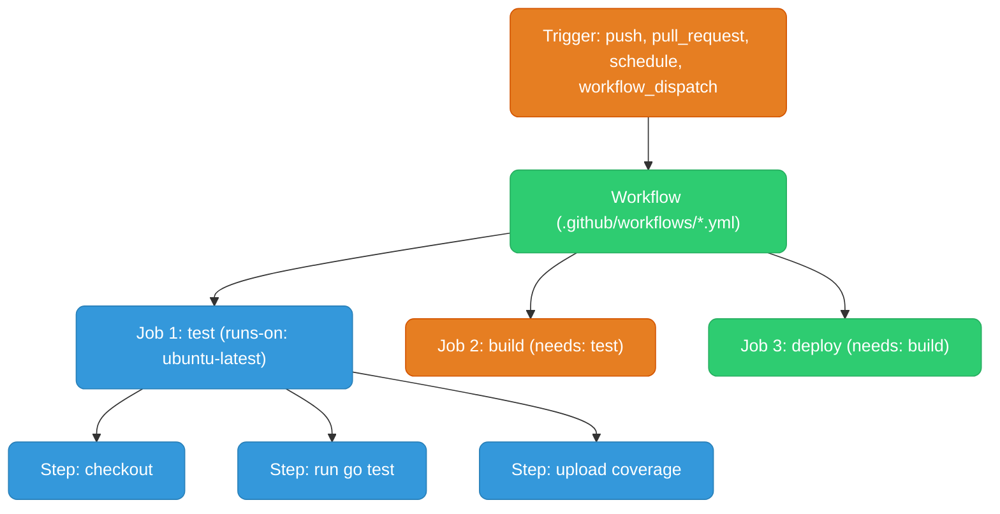
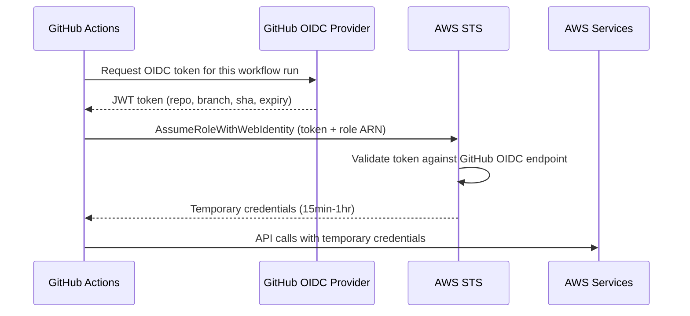

# GitHub Actions

---

## Concepts



- **Workflow** — a YAML file in `.github/workflows/`. One repo can have many workflows.
- **Job** — a group of steps that run on the same runner. Jobs run in parallel by default; `needs:` makes them sequential.
- **Step** — a single task: `uses` (an action) or `run` (shell command).
- **Runner** — the VM that executes jobs. GitHub-hosted (`ubuntu-latest`, `macos-latest`) or self-hosted.

---

## Full CI Workflow

```yaml
name: CI

on:
  push:
    branches: [main, develop]
  pull_request:
    branches: [main]

env:
  GO_VERSION: "1.23"
  ECR_REPO: 123456789.dkr.ecr.us-east-1.amazonaws.com/my-service

jobs:
  test:
    runs-on: ubuntu-latest
    steps:
      - uses: actions/checkout@v4

      - uses: actions/setup-go@v5
        with:
          go-version: ${{ env.GO_VERSION }}
          cache: true   # caches go module download cache automatically

      - name: Run tests
        run: go test -race -coverprofile=coverage.out ./...

      - name: Upload coverage
        uses: actions/upload-artifact@v4
        with:
          name: coverage
          path: coverage.out

  build:
    runs-on: ubuntu-latest
    needs: test   # only runs if test passes
    outputs:
      image-tag: ${{ steps.meta.outputs.version }}
    steps:
      - uses: actions/checkout@v4

      - name: Extract metadata
        id: meta
        uses: docker/metadata-action@v5
        with:
          images: ${{ env.ECR_REPO }}
          tags: |
            type=sha,prefix=sha-
            type=semver,pattern={{version}}

      - name: Configure AWS credentials via OIDC
        uses: aws-actions/configure-aws-credentials@v4
        with:
          role-to-assume: arn:aws:iam::123456789:role/github-actions-ecr
          aws-region: us-east-1

      - name: Login to ECR
        uses: aws-actions/amazon-ecr-login@v2

      - name: Build and push
        uses: docker/build-push-action@v5
        with:
          push: true
          tags: ${{ steps.meta.outputs.tags }}
          cache-from: type=gha       # GitHub Actions cache for Docker layers
          cache-to: type=gha,mode=max

  deploy:
    runs-on: ubuntu-latest
    needs: build
    environment: production   # requires manual approval if configured in repo settings
    steps:
      - name: Configure AWS credentials
        uses: aws-actions/configure-aws-credentials@v4
        with:
          role-to-assume: arn:aws:iam::123456789:role/github-actions-deploy
          aws-region: us-east-1

      - name: Update ECS service
        run: |
          aws ecs update-service \
            --cluster prod \
            --service my-service \
            --force-new-deployment
```

---

## OIDC to AWS (No Long-Lived Keys)

OIDC lets GitHub Actions workflows assume an AWS IAM role without storing AWS access keys as secrets. GitHub mints a short-lived OIDC token per workflow run; AWS STS validates it and returns temporary credentials.



**IAM role trust policy:**

```json
{
  "Statement": [{
    "Effect": "Allow",
    "Principal": {
      "Federated": "arn:aws:iam::123456789:oidc-provider/token.actions.githubusercontent.com"
    },
    "Action": "sts:AssumeRoleWithWebIdentity",
    "Condition": {
      "StringEquals": {
        "token.actions.githubusercontent.com:aud": "sts.amazonaws.com"
      },
      "StringLike": {
        "token.actions.githubusercontent.com:sub": "repo:my-org/my-repo:*"
      }
    }
  }]
}
```

---

## Matrix Builds

Run the same job across multiple combinations:

```yaml
jobs:
  test:
    strategy:
      matrix:
        go-version: ["1.21", "1.22", "1.23"]
        os: [ubuntu-latest, macos-latest]
      fail-fast: false   # don't cancel other matrix jobs if one fails
    runs-on: ${{ matrix.os }}
    steps:
      - uses: actions/setup-go@v5
        with:
          go-version: ${{ matrix.go-version }}
      - run: go test ./...
```

---

## Caching

```yaml
# Cache Go modules (keyed by go.sum hash)
- uses: actions/cache@v4
  with:
    path: |
      ~/.cache/go-build
      ~/go/pkg/mod
    key: ${{ runner.os }}-go-${{ hashFiles('**/go.sum') }}
    restore-keys: |
      ${{ runner.os }}-go-

# Or just use setup-go with cache: true (handles it automatically)
- uses: actions/setup-go@v5
  with:
    go-version: "1.23"
    cache: true
```

**Docker layer caching:**

```yaml
- uses: docker/build-push-action@v5
  with:
    cache-from: type=gha          # restore from GH Actions cache
    cache-to: type=gha,mode=max   # save all layers (mode=max)
```

---

## Reusable Workflows

Define a workflow once, call it from many others — like a function call for CI pipelines.

```yaml
# .github/workflows/reusable-deploy.yml
on:
  workflow_call:
    inputs:
      environment:
        required: true
        type: string
    secrets:
      DEPLOY_ROLE_ARN:
        required: true

jobs:
  deploy:
    runs-on: ubuntu-latest
    steps:
      - uses: aws-actions/configure-aws-credentials@v4
        with:
          role-to-assume: ${{ secrets.DEPLOY_ROLE_ARN }}
          aws-region: us-east-1
      - run: deploy.sh --env ${{ inputs.environment }}
```

```yaml
# .github/workflows/deploy-prod.yml — caller
jobs:
  deploy:
    uses: ./.github/workflows/reusable-deploy.yml
    with:
      environment: production
    secrets:
      DEPLOY_ROLE_ARN: ${{ secrets.PROD_DEPLOY_ROLE_ARN }}
```

---

## Useful Patterns

```yaml
# Run only on specific file changes
on:
  push:
    paths:
      - 'src/**'
      - 'go.mod'
      - '!docs/**'   # exclude docs changes

# Concurrency: cancel in-progress runs on same branch
concurrency:
  group: ${{ github.workflow }}-${{ github.ref }}
  cancel-in-progress: true

# Conditional step
- name: Deploy
  if: github.ref == 'refs/heads/main' && github.event_name == 'push'
  run: deploy.sh

# Set output from a step
- id: version
  run: echo "tag=$(git describe --tags)" >> $GITHUB_OUTPUT

- run: echo "Deploying ${{ steps.version.outputs.tag }}"

# Use GitHub secrets
- run: deploy.sh --token ${{ secrets.DEPLOY_TOKEN }}
```
