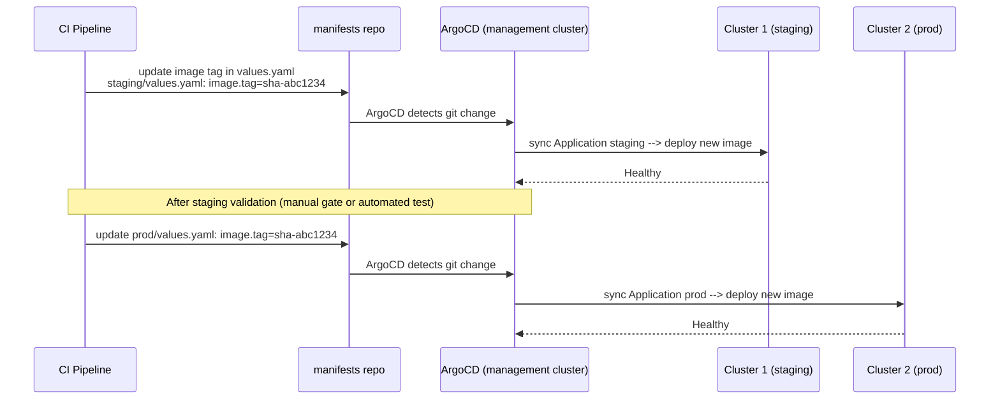
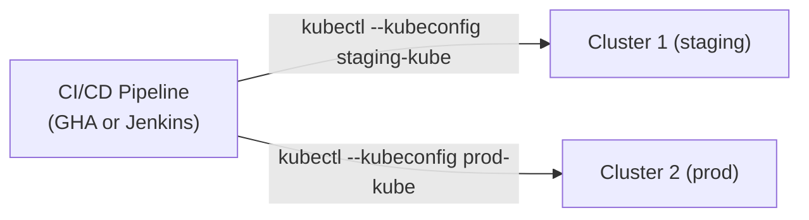

# CI/CD Pipeline Design — End to End

## Full Java CI Pipeline

```mermaid
graph LR
    PUSH["git push / PR"] --> CHECKOUT["1. Checkout code<br>git clone --depth 1"]
    CHECKOUT --> DEPS["2. Pull dependencies<br>mvn dependency:resolve<br>or cached ~/.m2"]
    DEPS --> UNIT["3. Unit Tests<br>mvn test<br>JUnit + Mockito"]
    UNIT --> INTEG["4. Integration Tests<br>mvn verify<br>testcontainers for DB/Redis"]
    INTEG --> BUILD["5. Build artifact<br>mvn package -DskipTests<br>--> target/app.jar"]
    BUILD --> DOCKER["6. Build Docker image<br>multi-stage Dockerfile<br>--> image:sha-abc1234"]
    DOCKER --> SCAN["7. Security scan<br>trivy image / snyk<br>fail on CRITICAL CVEs"]
    SCAN --> PUSH_IMG["8. Push to registry<br>ECR / DockerHub<br>tag: sha + semver"]
```



### GitHub Actions: Full Java CI

```yaml
name: CI

on:
  push:
    branches: [main]
  pull_request:
    branches: [main]

env:
  ECR_REPO: 123456789.dkr.ecr.us-east-1.amazonaws.com/myapp
  JAVA_VERSION: "21"

jobs:
  ci:
    runs-on: ubuntu-latest
    steps:
    - uses: actions/checkout@v4

    - uses: actions/setup-java@v4
      with:
        java-version: ${{ env.JAVA_VERSION }}
        distribution: temurin
        cache: maven          # cache ~/.m2 by pom.xml hash

    - name: Unit Tests
      run: mvn test -B
      # -B = batch mode (no ANSI colors, better for CI logs)

    - name: Integration Tests
      run: mvn verify -B -Pintegration
      # Pintegration = Maven profile that runs testcontainers tests

    - name: Build JAR
      run: mvn package -DskipTests -B

    - name: Configure AWS credentials (OIDC — no static keys)
      uses: aws-actions/configure-aws-credentials@v4
      with:
        role-to-assume: arn:aws:iam::123456789:role/github-actions-ecr
        aws-region: us-east-1

    - name: Login to ECR
      uses: aws-actions/amazon-ecr-login@v2

    - name: Build and push Docker image
      run: |
        IMAGE_TAG="sha-${{ github.sha }}"
        docker build \
          --cache-from type=gha \    # use GH Actions cache for Docker layers
          --cache-to type=gha,mode=max \
          -t $ECR_REPO:$IMAGE_TAG \
          -t $ECR_REPO:latest .
        docker push $ECR_REPO:$IMAGE_TAG
        docker push $ECR_REPO:latest
        echo "IMAGE_TAG=$IMAGE_TAG" >> $GITHUB_OUTPUT
      id: build

    - name: Scan image for vulnerabilities
      uses: aquasecurity/trivy-action@master
      with:
        image-ref: ${{ env.ECR_REPO }}:sha-${{ github.sha }}
        severity: CRITICAL,HIGH
        exit-code: 1    # fail CI if CRITICAL found
```

---

## CD: Deploy to Two Clusters

### Option A: ArgoCD (Recommended — GitOps)



**Where does ArgoCD live?** One ArgoCD instance in a management cluster. It registers both staging and prod clusters via `argocd cluster add`. Both clusters' kubeconfigs are stored as Secrets in the ArgoCD namespace.

```bash
# Register clusters with ArgoCD
argocd cluster add staging-context --name staging
argocd cluster add prod-context --name prod

# ArgoCD ApplicationSet: one definition → two applications
apiVersion: argoproj.io/v1alpha1
kind: ApplicationSet
spec:
  generators:
  - list:
      elements:
      - cluster: staging
        url: https://staging-api.eks.amazonaws.com
        values_file: staging/values.yaml
      - cluster: prod
        url: https://prod-api.eks.amazonaws.com
        values_file: prod/values.yaml
  template:
    spec:
      source:
        helm:
          valueFiles: ["{{values_file}}"]
      destination:
        server: "{{url}}"
```

### Option B: GitHub Actions / Jenkins — Pushing via kubectl/helm



**Sequential vs Parallel:**
- **Sequential:** deploy staging → wait for health check → deploy prod (safer — catch issues before prod)
- **Parallel:** deploy both simultaneously (faster — use only if staging and prod are truly independent)

```yaml
# GitHub Actions: sequential deploy
jobs:
  deploy-staging:
    runs-on: ubuntu-latest
    environment: staging
    steps:
    - name: Configure kubeconfig for staging
      run: |
        aws eks update-kubeconfig \
          --name staging-cluster \
          --region us-east-1 \
          --role-arn arn:aws:iam::123:role/staging-deploy
    - name: Helm upgrade staging
      run: |
        helm upgrade --install myapp ./helm/myapp \
          --namespace myapp \
          --values helm/myapp/values-staging.yaml \
          --set image.tag=${{ github.sha }} \
          --wait --timeout 5m \
          --atomic   # rollback on failure

  deploy-prod:
    needs: deploy-staging    # wait for staging to succeed
    runs-on: ubuntu-latest
    environment: production  # requires manual approval in GitHub
    steps:
    - name: Configure kubeconfig for prod
      run: |
        aws eks update-kubeconfig \
          --name prod-cluster \
          --region us-east-1 \
          --role-arn arn:aws:iam::123:role/prod-deploy
    - name: Helm upgrade prod
      run: |
        helm upgrade --install myapp ./helm/myapp \
          --namespace myapp \
          --values helm/myapp/values-prod.yaml \
          --set image.tag=${{ github.sha }} \
          --wait --timeout 5m \
          --atomic
```

---

## Helm — Create, Install, Upgrade

### Create a Chart

```bash
helm create myapp
# Creates:
# myapp/
#   Chart.yaml         ← name, version, appVersion
#   values.yaml        ← default values
#   templates/
#     deployment.yaml
#     service.yaml
#     ingress.yaml
#     _helpers.tpl     ← named templates ({{ include "myapp.name" . }})
```

### Install a Chart

```bash
helm install <release-name> <chart> [flags]

helm install myapp ./myapp \
  --namespace myapp \
  --create-namespace \
  --values values-prod.yaml \
  --set image.tag=v1.2.3 \
  --wait            # wait until all pods are Running
  --timeout 5m
```

### Upgrade a Chart

```bash
helm upgrade myapp ./myapp \
  --namespace myapp \
  --values values-prod.yaml \
  --set image.tag=v1.3.0 \
  --wait \
  --atomic          # rollback automatically if upgrade fails
```

### Single Command: Upgrade if Exists, Install if Not

```bash
helm upgrade --install myapp ./myapp \
  --namespace myapp \
  --create-namespace \
  --values values-prod.yaml \
  --set image.tag=$IMAGE_TAG \
  --wait \
  --atomic
# --install flag: if release doesn't exist → install. If it does → upgrade.
# This is the standard CI/CD command — idempotent.
```

### Check if Release Exists

```bash
# Check status
helm status myapp -n myapp
# If release doesn't exist: Error: release: not found

# List all releases in namespace
helm list -n myapp

# History of a release
helm history myapp -n myapp

# Rollback to previous version
helm rollback myapp -n myapp         # previous
helm rollback myapp 2 -n myapp       # specific revision
```

---

## SDE-1 vs SDE-2 Classification

### SDE-1 Level (expected to know cold)

| Topic | Why SDE-1 |
|-------|-----------|
| ECS Fargate basics — Task Definition, Service, networking | Standard AWS container deployment |
| HPA basics — CPU-based scaling, `kubectl get hpa` | Fundamental K8s operations |
| Scheduler Filter/Score at concept level | Core K8s knowledge |
| Route53 → ALB → pod request flow | Required for any AWS service |
| ALB vs NLB — L7 vs L4 | Standard infra interview question |
| `kubectl logs`, `describe`, `get events` debugging | Daily operational skill |
| Docker layers and why layer order matters | Every Dockerfile you write |
| Docker image optimization (multi-stage, distroless) | Production requirement |
| Helm install/upgrade/upgrade--install | Standard deploy tooling |
| Namespaces and cgroups conceptually | Container fundamentals |
| Terraform remote state (S3 + DynamoDB) | Standard team Terraform setup |
| NAT Gateway vs Internet Gateway | AWS networking basics |
| Round-robin load balancing | Fundamental networking |

### SDE-2 Level (deeper knowledge expected)

| Topic | Why SDE-2 |
|-------|-----------|
| HPA stabilizationWindow, behavior.scaleDown/Up policies | Tuning production autoscaling |
| VPA update modes, Recommender/Updater/Admission Controller architecture | Right-sizing at scale |
| VPA + singleton interaction (eviction = downtime) | Production incident prevention |
| HPA + VPA conflict and safe combinations | System design decision |
| Scheduler: every Filter/Score plugin by name and function | Platform engineering |
| Gang scheduling (Volcano) for distributed training | AI/ML infra |
| containerd-shim role (why containers survive containerd restart) | Container runtime internals |
| CRI gRPC interface (kubelet → containerd, no dockerd) | K8s internals |
| ALB target group deregistration delay and connection draining | Zero-downtime deploys |
| Terraform DynamoDB locking — race conditions and how lock prevents them | IaC at team scale |
| ArgoCD ApplicationSet multi-cluster management | Platform GitOps |
| Sequential vs parallel CD tradeoffs | System design |
| `helm upgrade --atomic` auto-rollback mechanism | Production reliability |
