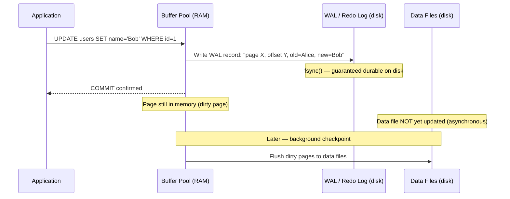
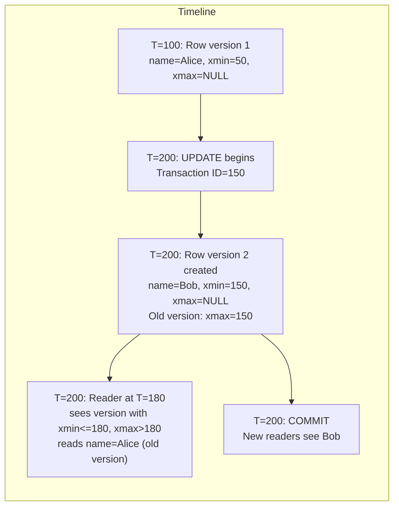

# Databases — Internals, Features, and Operations

Deep dives into each database: storage engine internals, WAL, replication, indexing, and operational patterns.

## Files

| File | Database | Key Topics |
|------|----------|-----------|
| [postgres-internals.md](./postgres-internals.md) | PostgreSQL | MVCC, WAL, VACUUM, B-tree/GiST indexes, EXPLAIN, connection pooling, replication internals |
| [mysql-internals.md](./mysql-internals.md) | MySQL / InnoDB | InnoDB storage engine, redo log, undo log, MVCC, B-tree, buffer pool, replication binlog |
| [mongodb-internals.md](./mongodb-internals.md) | MongoDB | WiredTiger storage engine, oplog, BSON, aggregation pipeline, index types, sharding |
| [redis-internals.md](./redis-internals.md) | Redis | Data structures internals, RDB/AOF persistence, eviction policies, Lua scripting, cluster |
| [kafka-internals.md](./kafka-internals.md) | Apache Kafka | Log segments, offset management, consumer groups, exactly-once, compaction |
| [clickhouse-internals.md](./clickhouse-internals.md) | ClickHouse | MergeTree family, columnar storage, compression, materialized views, query execution |

## Common Concepts Across All Databases

### WAL — Write-Ahead Log

WAL is the most important concept in database durability. Before any data page is modified, the change is written to an append-only log (the WAL). On crash, the database replays the WAL to recover.



**Why WAL first?** Writing to the WAL is sequential (append-only) — fast. Writing to data files is random I/O — slow. WAL gives durability at sequential-write speed.

**Crash recovery:**
```
1. Find last checkpoint in WAL
2. Replay all WAL records after checkpoint
3. Database is consistent as of last committed transaction
```

### MVCC — Multi-Version Concurrency Control

Most databases use MVCC to allow readers and writers to not block each other.



Old versions accumulate → need garbage collection:
- PostgreSQL: `VACUUM`
- MySQL InnoDB: purge thread
- MongoDB: checkpoint + journal truncation
