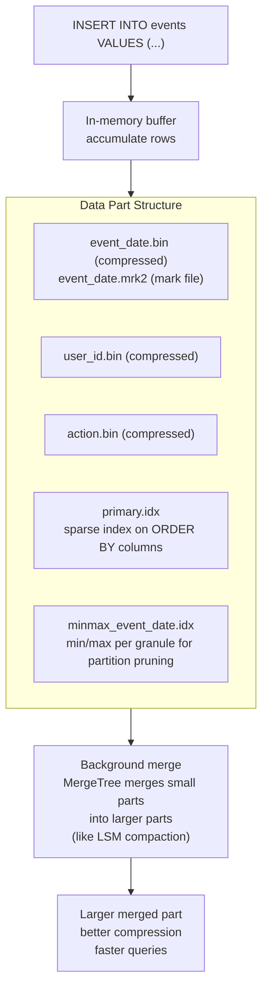
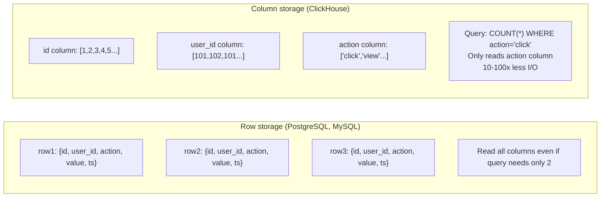
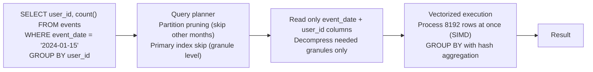
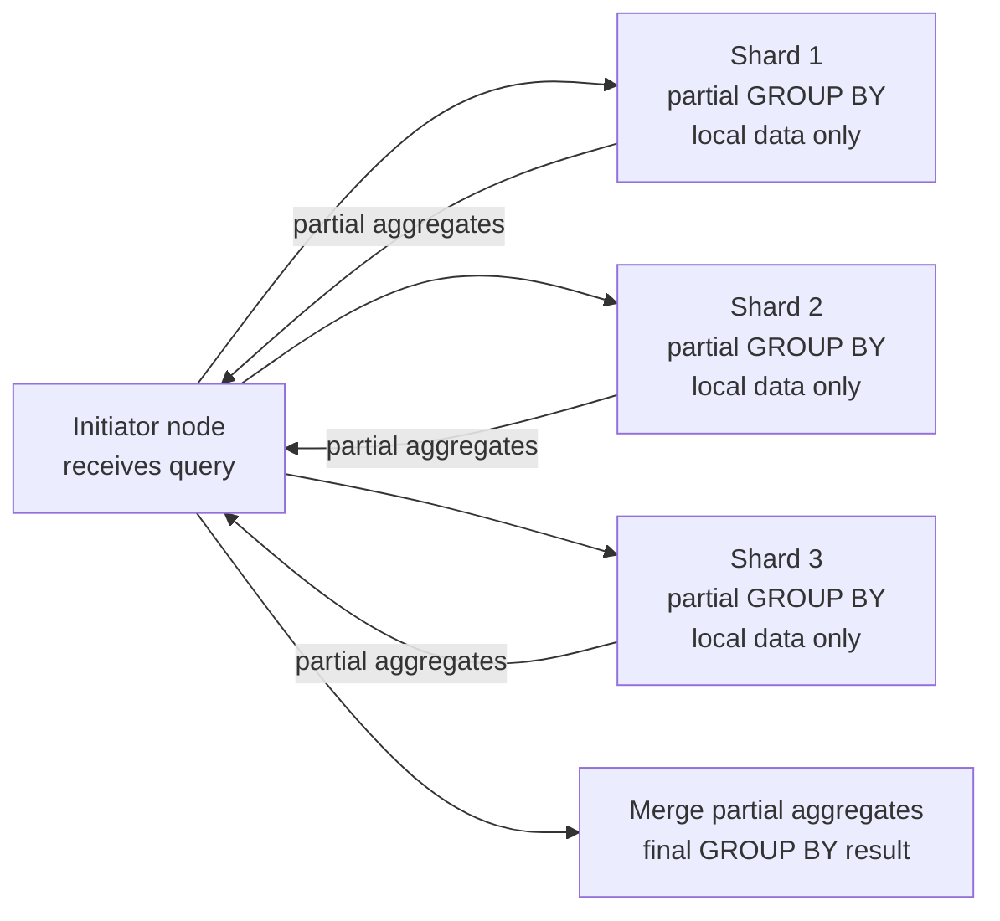
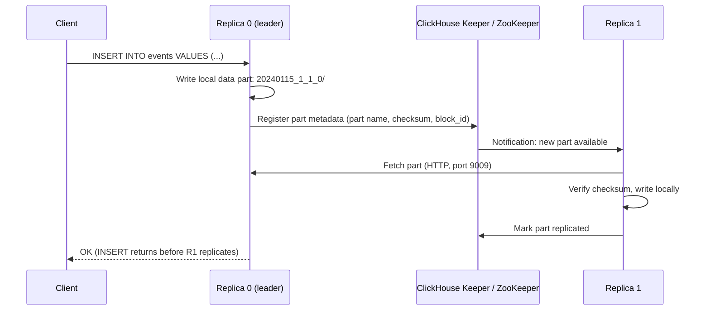

# ClickHouse Internals

## MergeTree Storage Engine

ClickHouse's primary table engine — designed for analytical queries over billions of rows.



---

## Columnar Storage — Why Queries Are Fast



**Compression per column:** Each column has uniform data type → high compression ratio. `user_id` column: sorted integers → delta encoding → LZ4/ZSTD. Typical: 5-10x compression vs raw CSV.

---

## MergeTree Family

```
MergeTree                 — base engine, append + merge
ReplacingMergeTree        — deduplicate by ORDER BY key on merge
SummingMergeTree          — aggregate numeric columns on merge
AggregatingMergeTree      — store partial aggregates, merge = combine aggregates
CollapsingMergeTree       — delete rows by sign column (CRDT-like)
ReplicatedMergeTree       — MergeTree with ZooKeeper/Keeper replication
```

```sql
CREATE TABLE events (
    event_date  Date,
    user_id     UInt64,
    action      LowCardinality(String),
    value       Float64
) ENGINE = ReplicatedMergeTree('/clickhouse/tables/{shard}/events', '{replica}')
PARTITION BY toYYYYMM(event_date)     -- partition by month
ORDER BY (event_date, user_id)         -- sort key = primary key
SETTINGS index_granularity = 8192;    -- rows per granule (sparse index unit)
```

---

## Query Execution



**Granule:** ClickHouse divides each column file into granules of `index_granularity` rows (default 8192). The sparse primary index stores the first value of each granule. Queries skip entire granules that can't match the WHERE clause.

---

## Materialized Views

Pre-aggregate data at insert time for fast dashboard queries:

```sql
-- Source table
CREATE TABLE events (...) ENGINE = MergeTree() ...;

-- Materialized view: count events per user per day
CREATE MATERIALIZED VIEW events_by_user_daily
ENGINE = AggregatingMergeTree()
PARTITION BY toYYYYMM(event_date)
ORDER BY (event_date, user_id)
AS SELECT
    event_date,
    user_id,
    countState() AS cnt,        -- partial aggregate state
    sumState(value) AS total
FROM events
GROUP BY event_date, user_id;

-- Query the materialized view
SELECT
    event_date,
    user_id,
    countMerge(cnt) AS count,   -- merge partial states
    sumMerge(total) AS total
FROM events_by_user_daily
WHERE event_date = today()
GROUP BY event_date, user_id;
```

---

## Key Configuration

```xml
<!-- config.xml -->
<max_memory_usage>10000000000</max_memory_usage>  <!-- 10GB per query -->
<max_threads>8</max_threads>
<max_concurrent_queries>100</max_concurrent_queries>

<!-- Compression -->
<compression>
    <case><min_part_size>10000000000</min_part_size>
        <method>zstd</method><level>3</level>
    </case>
</compression>
```

---

## Key Metrics

```promql
ClickHouseMetrics_Query                    # active queries
ClickHouseAsyncMetrics_MemoryResident      # RSS memory
ClickHouseMetrics_BackgroundMergesAndMutations  # merge queue
ClickHouseProfileEvents_MergedRows         # rows merged per second
ClickHouseMetrics_ReplicatedChecks         # replication queue depth
```

---

## EXPLAIN — Query Execution Analysis

```sql
-- See query execution pipeline
EXPLAIN PIPELINE SELECT user_id, count() FROM events
WHERE event_date = today() GROUP BY user_id;

-- Output shows stages:
-- (ExpressionTransform) → (AggregatingTransform) → (MergingAggregatedTransform)
-- → shows parallelism: how many threads per stage

-- Detailed analysis with timing
EXPLAIN ANALYZE SELECT user_id, count() FROM events
WHERE event_date = today() GROUP BY user_id;

-- Show which granules are read (index analysis)
EXPLAIN indexes=1 SELECT count() FROM events WHERE user_id = 123;
-- Marks (1) → only 1 granule read out of thousands (primary index worked)
```

---

## TTL — Automatic Data Expiry

```sql
-- Auto-delete rows older than 30 days
CREATE TABLE events (
    event_date  Date,
    user_id     UInt64,
    action      String
) ENGINE = MergeTree()
ORDER BY (event_date, user_id)
TTL event_date + INTERVAL 30 DAY DELETE;
-- Rows deleted during background merges when TTL expires

-- Move old data to cheaper storage tier (tiered storage)
TTL event_date + INTERVAL 7 DAY TO DISK 'ssd',
    event_date + INTERVAL 30 DAY TO DISK 'hdd',
    event_date + INTERVAL 90 DAY TO VOLUME 's3';

-- Check TTL status
SELECT name, data_compressed_bytes/1e9 AS compressed_gb,
       min_date, max_date
FROM system.parts
WHERE table = 'events' AND active;
```

---

## Distributed Aggregation

When ClickHouse shards data, aggregations run in two phases:



```sql
-- Distributed table fans out to shards, merges results
SELECT user_id, count() FROM distributed_events
WHERE event_date = today() GROUP BY user_id ORDER BY count() DESC LIMIT 10;

-- Under the hood: each shard runs:
-- SELECT user_id, count() FROM local_events WHERE event_date = today() GROUP BY user_id
-- Initiator merges partial counts from all shards
```

---

## ReplicatedMergeTree Internals



Replication is **asynchronous** — INSERT returns after writing to one replica. Use `insert_quorum` for synchronous-like behavior:

```sql
SET insert_quorum = 2;  -- wait for 2 replicas to confirm before returning
SET insert_quorum_timeout = 60000;  -- 60 second timeout

INSERT INTO events VALUES (...);  -- blocks until 2 replicas have the data
```

---

## Query Profiling and Optimization

```sql
-- System tables for query analysis
SELECT query, read_rows, read_bytes/1e9 AS read_gb,
       memory_usage/1e9 AS memory_gb,
       query_duration_ms
FROM system.query_log
WHERE type = 'QueryFinish'
  AND event_time > now() - INTERVAL 1 HOUR
ORDER BY query_duration_ms DESC LIMIT 10;

-- Find queries doing too many reads (need better indexes/partitioning)
SELECT query, read_rows, read_rows / result_rows AS selectivity
FROM system.query_log
WHERE type = 'QueryFinish' AND read_rows > 1e8
ORDER BY read_rows DESC LIMIT 10;
-- If selectivity > 10000: reading 10K rows per result row → bad filtering

-- Parts and merges in progress
SELECT table, elapsed, progress, rows_read, rows_written
FROM system.merges;

-- Background merge queue size (high = inserts faster than merges)
SELECT table, count() AS parts_count
FROM system.parts
WHERE active AND database = currentDatabase()
GROUP BY table
HAVING parts_count > 100  -- warning: too many parts → slow queries
ORDER BY parts_count DESC;
```

---

## Ingestion Best Practices

```sql
-- Batch inserts: ClickHouse is optimized for large batches, NOT one-row inserts
-- Bad: INSERT INTO events VALUES (row1); INSERT INTO events VALUES (row2);
-- Good: INSERT INTO events VALUES (row1),(row2),...,(row10000);

-- Use async_insert for high-frequency small inserts
SET async_insert = 1;          -- buffer inserts server-side
SET wait_for_async_insert = 0; -- don't wait for flush confirmation

-- Buffer table: accumulate writes, flush to MergeTree periodically
CREATE TABLE events_buffer AS events
ENGINE = Buffer(currentDatabase(), events, 16, 10, 100, 10000, 1000000, 10000000, 100000000);
-- Flushes when: time > 10-100s OR rows > 10K-1M OR bytes > 10MB-100MB
INSERT INTO events_buffer VALUES (...);  -- fast, goes to RAM buffer
```
