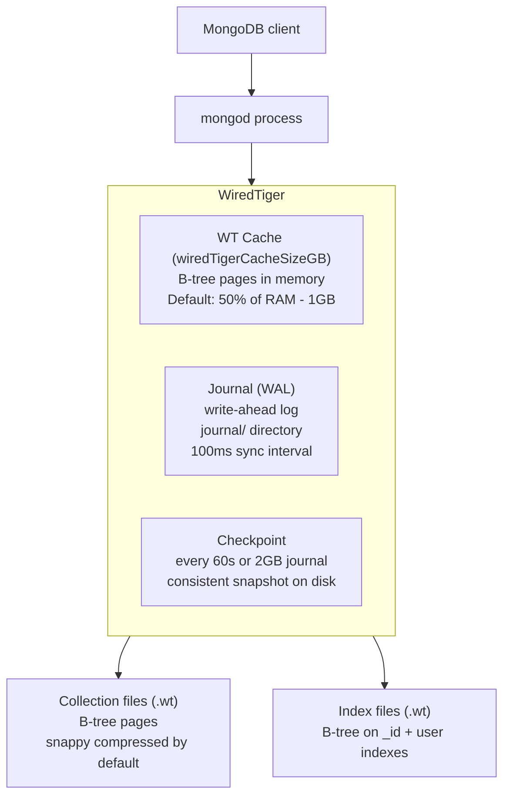
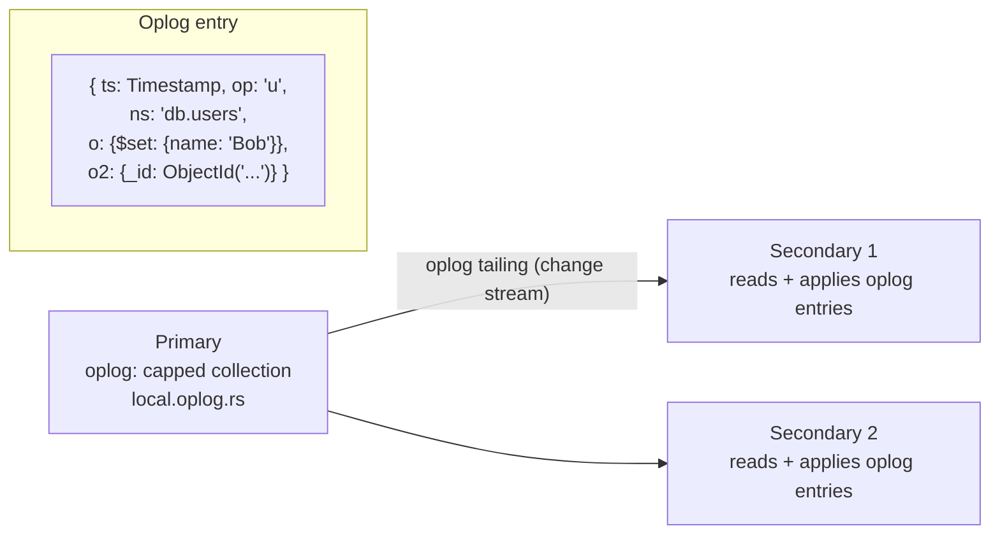
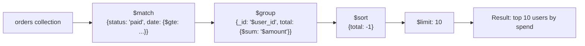
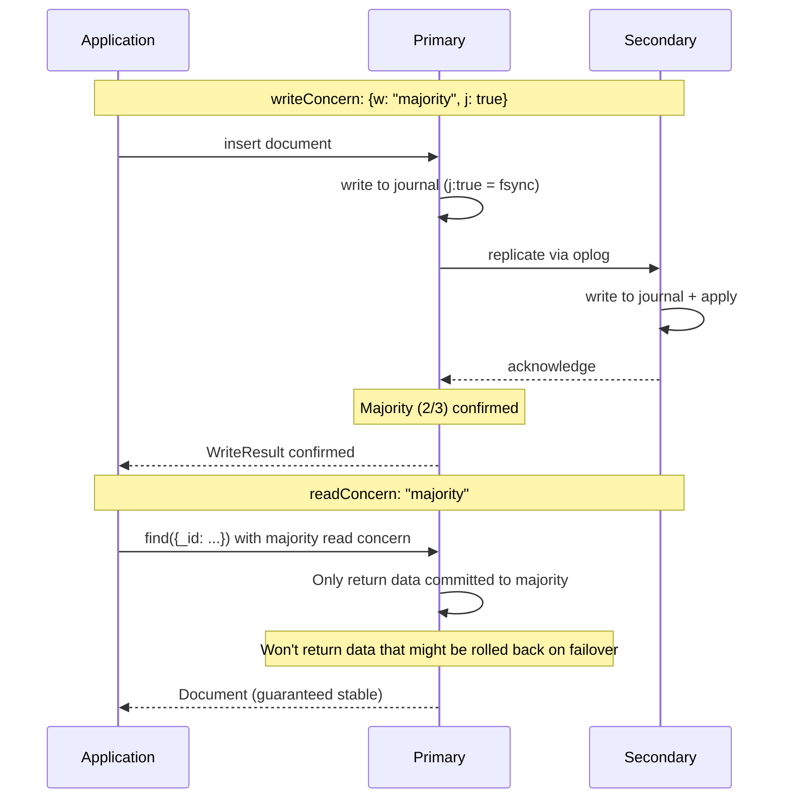
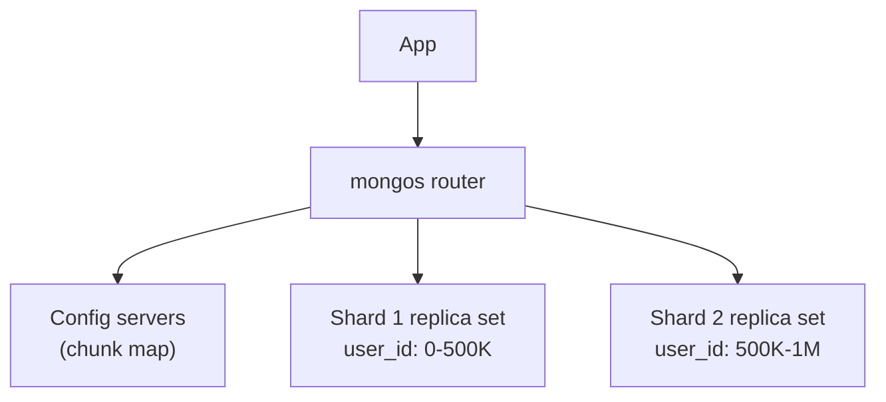

# MongoDB Internals

## WiredTiger Storage Engine



---

## Document Model and BSON

MongoDB stores documents as BSON (Binary JSON):

```
BSON document: {_id: ObjectId("..."), name: "Alice", age: 30}

Binary encoding:
[doc_length 4B][type 1B][key "name\0"][value "Alice"][type 1B][key "age\0"][value 30 4B]...[terminator 0x00]

Advantages:
- Traversable without full parse (know field length from header)
- Native types: Date, ObjectId, Binary, Decimal128
- ObjectId: 12 bytes = 4B timestamp + 5B random + 3B counter (sortable, unique, no central seq)
```

---

## Oplog — Replication Log

The oplog is a capped collection in the `local` database. Every write to the primary is recorded as an idempotent operation.



**op types:** `i` (insert), `u` (update), `d` (delete), `c` (command: createCollection, dropCollection), `n` (no-op, keepalive)

**Oplog window:** Capped at a fixed size (default 5% of disk space, min 1GB). If a secondary falls behind more than the oplog window, it needs a full resync.

---

## Aggregation Pipeline



MongoDB can use indexes in `$match` and `$sort` stages. `explain()` shows if indexes are used:

```javascript
db.orders.aggregate([
    {$match: {status: 'paid'}},
    {$group: {_id: '$user_id', total: {$sum: '$amount'}}}
]).explain('executionStats')
```

---

## Index Types

```javascript
// Standard B-tree
db.users.createIndex({email: 1})                    // ascending
db.users.createIndex({email: 1, status: 1})         // compound
db.users.createIndex({email: 1}, {unique: true})    // unique

// Partial index (only index active users — smaller, faster)
db.users.createIndex({email: 1}, {
    partialFilterExpression: {deleted: {$exists: false}}
})

// TTL index (auto-delete documents after N seconds)
db.sessions.createIndex({createdAt: 1}, {expireAfterSeconds: 3600})

// Text index (full-text search)
db.posts.createIndex({body: 'text', title: 'text'})
db.posts.find({$text: {$search: "kubernetes failover"}})

// Geospatial
db.locations.createIndex({coords: '2dsphere'})
db.locations.find({coords: {$near: {$geometry: {type:'Point', coordinates:[77.2,28.6]}, $maxDistance: 1000}}})
```

---

## Write Concern and Read Concern — Deep Dive



| Write Concern | Data loss on failover | Latency |
|--------------|----------------------|---------|
| `{w:1}` | Yes (if only primary had it) | Lowest |
| `{w:"majority"}` | No | +replica RTT |
| `{w:"majority", j:true}` | No + disk durable | Highest |

---

## explain() — Query Analysis

```javascript
// Find execution plan
db.orders.find({user_id: "123", status: "paid"}).explain("executionStats")
// winningPlan.stage: "COLLSCAN" = full scan (bad) | "IXSCAN" = index (good)
// executionStats.totalDocsExamined vs totalDocsReturned: large ratio = missing index

// Create compound index
db.orders.createIndex({user_id: 1, status: 1})

// Covering index: all projected fields in index = no heap fetch
db.orders.createIndex({user_id: 1, status: 1, amount: 1})
db.orders.find({user_id: "123"}, {status:1, amount:1, _id:0})
// Extra: "Using index" — zero document reads
```

---

## Transactions (4.0+)

```javascript
const session = db.getMongo().startSession();
session.startTransaction({ readConcern:{level:"snapshot"}, writeConcern:{w:"majority"} });
try {
    const accounts = session.getDatabase("bank").accounts;
    accounts.updateOne({_id:"alice"}, {$inc:{balance:-100}}, {session});
    accounts.updateOne({_id:"bob"},   {$inc:{balance: 100}}, {session});
    session.commitTransaction();
} catch (err) {
    session.abortTransaction();
    throw err;
} finally { session.endSession(); }
```

---

## Change Streams

Real-time feed of insert/update/delete events — built on the oplog.

```javascript
const stream = db.orders.watch([
    {$match: {"operationType": {$in:["insert","update"]}}},
    {$match: {"fullDocument.status": "paid"}}
]);
stream.on("change", change => processOrder(change.fullDocument));

// Crash recovery: store resumeToken, restart from it
const stream2 = db.orders.watch([], {resumeAfter: lastToken});
```

---

## Sharding



```javascript
sh.enableSharding("mydb")
sh.shardCollection("mydb.orders", {user_id: "hashed"})
// hashed = even distribution
// ranged = supports range queries but hotspot risk on monotonic keys

sh.getBalancerState()  // check if auto-balancer is moving chunks
```

---

## Aggregation Pipeline Stages

```javascript
db.orders.aggregate([
    {$match:  {status:"paid", created_at:{$gte: new Date("2024-01-01")}}},  // filter early
    {$lookup: {from:"users", localField:"user_id", foreignField:"_id", as:"user"}},
    {$unwind: "$user"},
    {$group:  {_id:"$user_id", total:{$sum:"$amount"}, count:{$sum:1}}},
    {$match:  {total:{$gte:1000}}},   // post-group filter
    {$sort:   {total:-1}},
    {$limit:  100},
    {$project:{_id:0, user_id:"$_id", total:1, count:1}}
])
// allowDiskUse:true if pipeline > 100MB RAM
```

---

## Monitoring

```javascript
db.currentOp({secs_running:{$gt:5}})  // long-running ops
db.killOp(opid)
db.setProfilingLevel(1, {slowms:100}) // log slow queries
db.system.profile.find().sort({ts:-1}).limit(10)
rs.status()  // replica set health + lag
```
