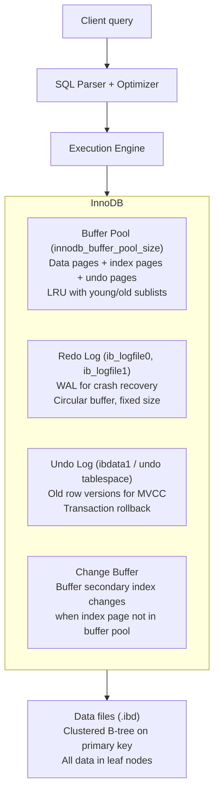
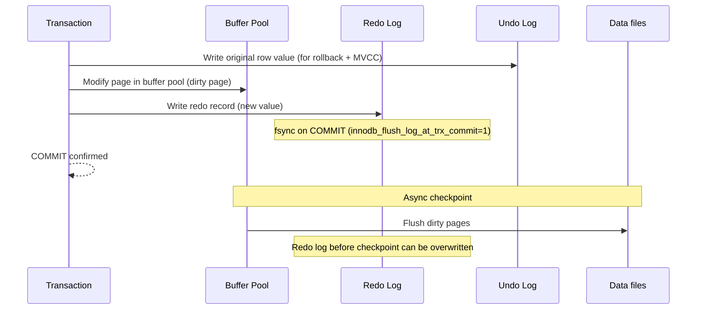
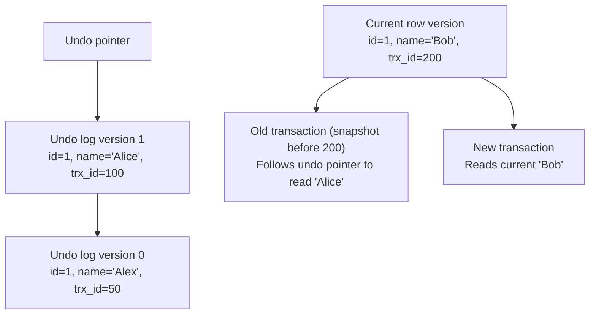
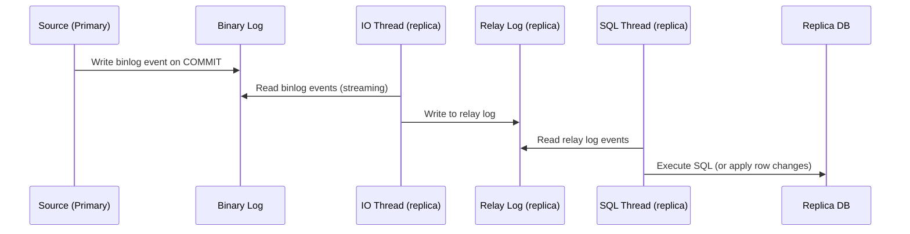
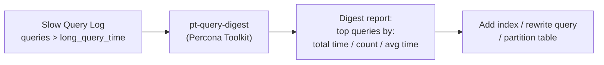
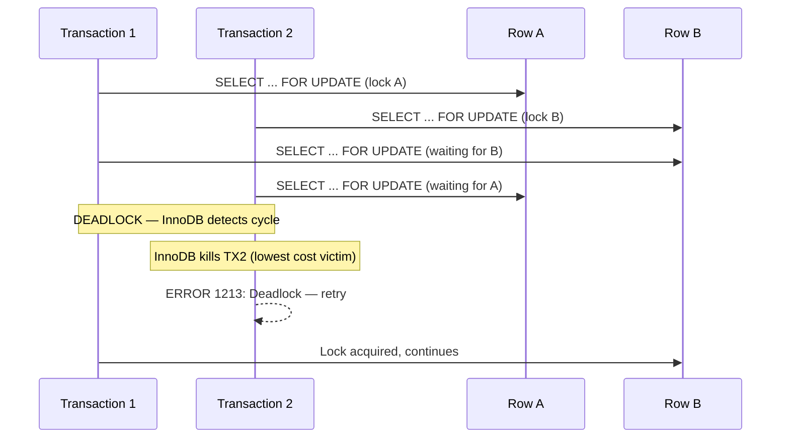

# MySQL / InnoDB Internals

## InnoDB Storage Engine Architecture



---

## Redo Log (WAL) + Undo Log



**`innodb_flush_log_at_trx_commit`:**
| Value | Behavior | Durability | Performance |
|-------|---------|-----------|------------|
| 0 | Flush every 1s (OS buffer) | 1s data loss on crash | Fastest |
| 1 (default) | Flush + fsync on every commit | Zero loss | Slowest |
| 2 | Flush to OS buffer on commit, fsync every 1s | 1s loss on OS crash | Medium |

---

## MVCC with Undo Log



Unlike PostgreSQL (which stores old versions in the heap), MySQL/InnoDB stores them in undo logs.

**Undo log purge:** Background purge thread removes undo records no longer needed by any transaction. Long-running transactions prevent purge → undo tablespace grows.

---

## InnoDB B-tree (Clustered Index)

```
PRIMARY KEY is the clustered index.
ALL data stored in leaf nodes of the B-tree.
Secondary indexes store the primary key value as the pointer.

SELECT * FROM users WHERE id=123:
  1. B-tree lookup in clustered index → find leaf → entire row

SELECT * FROM users WHERE email='alice@example.com':
  1. B-tree lookup in secondary index (email) → find leaf → get PK value
  2. B-tree lookup in clustered index (PK) → find leaf → entire row
  (Double lookup = "index dive")
```

---

## Replication: Binary Log (Binlog)



**Binlog formats:**
- `STATEMENT`: log SQL statements (compact, but non-deterministic queries can diverge)
- `ROW`: log actual row changes (verbose, always correct — used by default now)
- `MIXED`: statement for safe queries, row for non-deterministic

**GTID (Global Transaction ID):** Each transaction gets a globally unique ID. Replicas use GTIDs to track position — no need to know binlog filename + offset. Enables automatic failover.

---

## Key Configuration

```ini
innodb_buffer_pool_size = 12G      # 70-80% of RAM
innodb_buffer_pool_instances = 8   # reduce contention
innodb_log_file_size = 2G          # larger = faster writes, slower crash recovery
innodb_flush_log_at_trx_commit = 1 # 1 = full durability (use 2 for replicas)
innodb_flush_method = O_DIRECT     # bypass OS cache (avoid double-buffering)
sync_binlog = 1                    # sync binlog to disk per transaction
binlog_format = ROW
gtid_mode = ON
enforce_gtid_consistency = ON
```

---

## Slow Query Log and Analysis



```ini
# Enable slow query log
slow_query_log = ON
slow_query_log_file = /var/log/mysql/slow.log
long_query_time = 1           # log queries > 1 second
log_queries_not_using_indexes = ON  # catch full table scans
min_examined_row_limit = 1000 # skip trivially small queries
```

```bash
# Analyze slow query log
pt-query-digest /var/log/mysql/slow.log | head -100

# Output shows per-query fingerprint:
# Query 1: 23.45s total, 234 calls, 0.10s avg
# SELECT * FROM orders WHERE user_id = ? AND status = ?
# Rows examined: 50000 → index missing on (user_id, status)
```

```sql
-- Find slow queries in real time (Performance Schema)
SELECT DIGEST_TEXT, COUNT_STAR, AVG_TIMER_WAIT/1e12 AS avg_sec,
       SUM_ROWS_EXAMINED/COUNT_STAR AS avg_rows_examined
FROM performance_schema.events_statements_summary_by_digest
WHERE AVG_TIMER_WAIT > 1e12  -- > 1 second
ORDER BY SUM_TIMER_WAIT DESC LIMIT 10;
```

---

## Deadlock Analysis



```sql
-- View last deadlock
SHOW ENGINE INNODB STATUS\G
-- Look for "LATEST DETECTED DEADLOCK" section
-- Shows: which transactions, which rows were locked, who was killed

-- Enable deadlock logging
innodb_print_all_deadlocks = ON  -- logs every deadlock to error log

-- Prevent deadlocks: always lock rows in the same order
-- Bad: TX1 locks A then B, TX2 locks B then A
-- Good: both always lock in alphabetical/ID order
```

---

## EXPLAIN and Index Optimization

```sql
-- Full EXPLAIN output
EXPLAIN FORMAT=JSON SELECT u.name, COUNT(o.id)
FROM users u
JOIN orders o ON o.user_id = u.id
WHERE u.created_at > '2024-01-01'
GROUP BY u.id\G

-- Key fields to check:
-- type: ALL (full scan bad), ref/eq_ref (good), range (ok), index (scan index only)
-- key: NULL means no index used
-- rows: estimated rows to examine
-- Extra: "Using filesort" or "Using temporary" = expensive

-- Find missing indexes
EXPLAIN SELECT * FROM orders WHERE user_id = 123 AND status = 'pending'\G
-- If type=ALL and rows=100000 → add composite index

CREATE INDEX idx_orders_user_status ON orders(user_id, status);

-- Covering index: index contains all columns the query needs (no table lookup)
CREATE INDEX idx_orders_covering ON orders(user_id, status, created_at, amount);
-- Query: SELECT amount FROM orders WHERE user_id=1 AND status='paid'
-- Extra: "Using index" → reads index only, never touches table rows
```

---

## Partitioning

```sql
-- Range partitioning by year (for large time-series tables)
CREATE TABLE orders (
    id BIGINT NOT NULL,
    user_id BIGINT,
    amount DECIMAL(10,2),
    created_at DATETIME NOT NULL
)
PARTITION BY RANGE (YEAR(created_at)) (
    PARTITION p2022 VALUES LESS THAN (2023),
    PARTITION p2023 VALUES LESS THAN (2024),
    PARTITION p2024 VALUES LESS THAN (2025),
    PARTITION pmax  VALUES LESS THAN MAXVALUE
);

-- Query uses partition pruning automatically
EXPLAIN SELECT * FROM orders WHERE created_at BETWEEN '2024-01-01' AND '2024-12-31';
-- partitions: p2024  ← only scans 2024 partition, skips 2022-2023

-- Drop old partition instantly (no row-by-row DELETE)
ALTER TABLE orders DROP PARTITION p2022;  -- instant, reclaims disk space

-- List partitions and row counts
SELECT PARTITION_NAME, TABLE_ROWS, DATA_LENGTH/1024/1024 AS data_mb
FROM INFORMATION_SCHEMA.PARTITIONS
WHERE TABLE_NAME = 'orders';
```

---

## Performance Schema — Real-Time Diagnostics

```sql
-- Top wait events (where time is spent)
SELECT EVENT_NAME, COUNT_STAR, SUM_TIMER_WAIT/1e12 AS total_sec
FROM performance_schema.events_waits_summary_global_by_event_name
WHERE COUNT_STAR > 0
ORDER BY SUM_TIMER_WAIT DESC LIMIT 10;

-- I/O by table
SELECT OBJECT_SCHEMA, OBJECT_NAME,
       COUNT_READ, SUM_TIMER_READ/1e12 AS read_sec,
       COUNT_WRITE, SUM_TIMER_WRITE/1e12 AS write_sec
FROM performance_schema.table_io_waits_summary_by_table
ORDER BY (SUM_TIMER_READ + SUM_TIMER_WRITE) DESC LIMIT 10;

-- Current connections with their last query
SELECT PROCESSLIST_ID, PROCESSLIST_USER, PROCESSLIST_HOST,
       PROCESSLIST_DB, PROCESSLIST_COMMAND, PROCESSLIST_TIME,
       LEFT(PROCESSLIST_INFO, 100) AS query
FROM performance_schema.processlist
WHERE PROCESSLIST_COMMAND != 'Sleep'
ORDER BY PROCESSLIST_TIME DESC;
```

---

## Key Monitoring Queries

```sql
-- Buffer pool hit rate (target > 99%)
SELECT (1 - Innodb_buffer_pool_reads / Innodb_buffer_pool_read_requests) * 100 AS hit_rate_pct
FROM (
    SELECT variable_value AS Innodb_buffer_pool_reads FROM information_schema.global_status WHERE variable_name = 'Innodb_buffer_pool_reads'
) r, (
    SELECT variable_value AS Innodb_buffer_pool_read_requests FROM information_schema.global_status WHERE variable_name = 'Innodb_buffer_pool_read_requests'
) rr;

-- Replication lag in seconds
SHOW REPLICA STATUS\G
-- Seconds_Behind_Source: 0 = in sync, >30 = alert

-- InnoDB row lock waits (high = contention)
SHOW STATUS LIKE 'Innodb_row_lock%';
-- Innodb_row_lock_waits: cumulative waits
-- Innodb_row_lock_time_avg: average wait ms

-- Table sizes
SELECT table_name,
       round(data_length/1024/1024, 1) AS data_mb,
       round(index_length/1024/1024, 1) AS index_mb,
       table_rows
FROM information_schema.tables
WHERE table_schema = DATABASE()
ORDER BY data_length + index_length DESC LIMIT 20;
```
