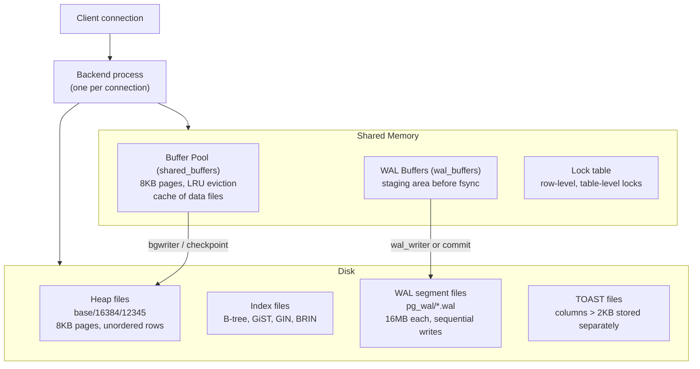
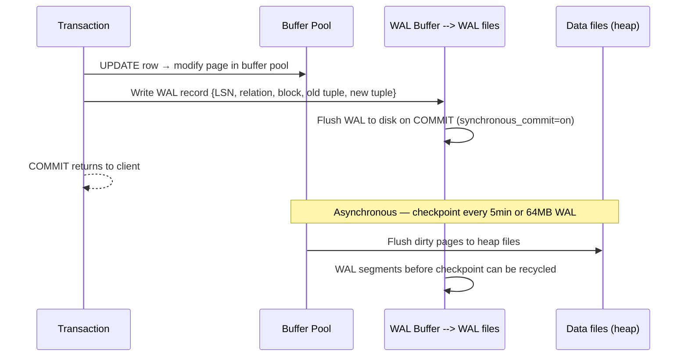
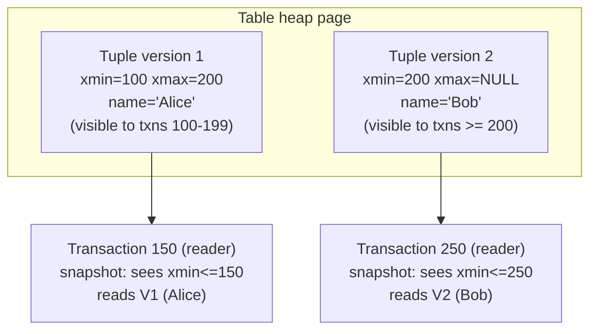
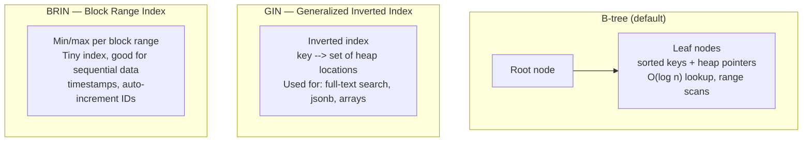
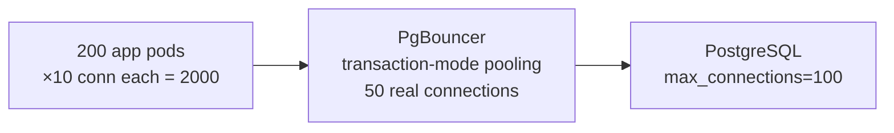
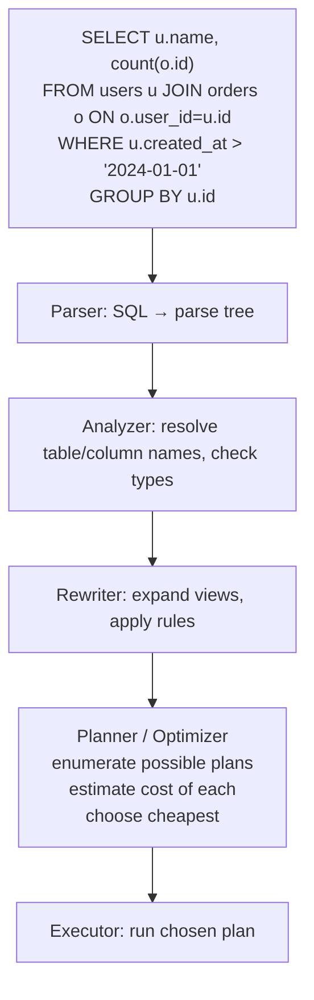
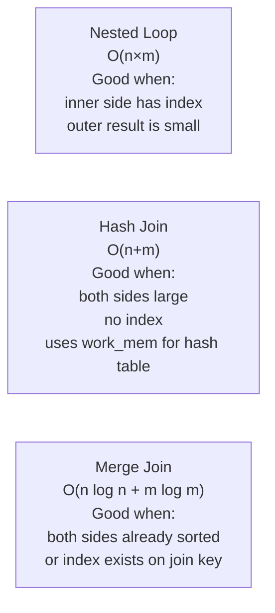
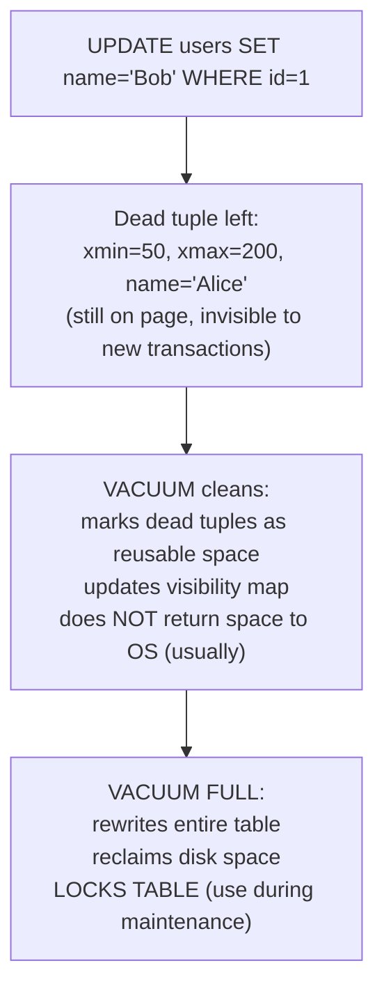
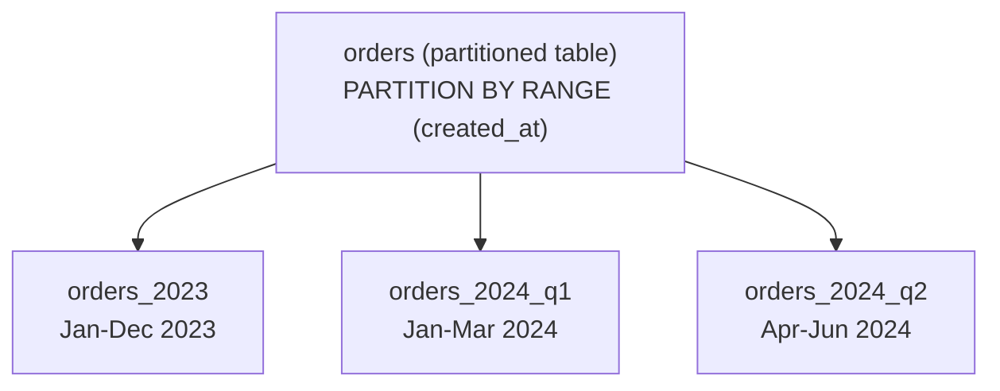
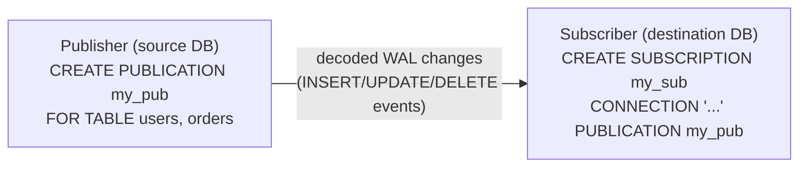

# PostgreSQL Internals

## Storage Architecture



---

## WAL — Write-Ahead Log in Detail

Every modification (INSERT, UPDATE, DELETE) writes a WAL record before the data page is changed.



**LSN (Log Sequence Number):** 64-bit monotonically increasing number. Every WAL record has an LSN. Replicas track which LSN they've replayed — this is the replication lag.

```sql
-- Check current WAL position
SELECT pg_current_wal_lsn();

-- Check replication lag
SELECT
    client_addr,
    sent_lsn - replay_lsn AS lag_bytes,
    EXTRACT(EPOCH FROM (now() - replay_lag)) AS lag_seconds
FROM pg_stat_replication;
```

---

## MVCC — How PostgreSQL Handles Concurrent Reads/Writes

PostgreSQL never overwrites a row in place. Every UPDATE creates a new row version.



**xmin/xmax system columns:**
- `xmin`: transaction ID that created this tuple version
- `xmax`: transaction ID that deleted/updated this tuple (NULL = still live)
- A tuple is visible if `xmin <= my_snapshot_xid < xmax`

**Dead tuples:** Old versions accumulate. `VACUUM` marks them as free space. `VACUUM FULL` rewrites the table (locks table, reclaims disk).

```sql
-- Check table bloat
SELECT
    relname,
    n_dead_tup,
    n_live_tup,
    round(n_dead_tup::numeric/NULLIF(n_live_tup+n_dead_tup,0)*100, 2) AS dead_pct
FROM pg_stat_user_tables
WHERE n_dead_tup > 10000
ORDER BY n_dead_tup DESC;

-- Force vacuum
VACUUM ANALYZE my_table;
VACUUM VERBOSE my_table;  -- shows what it freed
```

---

## Replication — Sync vs Async in Detail

```mermaid
sequenceDiagram
    participant APP as Application
    participant PRI as Primary (postgres-0)
    participant WAL_SEND as WAL Sender process
    participant WAL_RECV as WAL Receiver (replica)
    participant REP as Replica (postgres-1)

    APP->>PRI: BEGIN; UPDATE orders SET status='paid'; COMMIT;
    PRI->>PRI: Write WAL record to WAL buffer
    PRI->>PRI: Flush WAL to disk (always, for durability)

    Note over PRI,REP: ASYNC replication (default)
    PRI-->>APP: COMMIT returns immediately
    PRI->>WAL_SEND: Stream WAL to replica (best effort)
    WAL_SEND->>WAL_RECV: WAL data
    WAL_RECV->>REP: Apply WAL records
    Note over REP: Replica may be 0ms to minutes behind

    Note over PRI,REP: SYNC replication (synchronous_standby_names set)
    PRI->>WAL_SEND: Wait for replica ACK before returning to app
    WAL_SEND->>WAL_RECV: WAL data
    WAL_RECV->>WAL_RECV: Write to replica's WAL (flush to disk)
    WAL_RECV-->>WAL_SEND: ACK (flushed)
    WAL_SEND-->>PRI: Replica confirmed
    PRI-->>APP: COMMIT returns
    Note over REP: Data guaranteed on at least 2 disks before client sees commit
```

**Synchronous commit levels (granular control):**

```sql
-- Per-transaction override
SET synchronous_commit = 'remote_write';  -- stronger than off, weaker than on

-- Levels:
-- off          → WAL not even flushed locally (fastest, risk data loss on crash)
-- local        → WAL flushed locally only (default)
-- remote_write → replica received WAL in its OS buffer (not fsynced yet)
-- remote_apply → replica has replayed WAL and applied changes
-- on           → replica WAL flushed to disk (same as remote_apply for most uses)
```

| Level | Data loss on primary crash | Write latency |
|-------|--------------------------|---------------|
| `off` | Up to wal_writer_delay (200ms) | Fastest |
| `local` | No local loss, yes if replica needed | Normal |
| `remote_write` | No — replica has it in memory | +0.5× RTT |
| `on` / `remote_apply` | Zero — replica has it on disk | +1× RTT |

---

## Indexes



```sql
-- B-tree (default): equality + range on most types
CREATE INDEX idx_users_email ON users(email);

-- Partial index: only index rows matching a condition (smaller, faster)
CREATE INDEX idx_active_users ON users(email) WHERE deleted_at IS NULL;

-- Composite: multi-column (order matters — most selective first)
CREATE INDEX idx_orders_user_status ON orders(user_id, status);

-- GIN: full-text search
CREATE INDEX idx_posts_fts ON posts USING gin(to_tsvector('english', body));

-- BRIN: large append-only tables (logs, time-series)
CREATE INDEX idx_events_created ON events USING brin(created_at);

-- Check index usage
SELECT indexrelname, idx_scan, idx_tup_read
FROM pg_stat_user_indexes
WHERE idx_scan = 0;  -- unused indexes
```

---

## EXPLAIN ANALYZE

```sql
EXPLAIN (ANALYZE, BUFFERS, FORMAT TEXT)
SELECT u.name, COUNT(o.id)
FROM users u
JOIN orders o ON o.user_id = u.id
WHERE u.created_at > '2024-01-01'
GROUP BY u.id;

-- Key things to look for:
-- Seq Scan on large table → missing index
-- Nested Loop with many rows → should be Hash Join
-- Buffers: hit=X read=Y → X from cache, Y from disk
-- actual rows >> estimated rows → stale statistics (run ANALYZE)
-- cost=X..Y: X=startup cost, Y=total cost (in arbitrary units)
```

---

## Connection Pooling

PostgreSQL creates one OS process per connection (~10MB RAM each). At 1000 connections = 10GB just for processes.



```ini
# pgbouncer.ini
[pgbouncer]
pool_mode = transaction      # connection returned after each transaction (most efficient)
max_client_conn = 10000      # app pods can open many client connections
default_pool_size = 50       # actual PostgreSQL connections
reserve_pool_size = 10       # emergency pool
server_idle_timeout = 300    # close idle server connections after 5min
```

---

## Key Configuration Parameters

```ini
# postgresql.conf
shared_buffers = 4GB              # 25% of RAM for buffer pool
effective_cache_size = 12GB       # planner hint: how much OS cache is available
work_mem = 64MB                   # per-sort, per-hash operation (watch out: can multiply)
maintenance_work_mem = 512MB      # for VACUUM, CREATE INDEX, pg_restore
wal_level = replica               # needed for streaming replication
max_wal_senders = 10              # max replication connections
checkpoint_completion_target = 0.9 # spread checkpoint I/O
random_page_cost = 1.1            # SSD: set to 1.1 (same as seq scan)
effective_io_concurrency = 200    # SSD: number of concurrent I/O requests
```

---

## Query Planner — How PostgreSQL Chooses Execution Plans



**Cost model:** The planner assigns a cost (in arbitrary units) to each plan based on:
- `seq_page_cost` (default 1.0) — cost to read a page sequentially
- `random_page_cost` (default 4.0, use 1.1 for SSDs) — cost of a random page read
- `cpu_tuple_cost` (0.01) — cost per row processed
- Row count estimates from `pg_statistic` (updated by ANALYZE)

**Why plans go wrong:**
- Stale statistics → wrong row estimates → wrong plan choice
- Run `ANALYZE table_name` after bulk loads
- `autovacuum` runs ANALYZE automatically but may lag

```sql
-- Force statistics update
ANALYZE users;

-- See planner's row estimates vs actual
EXPLAIN (ANALYZE, FORMAT TEXT) SELECT * FROM users WHERE email = 'alice@example.com';
-- rows=1 (estimate) vs rows=1 (actual) ← good
-- rows=1000 (estimate) vs rows=1 (actual) ← bad — stale stats, will choose wrong plan

-- Increase statistics target for skewed columns
ALTER TABLE orders ALTER COLUMN status SET STATISTICS 500; -- default 100
ANALYZE orders;
```

---

## Join Types — When Planner Uses Each



```sql
-- Force a specific join type for testing
SET enable_hashjoin = off;    -- disable hash joins
SET enable_nestloop = off;    -- disable nested loops
EXPLAIN SELECT ... JOIN ...;  -- see what planner picks without preferred type
SET enable_hashjoin = on;     -- always reset after testing!
```

---

## VACUUM and Autovacuum

PostgreSQL never updates or deletes rows in place (MVCC). Dead tuples accumulate and must be reclaimed.



**Table bloat** — pages fill with dead tuples → table grows → queries slow (more pages to scan).

```sql
-- Check bloat
SELECT relname,
       pg_size_pretty(pg_relation_size(oid)) AS table_size,
       n_dead_tup,
       n_live_tup,
       round(100.0 * n_dead_tup / nullif(n_live_tup + n_dead_tup, 0), 1) AS dead_pct
FROM pg_stat_user_tables
WHERE n_dead_tup > 1000
ORDER BY n_dead_tup DESC;

-- Manual vacuum with verbose output
VACUUM (ANALYZE, VERBOSE) users;

-- Autovacuum thresholds (per-table override)
ALTER TABLE orders SET (
    autovacuum_vacuum_scale_factor = 0.01,  -- vacuum when 1% dead (default 20%)
    autovacuum_analyze_scale_factor = 0.005 -- analyze when 0.5% changed
);
```

---

## Partitioning

For very large tables (100M+ rows), partitioning divides the table into smaller physical pieces.



```sql
-- Declarative partitioning (PostgreSQL 10+)
CREATE TABLE orders (
    id BIGINT NOT NULL,
    user_id BIGINT,
    amount NUMERIC,
    created_at TIMESTAMPTZ NOT NULL
) PARTITION BY RANGE (created_at);

-- Create partitions
CREATE TABLE orders_2024_q1
    PARTITION OF orders
    FOR VALUES FROM ('2024-01-01') TO ('2024-04-01');

CREATE TABLE orders_2024_q2
    PARTITION OF orders
    FOR VALUES FROM ('2024-04-01') TO ('2024-07-01');

-- Query partition pruning: WHERE created_at = '2024-02-15'
-- PostgreSQL scans ONLY orders_2024_q1 — skips all other partitions
EXPLAIN SELECT * FROM orders WHERE created_at = '2024-02-15';
-- → Seq Scan on orders_2024_q1 (not the others)

-- Drop old data: drop a partition instantly (no row-by-row DELETE)
DROP TABLE orders_2023;  -- instant, reclaims disk space immediately
```

---

## Logical Replication

Streaming replication replicates everything. Logical replication lets you replicate specific tables to specific databases — useful for migrations, ETL, and multi-cloud.



```sql
-- On source database
CREATE PUBLICATION my_pub FOR TABLE users, orders;

-- On destination database (different server, different DB)
CREATE SUBSCRIPTION my_sub
  CONNECTION 'host=source-db user=replicator dbname=myapp'
  PUBLICATION my_pub;

-- Check replication lag
SELECT subname, received_lsn, latest_end_lsn,
       received_lsn - latest_end_lsn AS lag_bytes
FROM pg_stat_subscription;
```

**Use cases:** Zero-downtime major version upgrades (replicate to new version, cut over), selective table replication to data warehouse, real-time CDC without Debezium.

---

## Useful Diagnostic Queries

```sql
-- Long-running queries (> 5 minutes)
SELECT pid, now() - pg_stat_activity.query_start AS duration,
       query, state, wait_event_type, wait_event
FROM pg_stat_activity
WHERE query_start < now() - interval '5 minutes'
  AND state != 'idle'
ORDER BY duration DESC;

-- Locks and who is blocking whom
SELECT blocked.pid AS blocked_pid,
       blocked.query AS blocked_query,
       blocking.pid AS blocking_pid,
       blocking.query AS blocking_query
FROM pg_stat_activity blocked
JOIN pg_stat_activity blocking
  ON blocking.pid = ANY(pg_blocking_pids(blocked.pid));

-- Missing indexes (sequential scans on large tables)
SELECT relname, seq_scan, seq_tup_read,
       idx_scan, seq_tup_read / seq_scan AS avg_seq_tup
FROM pg_stat_user_tables
WHERE seq_scan > 0
ORDER BY seq_tup_read DESC
LIMIT 20;

-- Cache hit rate (should be > 99% for OLTP)
SELECT sum(heap_blks_hit) / (sum(heap_blks_hit) + sum(heap_blks_read)) AS cache_hit_ratio
FROM pg_statio_user_tables;

-- Table sizes including indexes and TOAST
SELECT relname,
       pg_size_pretty(pg_total_relation_size(oid)) AS total_size,
       pg_size_pretty(pg_relation_size(oid)) AS table_size,
       pg_size_pretty(pg_indexes_size(oid)) AS index_size
FROM pg_class
WHERE relkind = 'r'
ORDER BY pg_total_relation_size(oid) DESC
LIMIT 20;
```
