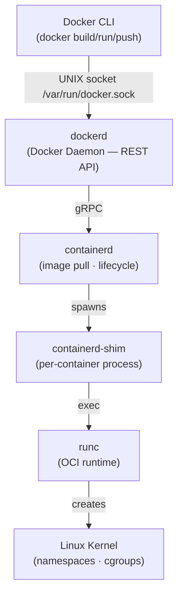
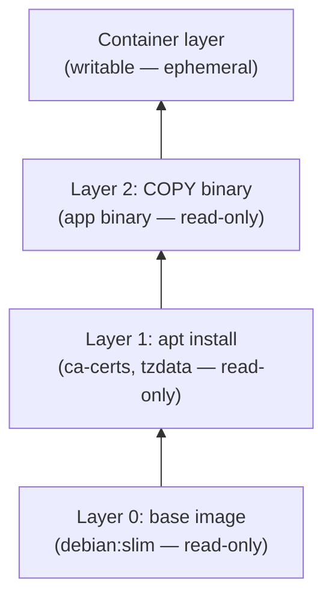

# Docker Reference

A production-focused Docker reference covering architecture, image layers, essential commands, Dockerfile best practices, Compose, and runtime flags.

---

## 1. Architecture



| Layer | Responsibility |
|---|---|
| Docker CLI | User-facing commands, sends requests to daemon |
| dockerd | Orchestrates builds, networks, volumes; delegates to containerd |
| containerd | Image distribution (OCI), snapshot management, container lifecycle |
| containerd-shim | Keeps container running if containerd restarts; reports exit codes |
| runc | Low-level OCI runtime — calls clone(2) to create namespaces |
| Kernel | pid/net/mnt/uts/ipc namespaces + cgroups v2 for resource limits |

---

## 2. Image Layers & Copy-on-Write



**How COW works:**

1. All image layers are **read-only** and stored once on disk (content-addressed by SHA256).
2. When a container starts, a thin **writable layer** is stacked on top via OverlayFS (`overlay2` driver).
3. Reading a file: OverlayFS finds it in the topmost layer that contains it — no copy needed.
4. Writing/modifying a file: the file is **copied up** from the read-only layer into the writable layer on first write, then modified there. The original layer is untouched.
5. Deleting a file: a **whiteout** file is created in the writable layer masking the lower layer entry.
6. When the container is removed, the writable layer is discarded. Image layers remain cached.

**Practical consequence:** Multiple containers from the same image share all read-only layers — only the writable layer is per-container.

---

## 3. Essential Commands

### Images

```bash
# Pull an image (latest tag if omitted)
docker pull golang:1.22-alpine

# Build from Dockerfile in current directory
docker build -t myapp:1.0 .

# Tag an existing image
docker tag myapp:1.0 registry.example.com/myapp:1.0

# Push to a registry
docker push registry.example.com/myapp:1.0

# List local images
docker images
docker images --filter "dangling=true"   # untagged layers

# Remove an image
docker rmi myapp:1.0
docker rmi $(docker images -q --filter "dangling=true")  # remove all dangling

# Show layer history + sizes
docker history myapp:1.0

# Full image metadata (JSON)
docker inspect myapp:1.0
```

### Containers

```bash
# Run a container (detached, named, port-mapped)
docker run -d --name api -p 8080:8080 myapp:1.0

# Execute a command in a running container
docker exec -it api sh

# Stream logs (follow + timestamps)
docker logs -f --timestamps api

# List running containers; -a includes stopped
docker ps
docker ps -a

# Graceful stop (SIGTERM → waits → SIGKILL after 10s)
docker stop api

# Immediate kill (SIGKILL)
docker kill api

# Remove a stopped container
docker rm api
docker rm -f api   # force-remove running container

# Low-level container metadata
docker inspect api

# Live resource usage (CPU, mem, net, block I/O)
docker stats api

# Processes inside a container
docker top api
```

### System

```bash
# Disk usage by images / containers / volumes / build cache
docker system df
docker system df -v   # verbose breakdown

# Remove stopped containers
docker container prune

# Remove unused images (dangling only)
docker image prune
docker image prune -a   # all images not used by a container

# Remove everything unused (containers, networks, images, cache)
docker system prune
docker system prune -a --volumes   # also volumes — destructive!

# Stream real-time Docker events
docker events
docker events --filter "type=container" --filter "event=die"
```

### Build

```bash
# Build without cache (force fresh layer resolution)
docker build --no-cache -t myapp:1.0 .

# Build a specific stage from a multi-stage Dockerfile
docker build --target builder -t myapp:builder .

# Pass build-time variables
docker build --build-arg GO_VERSION=1.22 -t myapp:1.0 .

# Multi-platform build with buildx (requires buildx plugin)
docker buildx create --use --name multi
docker buildx build \
  --platform linux/amd64,linux/arm64 \
  --push \
  -t registry.example.com/myapp:1.0 .
```

---

## 4. Dockerfile Best Practices (Production Go)

```dockerfile
# syntax=docker/dockerfile:1
# ---------- build stage ----------
# Pin exact base image digest for reproducibility.
# Use alpine for small footprint; golang image has the full toolchain.
FROM golang:1.22-alpine AS builder

# Install only what the build needs. Combine RUN commands to reduce layers.
# ca-certificates needed for TLS in scratch image; git for go modules with VCS deps.
RUN apk add --no-cache ca-certificates git tzdata

WORKDIR /src

# Copy go.mod and go.sum BEFORE source code.
# This layer is cached as long as dependencies don't change — avoids re-downloading
# modules on every code change.
COPY go.mod go.sum ./
RUN go mod download

# Now copy source. Cache miss here only rebuilds the binary, not module download.
COPY . .

# CGO_ENABLED=0 → fully static binary (no libc dependency).
# -ldflags "-s -w" strips debug info and DWARF → smaller binary.
# -trimpath removes local filesystem paths from the binary.
RUN CGO_ENABLED=0 GOOS=linux go build \
    -ldflags="-s -w" \
    -trimpath \
    -o /out/api \
    ./cmd/api

# ---------- final stage ----------
# scratch = zero-byte base. The only files are what we COPY in.
# Alternatives: gcr.io/distroless/static-debian12 (adds ca-certs + tz data).
FROM scratch AS final

# Copy trusted CA bundle so the binary can validate TLS certs.
COPY --from=builder /etc/ssl/certs/ca-certificates.crt /etc/ssl/certs/

# Copy timezone data so time.LoadLocation works.
COPY --from=builder /usr/share/zoneinfo /usr/share/zoneinfo

# Copy the compiled binary from the builder stage.
# COPY is preferred over ADD; ADD has implicit tar-extraction and URL-fetch behaviour
# which is surprising and rarely needed.
COPY --from=builder /out/api /api

# Run as non-root. scratch has no useradd, so use numeric UID directly.
# Principle of least privilege: a compromised process can't write to the filesystem.
USER 65532:65532

EXPOSE 8080

# ENTRYPOINT sets the executable; CMD provides default arguments.
# Using exec form (JSON array) avoids a shell wrapper — signals go directly to the
# process, which means SIGTERM is handled properly for graceful shutdown.
ENTRYPOINT ["/api"]
CMD ["--addr", ":8080"]
```

**Key decisions explained:**

| Decision | Reason |
|---|---|
| Two-stage build | Builder stage has compiler + tools; final stage is minimal, no attack surface |
| Copy go.mod first | Dependency layer cached independently from source changes |
| `CGO_ENABLED=0` | Static binary works in scratch/distroless without libc |
| `-ldflags="-s -w"` | Strips symbol table + DWARF → 30–40% size reduction |
| `FROM scratch` | Zero OS — no shell, no package manager, minimal CVE surface |
| Non-root UID 65532 | Matches `nonroot` user in distroless; principle of least privilege |
| ENTRYPOINT + CMD | ENTRYPOINT = fixed binary; CMD = overridable defaults at `docker run` |

**Follow-up: `CMD` vs `ENTRYPOINT` — exact behaviour matrix**

| | No ENTRYPOINT | `ENTRYPOINT ["/bin/app"]` |
|--|---------------|--------------------------|
| No CMD | Error — nothing to run | `/bin/app` |
| `CMD ["--port","8080"]` | `/bin/sh -c --port 8080` (shell form) or runs cmd directly | `/bin/app --port 8080` |
| `docker run img --port 9090` | Overrides CMD → runs `--port 9090` | `/bin/app --port 9090` (CMD replaced) |

**Key rules:**
- `ENTRYPOINT` (exec form) = the process that receives SIGTERM. Always use exec form `["binary"]` not shell form `"binary"` — shell form wraps in `/bin/sh -c` which doesn't forward signals → container ignores SIGTERM → gets SIGKILL after grace period.
- `CMD` = default arguments, overridden by anything after the image name in `docker run`
- `ENTRYPOINT` = fixed command, overridden only with `--entrypoint` flag

```dockerfile
# Correct — exec form, signals go directly to /api
ENTRYPOINT ["/api"]
CMD ["--port", "8080"]

# Wrong — shell form, SIGTERM goes to /bin/sh not /api
ENTRYPOINT /api --port 8080
```

**Follow-up: `COPY` vs `ADD` — which to use?**

Always use `COPY` unless you specifically need `ADD`'s extra behaviours:

| | `COPY` | `ADD` |
|--|--------|-------|
| Local file → image | ✅ | ✅ |
| Auto-extract `.tar.gz` | ❌ | ✅ |
| Fetch from URL | ❌ | ✅ (but don't — use `RUN curl` for layer caching) |
| Predictability | Always copies as-is | Surprising: `.tar` gets extracted silently |

```dockerfile
COPY app.tar.gz /tmp/          # copies the .tar.gz file as-is
ADD  app.tar.gz /tmp/          # silently extracts to /tmp/ ← surprising
```

Best practice: use `COPY` for everything. Use `RUN curl | tar` if you need URL-fetched archives (gives you explicit control and a single layer).

---

## 5. Docker Compose

```yaml
# compose.yml
services:
  api:
    build:
      context: .
      target: final
    image: myapp:local
    env_file: .env              # keeps secrets out of compose file
    ports:
      - "8080:8080"
    networks:
      - backend
    depends_on:
      postgres:
        condition: service_healthy   # wait for health check, not just start
      redis:
        condition: service_healthy
    restart: unless-stopped
    deploy:
      resources:
        limits:
          cpus: "0.50"
          memory: 256M
    healthcheck:
      test: ["CMD", "wget", "-qO-", "http://localhost:8080/healthz"]
      interval: 10s
      timeout: 5s
      retries: 3
      start_period: 15s

  postgres:
    image: postgres:16-alpine
    env_file: .env              # POSTGRES_USER, POSTGRES_PASSWORD, POSTGRES_DB
    volumes:
      - pg_data:/var/lib/postgresql/data   # named volume — survives container removal
    networks:
      - backend
    deploy:
      resources:
        limits:
          cpus: "1.00"
          memory: 512M
    healthcheck:
      test: ["CMD-SHELL", "pg_isready -U $$POSTGRES_USER -d $$POSTGRES_DB"]
      interval: 10s
      timeout: 5s
      retries: 5
      start_period: 20s

  redis:
    image: redis:7-alpine
    command: redis-server --save 60 1 --loglevel warning
    volumes:
      - redis_data:/data
    networks:
      - backend
    deploy:
      resources:
        limits:
          cpus: "0.25"
          memory: 128M
    healthcheck:
      test: ["CMD", "redis-cli", "ping"]
      interval: 10s
      timeout: 3s
      retries: 3

volumes:
  pg_data:    # Docker manages the path; data persists across `docker compose down`
  redis_data:

networks:
  backend:
    driver: bridge  # default; containers on this network reach each other by service name
```

**Notable patterns:**

- `depends_on` with `condition: service_healthy` — container starts only after dependency passes its health check, not just when it starts.
- `env_file: .env` — credentials never appear in `compose.yml`; add `.env` to `.gitignore`.
- Named volumes (`pg_data`, `redis_data`) — data survives `docker compose down`; only `docker compose down -v` removes them.
- Service discovery — containers reach each other by service name (`postgres:5432`, `redis:6379`) via the `backend` network.
- Resource limits prevent a runaway service from starving others on the same host.

---

## 6. Container Runtime Flags

```bash
docker run [FLAGS] IMAGE [COMMAND]
```

### Volume & Storage

| Flag | Purpose | Example |
|---|---|---|
| `-v src:dst[:opts]` | Bind mount or named volume | `-v /data:/app/data:ro` |
| `--mount` | Explicit mount syntax (preferred) | `--mount type=bind,src=/data,dst=/app/data,readonly` |

`--mount` is preferred over `-v` for clarity — it separates `type`, `src`, `dst`, and options explicitly.

```bash
# Named volume
docker run --mount type=volume,src=pg_data,dst=/var/lib/postgresql/data postgres:16

# Read-only bind mount
docker run --mount type=bind,src=$(pwd)/config,dst=/config,readonly myapp
```

### Networking

| Flag | Purpose | Example |
|---|---|---|
| `-p host:container` | Publish a port | `-p 8080:8080` |
| `--network` | Attach to a network | `--network backend` |
| `--network host` | Share host network namespace | `--network host` |
| `--network none` | No network access | `--network none` |

### Security

| Flag | Purpose | Example |
|---|---|---|
| `--cap-drop ALL` | Drop all Linux capabilities | `--cap-drop ALL` |
| `--cap-add NET_BIND_SERVICE` | Add back only what's needed | `--cap-add NET_BIND_SERVICE` |
| `--security-opt no-new-privileges` | Prevent privilege escalation via setuid | `--security-opt no-new-privileges:true` |
| `--security-opt seccomp=profile.json` | Apply custom seccomp filter | `--security-opt seccomp=/path/to/profile.json` |
| `--read-only` | Mount root filesystem read-only | `--read-only` |
| `-u uid:gid` | Run as specific user | `-u 65532:65532` |

```bash
# Hardened container: no capabilities, no privilege escalation, read-only rootfs
docker run \
  --cap-drop ALL \
  --security-opt no-new-privileges:true \
  --read-only \
  --tmpfs /tmp \           # writable tmpfs only where needed
  -u 65532:65532 \
  myapp:1.0
```

### Resource Limits

| Flag | Purpose | Example |
|---|---|---|
| `--memory` | Hard memory limit | `--memory 256m` |
| `--memory-swap` | Total memory+swap limit | `--memory-swap 256m` (= no swap) |
| `--cpus` | CPU quota (fractional cores) | `--cpus 0.5` |
| `--cpu-shares` | Relative CPU weight | `--cpu-shares 512` |
| `--pids-limit` | Max number of processes | `--pids-limit 100` |

### Restart Policy

| Flag | Behavior |
|---|---|
| `--restart no` | Never restart (default) |
| `--restart on-failure[:n]` | Restart on non-zero exit; optional max retries |
| `--restart unless-stopped` | Always restart unless manually stopped |
| `--restart always` | Always restart, even after daemon restart |

```bash
# Production-like run combining several flags
docker run -d \
  --name api \
  -p 8080:8080 \
  --network backend \
  --memory 256m \
  --cpus 0.5 \
  --cap-drop ALL \
  --security-opt no-new-privileges:true \
  --read-only \
  --tmpfs /tmp \
  --restart unless-stopped \
  myapp:1.0
```

---

## Quick Reference Card

```
Build cycle:     docker build → docker tag → docker push
Run cycle:       docker run  → docker exec → docker logs → docker stop → docker rm
Debug:           docker inspect · docker stats · docker top · docker events
Cleanup:         docker system prune -a --volumes
Multi-platform:  docker buildx build --platform linux/amd64,linux/arm64 --push
```

---

## 7. Storage Drivers

The storage driver controls how image layers are stacked and how COW works on disk.

| Driver | Kernel feature | Status | Use when |
|--------|---------------|--------|----------|
| `overlay2` | OverlayFS | **Default, recommended** | All modern Linux kernels (4.0+) |
| `devicemapper` | Device Mapper | Deprecated | Old RHEL/CentOS kernels |
| `btrfs` | Btrfs | Niche | Already on Btrfs filesystem |
| `zfs` | ZFS | Niche | Already on ZFS |
| `vfs` | None (full copy) | Testing only | No COW — each layer is a full copy |

**overlay2 directory structure:**

```
/var/lib/docker/overlay2/
  <layer-id>/
    diff/        ← actual files in this layer
    link         ← short ID symlink
    lower        ← IDs of all lower layers (colon-separated)
    work/        ← OverlayFS internal use
    merged/      ← union mount (only exists while container is running)
```

```bash
# See driver in use
docker info | grep "Storage Driver"

# Inspect a container's overlay2 layers
docker inspect api --format '{{.GraphDriver.Data}}'
# Shows: LowerDir, UpperDir, WorkDir, MergedDir
```

---

## 8. Build Cache Mechanics

Understanding cache invalidation prevents slow builds.

```
Dockerfile instruction → cache key = (parent layer hash + instruction string + context)

COPY/ADD additionally hash the file contents of what they copy.
```

**Cache invalidation rules:**

```dockerfile
FROM golang:1.22-alpine          # ← cache key: image digest

RUN apk add --no-cache git       # ← only invalidated if instruction text changes
                                  #   or parent layer changes

COPY go.mod go.sum ./            # ← invalidated if go.mod OR go.sum changes
RUN go mod download              # ← only reruns if COPY above was a cache miss

COPY . .                         # ← invalidated if ANY source file changes
RUN go build -o /app ./cmd/api   # ← reruns only if COPY above was a cache miss
```

**Why order matters:** place instructions that change frequently **later** in the Dockerfile.

```bash
# Force no cache (e.g. to pick up security patches in base image)
docker build --no-cache .

# Use a specific cache source (BuildKit)
docker build --cache-from=registry.example.com/myapp:latest .

# BuildKit cache mounts — persist cache between builds without layer bloat
RUN --mount=type=cache,target=/root/.cache/go/pkg/mod \
    go mod download
```

---

## 9. Health Checks

Health checks let Docker (and K8s) know if a container is actually working, not just running.

```dockerfile
# In Dockerfile
HEALTHCHECK --interval=30s --timeout=5s --start-period=15s --retries=3 \
  CMD wget -qO- http://localhost:8080/healthz || exit 1
```

```yaml
# In docker-compose
healthcheck:
  test: ["CMD", "wget", "-qO-", "http://localhost:8080/healthz"]
  interval: 30s       # check every 30s
  timeout: 5s         # fail if no response in 5s
  retries: 3          # mark unhealthy after 3 consecutive failures
  start_period: 15s   # grace period after start before failures count
```

**States:** `starting` → `healthy` / `unhealthy`

```bash
# Check health status
docker inspect api --format='{{.State.Health.Status}}'
docker inspect api --format='{{json .State.Health}}' | jq

# In Compose: depends_on with condition: service_healthy
# waits for health check to pass before starting dependent service
```

**Health check in scratch/distroless images:** no `wget`/`curl` available. Use a tiny Go binary:

```go
// cmd/healthcheck/main.go
func main() {
    resp, err := http.Get("http://localhost:8080/healthz")
    if err != nil || resp.StatusCode != 200 { os.Exit(1) }
}
```

```dockerfile
COPY --from=builder /out/healthcheck /healthcheck
HEALTHCHECK CMD ["/healthcheck"]
```
