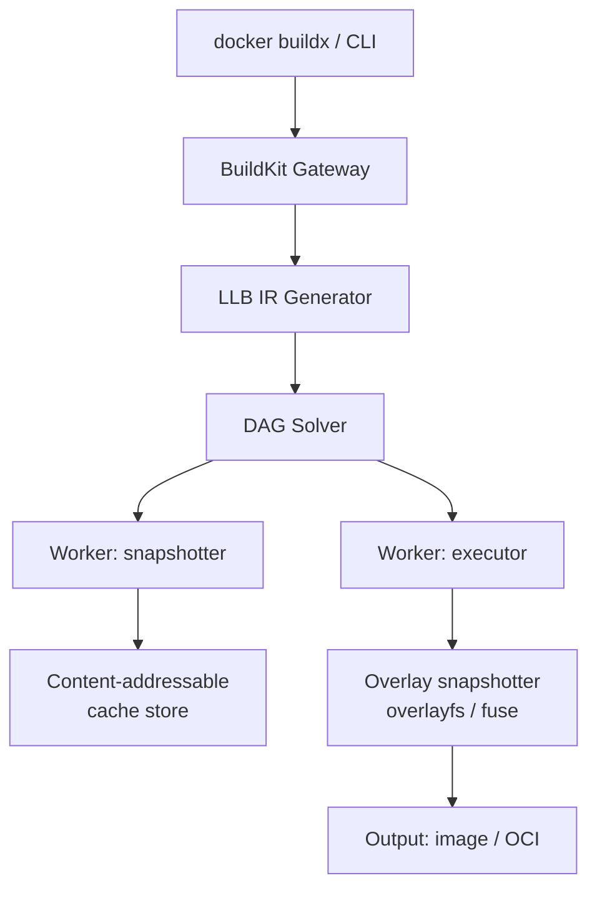
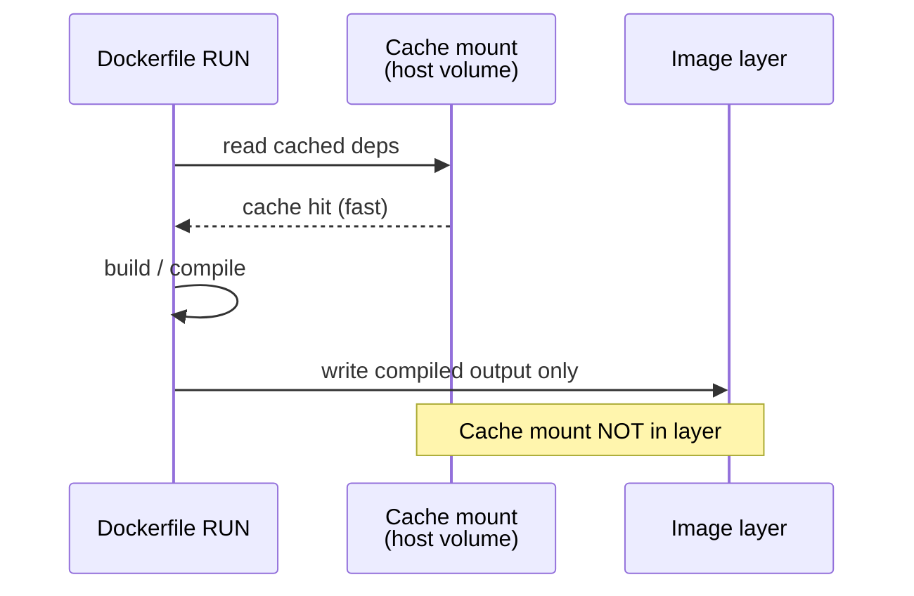

# BuildKit

## 1. Architecture



- **buildkitd**: daemon that receives LLB graphs and executes them
- **LLB (Low-Level Build)**: protobuf IR — a DAG of operations (exec, copy, mount)
- **Snapshotter**: manages layer snapshots (overlayfs, native, fuse-overlayfs)
- **Worker**: executes each LLB operation in isolation

## 2. Parallel Stage Execution

Classic builder executes stages sequentially. BuildKit builds the dependency DAG and runs independent stages in parallel.

```dockerfile
FROM golang:1.22 AS builder
RUN go build -o /app .

FROM node:20 AS frontend       # independent of builder
RUN npm ci && npm run build

FROM alpine AS final
COPY --from=builder /app /app
COPY --from=frontend /dist /static
```



```mermaid
gantt
    title BuildKit parallel vs sequential
    dateFormat X
    axisFormat %s s

    section Classic Builder
    base image pull   : 0, 3
    builder stage     : 3, 8
    frontend stage    : 8, 13
    final stage       : 13, 15

    section BuildKit
    builder stage     : 0, 5
    frontend stage    : 0, 4
    final stage       : 5, 7
```

BuildKit detects that `builder` and `frontend` have no dependency → runs them concurrently.

## 3. Cache Mounts

Cache mounts persist across builds — the directory is **not** part of the image layer.

```dockerfile
# Go modules cache
RUN --mount=type=cache,target=/go/pkg/mod \
    --mount=type=cache,target=/root/.cache/go-build \
    go build -o /app .

# apt cache
RUN --mount=type=cache,target=/var/cache/apt \
    apt-get update && apt-get install -y curl

# npm cache
RUN --mount=type=cache,target=/root/.npm \
    npm ci
```



Cache scope options:
```dockerfile
# shared (default): all builds share the cache
RUN --mount=type=cache,target=/go/pkg/mod,sharing=shared

# locked: exclusive access per build
RUN --mount=type=cache,target=/go/pkg/mod,sharing=locked

# private: each build gets its own copy
RUN --mount=type=cache,target=/go/pkg/mod,sharing=private
```

## 4. Secret Mounts

Secrets are available only during the `RUN` step — never written to any layer.

```dockerfile
RUN --mount=type=secret,id=gh_token \
    GITHUB_TOKEN=$(cat /run/secrets/gh_token) \
    GONOSUMCHECK=* GOFLAGS=-mod=mod \
    go mod download
```

```bash
docker buildx build \
  --secret id=gh_token,env=GITHUB_TOKEN \
  -t myapp:latest .
```

Verification — secret is absent from history:
```bash
docker history myapp:latest   # no token visible
docker save myapp:latest | tar xO | strings | grep -c TOKEN  # 0
```

## 5. SSH Agent Forwarding

For private Git repos without exposing keys:

```dockerfile
FROM golang:1.22
RUN mkdir -p -m 0700 ~/.ssh && \
    ssh-keyscan github.com >> ~/.ssh/known_hosts
RUN --mount=type=ssh \
    git clone git@github.com:myorg/private-repo.git
```

```bash
eval $(ssh-agent)
ssh-add ~/.ssh/id_ed25519

docker buildx build \
  --ssh default=$SSH_AUTH_SOCK \
  -t myapp:latest .
```

## 6. Multi-Platform Builds

```bash
# Create a multi-platform builder
docker buildx create --name multiarch --driver docker-container --use
docker buildx inspect --bootstrap

# Build for multiple platforms and push
docker buildx build \
  --platform linux/amd64,linux/arm64,linux/arm/v7 \
  --push \
  -t myorg/myapp:v1.0.0 .
```

BuildKit uses QEMU for cross-compilation when native hardware is unavailable. For Go, prefer `CGO_ENABLED=0` with `GOARCH` set to avoid QEMU overhead:

```dockerfile
FROM --platform=$BUILDPLATFORM golang:1.22 AS builder
ARG TARGETOS TARGETARCH
RUN CGO_ENABLED=0 GOOS=$TARGETOS GOARCH=$TARGETARCH go build -o /app .
```

## 7. Inline Cache

Push cache metadata to the registry alongside the image:

```bash
# Push image + cache metadata
docker buildx build \
  --cache-to type=registry,ref=myorg/myapp:cache,mode=max \
  --push -t myorg/myapp:latest .

# Pull cache on next build (CI)
docker buildx build \
  --cache-from type=registry,ref=myorg/myapp:cache \
  --push -t myorg/myapp:latest .
```

`mode=max` exports cache for all intermediate layers (not just final). Use in CI for maximum reuse.

Other cache backends:
```bash
# Local filesystem cache
--cache-to type=local,dest=/tmp/buildcache,mode=max
--cache-from type=local,src=/tmp/buildcache

# GitHub Actions cache
--cache-to type=gha,mode=max
--cache-from type=gha
```

## 8. Output Types

```bash
# Default: image in local Docker daemon
docker buildx build -t myapp:latest .

# OCI tarball (portable)
docker buildx build --output type=oci,dest=./myapp.tar .

# Plain tarball
docker buildx build --output type=tar,dest=./myapp.tar .

# Local directory (extract filesystem)
docker buildx build --output type=local,dest=./out .

# Push directly to registry
docker buildx build --output type=image,push=true -t myorg/myapp:latest .
```

| Output type | Use case |
|-------------|----------|
| `image` | Standard Docker image, push to registry |
| `oci` | OCI-compliant tar, use with `skopeo`, `podman` |
| `tar` | Raw filesystem archive |
| `local` | Extract build artifacts to host directory |
