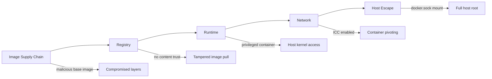
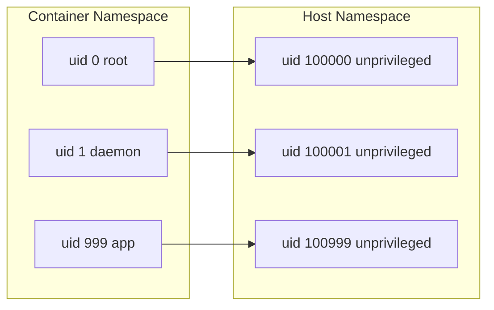
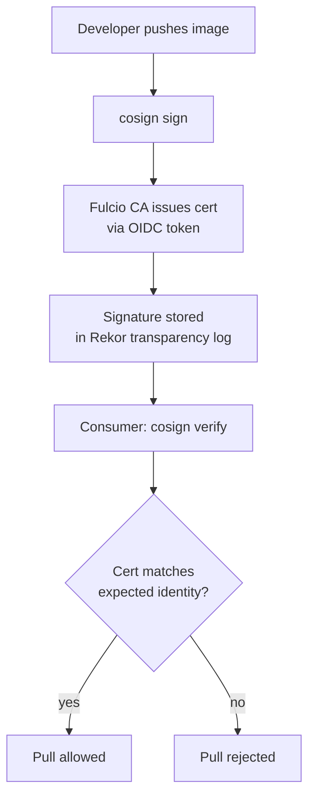
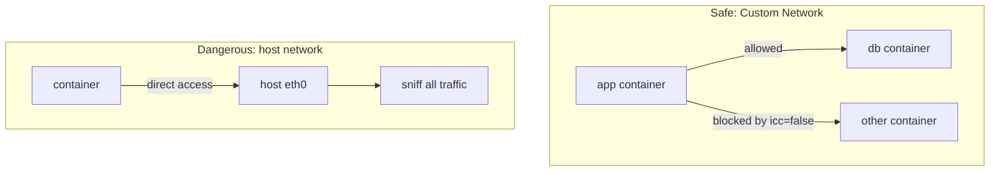

# Docker Security

## 1. Attack Surface



## 2. Rootless Docker: UID Remapping

Docker runs containers as root by default. Rootless mode remaps UIDs via user namespaces.

```
Container UID 0   →   Host UID 100000
Container UID 1   →   Host UID 100001
Container UID 999 →   Host UID 100999
```

Formula: `host_uid = subordinate_uid_start + container_uid`

Default subordinate range in `/etc/subuid`:
```
dockremap:100000:65536
```

So `container uid 0` = `host uid 100000` — never actual root on host.



Enable rootless:
```bash
dockerd-rootless-setuptool.sh install
export DOCKER_HOST=unix://$XDG_RUNTIME_DIR/docker.sock
```

## 3. Docker Socket Danger

`/var/run/docker.sock` grants **full Docker API access = root on host**.

**The escape:**
```bash
# Attacker inside a container with socket mounted:
docker -H unix:///var/run/docker.sock run -it \
  --rm --privileged \
  -v /:/host \
  alpine chroot /host sh
# Result: root shell on the host
```

Never mount the socket in untrusted containers. If CI/CD needs it, use:
- **Docker-in-Docker (dind)** with a sidecar
- **Kaniko** or **Buildah** (daemonless builds)
- **Socket proxies** like `docker-socket-proxy` with read-only ACLs

## 4. Image Scanning with Trivy

```bash
# Scan an image
trivy image nginx:latest

# Fail CI on CRITICAL or HIGH
trivy image --exit-code 1 --severity CRITICAL,HIGH myapp:latest

# Scan filesystem (in CI before build)
trivy fs --severity CRITICAL,HIGH .
```

CVE severity levels:
| Level | CVSS Score | Action |
|-------|-----------|--------|
| CRITICAL | 9.0–10.0 | Block immediately |
| HIGH | 7.0–8.9 | Block in CI |
| MEDIUM | 4.0–6.9 | Track / schedule fix |
| LOW | 0.1–3.9 | Informational |

CI pipeline block:
```yaml
# GitHub Actions
- name: Scan image
  run: trivy image --exit-code 1 --severity CRITICAL,HIGH $IMAGE
```

## 5. Content Trust: cosign + Sigstore

**Keyless signing** with Sigstore (no long-lived keys, uses OIDC identity):

```bash
# Sign after push (keyless via Sigstore Fulcio CA)
cosign sign --yes ghcr.io/myorg/myapp:v1.0.0

# Verify on pull
cosign verify \
  --certificate-identity-regexp="https://github.com/myorg/myapp" \
  --certificate-oidc-issuer="https://token.actions.githubusercontent.com" \
  ghcr.io/myorg/myapp:v1.0.0
```



## 6. Runtime Hardening

```bash
docker run \
  --cap-drop ALL \                          # drop all Linux capabilities
  --cap-add NET_BIND_SERVICE \              # add back only what's needed
  --security-opt no-new-privileges \        # prevent privilege escalation via setuid
  --security-opt seccomp=seccomp.json \     # restrict syscalls
  --read-only \                             # immutable filesystem
  --tmpfs /tmp \                            # writable scratch space
  --user 1000:1000 \                        # non-root user
  myapp:latest
```

Key capabilities to never grant:
- `SYS_ADMIN` — nearly equals root
- `NET_ADMIN` — reconfigure host networking
- `SYS_PTRACE` — inspect/modify other processes

Default seccomp profile blocks ~44 syscalls including `ptrace`, `mount`, `kexec_load`.

## 7. BuildKit Secrets (Never in Layer)

```dockerfile
# WRONG — secret baked into image layer
RUN curl -H "Authorization: Bearer $TOKEN" https://api.example.com

# CORRECT — secret mounted at build time, not in layer
RUN --mount=type=secret,id=mysecret \
    TOKEN=$(cat /run/secrets/mysecret) && \
    curl -H "Authorization: Bearer $TOKEN" https://api.example.com
```

```bash
# Build with secret
docker buildx build \
  --secret id=mysecret,src=.env \
  -t myapp:latest .
```

Secret is **never** in:
- Image layers
- `docker history`
- The build cache

## 8. Network Hardening

**Disable ICC (inter-container communication):**
```json
// /etc/docker/daemon.json
{
  "icc": false,
  "iptables": true
}
```

With `--icc=false`, containers on the default bridge cannot talk to each other unless explicitly linked.

**Use custom networks:**
```bash
# Only containers on the same named network can communicate
docker network create --driver bridge app-net
docker run --network app-net myapp
docker run --network app-net mydb
```

**Never `--network host` in production:**
- Container shares host network stack
- Bypasses all network isolation
- A compromised container can sniff all host traffic


