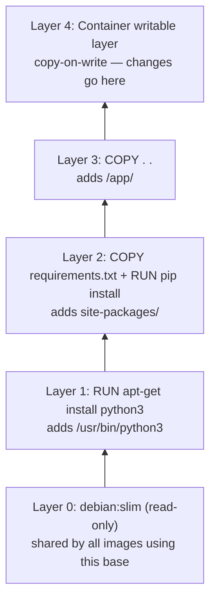
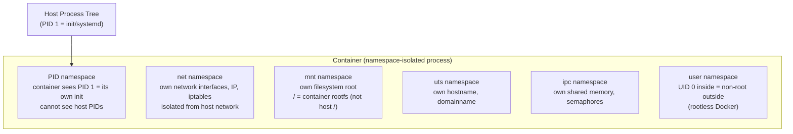
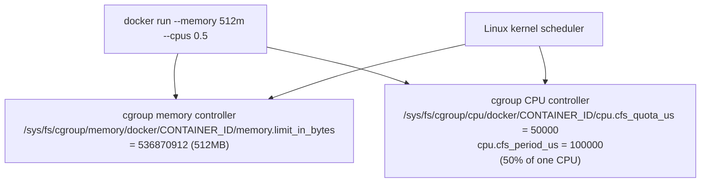
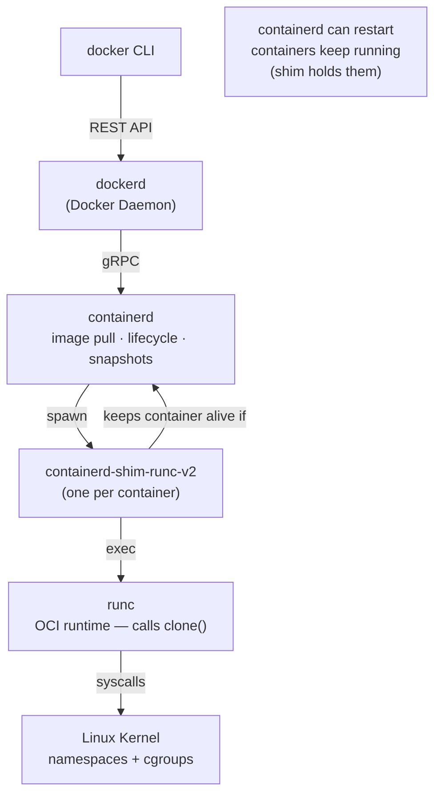

# Docker Internals — Layers, Isolation, and containerd

## Image Layers and Copy-on-Write

Every Dockerfile instruction creates a layer. Layers are **immutable** and **shared** across images.



**Copy-on-Write (CoW):** When a container modifies a file from a lower read-only layer, the storage driver copies the file to the writable layer first, then modifies it. Lower layers are never changed — only the copy in the writable layer changes.

```bash
# See layers of an image
docker history --no-trunc my-image:v1
# IMAGE               CREATED    CREATED BY                     SIZE
# sha256:abc123...    1 day ago  COPY . .                       2.4MB
# sha256:def456...    1 day ago  RUN pip install -r req.txt     145MB
# sha256:ghi789...    2 days ago RUN apt-get install python3    56MB
# sha256:base000...   1 week ago /bin/sh -c #(nop) CMD          0B

# Storage driver (overlayfs on modern Linux)
docker info | grep Storage
# Storage Driver: overlay2
```

### Why Layer Order Matters

```dockerfile
# BAD: source code copied before dependencies
# → Any code change invalidates the pip install layer → full reinstall
FROM python:3.11-slim
COPY . .                          # changes every commit
RUN pip install -r requirements.txt  # reinstalls every commit

# GOOD: stable layers first
FROM python:3.11-slim
COPY requirements.txt .           # only changes when deps change
RUN pip install -r requirements.txt  # cached unless requirements.txt changes
COPY . .                          # code changes don't bust the dep layer
```

---

## How Docker Isolates Processes — Linux Namespaces

Docker containers are just **Linux processes with restricted visibility**. No hypervisor, no separate kernel. The isolation comes from Linux namespaces.



| Namespace | What it isolates |
|-----------|----------------|
| `pid` | Process IDs — container sees PID 1, can't see host processes |
| `net` | Network interfaces, IP, routing, iptables |
| `mnt` | Mount points — container has its own `/` |
| `uts` | Hostname and domain name |
| `ipc` | IPC objects (shared memory, semaphores, message queues) |
| `user` | UID/GID mapping — root inside is not root outside |
| `cgroup` | cgroup root — container has its own cgroup hierarchy |

```bash
# Verify: container's PID namespace
docker run --rm alpine ps aux
# PID   USER     COMMAND
# 1     root     ps aux   ← container sees itself as PID 1

# Host sees the real PID
ps aux | grep alpine   # different, higher PID
```

---

## Resource Limits — Linux cgroups

cgroups (control groups) enforce **resource limits**. Docker translates `--memory` and `--cpus` flags into cgroup file writes.



```bash
# Read container's actual cgroup limits from inside
cat /sys/fs/cgroup/memory/memory.limit_in_bytes    # cgroup v1
cat /sys/fs/cgroup/memory.max                       # cgroup v2

# From host — find container cgroup
docker inspect <container> --format='{{.HostConfig.Memory}}'
# 536870912

# Verify CPU throttling
cat /sys/fs/cgroup/cpu/docker/CONTAINER_ID/cpu.stat
# nr_throttled: 45   ← this many scheduling periods were throttled
```

---

## Who Manages Containers — containerd and shims



| Component | Responsibility |
|-----------|---------------|
| `dockerd` | Image build, Compose, volumes, networks. Delegates runtime to containerd. |
| `containerd` | Image distribution (OCI), container lifecycle, snapshot management |
| `containerd-shim` | One per container. Keeps container running if containerd restarts. Reports exit codes. |
| `runc` | Low-level OCI runtime. Calls `clone(2)` to create namespaces, then `exec`. |
| Linux kernel | Enforces namespaces + cgroup limits. |

**Why the shim?** If containerd is upgraded/restarted, all containers would die if they were direct children of containerd. The shim is a long-lived process that owns each container — containerd can restart without affecting running containers.

### K8s uses containerd directly (no dockerd)


In Kubernetes, the Docker daemon is not involved at all. kubelet speaks directly to containerd via the CRI (Container Runtime Interface) gRPC API.

---

## Docker Image Optimization

```dockerfile
# Production Go binary — 3-stage build

# Stage 1: Download dependencies (cached layer)
FROM golang:1.23-alpine AS deps
WORKDIR /app
COPY go.mod go.sum ./
RUN go mod download

# Stage 2: Build binary
FROM deps AS builder
COPY . .
RUN CGO_ENABLED=0 GOOS=linux go build \
    -ldflags="-s -w" \     # strip debug symbols → 30-40% smaller binary
    -o /out/api ./cmd/api

# Stage 3: Minimal runtime image
FROM gcr.io/distroless/static-debian12
# distroless = no shell, no package manager, no /bin, ~2MB base
# attack surface is minimal
COPY --from=builder /out/api /api
USER nonroot:nonroot          # never run as root
EXPOSE 8080
ENTRYPOINT ["/api"]           # exec form — SIGTERM goes directly to process
```

| Optimization | Savings | How |
|-------------|---------|-----|
| Multi-stage build | 90%+ | Final image has binary only, no compiler/tools |
| `distroless` base | ~50MB → 2MB | No OS tools, no shell |
| `-ldflags="-s -w"` | 30-40% binary size | Strip symbol table + DWARF |
| `CGO_ENABLED=0` | Enables scratch/distroless | Static binary, no libc dependency |
| `.dockerignore` | Faster builds | Exclude `.git`, `node_modules`, test data |
| COPY deps before src | Cache efficiency | Only reinstall when go.mod changes |
