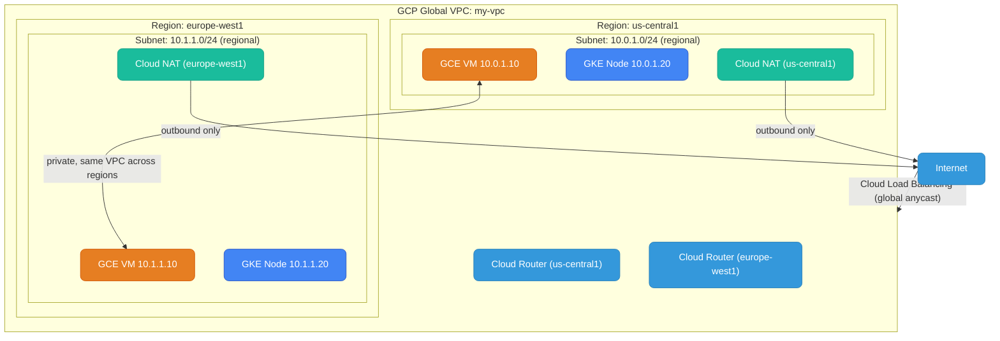
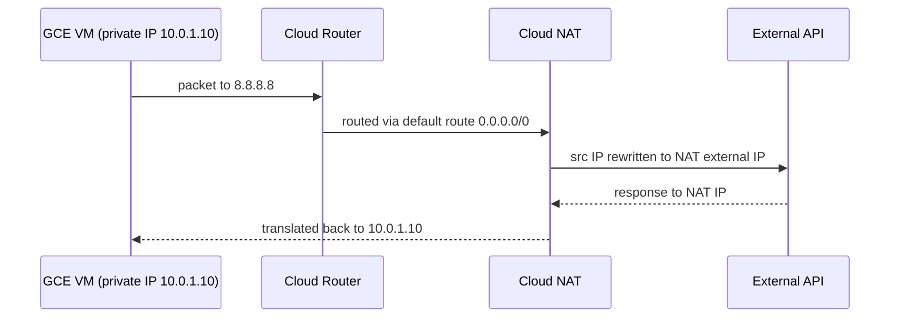
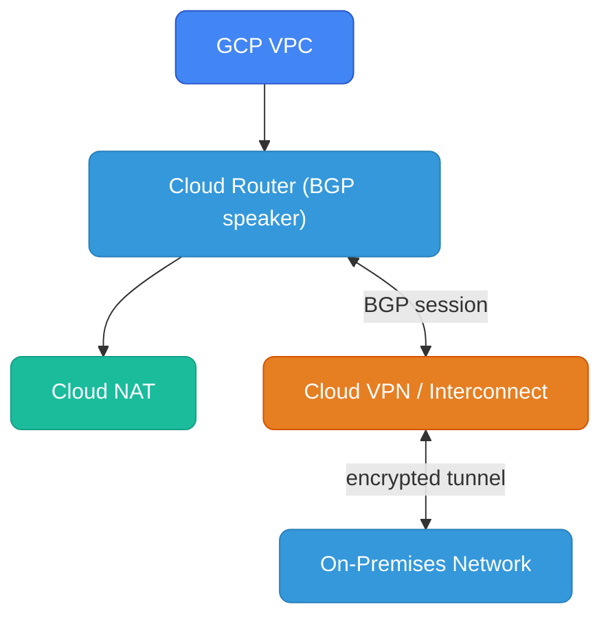
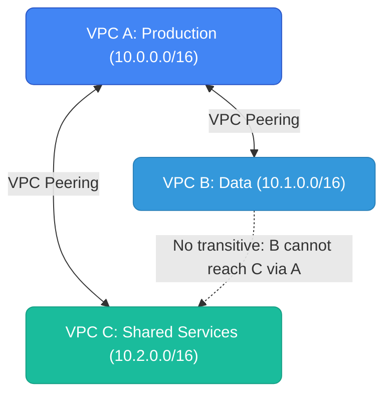
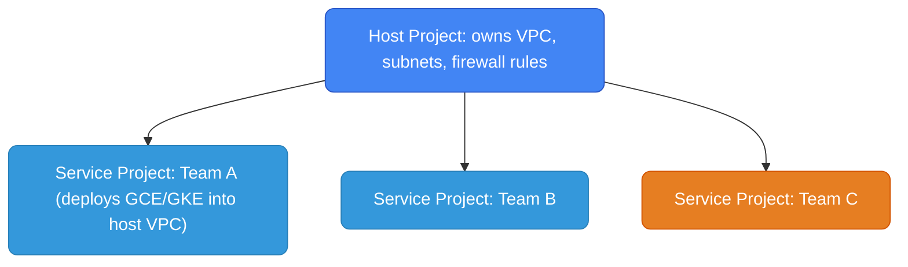

# GCP Networking

---

## VPC Architecture

GCP VPC is **global** — unlike AWS where a VPC is region-scoped, a single GCP VPC spans all regions. Subnets are regional (one subnet = one region), but they all belong to the same global VPC. This means a VM in `us-central1` and a VM in `europe-west1` can communicate privately within the same VPC without peering.



**Key difference from AWS:** In AWS, cross-region communication between VPCs requires VPC Peering or Transit Gateway. In GCP, it's native — same VPC, different regional subnets, traffic never leaves Google's private backbone.

---

## Subnets

GCP subnets are **regional** — you pick a region and a CIDR. Unlike AWS, there are no Availability Zone-level subnets. GCP manages zone distribution of compute resources within the region automatically.

### Subnet Modes

| Mode | Behavior |
|------|----------|
| **Auto mode** | One subnet per region created automatically (`10.128.0.0/9` range). Quick start, but limited control. |
| **Custom mode** | You define CIDRs per region. Required for production — gives full CIDR control and avoids overlap with on-prem. |

```bash
# Create custom mode VPC
gcloud compute networks create my-vpc --subnet-mode=custom

# Create a regional subnet
gcloud compute networks subnets create app-subnet \
  --network=my-vpc \
  --region=us-central1 \
  --range=10.0.1.0/24
```

### Secondary Ranges (for GKE)

GCP subnets support **secondary IP ranges** — extra CIDR blocks on the same subnet used by GKE for Pod IPs and Service IPs (VPC-native clusters). This avoids IP exhaustion on the primary range.

```bash
gcloud compute networks subnets create gke-subnet \
  --network=my-vpc \
  --region=us-central1 \
  --range=10.0.2.0/24 \
  --secondary-range pods=10.1.0.0/16,services=10.2.0.0/20
```

**AWS parallel:** AWS secondary CIDRs are added at the VPC level; GCP secondary ranges are per-subnet. GKE automatically uses these for pod networking (Alias IPs) without needing an overlay network.

---

## Firewall Rules

GCP firewall rules are **network-scoped**, not resource-scoped. They're conceptually closest to AWS Security Groups but evaluated at the network level, not the ENI. There are no NACLs in GCP.

### Key Properties

- **Direction:** `INGRESS` (inbound) or `EGRESS` (outbound)
- **Priority:** 0–65535 — lower number wins, evaluated first
- **Action:** `ALLOW` or `DENY`
- **Targets:** apply to all VMs, or by **target tag** or **target service account**
- **Sources/Destinations:** CIDR, **source tag**, or **source service account**
- **Stateful:** GCP firewall rules ARE stateful (like AWS SGs) — return traffic is auto-allowed

```
Firewall Rule: allow-internal-http
  Direction:   INGRESS
  Priority:    1000
  Action:      ALLOW
  Target:      tag: backend
  Source:      tag: frontend
  Ports:       TCP 8080
```

```bash
# Allow inbound HTTP to all VMs tagged "backend" from VMs tagged "frontend"
gcloud compute firewall-rules create allow-internal-http \
  --network=my-vpc \
  --direction=INGRESS \
  --priority=1000 \
  --action=ALLOW \
  --target-tags=backend \
  --source-tags=frontend \
  --rules=tcp:8080
```

### Tags vs Service Accounts as Selectors

| Selector | How it works | Security |
|----------|-------------|----------|
| **Network tag** | String applied to VM (`--tags=frontend`). Any user with VM edit access can add/remove. | Lower — tag is just metadata |
| **Service account** | VM's identity (what IAM SA it runs as). Can't be spoofed. | Higher — tied to IAM identity |

**Best practice:** Use service accounts as firewall selectors in production. Tags are convenient but any engineer with compute.instances.setTags can reassign them.

### Default Rules

Every GCP VPC has two implied rules (lowest priority, 65535):
- `default-allow-internal` — allow all traffic between instances in the same network (often removed for stricter setups)
- `default-deny-ingress` — deny all ingress
- `default-allow-egress` — allow all egress

```mermaid
graph LR
    classDef blue fill:#3498db,stroke:#2980b9,color:#fff,rx:8
    classDef green fill:#2ecc71,stroke:#27ae60,color:#fff,rx:8
    classDef red fill:#e74c3c,stroke:#c0392b,color:#fff,rx:8
    classDef orange fill:#e67e22,stroke:#d35400,color:#fff,rx:8
    classDef teal fill:#1abc9c,stroke:#16a085,color:#fff,rx:8
    classDef dark fill:#2c3e50,stroke:#1a252f,color:#fff,rx:8
    classDef gcp fill:#4285f4,stroke:#2a56c6,color:#fff,rx:8

    INTERNET["Internet"]:::blue
    FW_INGRESS["Firewall INGRESS rules: stateful, priority-ordered"]:::teal
    VM_TARGET["VM (by tag / SA)"]:::orange
    FW_EGRESS["Firewall EGRESS rules: stateful"]:::teal
    EXT["External"]:::blue

    INTERNET -->|"1. hit INGRESS rule"| FW_INGRESS
    FW_INGRESS -->|"2. rule matched ALLOW"| VM_TARGET
    VM_TARGET -->|"3. outbound hits EGRESS rule"| FW_EGRESS
    FW_EGRESS -->|"4. ALLOW"| EXT
```



### GCP Firewall vs AWS Security Groups

| | GCP Firewall Rule | AWS Security Group |
|--|---|---|
| **Scope** | Network-wide, filtered by tag/SA | Attached to specific ENI |
| **Stateful** | Yes | Yes |
| **Allow/Deny** | Both | Allow only |
| **Priority** | Explicit numeric priority | No priority, union of allows |
| **Subnet-level filter** | No (no NACLs in GCP) | NACLs exist at subnet boundary |
| **Reference by identity** | Tag or Service Account | SG ID |

---

## Cloud NAT

Cloud NAT provides **outbound internet access** for VMs without external IP addresses. Conceptually mirrors AWS NAT Gateway.



### How It Works

Cloud NAT is a **distributed software service** — it's not a VM or a single machine. It runs on Google's infrastructure, attached to a Cloud Router, and automatically scales with traffic.

```bash
# Cloud NAT requires a Cloud Router first
gcloud compute routers create my-router \
  --network=my-vpc \
  --region=us-central1

# Create Cloud NAT on the router
gcloud compute routers nats create my-nat \
  --router=my-router \
  --region=us-central1 \
  --nat-all-subnet-ip-ranges \
  --auto-allocate-nat-external-ips
```

### GCP Cloud NAT vs AWS NAT Gateway

| | GCP Cloud NAT | AWS NAT Gateway |
|--|---|---|
| **Architecture** | Distributed, no single VM | Managed service, single AZ |
| **Placement** | Regional (configured on Cloud Router) | Per-subnet (must be in public subnet) |
| **Public subnet needed** | No — GCP has no concept of "public subnet" | Yes — NAT GW lives in public subnet |
| **AZ resilience** | Built-in, fully distributed | One per AZ recommended |
| **Cost** | ~$0.044/hr + $0.045/GB | ~$0.045/hr + $0.045/GB |
| **Scale** | Auto-scales | Auto-scales |

**GCP has no "public/private subnet" distinction.** A subnet is "private" by not assigning external IPs to VMs. Outbound internet access for those VMs is then provided by Cloud NAT.

---

## Cloud Router

Cloud Router is a **BGP routing service** that dynamically exchanges routes between your VPC and external networks (on-prem via Cloud VPN or Cloud Interconnect, or other VPCs via VPN).

- Required for Cloud NAT
- Advertises your VPC subnets via BGP to on-prem routers
- Learns on-prem routes and injects them into VPC route tables dynamically



**AWS parallel:** AWS Transit Gateway + VPN Gateway + BGP achieves similar hybrid connectivity. Cloud Router is GCP's managed BGP speaker that plugs into these services.

---

## VPC Peering vs Shared VPC

GCP offers two models for multi-VPC connectivity — different from AWS's Transit Gateway model.

### VPC Peering

Direct L3 peering between two GCP VPCs. Internal IPs are routable across the peering.



**Same limitation as AWS:** no transitive routing. N*(N-1)/2 peering connections for full mesh.

### Shared VPC (Host/Service Project)

GCP-specific: a **Host Project** owns the VPC and subnets. **Service Projects** attach to it and deploy workloads into the host's subnets. Centralized network control across many projects.



| | VPC Peering | Shared VPC |
|--|---|---|
| **Use case** | Connect separate VPCs | Central network for multiple teams/projects |
| **Route transitivity** | No | Yes — all service projects share the host VPC |
| **Admin model** | Each VPC team manages their own | Centralized network team owns the host |
| **AWS analog** | VPC Peering | Centralized VPC + Transit Gateway (roughly) |
| **Best for** | Connecting a few VPCs | Org-wide multi-project platform |

---

## Private Google Access & Private Service Connect

### Private Google Access

Allows VMs **without external IPs** to reach Google APIs (GCS, BigQuery, Cloud SQL APIs) using internal routes — traffic stays on Google's backbone.

```bash
gcloud compute networks subnets update app-subnet \
  --region=us-central1 \
  --enable-private-ip-google-access
```

**AWS parallel:** VPC Endpoints (Gateway for S3/DynamoDB, Interface for everything else). GCP's Private Google Access is simpler — a subnet flag, no individual endpoint to provision per service.

### Private Service Connect (PSC)

More granular than Private Google Access. Create a **PSC endpoint** (a forwarding rule with an internal IP) to access specific Google managed services or partner services entirely privately.

| | Private Google Access | Private Service Connect |
|--|---|---|
| **Scope** | All Google APIs broadly | Specific service or producer VPC |
| **IP** | Uses `private.googleapis.com` DNS | Assigns internal IP of your choosing |
| **Use case** | General Google API access | Multi-tenant, specific endpoint, partner services |
| **AWS analog** | VPC Gateway/Interface Endpoint | Interface VPC Endpoint (PrivateLink) |
