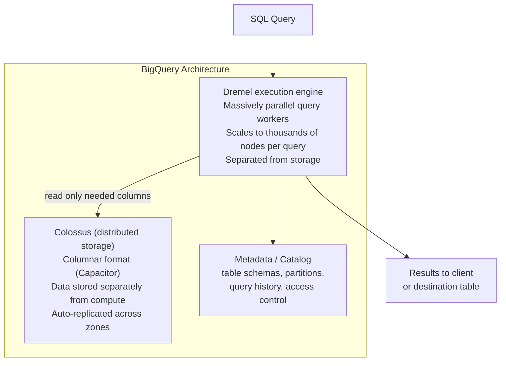
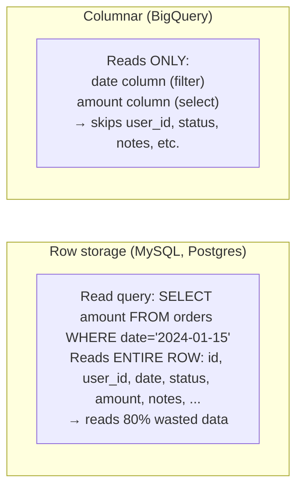
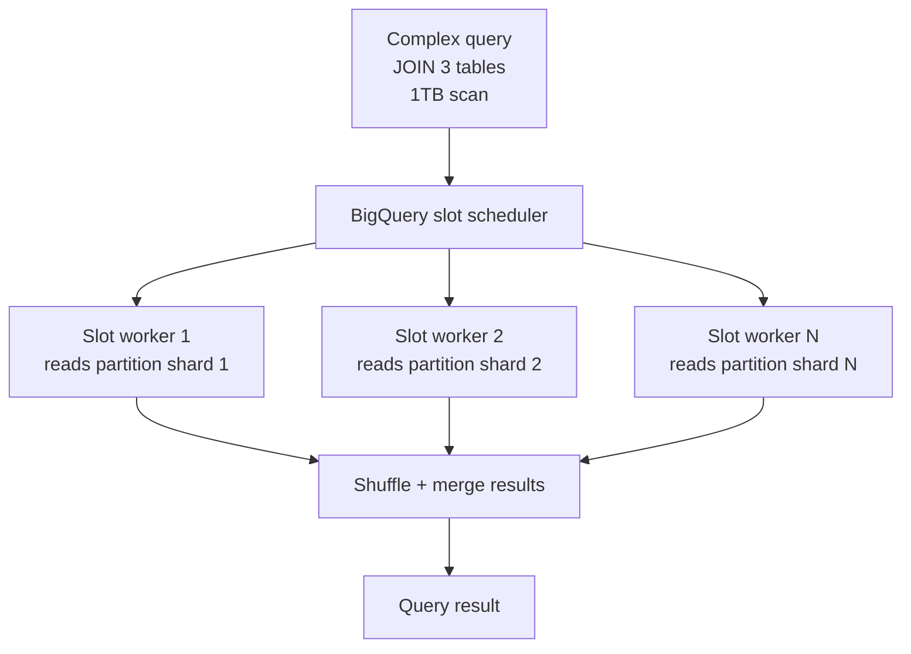
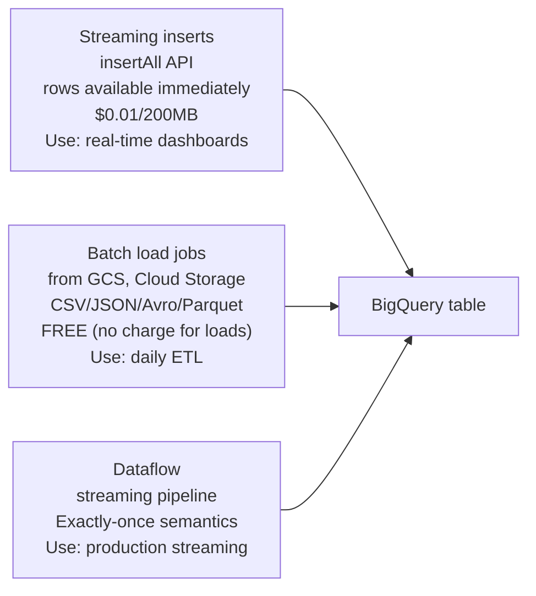

# BigQuery

BigQuery is GCP's fully managed, serverless data warehouse. No infrastructure to manage — you write SQL and BigQuery automatically scales compute across thousands of nodes.

---

## Architecture



**Key insight — separation of storage and compute:**
- Storage costs: ~$0.02/GB/month (no charge for queries)
- Compute costs: $5/TB scanned (on-demand) or flat-rate slots
- You can run 100 queries concurrently — each gets independent compute

---

## Columnar Storage — Why Queries Are Fast



For analytics (aggregate many rows, select few columns), columnar is 10-100× faster.

---

## Tables and Partitioning

```sql
-- Partitioned table (reduces cost — only scans relevant partitions)
CREATE TABLE `project.dataset.orders`
PARTITION BY DATE(created_at)    -- one partition per day
OPTIONS (
    partition_expiration_days = 365,    -- auto-delete partitions older than 1 year
    require_partition_filter = true     -- queries MUST filter on created_at (prevents full scans)
)
AS SELECT * FROM ...;

-- Clustered table (sort data within partitions for faster point lookups)
CREATE TABLE `project.dataset.orders`
PARTITION BY DATE(created_at)
CLUSTER BY user_id, status    -- sort within each partition by these columns
AS SELECT * FROM ...;

-- Estimate cost before running
SELECT COUNT(*) FROM `project.dataset.orders`
WHERE DATE(created_at) = '2024-01-15';
-- In BQ console: shows "This query will process X bytes" before running
```

**Cost = bytes scanned:**
- Partition pruning: `WHERE DATE(created_at) = '2024-01-15'` → scans 1 day, not all history
- Clustering: `WHERE user_id = 123` → BigQuery skips blocks that don't contain user_id=123
- Projected columns: `SELECT amount` costs less than `SELECT *`

---

## Slots — Compute Units



**Pricing models:**
| Model | Price | Best for |
|-------|-------|---------|
| On-demand | $5/TB scanned | Sporadic queries, unknown usage |
| Flat-rate (Standard edition) | ~$1600/month/100 slots | Predictable, high-volume workloads |
| BigQuery Reservations | Purchase slots, assign to projects | Large orgs with multiple teams |

---

## Streaming Inserts vs Batch Load



---

## External Tables and Federated Queries

```sql
-- Query data directly from GCS without loading into BigQuery
CREATE EXTERNAL TABLE `project.dataset.raw_events`
OPTIONS (
    format = 'NEWLINE_DELIMITED_JSON',
    uris = ['gs://my-bucket/events/2024/01/15/*.json']
);

SELECT event_type, COUNT(*) FROM `project.dataset.raw_events`
GROUP BY event_type;
-- Reads directly from GCS — no storage cost in BQ, slower than native tables

-- Query across GCP services (federated)
SELECT bq.user_id, cs.status
FROM `project.dataset.orders` bq
JOIN `project.region-us.INFORMATION_SCHEMA.TABLES` cs
ON bq.user_id = cs.table_name;
```

---

## GCP-Specific Features

```sql
-- Time travel: query data as it was 7 days ago
SELECT * FROM `project.dataset.orders`
FOR SYSTEM_TIME AS OF TIMESTAMP_SUB(CURRENT_TIMESTAMP(), INTERVAL 6 HOUR);

-- Snapshots: point-in-time table copy (billing: only stores diffs)
CREATE SNAPSHOT TABLE `project.dataset.orders_snapshot_20240115`
CLONE `project.dataset.orders`
FOR SYSTEM_TIME AS OF '2024-01-15 00:00:00 UTC';

-- Authorized views: share data without exposing underlying tables
-- Row-level security with row access policies
CREATE ROW ACCESS POLICY orders_by_region
ON `project.dataset.orders`
GRANT TO ("group:emea-team@company.com")
FILTER USING (region = 'EMEA');

-- INFORMATION_SCHEMA: metadata about all tables/jobs/partitions
SELECT table_id, row_count, size_bytes/1e9 AS size_gb, last_modified_time
FROM `project.dataset`.INFORMATION_SCHEMA.PARTITIONS
WHERE table_name = 'orders'
ORDER BY partition_id DESC LIMIT 10;
```

---

## Scenarios — Common Issues

| Issue | Diagnosis | Fix |
|-------|-----------|-----|
| Query too expensive | `EXPLAIN` plan shows full table scan | Add `PARTITION BY`, use `WHERE date_col` |
| Queries queued (slot contention) | `INFORMATION_SCHEMA.JOBS` shows `pendingTime` | Increase reservation slots or use flat-rate |
| Data freshness lag | Streaming buffer not yet queryable | Use `WHERE _PARTITIONTIME >= TIMESTAMP_SUB(...)` |
| Permission denied | Service account missing roles | Grant `BigQuery Data Viewer` + `BigQuery Job User` |
| Exceeded shuffle quota | Query joins too many large tables | Materialize intermediate results, pre-aggregate |
