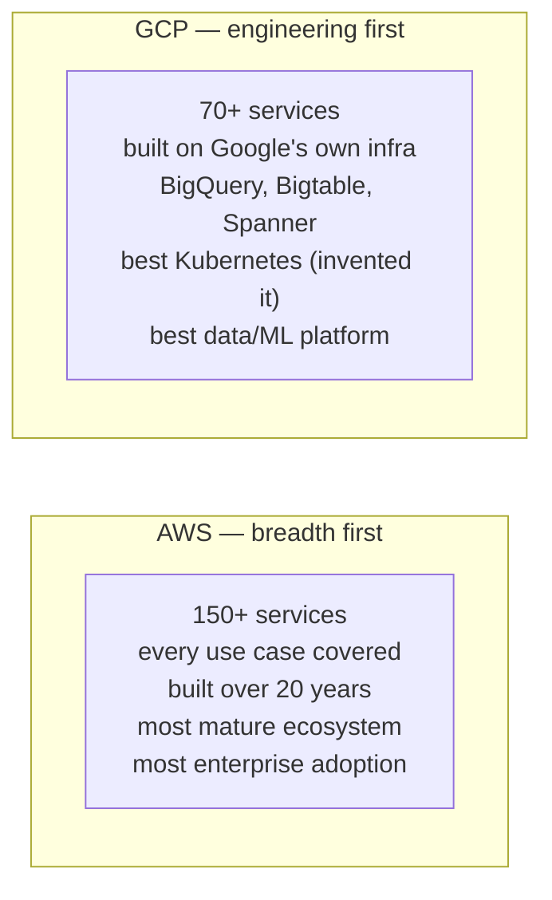
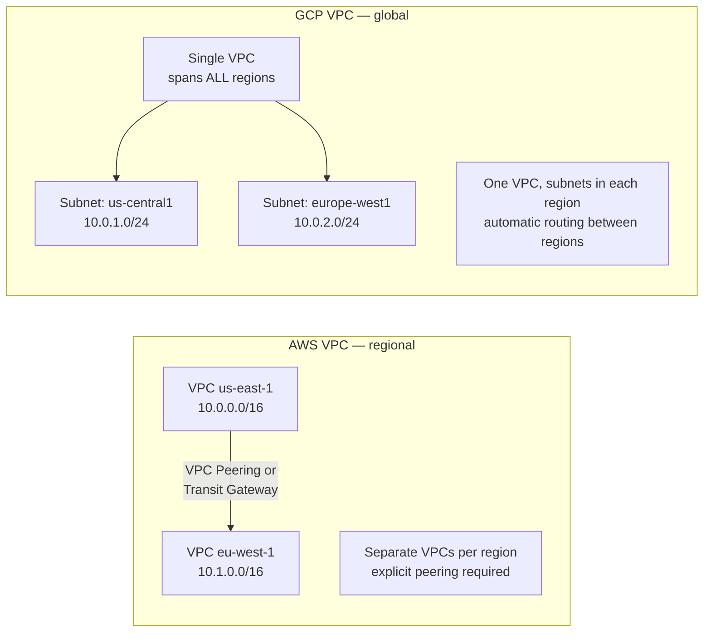

# GCP vs AWS — Service Comparison

## Core Philosophy Difference



| Dimension | AWS | GCP |
|-----------|-----|-----|
| Market share | ~32% | ~11% |
| Enterprise adoption | Dominant | Growing |
| Kubernetes | EKS (solid) | GKE (best-in-class, invented K8s) |
| Data/Analytics | Redshift, Athena, EMR | BigQuery (simpler, often cheaper) |
| ML/AI | SageMaker, Bedrock | Vertex AI, TPUs, best for training |
| Networking | Complex but powerful | Global VPC, simpler model |
| Pricing | Pay-per-resource | Sustained use discounts automatic |

---

## Service-by-Service Mapping

### Compute

| Use case | AWS | GCP |
|---------|-----|-----|
| VMs | EC2 | Compute Engine |
| Managed K8s | EKS | GKE |
| Serverless containers | Fargate, App Runner | Cloud Run |
| Serverless functions | Lambda | Cloud Functions |
| Batch compute | Batch | Cloud Batch |
| Spot/preemptible VMs | Spot Instances | Preemptible VMs (Spot VMs) |

### Storage and Databases

| Use case | AWS | GCP |
|---------|-----|-----|
| Object storage | S3 | Cloud Storage |
| Block storage | EBS | Persistent Disk |
| File storage | EFS | Filestore |
| Relational DB | RDS | Cloud SQL |
| Managed Postgres | Aurora Postgres | Cloud Spanner, AlloyDB |
| Global ACID DB | Aurora Global | Spanner (better: true global) |
| NoSQL key-value | DynamoDB | Firestore, Bigtable |
| Wide-column | DynamoDB single-table | Bigtable (better for time-series) |
| Data warehouse | Redshift | BigQuery |
| In-memory cache | ElastiCache | Memorystore (Redis/Memcached) |
| Time-series | Timestream | Bigtable |

### Networking

| Use case | AWS | GCP |
|---------|-----|-----|
| VPC | VPC (region-scoped) | VPC (global — one VPC, all regions) |
| Load balancer | ALB/NLB/CLB | Cloud Load Balancing |
| CDN | CloudFront | Cloud CDN |
| DNS | Route 53 | Cloud DNS |
| Private connectivity | PrivateLink, VPN | Private Service Connect, Cloud VPN |
| Cross-region connectivity | Transit Gateway | Cloud Router + HA VPN |

### Key networking difference:



### Observability

| Use case | AWS | GCP |
|---------|-----|-----|
| Metrics | CloudWatch | Cloud Monitoring |
| Logs | CloudWatch Logs | Cloud Logging |
| Traces | X-Ray | Cloud Trace |
| Dashboards | CloudWatch | Cloud Monitoring, Grafana |
| Audit logs | CloudTrail | Cloud Audit Logs |

### AI/ML

| Use case | AWS | GCP |
|---------|-----|-----|
| ML platform | SageMaker | Vertex AI |
| LLM APIs | Bedrock (Claude, Llama, etc.) | Vertex AI (Gemini, etc.) |
| Custom training | SageMaker Training | Vertex AI Training, TPUs |
| TPU access | No | Yes (Google's custom AI chips) |
| Managed notebooks | SageMaker Studio | Vertex AI Workbench |

**GCP TPUs:** Google's Tensor Processing Units give 10-100× better price/performance for LLM training vs GPUs on any cloud. If you're training large models, GCP is often cheaper.

---

## GCP Unique Advantages

### 1. Global VPC
Single VPC spanning all regions — no peering needed. Add a subnet in Tokyo, your London VM can reach it without configuration.

### 2. BigQuery Pricing
BigQuery: $5/TB scanned, $0.02/GB storage. AWS Redshift: $0.25/hour for smallest cluster (even when idle). For sporadic analytics, BigQuery is often 10× cheaper.

### 3. Sustained Use Discounts
GCP automatically gives discounts for VMs running >25% of the month — no upfront commitment required. AWS requires Reserved Instances (1-3 year commitment) for equivalent discounts.

### 4. GKE Quality
GKE gets Kubernetes features first (it's the reference implementation). Autopilot mode — true serverless Kubernetes — doesn't exist on AWS/Azure.

### 5. Spanner — True Global ACID
AWS Aurora Global has replication lag (seconds). Spanner provides globally consistent transactions with ~10ms latency using TrueTime (atomic clocks).

---

## AWS Unique Advantages

### 1. Service breadth
AWS has services GCP doesn't: AppSync (GraphQL), Kinesis Data Firehose simplicity, CodePipeline, many enterprise integrations.

### 2. Enterprise ecosystem
AWS has the most ISV integrations, compliance certifications, and enterprise support.

### 3. Mature marketplace
AWS Marketplace has thousands of third-party products pre-configured.

### 4. On-premises hybrid
AWS Outposts, AWS Local Zones — better on-prem story than GCP Distributed Cloud.

---

## When to Choose Which

```
Choose AWS when:
  - Your team already knows AWS
  - You need maximum service breadth
  - Enterprise compliance requirements (AWS has most certifications)
  - Strong on-prem hybrid requirements

Choose GCP when:
  - Analytics-heavy workload (BigQuery is hard to beat)
  - K8s-native platform (GKE Autopilot, Workload Identity)
  - Training large ML models (TPUs)
  - Multi-region global application (global VPC simplicity)
  - Cost optimization for data warehousing
```
